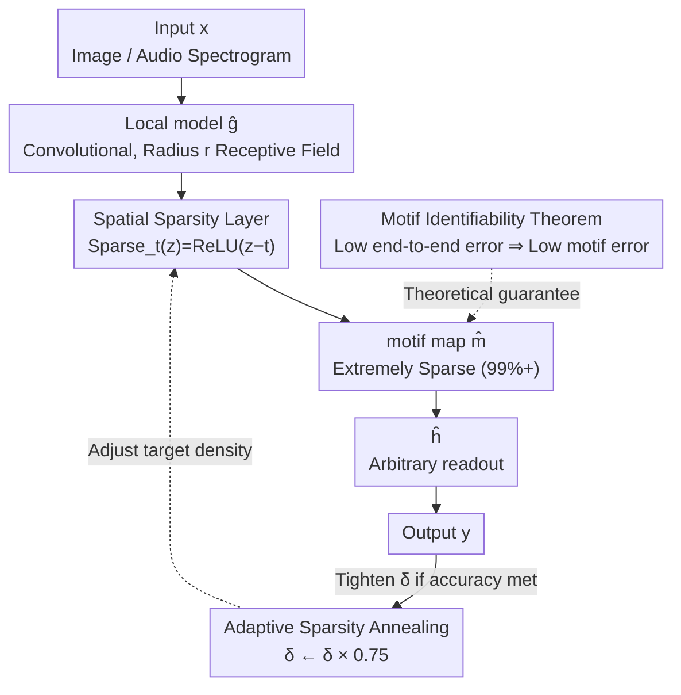

# Sparling: End-to-End Spatial Concept Learning via Extremely Sparse Activations

**Conference**: ICLR 2026  
**OpenReview**: [https://openreview.net/forum?id=yfBs0GQxx9](https://openreview.net/forum?id=yfBs0GQxx9)  
**Code**: `sparling` PyPI package (mentioned in paper, repository TBD)  
**Area**: Interpretability / Concept Bottleneck / Representation Learning  
**Keywords**: motif, spatial concepts, extreme sparsity, identifiability, concept bottleneck

## TL;DR
This paper proves a "Motif Identifiability Theorem"—asserting that as long as intermediate concepts are local, sparse, and sufficient/necessary for the output, they can be precisely recovered using only end-to-end supervision (without any intermediate concept labels). The authors introduce the SPARLING algorithm, which approximates this optimal solution using a "Spatial Sparsity Layer" that forces activations to $99\%+$ sparsity combined with an annealing-based adaptive sparsity schedule. It achieves $>90\%$ precision in locating intermediate spatial concepts across three synthetic domains.

## Background & Motivation
**Background**: A hallmark capability of deep learning is automatically learning useful intermediate representations from end-to-end supervision. However, these representations are typically "black boxes"—intermediate vector values do not correspond to any human-understandable concepts. To pull intermediate layers back to meaningful concepts, concept bottleneck models (CBMs) emerged, explicitly aligning intermediate layers with a set of concepts.

**Limitations of Prior Work**: Training CBMs requires either direct labeling of intermediate concepts or designing algorithms capable of self-learning concepts from end-to-end signals. The former is only feasible in domains where "concepts are known," contradicting the deep learning goal of "learning representations beyond manual knowledge." The latter is extremely difficult—the potential concept space that produces the same input/output mapping is vast; theoretically, infinite "explanations" can fit the data, so why would end-to-end training converge to the "true" one?

**Key Challenge**: Recovering intermediate variables $m^*$ from end-to-end data $D=\{(x, f^*(x))\}$ seems nearly impossible: intermediate variables are naturally non-unique (channels can be swapped, positions shifted, and information moved into $\hat h$). The root of the problem is: under what conditions does "low end-to-end error" **force** "low intermediate concept error"? A related genomics work (Gupta et al., 2024) empirically observed that end-to-end training can make RNA protein binding site (motif) predictions closer to independent experimental measurements, but it relies on an approximate initial motif model as a prior.

**Goal**: (1) Characterize a set of assumptions under which "recovering intermediate spatial concepts purely from end-to-end supervision" is statistically feasible; (2) Remove the approximate prior from genomics work and provide an algorithm that achieves this condition in practice.

**Key Insight**: The authors observe that spatial concepts (collectively termed **motifs**) typically possess two key properties—**locality** (motif $m[i,j,c]$ only depends on the input neighborhood $(i,j)$) and **sparsity** (the number of concepts is much smaller than the number of pixels, most motif activations are zero). These two properties serve as leverage to narrow "infinite explanations" down to a unique solution.

**Core Idea**: By combining locality + extreme sparsity + three fulfillable distributional assumptions, it is possible to prove "low end-to-end error $\Rightarrow$ low motif error." An information bottleneck layer capable of pushing to $99\%+$ sparsity is then used to optimize this objective.

## Method

### Overall Architecture
The problem is: given a true process $f^* = h^* \circ g^*$, where $g^*: X \to M$ maps inputs to a sparse motif space $M$, and $h^*: M \to Y$ maps motifs to output labels; during training, **only** $(x, y^*)$ is observed, not $m^*$. The objective is to train $\hat g, \hat h$ such that $\hat g$ precisely recovers $g^*$ (subject to channel permutation and position shifts).

The pipeline is straightforward: input $x$ passes through a **local model $\hat g$** (convolutional, $r$-radius receptive field) to get dense activations, followed by a **Spatial Sparsity Layer** that compresses activations to extreme sparsity to produce a motif map $\hat m$. Finally, an arbitrary readout architecture $\hat h$ (e.g., LSTM + Transformer) generates the sequence output $\hat y$. The network is trained only on end-to-end error. Three factors ensure this pipeline converges to the correct motifs: theoretically, the **Motif Identifiability Theorem** guarantees "low end-to-end error + density equal to $\delta^* \Rightarrow$ low motif error"; algorithmically, the **Spatial Sparsity Layer** pins density to the target value, and **Adaptive Sparsity Annealing** gradually pushes the target density from high to $\delta^*$ (preventing local optima caused by a lack of initial learning signal).

### Key Designs

**1. Motif Identifiability Theorem: Translating "low end-to-end error" to "accurate concept recovery"**

This theorem is the foundation, answering why end-to-end supervision can force unique correct intermediate concepts. The authors list types of non-uniqueness and then provide three assumptions to exclude them: **NON-OVERLAPPING** (receptive field cells of any two motifs do not overlap), **MOTIF-SUFFICIENCY** (pixels representing a motif are independent of the global layout $P_m(m)$, and background is translation invariant—ensuring motifs are independent entities, the primary assumption), and **$\alpha$-MOTIF-NECESSITY** (no motif type is completely ignored by $h^*$; modifying a motif in cases with prob sum $\ge \alpha$ necessarily changes the output). When these hold:

$$\forall \hat g \in G, \hat h.\ \delta(\hat g)=\delta^* \Rightarrow \big(\forall \epsilon>0,\ E(\hat h\circ\hat g)<\epsilon \Rightarrow E_m(\hat g)<k\epsilon\big)$$

where $E$ is end-to-end error, $E_m$ is motif error, and $k=O\!\left(\#_{\max}^2|p_2|n^2 / (\#^* \alpha^2)\right)$. Crucially, the theorem **does not assume parameter identifiability**, only the input/output behavior of $\hat g$, allowing motifs to be complex functions of the input. $h^*$ is also unconstrained by structure. $E_m$ is defined via an IoU-style metric. The proof uses contradiction and counting arguments to show that errors (false negatives or channel confusion) propagate to end-to-end error. This is useful because end-to-end error is **trivially verifiable** on the test set.

**2. Spatial Sparsity Layer: Differentiable mechanism for "extreme sparsity"**

The theorem requires density strictly equal to $\delta^*$, where $\delta^*$ is tiny (e.g., 4.5 digits in $100\times100$ image, $\delta^*=4.5\times10^{-5}$). Standard L1 or dropout cannot reach such levels. The Spatial Sparsity Layer is designed as the final step of $\hat g$:

$$\text{Sparse}_t(z)=\text{ReLU}(z-t)$$

Key is the threshold $t$: it is treated as a **constant** during backpropagation (no gradient update). Instead, it is fitted online using an exponential moving average (EMA) of batch quantiles: $t_n=\mu t_{n-1}+(1-\mu)q(z_n, 1-\delta)$. This automatically adjusts the threshold per channel so that exactly $\delta$ proportion of elements are retained, **forcing** the sparsity of $\hat g$ to $1-\delta$.

**3. Adaptive Sparsity Annealing: Guiding density with validation accuracy**

Requiring extreme sparsity from the start often leads to local optima due to unstable optimization landscapes. Borrowing from simulated annealing, the target density $\delta$ decreases over training. Instead of a fixed schedule, annealing is **tied to end-to-end validation accuracy**: if validation accuracy $A_t$ exceeds a target $T_t$, density is tightened $\hat f.\delta \leftarrow \hat f.\delta \times 0.75$, and $T_t$ is updated. This allows the model to learn a usable solution under loose density first, then step-by-step converge to $\delta^*$.

### Loss & Training
Training uses only end-to-end error (Exact Match in proof, Normalized Edit Distance E2EE in empirical analysis). $\hat g$ uses four residual units ($17\times17$ receptive field) + 10-channel bottleneck + Spatial Sparsity Layer. $\hat h$ uses max pooling + LSTM row encoding + 6-layer Transformer. Hyperparameters: batch size 10, learning rate $10^{-5}$, annealing evaluation frequency $M=2\times10^5$, $d_T=10^{-7}$.

## Key Experimental Results

### Main Results
Three synthetic domains: **DIGITCIRCLE** (3-6 digits in a circle on $100\times100$ noisy image), **LATEX-OCR** (image to LaTeX code), **AUDIOMNISTSEQUENCE** (5-10 digit speech sequence; trained on speakers 1-51, tested on 52-60).

| Metric / Domain | DIGITCIRCLE | LATEX-OCR | AUDIOMNISTSEQUENCE |
|-----------|-------------|-----------|--------------------|
| Average motif error | <10% | <10% (exc. FNE) | <10% |
| $\hat h$ perturbation consistency (Exact Match) | 99.3% | 86.1% | 93.4% |
| Note | Consistent channel-digit mapping | Symbols like brackets/plus often ignored | FPE is 0, generalizes to unseen speakers |

Motif errors are below 10% across three domains (except FNE in LATEX-OCR). Generalization to unseen speakers in AUDIOMNISTSEQUENCE confirms Sparling learns motif features rather than memorization. LATEX-OCR's high FNE validates $\alpha$-MOTIF-NECESSITY: labels like `()+` are not strictly necessary for unique identification and are dropped as background.

### Ablation Study
Core ablation is "Sparsity $\delta$ scan" (x-axis as reverse log scale, corresponding to annealing time):

| Trend as $\delta$ decreases (sparser) | Phenomenon | Implication |
|-------------------------------|------|------|
| False Positive Error (FPE) | Decreases | Sparsity squeezes out spurious motifs |
| False Negative Error (FNE) | Increases | Excess sparsity leads to missing motifs |
| Confusion Error (CE) | **Decreases significantly** | Extreme sparsity is required to distinguish channels |
| End-to-end Error (E2EE) | Increases | Information bottleneck forces hard decisions |

A critical finding is the trade-off between E2EE and CE: increasing density by 2-3x drastically increases CE, proving **extreme sparsity is necessary**, matching the $\delta(\hat g)=\delta^*$ theorem condition. Retrained ablation (freeze $\hat g$, finetune $\hat h$ without bottleneck) yields accuracy near Non-Sparse models, proving the motif model provides sufficient signals.

### Key Findings
- **Extreme sparsity is essential, not optional**: A small density difference drastically worsens confusion error, validating that $\delta=\delta^*$ is a core requirement, not a detail.
- **$\hat h$ behavior is causal**: Changing a motif type in the intermediate layer results in the expected output change, with perturbation consistency up to 99.3%.
- **Degradation when assumptions fail**: In the Splicing domain (where assumptions of Section 3.3 fail), SPARLING cannot precisely recover motifs but still performs significantly better than random.

## Highlights & Insights
- **Elevating Interpretability to a Provable Theorem**: While "interpretable concepts from end-to-end training" was previously a surprising observation, this work provides strict sufficient conditions (locality + sparsity + 3 assumptions) and simplifies "identifiability verification" to checking test-set end-to-end error.
- **Identifiability of Functional Behavior over Parameters**: The theorem does not require parameter identifiability, allowing motifs to be any complex function of input and $h^*$ to be any architecture—much weaker assumptions than traditional ICA/HMM results.
- **Spatial Sparsity Layer as a Reusable Trick**: Treating $t$ as a constant in backprop while fitting it via quantile EMA is a robust way to pin sparsity to arbitrary targets (even $99.99\%+$).
- **Validation-tied Annealing**: Using accuracy instead of a fixed schedule makes optimization robust to different training rhythms.

## Limitations & Future Work
- **Strong NON-OVERLAPPING Assumption**: Technically excludes scenarios where motif receptive fields overlap; the authors suggest future relaxations if "patterns must use the full cell" is assumed.
- **Synthetic Domain Validation**: The success is demonstrated on synthetic data; real-world Splicing data failed to satisfy assumptions, leaving real-world applicability as an open question.
- **Accuracy Trade-off**: End-to-end accuracy is slightly lower than non-sparse baselines because the hard bottleneck forces "binary decisions" on motifs.
- **Noise Sensitivity**: The theoretical portion does not handle noise directly.

## Related Work & Insights
- **vs CBM (Koh et al., 2020)**: CBMs usually need supervision or priors; this work shows concepts can be recovered **without any intermediate supervision** under locality and sparsity.
- **vs Genomics motifs (Gupta et al., 2024)**: Gupta used empirical evidence and approximate priors; this work removes the prior and provides a formal theorem.
- **vs Nonlinear ICA**: ICA has heavy constraints on the mixing function; this work places almost no constraints on the "mixing" $h^*$.
- **vs Traditional Identifiability (HMM / PCFG)**: Those results target specific latent models and parameter recovery; this work targets deep learning intermediate behaviors between arbitrary networks.

## Rating
- Novelty: ⭐⭐⭐⭐⭐ Elevates interpretability to a provable theorem with a matched algorithm.
- Experimental Thoroughness: ⭐⭐⭐⭐ Excellent synthetic coverage and trade-off analysis, though missing real-world success cases.
- Writing Quality: ⭐⭐⭐⭐ Clear definitions of assumptions and error metrics.
- Value: ⭐⭐⭐⭐ Provides rare theoretical guarantees for unsupervised concept discovery; the sparsity layer has independent utility.

<!-- RELATED:START -->

## Related Papers

- [\[CVPR 2026\] SafeDrive: Fine-Grained Safety Reasoning for End-to-End Driving in a Sparse World](../../CVPR2026/interpretability/safedrive_fine-grained_safety_reasoning_for_end-to-end_driving_in_a_sparse_world.md)
- [\[CVPR 2026\] TDATR: Improving End-to-End Table Recognition via Table Detail-Aware Learning and Cell-Level Visual Alignment](../../CVPR2026/interpretability/tdatr_improving_end-to-end_table_recognition_via_table_detail-aware_learning_and.md)
- [\[ICLR 2026\] Sparse CLIP: Co-optimizing Interpretability and Performance in Contrastive Learning](sparse_clip_co-optimizing_interpretability_and_performance_in_contrastive_learni.md)
- [\[ICLR 2026\] Learning Multimodal Dictionary Decompositions with Group-Sparse Autoencoders](learning_multimodal_dictionary_decompositions_with_group-sparse_autoencoders.md)
- [\[ICLR 2026\] Negative Pre-activations Differentiate Syntax](negative_pre-activations_differentiate_syntax.md)

<!-- RELATED:END -->
