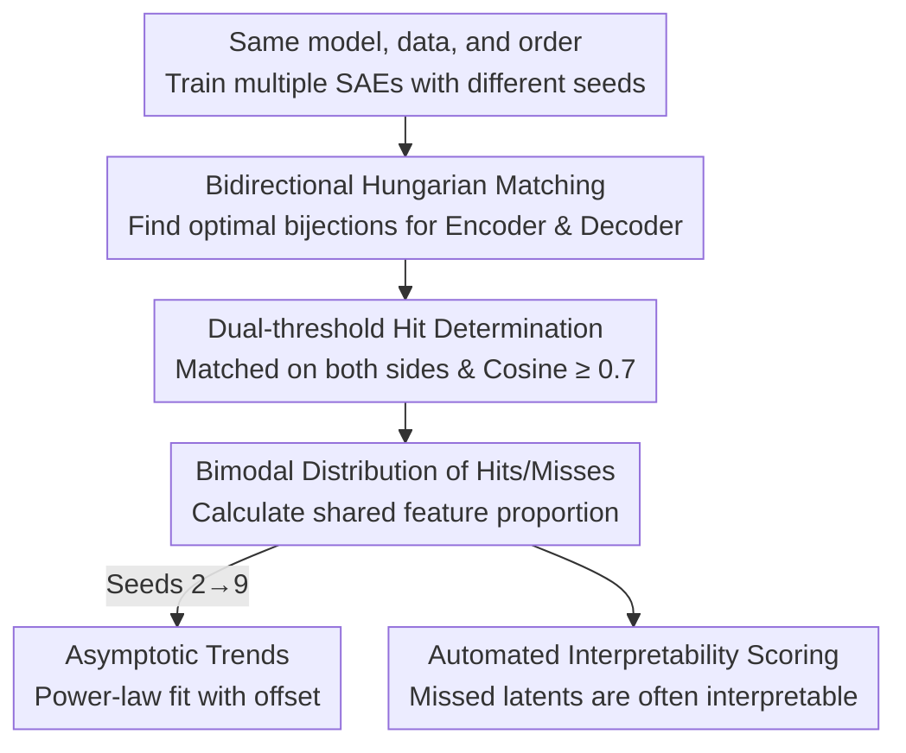

# Sparse Autoencoders Trained on the Same Data Learn Different Features

**Conference**: ICLR 2026  
**OpenReview**: [https://openreview.net/forum?id=EjInprGpk9](https://openreview.net/forum?id=EjInprGpk9)  
**Code**: Yes (The paper provides Hungarian alignment and analysis scripts in Code Availability, along with all SAE checkpoints)  
**Area**: Interpretability / Sparse Autoencoders / Mechanistic Interpretability  
**Keywords**: Sparse Autoencoders, Random Seeds, Feature Stability, Hungarian Matching, Interpretability

## TL;DR
This is an analytical paper: the authors use the Hungarian algorithm to align multiple Sparse Autoencoders (SAEs) that differ only in their initialization random seeds while seeing identical data. They find that learned features only partially overlap (only 30% on Llama 3 8B). Furthermore, larger models/SAEs exhibit lower overlap, and TopK is more unstable than ReLU. This demonstrates that SAEs identify a "practical decomposition of the activation space" rather than a "unique and objective feature list" actually used by the model.

## Background & Motivation

**Background**: SAEs are currently the primary tools for mechanistic interpretability, using a sparse, overcomplete hidden layer to decompose neural network activations into human-readable "features," thereby mitigating neuronal polysemanticity. They have been applied to SOTA models such as GPT-4 and Claude 3 Sonnet.

**Limitations of Prior Work**: Many researchers (and the safety community) implicitly hold a stronger expectation—hoping that SAEs can "enumerate all features in a model" to verify safety properties, such as "the model will never lie." This expectation presupposes that neural networks possess a **unique, objective** feature decomposition that SAEs can extract. However, this assumption has never been rigorously tested.

**Key Challenge**: If SAEs are indeed approaching an objective set of features, then changing only the random seed for weight initialization—holding everything else constant—should result in two SAEs learning nearly identical features. Conversely, if changing the seed leads to a large number of different features, it suggests that the SAE solution is merely one of many local minima on the loss surface, and a "true feature list" does not exist.

**Goal**: To transform the above philosophical assumption into a measurable question—quantifying the proportion of "shared features" between two SAEs trained on the same model, data, and order, by changing only the random seed, and observing how this varies with model scale, SAE size, sparsity, activation functions, and training duration.

**Key Insight**: The difficulty lies in the fact that SAE latent units have no inherent order; a new SAE obtained by randomly permuting the latents represents the same function and features, but the weight matrices appear completely different. The authors observe that by finding a **bijection that maximizes average similarity**, one can correctly determine that features are identical in the "permutation-only" case, thus turning "feature sharing" into a computable assignment problem.

**Core Idea**: Use the Hungarian algorithm to find the optimal bijective matching between the latent units of two SAEs, and then use a cosine similarity threshold to classify each latent as a "hit" or a "miss," using the sharing proportion as a proxy for the universality of SAE features.

## Method

### Overall Architecture

This paper does not propose a new model but rather an analytical pipeline to **measure SAE feature stability**. The process includes: training a batch of SAEs independently with different random seeds (but identical data and order); finding the optimal bijective matching of latent units for any two SAEs; using similarity thresholds to label each latent as a hit/miss and calculating the shared feature proportion; extending the number of seeds from 2 to 9 to observe the decay of features existing in only one SAE; and finally using an automated interpretability pipeline to score hit and miss latents to determine if features missed by specific seeds are merely "junk."

The SAE itself follows a standard structure with TopK activation:
$$\hat{x} = D\,\mathrm{TopK}(Ex + e) + d$$
Where $x$ is the output of the target MLP, $E, e$ are the encoder weights and bias, and $D, d$ are the decoder weights and bias. The training objective is to minimize the reconstruction mean squared error $\lVert x - \hat{x}\rVert_2^2$. The ratio of SAE latent units to input dimensions is fixed at 36.

### Key Designs

**1. Bidirectional Hungarian Matching: Solving Latent Disorder with Optimal Bijection**

Direct comparison of SAE weight matrices is meaningless because latent order is arbitrary. The authors require the matching to be bijective (one-to-one) and to maximize the average similarity of matched pairs. This is a classic linear assignment problem, solved efficiently via the Hungarian algorithm (SciPy's `linear_sum_assignment`). Specifically, encoder row vectors and decoder column vectors are normalized to unit norm. Decoder permutation $P_{dec}$ is solved to maximize $\mathrm{tr}(P_{dec}^{T} D_1^{T} D_2)$, and encoder permutation $P_{enc}$ to maximize $\mathrm{tr}(P_{enc}^{T} E_1 E_2^{T})$. This ensures that if $M'$ is merely a permutation of $M$, the algorithm will identify them as identical.

**2. Dual-threshold Shared Identification: Validation by Both Encoder and Decoder**

Although encoders and decoders are initialized as transposes, they diverge during training. Looking at only one side might overestimate similarity. The authors adopt a conservative strategy: **perform matching for the encoder and decoder separately**. A latent unit is considered a "shared feature" only if it is matched to the same counterpart in both sets of matches and both sets of cosine similarities are $\geq 0.7$; otherwise, it is "unpaired." Under this strict definition, only 42% of latent units are shared between two independently trained SAEs. The authors also verified that replacing Hungarian matching with a simpler "mean max cosine similarity" yields nearly identical conclusions.

**3. Bimodal Distribution of Hits/Misses: Sharing as a Binary Modality**

The distribution of cosine similarities after matching shows a clear **bimodal** pattern: high-similarity "hits" and low-similarity "misses." Hit units often activate in semantically similar contexts with similar interpretations, while misses are usually semantically unrelated. Interestingly, when encoder and decoder matches disagree on a counterpart (inconsistency), similarities tend to be low on both sides; when they agree, similarities are high. This bimodal structure justifies using "sharing proportion" as a binary metric rather than a continuous value.

**4. Asymptotic Trends + Automated Interpretability: Missed Features are Not Noise**

To avoid underestimating stability with only two seeds, the authors expanded to 9 seeds. For each $k\in[2,9]$, they calculated the proportion of latent units that exist "only in a baseline SAE" (i.e., missed in all other $k-1$ matchings). This proportion decays slowly, remaining at ~35% even at $k=9$. A power-law fit with an offset performs significantly better than one without, implying that some latents will never find matches regardless of the number of seeds. Using a Llama 3.1 70B Instruct-based auto-interp pipeline, the authors found that while shared features have higher average scores, many "unique" features also receive high interpretability scores.

### Loss & Training

SAEs are trained using the Adam optimizer with a sequence length of 2049 and a batch size of 32 sequences. The primary experiments use Pythia 160M (6th MLP layer) with $2^{15}$ latents trained on 8B tokens of the Pile. Additional tests were conducted on SmolLM, GPT-2, and Llama 3.1 8B (using Fineweb-edu, OpenWebText, and RedPajama V2). Decoder vectors are constrained to unit norm to eliminate the scaling symmetry inherent in ReLU networks.

## Key Experimental Results

### Main Results

| Setting | Shared Feature Proportion | Description |
|------|------------|------|
| Pythia 160M, 32K latents, 2 seeds | 42% | Shared proportion under strict dual-threshold |
| Pythia 160M, 9 seeds ($k=9$) | ~35% "Unique to 1 SAE" | ~35% of units find no match across 8 other seeds |
| Llama 3 8B, 131K latents | 30% | Largest model, lowest sharing proportion |
| GPT-2 / Gated·ReLU (L1 loss) | High (> 90%) | L1 ReLU/Gated SAEs are much more stable |
| GPT-2 / TopK | Significantly Lower | TopK is more seed-dependent at same sparsity |

### Ablation Study

| Variable | Change in Shared Proportion | Interpretation |
|------|------------|------|
| Increasing total latents | Decrease | Larger SAEs diverge more across seeds |
| Increasing $k$ in TopK (denser) | Decrease | More active units lead to higher instability |
| Increasing training duration | Increase | Longer training improves alignment between seeds |
| Layer position | Low at start/end, stable in middle | Stability varies by layer depth |
| Activation (ReLU/Gated vs TopK) | ReLU/Gated > TopK | TopK discontinuity worsens non-convex local optima |

### Key Findings
- **Scaling leads to divergence**: Contrary to the intuition that larger scales converge to "true features," larger models and SAEs show lower shared proportions (only 30% for Llama 3 8B).
- **TopK is more unstable than ReLU**: Even controlling for sparsity, TopK activations are more seed-dependent, likely due to optimization challenges from discontinuity.
- **Seed dependence is not feature absorption**: Absorption typically worsens with lower sparsity and longer training, whereas the instability observed here improves with training duration, suggesting a different phenomenon.
- **Missed features are not junk**: A significant portion of "unique" latents remain highly interpretable, meaning single SAE runs systematically miss meaningful features.

## Highlights & Insights
- **Quantifying philosophical assumptions**: The "unique ground truth" assumption is elegantly converted into a measurable "shared proportion" metric using Hungarian matching.
- **Conservative dual-threshold design**: Requiring agreement from both encoder and decoder prevents overestimation and ensures the metric is robust to permutations.
- **Bimodal distribution discovery**: The fact that similarity isn't a continuous spectrum but splits into hits and misses makes "shared proportion" a clean binary metric.
- **Impact on safety narratives**: If even "enumerating all features" depends on the random seed, the foundation for using SAEs to provide absolute safety guarantees (e.g., "the model never lies") is shaken.

## Limitations & Future Work
- **Focus on MLP SAEs**: Current metrics for feature absorption are tuned for residual stream SAEs; "no absorption" in MLP SAEs might be a result of insensitive metrics.
- **Hyperparameter dependence of matching**: The choice of 0.7 as a threshold and the requirement for bidirectional agreement are somewhat subjective.
- **Lack of mechanistic explanation for divergence**: While attributed to non-convexity, the paper does not fully characterize how different local optima systematically differ at the feature level.
- **Future Directions**: Exploring explicit cross-seed alignment losses or hierarchical SAE designs to reduce seed dependence.

## Related Work & Insights
- **vs. Leask et al. / Braun et al.**: Their findings of >90% stability were biased by smaller, ReLU-based SAEs. This paper identifies that TopK and scale significantly reduce this stability.
- **vs. Marks et al. (2024)**: Their need for forced alignment between seeds to improve SAEs indirectly supports the finding that they do not align by default.
- **vs. Balagansky et al. (2024)**: While they found high alignment across layers in Gemma 2, this paper notes that all Gemmascope SAEs used the **same initial seed**, making their positive conclusion a possible artifact of that choice.

## Rating
- Novelty: ⭐⭐⭐⭐⭐ First systematic refutation of the "unique ground truth" assumption for SAEs.
- Experimental Thoroughness: ⭐⭐⭐⭐ Covers various models and architectures, though mechanistic depth is slightly limited.
- Writing Quality: ⭐⭐⭐⭐⭐ Clear definitions, rigorous metrics, and balanced conclusions.
- Value: ⭐⭐⭐⭐⭐ Significantly impacts how the community views SAEs for interpretability and safety.

<!-- RELATED:START -->

## Related Papers

- [\[ICLR 2026\] AbsTopK: Rethinking Sparse Autoencoders For Bidirectional Features](abstopk_rethinking_sparse_autoencoders_for_bidirectional_features.md)
- [\[ICLR 2026\] Toward Faithful Retrieval-Augmented Generation with Sparse Autoencoders](toward_faithful_retrieval-augmented_generation_with_sparse_autoencoders.md)
- [\[ICLR 2026\] On the Limits of Sparse Autoencoders: A Theoretical Framework and Reweighted Remedy](on_the_limits_of_sparse_autoencoders_a_theoretical_framework_and_reweighted_reme.md)
- [\[ICLR 2026\] Uncovering Conceptual Blindspots in Generative Image Models Using Sparse Autoencoders](uncovering_conceptual_blindspots_in_generative_image_models_using_sparse_autoenc.md)
- [\[ICLR 2026\] Taming Polysemanticity in LLMs: Theory-Grounded Feature Recovery via Sparse Autoencoders](taming_polysemanticity_in_llms_theory-grounded_feature_recovery_via_sparse_autoe.md)

<!-- RELATED:END -->
