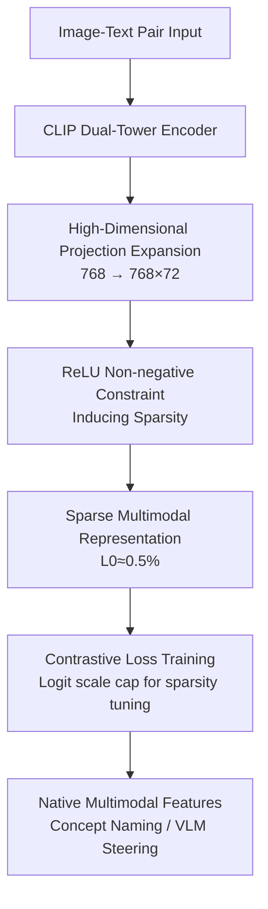

# Sparse CLIP: Co-optimizing Interpretability and Performance in Contrastive Learning

**Conference**: ICLR 2026  
**OpenReview**: [https://openreview.net/forum?id=DjefrO8TJr](https://openreview.net/forum?id=DjefrO8TJr)  
**Code**: None  
**Area**: Multimodal VLM / Interpretability / Contrastive Learning  
**Keywords**: CLIP, Sparse Representation, Interpretability, Multimodal, Visual steering

## TL;DR
This paper integrates "sparsity" directly into CLIP's contrastive pre-training (adding ReLU non-negative constraints to the final projection layer + significant dimensional expansion). This trains sparse CLIP representations that are interpretable, maintain accuracy, and naturally preserve cross-modal capabilities, thereby overthowing the common assumption that "interpretability must sacrifice precision."

## Background & Motivation
**Background**: CLIP has become the foundation of vision-language representation learning and the default visual backbone for Multimodal Large Language Models (MLLM). However, it outputs a dense, opaque latent space where individual dimensions rarely correspond to clear concepts, leading to poor interpretability.

**Limitations of Prior Work**: To open this black box, current mainstream approaches involve post-hoc training of Sparse Autoencoders (SAEs)—inserting a high-dimensional bottleneck layer into a pre-trained CLIP's residual stream to decompose dense features into interpretable sparse atoms. However, SAEs face two major flaws: first, sparse SAE features typically underperform compared to dense original features in downstream tasks (probing, unlearning, etc.); second, most CLIP SAEs are trained only on the vision tower, discarding CLIP's most valuable cross-modal capability (even SAEs trained on multimodal spaces often produce "unimodal" features that activate only for images or only for text).

**Key Challenge**: There is a deeply rooted belief in the field that interpretability and precision are inherently mutually exclusive—the assumption that "enforcing sparsity during training harms downstream performance" is precisely what has pushed research toward post-hoc approaches.

**Goal**: Is it possible to introduce sparsity during the training phase while (1) preserving downstream performance, (2) maintaining multimodal properties, and (3) achieving better interpretability than post-hoc SAEs?

**Key Insight**: The authors note a theoretical fact—HaoChen et al. proved that the spectral form of contrastive learning is equivalent to Matrix Factorization (MF), and Wang et al. further proved that "non-negative contrastive learning is equivalent to Non-negative Matrix Factorization (NMF)," an equivalence that extends to multimodal contrastive learning. Since NMF and SAEs can both be unified under the dictionary learning framework, "inducing sparsity via non-negative constraints in CLIP" has a theoretical basis, and since it is trained with contrastive loss, multimodal attributes will be naturally preserved.

**Core Idea**: Instead of training separate SAEs, the authors make two minimal changes to the original CLIP training: adding ReLU after the final projection layer (non-negative constraint) + significantly expanding the projection dimension. This transforms dense CLIP representations into SAE-like sparse interpretable features without performance degradation and with native multimodality.

## Method

### Overall Architecture
The starting point of Sparse CLIP is counter-intuitive: it hardly changes the CLIP training pipeline. It only modifies the **final projection layer** of the image/text encoders and continues to train with the original contrastive (cosine similarity) loss. Specifically, the input remains scraped image-text pairs. Embeddings are generated via dual towers, but the projection layer expands the dimension from 768 to $768 \times 72 = 55,296$, followed by a ReLU to force non-negativity. These two steps together compress the originally dense, fully active representations into sparse vectors with extremely low $L_0$ (activation rates of 0.47%–0.66%). After training, each sparse feature dimension can correspond to a semantic concept, allowing it to be named using the "maximally activating words," which in turn supports VLM visual steering (masking/enhancing specific concepts).

From a dictionary learning perspective, to approximate the activation matrix $A \in \mathbb{R}^{n\times m}$ as $A \approx UV^\top$ ($V$ is the dictionary, $U$ is the representation): NMF follows the $U,V \ge 0$ constraint, while SAE follows $U=\psi(A), \|U\|_0 \le K$ hard sparsity. Sparse CLIP chooses the NMF path—non-negative constraints (rather than top-K or reconstruction loss). Structurally, it resembles an "SAE without a decoder," but its loss function remains the contrastive loss, which is the key distinction from SAEs.

### Key Designs

**1. Inducing Sparsity via Non-negative Constraints: Using ReLU instead of top-K/Reconstruction Loss**

The authors initially tried porting traditional SAE methods (reconstruction loss, top-K activation) into CLIP training but found them unnecessary. Simply adding a ReLU after the final projection layer to enforce non-negativity, combined with contrastive loss, leads to the natural emergence of sparsity. This is supported by the theory that "non-negative contrastive learning is equivalent to NMF," making the non-negative constraint essentially a sparse dictionary decomposition. Crucially, the dynamics of ReLU differ from top-K/L1: L1 and top-K force $L_0$ very low from the start of training, prematurely limiting model capacity and harming learning ability. ReLU allows sparsity to form **gradually**; early in training, activation density remains higher, allowing the model to learn fully, while sparsity tightens as training progresses. This results in significantly higher zero-shot accuracy (see Observation 2 in the ablation). Essentially: sparsity should "grow gradually," not be "strangled at the start."

**2. Dimensional Expansion: The Dictionary Must Be Large Enough**

Non-negative constraints alone are insufficient. Small-scale experiments showed that without dimensional expansion, adding non-negative constraints actually leads to performance drops (Fig 2a, left end of the blue line). Only by significantly increasing the projection dimension can sparse representations achieve competitive performance on downstream tasks. This aligns with dictionary learning theory—to learn a good dictionary, its scale (the representation dimension) must be large enough. Expansion and non-negativity have a synergistic effect: as dimensions increase, performance improves while the number of activated features plateaus (stable sparsity), but **this only holds when non-negative constraints are present**. Without ReLU, all features remain active regardless of dimension, and sparsity never emerges. On ViT-L/14, the authors used a $72\times$ expansion factor (the maximum permitted by 80GB VRAM), expanding the dimension from 768 to 55,296.

**3. Logit scale cap: A Tunable Sparsity Knob**

CLIP features a learnable logit scale (temperature) that amplifies cosine similarity before the softmax to control distribution sharpness and facilitate learning from harder samples. The authors discovered this parameter also acts as a control valve for sparsity: lowering the logit scale cap consistently reduces $L_0$ sparsity (Fig 2c, left). While lacking a full theoretical explanation, it provides a practical tuning mechanism. However, a sweet spot exists—performance drops sharply when the cap reaches 20, indicating that excessive sparsity harms representation capacity. The authors eventually trained two models with different sparsity levels using cap=50 and cap=40 ($L_0$ of 0.66% and 0.47%), named ViT-L/14 Sparse and Sparse+.

**4. The Free Lunch of Native Multimodality: Concept Naming and Visual Steering**

Because Sparse CLIP is always trained with cross-modal contrastive loss, its sparse features are **truly multimodal**—the same feature dimension is activated by both semantically similar images and text (contrasting with post-hoc SAEs which often yield unimodal features, see Fig 3b). This offers two direct benefits: first, visual features can be named directly using the "maximally activating vocabulary" (using a 98.6k vocabulary + 80k MetaCLIP images, authors found visual and textual concepts highly correlated, e.g., features for "dog," "British," or "David Beckham") without extra classifiers or LLMs; second, visual steering is possible—modifying sparse activation values directly before the VLM's adapter (e.g., zeroing out "dog" features or scaling "cat" features to 2.0) changes the VLM's text output accordingly, or suppresses "password" features to mask sensitive concepts.

### Loss & Training
The entire process uses CLIP's native cross-modal cosine similarity contrastive loss (**no reconstruction loss, no top-K**); sparsity emerges entirely from ReLU + dimensional expansion. Small-scale recipe searches used ViT-B/32 + 15M MetaCLIP image-text pairs, evaluating zero-shot accuracy and $L_0$ on ImageNet-1k. The scaled-up experiment used ViT-L/14 + 2.2B MetaCLIP corpus trained for approximately 6 epochs with an expansion factor of 72 (dimension 55,296), producing Sparse / Sparse+ variants via logit scale cap=50/40. Downstream VLMs utilized Sparse+ as the vision encoder with Llama 3.1 8B Instruct, connected via a 2-layer MLP adapter, trained in two stages (first freezing encoder and LLM to train the adapter, then joint fine-tuning of adapter+LLM).

## Key Experimental Results

### Main Results
In zero-shot classification, sparsification does not cause performance drops and even shows slight gains:

| Model | Avg Classification | Avg Fine-grained | Sparsity ($L_0$) |
|------|---------|-----------|------------|
| ViT-L/14 baseline (Dense) | 75.1 | 73.3 | 100% |
| ViT-L/14 Sparse | **75.6** (+0.5) | **74.0** (+0.7) | 0.66% |
| ViT-L/14 Sparse+ | 75.1 | 73.2 | 0.47% |

On additional downstream tasks, sparse models lead significantly in BBox classification (simulating CLIP usage in open-vocabulary detection), though zero-shot retrieval is consistently lower:

| Model | BBox Acc@1 | Img→Txt Retrieval IR@1 | Txt→Img Retrieval TR@1 |
|------|-----------|---------------|---------------|
| ViT-L/14 baseline | 53.3 | 45.5 | 62.7 |
| ViT-L/14 Sparse | **55.5** | 43.7 | 59.9 |
| ViT-L/14 Sparse+ | 56.0 | 41.8 | 57.0 |

The authors hypothesize that low $L_0$ + lower logit scale cap makes Sparse CLIP focus only on dominant subjects in an image, which is disadvantageous for COCO retrieval where captions often describe multiple subjects.

Regarding interpretability, the Clarity metric (measuring average pairwise cosine similarity between images activating the same feature, formula $\text{Clarity}=\frac{1}{|F_{active}|}\sum_{i}\frac{1}{|I_i|(|I_i|-1)}\sum_{x_j,x_k\in I_i}\text{sim}(e(x_j),e(x_k))$) is compared against open-source CLIP SAEs:

| Model | Clarity ↑ (ImageNet) | Active Feature Prop ↑ | $L_0$ ↓ |
|------|---------------------|---------------|------|
| Prisma SAE (cls@11) | 0.519 | 45.1% | 916.0 |
| Daujotas' SAE | 0.521 | 41.0% | >10k |
| ViT-L/14 Sparse | 0.549 | 88.3% | 468.5 |
| ViT-L/14 Sparse+ | **0.559** | 85.5% | 344.3 |

Sparse CLIP outperforms post-hoc SAEs in all three metrics: higher Clarity, nearly double the active feature proportion, and lower $L_0$.

### Ablation Study

| Configuration | Key Finding | Description |
|------|---------|------|
| Non-negativity only, no expansion | Performance drop | Dictionary too small; sparsity harms performance (Fig 2a, blue line left) |
| Non-negativity + Expansion | Performance & sparsity increase together | Dimension ↑ leads to performance ↑ and plateaued active features; only holds with ReLU |
| L1 loss / top-K(K=512) for sparsity | Significantly lower zero-shot | Forcing $L_0$ low from the start limits learning capacity |
| ReLU for sparsity | Highest zero-shot | Sparsity forms gradually, preserving training capacity |
| logit scale cap 50→40→...→20 | $L_0$ monotonic decrease; collapse at cap=20 | Sparsity is tunable, but has a sweet spot |

Image QA for downstream VLMs also validates the utility of sparse encoders:

| Visual Encoder | MMMU | AI2D | TextVQA | POPE |
|-----------|------|------|---------|------|
| ViT-L/14 baseline | 39.6 | 67.2 | 48.9 | 80.8 |
| ViT-L/14 Sparse | 40.8 | 66.4 | **51.3** | **82.0** |
| ViT-L/14 Sparse+ | **41.7** | **70.6** | 48.5 | 80.7 |

### Key Findings
- **Dimensional expansion is the performance switch, ReLU is the "gentle injection" of sparsity**: Removing expansion drops performance, and replacing ReLU with L1/top-K harms performance due to premature sparsity—both are essential and cannot be replaced by aggressive hard sparsity.
- **Sparse features are multimodal from the very early stages of training (1%)**: The modality distribution at the 1% checkpoint is already highly similar to the final state, just with an order of magnitude higher activation density; this suggests cross-modal alignment emerges early rather than merging later.
- **Concepts evolve or transform during training**: The "dog rose" feature evolved from "red fruit + random biology" $\rightarrow$ "rose hips" $\rightarrow$ "dog rose detector"; feature 40397 evolved from "goatee" $\rightarrow$ "Ryan Gosling" $\rightarrow$ "David Beckham." Sparse CLIP trained from scratch provides a rare window into how concepts are "born and matured."
- **Visual steering is most stable at SS=2.0 with 1–2 modified features**: Concept suppression strengthens linearly with the number and intensity of features; enhancing new concepts is also effective, but high SS can trigger model corruption (abnormally long responses), necessitating control over the number of modified features.

## Highlights & Insights
- **Minimal changes for a major breakthrough**: By only adding ReLU and dimensional expansion, the paper achieves interpretability without loss of performance, directly challenging the assumption that "interpretability vs precision" is a zero-sum game.
- **Repurposing CLIP's inherent temperature as a sparsity knob**: Reinterpreting the existing logit scale cap as a sparsity control valve is an elegant engineering solution that avoids introducing new hyperparameters.
- **"Native Interpretability" opens a window into training dynamics**: Training from scratch with namable dimensions allows for the first direct visualization of how concepts emerge and evolve, a methodology applicable to any contrastive learning scenario.
- **Sparsity should be gradual, not hard-coded**: The conclusion that ReLU outperforms L1/top-K suggests that the "timing and speed" of sparsity regularization is a crucial design variable.

## Limitations & Future Work
- **Requires training from scratch**: This paper trains a "natively interpretable" CLIP variant, so insights cannot be directly applied to existing dense CLIP models; comparing learned concepts across architectures is left for future work.
- **Significant parameter overhead, source of gains unclear**: The $768 \rightarrow 768 \times 72$ projection adds approximately 14% parameters to the vision tower; it remains undetermined if gains stem from sparsity or the additional parameters.
- **VRAM is a hard ceiling**: Contrastive learning requires aggregating batch activations across GPUs for cosine similarity calculations. After expanding dimensions, memory becomes tight; $72\times$ was the limit on 80GB GPUs. Memory-efficient sparse CLIP training is a major challenge.
- **Systematically weaker in retrieval**: The tendency to focus on dominant subjects harms performance in multi-subject caption retrieval, which limits its applicability in certain domains.

## Related Work & Insights
- **vs. Post-hoc SAEs (Prisma / Joseph et al.)**: SAEs insert bottleneck layers after training using reconstruction loss, resulting in mostly unimodal features and performance drops. This work induces sparsity during training using contrastive loss, resulting in truly multimodal features and no performance loss, with superior Clarity and $L_0$.
- **vs. Non-negative Contrastive Learning (Wang et al. 2024)**: They proved "non-negative contrastive learning $\equiv$ NMF" induces sparsity but did not explore strengthening representations via expansion. This paper completes the puzzle with "dimensional expansion" to provide a usable, scalable training scheme.
- **vs. Vocabulary-predefined Sparsity (Chen et al. 2023)**: They projected dense features into a high-dimensional space defined by a vocabulary. While interpretable and multimodal, the vocabulary limits the expression of high-level semantics. Sparse CLIP's space is learned from data and is not constrained by a predefined vocabulary.

## Rating
- Novelty: ⭐⭐⭐⭐⭐ Uses two minimal changes to overturn the consensus that interpretability sacrifices precision, building a theoretical bridge between NMF and contrastive learning.
- Experimental Thoroughness: ⭐⭐⭐⭐ Covers zero-shot classification/fine-grained/retrieval/BBox/VLM QA + interpretability + steering, though code is not released and $72\times$ was limited by VRAM.
- Writing Quality: ⭐⭐⭐⭐ Progresses logically from theoretical motivation to ablation observations; the three Observations clearly explain design choices.
- Value: ⭐⭐⭐⭐⭐ "Native interpretability during training" is a design principle likely to be widely reused, with significant implications for controllable/auditable MLLM vision backbones.

<!-- RELATED:START -->

## Related Papers

- [\[ACL 2026\] From Interpretability to Performance: Optimizing Retrieval Heads for Long-Context Language Models](../../ACL2026/interpretability/from_interpretability_to_performance_optimizing_retrieval_heads_for_long-context.md)
- [\[ICLR 2026\] Dissecting Representation Misalignment in Contrastive Learning via Influence Function](dissecting_representation_misalignment_in_contrastive_learning_via_influence_fun.md)
- [\[ICLR 2026\] Learning Multimodal Dictionary Decompositions with Group-Sparse Autoencoders](learning_multimodal_dictionary_decompositions_with_group-sparse_autoencoders.md)
- [\[ICLR 2026\] Dyslexify: A Mechanistic Defense Against Typographic Attacks in CLIP](dyslexify_a_mechanistic_defense_against_typographic_attacks_in_clip.md)
- [\[ICLR 2026\] The Tutor-Pupil Augmentation: Enhancing Learning and Interpretability via Input Corrections](the_tutor-pupil_augmentation_enhancing_learning_and_interpretability_via_input_c.md)

<!-- RELATED:END -->
