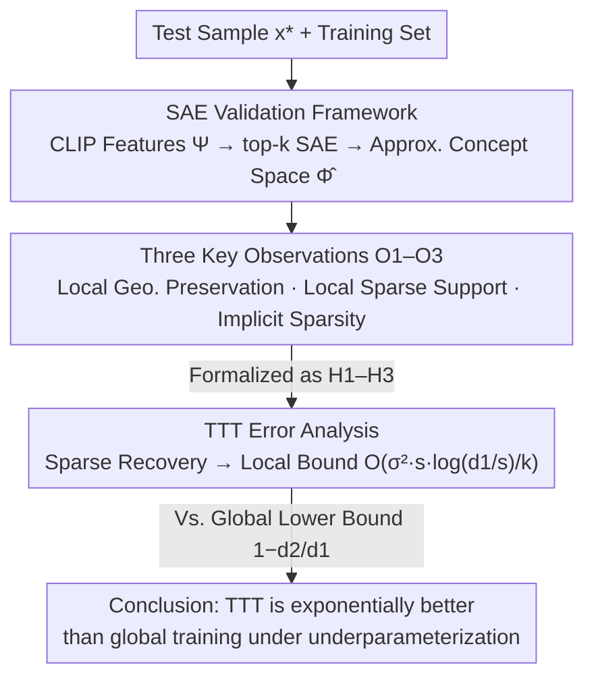

# Specialization after Generalization: Towards Understanding Test-Time Training in Foundation Models

**Conference**: ICLR 2026 Oral  
**arXiv**: [2509.24510](https://arxiv.org/abs/2509.24510)  
**Code**: None  
**Area**: Model Compression / Test-Time Training  
**Keywords**: Test-Time Training, Linear Representation Hypothesis, Sparse Autoencoders, Specialization after Generalization, Foundation Models

## TL;DR

Starting from the Linear Representation Hypothesis (LRH), this paper proposes a theoretical framework of "specialization after generalization" to systematically explain why TTT is effective in in-distribution scenarios for the first time. Foundation models experience concept superposition interference due to global underparameterization. TTT releases model capacity by temporarily forgetting irrelevant concepts and locally specializing on a few concepts related to the test task, providing theoretical guarantees that generalization is possible even when the feature space is exponentially smaller than the concept space.

## Background & Motivation

**Background**: Test-Time Training (TTT) pushes fine-tuning to the extreme by fine-tuning the model for each individual test sample. It has recently demonstrated significant improvements in tasks such as abstract reasoning, language modeling, and video generation. A typical approach involves retrieving nearest neighbors of the test point from the training set, performing a few steps of gradient descent on the pre-trained model using a supervised loss, and then using the locally fine-tuned model for prediction during inference.

**Limitations of Prior Work**: Past explanations for the effectiveness of TTT primarily focused on two aspects: (1) out-of-distribution (OOD) adaptation; (2) utilization of privileged data not seen during pre-training. However, as foundation models scale rapidly, most test data are already in-distribution, making these two explanations both inapplicable. A key unsolved question emerges: **Why does TTT still improve predictions in in-distribution scenarios?**

**Key Challenge**: Despite the massive parameter counts of contemporary foundation models, scaling law research indicates that increasing model size continues to improve performance, suggesting that models are actually in a state of "effective underparameterization." Models must simultaneously encode a vast number of real-world concepts, and since the number of concepts far exceeds the model's dimensions, multiple concepts must be superimposed within the same set of activations (superposition). This superposition causes interference between concepts during global prediction, preventing precise decoupling of each concept's meaning.

**Goal**: (1) Theoretically characterize the mechanism of TTT's effectiveness under in-distribution settings; (2) Establish theoretical upper bounds for TTT error to prove it outperforms global training; (3) Validate theoretical hypotheses via SAEs and verify theoretical predictions through scaling studies.

**Key Insight**: The authors start from the Linear Representation Hypothesis (LRH)—models encode high-level semantic concepts as linear directions in the activation space, with a single input activating only a few concepts ($s$-sparse). Since the number of concepts $d_1$ is much larger than the model dimension $d_2$, concepts are superimposed in dense activations. TTT is more likely to succeed because it only needs to decouple a few relevant concepts within a local neighborhood, rather than all concepts globally.

**Core Idea**: TTT is essentially "specialization after generalization"—the model first learns superimposed representations of concepts through global training, and then releases model capacity to a few concepts relevant to the current task through local fine-tuning at test time, temporarily "forgetting" irrelevant knowledge in exchange for improved local precision.

## Method

### Overall Architecture

This is a theory-driven empirical study. Instead of proposing a new TTT algorithm, it constructs a theoretical framework based on LRH to explain TTT's effectiveness. The framework is validated via Sparse Autoencoder (SAE) experiments and scaling studies. It is organized into three levels: (1) establishing three key observations (O1-O3) using SAEs on ImageNet to support theoretical hypotheses; (2) performing scaling experiments on model and data size (MNIST/ImageNet/Pile) to verify the practical predictions of the "underparameterization hypothesis"; (3) deriving the local error upper bound for TTT under LRH and comparing it theoretically with global training error.

The input is an arbitrary test sample $x^*$. The method retrieves $k=50$ neighbors from the training set and trains a local linear classifier (updating only the last layer) using cross-entropy loss to predict the label of $x^*$. The core theoretical question is: why is the strategy of "training a local model with 50 neighbors" better than "training a global model on the full data"? These three levels are interconnected—first using SAEs to turn the unobservable concept space into an analyzable object, then observing empirical laws O1–O3, and finally formalizing these into hypotheses to derive the TTT error bound for comparison with global training.

### Key Designs

**1. SAE Validation Framework: Making the unobservable "concept space" analyzable**

Since the "true concept space" $\Phi$ in the theory cannot be directly accessed, the authors use a Sparse Autoencoder (SAE) to learn an approximate concept space $\hat{\Phi}$, allowing originally verbal hypotheses to be empirically tested. Specifically, they extract $d_2=512$ dimensional features $\Psi(x)$ using CLIP ViT-B/32 on ImageNet-1K, then train a top-$k$ SAE to encode it into a $d_1=4096$ dimensional, $s=16$ sparse concept vector $\hat{\Phi}(x)$. The encoder $E \in \mathbb{R}^{d_1 \times d_2}$ keeps only the largest $s$ activations, while the decoder $D \in \mathbb{R}^{d_2 \times d_1}$ reconstructs the original features from the sparse representation. The optimization objective is the reconstruction error:

$$\mathbb{E}_x\|\Psi(x) - D \cdot \text{top}_s(E \cdot \Psi(x))\|_2^2,$$

assisted by ghost gradient loss to suppress dead features. A key technical choice is that subsequent experiments are conducted on reconstructed features $\hat{\Psi}(x)$ rather than original CLIP features. This aligns the experimental space with the theoretical model at the cost of directly dropping about 6% in global classification accuracy—a trade-off made to ensure the verifiability of theoretical hypotheses.

**2. Three Key Observations O1–O3: Anchoring theoretical hypotheses to empirical evidence**

Instead of analyzing TTT's mathematical properties directly, the authors establish three measurable empirical laws in the $\hat{\Phi}$ space as prerequisites for subsequent proofs.

- **O1 (Local Geometry Preservation)**: Comparing the cosine similarity distributions in $\Psi, \hat{\Psi}, \text{and } \hat{\Phi}$ spaces for the neighborhood of the same test point showed they almost overlap. This confirms that the SAE mapping does not destroy the local angular structure, allowing the theory to safely discuss neighborhoods in $\hat{\Phi}$.
- **O2 (Neighborhood Support by Few Concepts)**: Learning an adaptive binary mask $m$ for each neighborhood via straight-through estimators to optimize $\hat{\Phi}_m(x) = m \odot \hat{\Phi}(x)$ with an $\ell_2$ sparsity penalty. Results show that keeping only ~40 concepts (out of ~180 active in the neighborhood) maintains TTT accuracy. Crucially, a non-adaptive mask (keeping only concepts active in the test point itself) reached only 71.51%, significantly lower than the 72.64% of the adaptive mask. This proves that identifying "relevant concepts" requires learning to discard spurious features.
- **O3 (Implicit Sparsity)**: Performing TTT in both $\hat{\Psi}$ and $\hat{\Phi}_m$ spaces yielded consistent predictions on ~89% of samples with highly matched top-10 probability distributions. This indicates that TTT in the feature space implicitly favors sparse solutions in the concept space.

These observations correspond to "reliable neighborhood structure, sparse relevant concepts, and TTT's ability to find sparse solutions," paving the way for the error proof.

**3. Theoretical Analysis of TTT Error: Proving local specialization is exponentially superior under underparameterization**

After formalizing O1–O3 into three hypotheses—(H1) feature space neighborhoods are contained within concept space neighborhoods; (H2) there exists a $\Theta(s)$-sparse local concept vector approximating the target function; (H3) TTT implicitly finds sparse solutions—the authors prove the TTT test error bound using sparse recovery techniques:

$$\big(f(x^*) - \langle \Psi(x^*), \hat{v}_{x^*}^{\text{TTT}} \rangle\big)^2 \leq O\!\left(\frac{\sigma^2 s \log(d_1/s)}{k}\right),$$

which achieves the minimax optimal rate. For comparison, the global model's error lower bound is established: when the feature space is a random projection of the concept space, the global error is $1 - d_2/d_1$, which approaches 1 as $d_1 \to \infty$. Parallel examination of these formulas reveals the core logic: TTT error improves with neighborhood size $k$ and has only logarithmic dependence on concept space dimension $\log d_1$, whereas global model error worsens linearly with concepts $d_2/d_1$. When real-world concepts are vast (large $d_1$), local specialization gains an exponential advantage over global training.

### Loss & Training

The TTT stage uses a standard cross-entropy loss to train a local linear classifier on $k=50$ neighbors, updating only the final layer. In language modeling experiments, LoRA (approx. 1% parameters) is used on Qwen2.5 models for TTT, performing one gradient descent step on each of the 50 neighbors sorted by similarity. Neighborhood retrieval uses $L_2$ distance (equivalent to cosine similarity for normalized CLIP features).

## Key Experimental Results

### Main Results: TTT vs. Global Training on ImageNet

| Method | Concept Space $\hat{\Phi}(x)$ Acc | Feature Space $\hat{\Psi}(x)$ Acc |
|------|------|------|
| Global Training | 71.45 ± 0.21 | 71.26 ± 0.20 |
| TTT ($k$=50 neighbors) | **72.64 ± 0.20** | **72.56 ± 0.19** |
| Adaptive Mask TTT | 72.64 ± 0.20 (~40 concepts only) | — |
| Non-adaptive Mask TTT | 71.51 | — |

TTT improves accuracy by approximately 1.2-1.3 percentage points over global training. Adaptive Mask TTT achieves identical performance to dense TTT using only about 40 concepts, while non-adaptive masking (keeping only 16 concepts from the test point) shows almost no improvement, indicating that local concept selection must be learned.

### Model/Data Scaling Study

| Task | Min Model TTT Gain | Max Model TTT Gain | Trend |
|------|---------|---------|------|
| MNIST | ~0.8% error reduction | ~0.1% | Gap narrows significantly as model scales |
| ImageNet (MLP) | ~3% Acc increase | ~0.5% | Same as above |
| Pile LM (Qwen2.5) | 0.5B: ~0.07 bits/byte improv. | 7B: ~0.02 bits/byte | Same as above |

### TTT Locality Verification

| Evaluation Target | MNIST Accuracy | ImageNet Accuracy |
|---------|------------|----------------|
| Global Model | 98.57 ± 0.12 | 78.33 ± 0.19 |
| TTT Evaluation (Test Sample) | 99.01 ± 0.10 | 79.39 ± 0.18 |
| TTT Evaluation (Neighborhood) | 100.00 ± 0.00 | 95.19 ± 0.00 |
| TTT Head Global Evaluation | **36.38 ± 0.16** | **77.04 ± 0.06** |

This table is most compelling: while the TTT head is nearly perfect within the neighborhood (100% on MNIST), applying it globally to the entire test set leads to a catastrophic collapse (only 36.38% on MNIST). This visually validates the "local specialization" mechanism—TTT swaps irrelevant concepts for local precision.

### Key Findings

- **Scaling Trends Match Theoretical Predictions**: TTT consistently outperforms global training, but the gain diminishes as model size increases. On MNIST, the smallest model shows ~0.8% improvement while the largest is nearly flat; on Pile, the 0.5B model sees the largest gain. This aligns with the theory that the degree of underparameterization determines the TTT gain—larger models require less superposition and can naturally decouple more concepts.
- **Counter-intuitive Effect of Data Scale**: TTT improvement actually increases slightly as training data grows. Larger training sets provide more relevant and diverse neighborhoods for each test point, making local adaptation more effective.
- **Optimal Neighborhood Trade-off**: Experiments on ImageNet with varying $k$ show that too small a $k$ leads to high variance, while too large a $k$ introduces irrelevant concepts that violate local sparsity. The optimum is around $k=50$.
- **Weakness of Non-parametric Baselines**: Majority voting performs poorly when class counts are high (ImageNet 1000 classes) because it fails to leverage concept space structures, relying only on simple frequency statistics.

## Highlights & Insights

- **Unified Explanation of "Forgetting as Releasing"**: The paper attributes the in-distribution effectiveness of TTT to global underparameterization rather than distribution shift. This perspective explains why TTT helps small models more than large ones and why TTT heads fail globally. It is a conceptually elegant unification.
- **SAE as a Theoretical Validation Tool**: Cleverly using SAEs to transform unobservable "concept spaces" into analyzable objects. The adaptive mask experiment (O2) is particularly insightful, proving only ~40/4096 concepts are relevant, providing a quantitative explanation for why 50 neighbors suffice.
- **Theory Providing Practical Guidance**: The error bound $O(\sigma^2 s \log(d_1/s)/k)$ informs practitioners that TTT performance depends on local concept sparsity $s$, concept space size $d_1$ (logarithmic), and neighborhood size $k$. This provides a theoretical basis for neighborhood selection.
- **Conceptual Bridge to Continual Learning**: The "temporary forgetting" mechanism in TTT is the flip side of the coin to catastrophic forgetting in continual learning—where forgetting is a problem in the latter, it is a feature in the former.

## Limitations & Future Work

- **Universality of LRH**: Theoretical conclusions depend on the Linear Representation Hypothesis, which may not hold for all architectures or highly non-linear tasks (e.g., complex reasoning) where concepts are not encoded linearly.
- **SAE Approximation Precision**: SAE reconstruction drops global accuracy by 6%, suggesting a gap between $\hat{\Phi}$ and the true concept space. Whether O1-O3 hold in the true space requires more evidence.
- **Linear vs. Non-linear TTT Gap**: Theoretical analysis is restricted to linear classifiers (last-layer updates), while practice often uses LoRA across multiple layers. The theory does not fully cover non-linear cases.
- **Experimental Scale**: Language modeling experiments were limited to 1% of the test set and models up to 7B due to hardware constraints. Scaling trends for larger models (70B+) remain to be verified.
- **Neighborhood Selection Strategy**: The study uses fixed $k=50$ and $L_2$ distance. Optimal $k$ might vary based on local concept density. Adaptive neighborhood selection is a valuable future direction.

## Related Work & Insights

- **vs. Classic TTT (Sun et al. 2020)**: While classic TTT uses self-supervised losses for OOD adaptation, this work focuses on semi-parametric TTT (supervised loss on neighbors) for in-distribution scenarios. It provides theoretical grounding for why TTT gradients align with the oracle.
- **vs. Non-parametric Methods (kNN)**: Explains why kNN/majority voting fails in high-dimensional concept spaces ($s$-sparse): they cannot utilize sparse structures to decouple meanings.
- **vs. Basu et al. 2023**: While Basu et al. assumed smoothness in the feature space, this work explicitly models the underlying sparse concept space to explain why TTT works in high-dimensional local settings.
- **Interpretability Cross-over**: Extending SAEs beyond interpretability tools to theoretical validation tools is a transferable insight for analyzing internal representations in RLHF or knowledge editing.

## Rating

- **Novelty**: ⭐⭐⭐⭐⭐ — The "specialization after generalization" framework is high in theoretical depth and explanatory power.
- **Experimental Thoroughness**: ⭐⭐⭐⭐ — Scaling studies across vision and language validate predictions, though LM experiments are constrained in scale.
- **Writing Quality**: ⭐⭐⭐⭐⭐ — Exceptional clarity and logical progression from "when" to "why."
- **Value**: ⭐⭐⭐⭐ — Primarily theoretical, but offers indirect practical guidance on neighborhood size and application timing.

<!-- RELATED:START -->

## Related Papers

- [\[ICLR 2026\] Temporal Sparse Autoencoders: Leveraging the Sequential Nature of Language for Interpretability](temporal_sparse_autoencoders_leveraging_the_sequential_nature_of_language_for_in.md)
- [\[ICLR 2026\] Grokking in LLM Pretraining? Monitor Memorization-to-Generalization without Test](grokking_in_llm_pretraining_monitor_memorization-to-generalization_without_test.md)
- [\[ICLR 2026\] Tokenizing Single-Channel EEG with Time-Frequency Motif Learning](tokenizing_single-channel_eeg_with_time-frequency_motif_learning.md)
- [\[ICLR 2026\] Priors in Time: Missing Inductive Biases for Language Model Interpretability](priors_in_time_missing_inductive_biases_for_language_model_interpretability.md)
- [\[ICLR 2026\] ZeroTuning: Unlocking the Initial Token's Power to Enhance Large Language Models Without Training](zerotuning_unlocking_the_initial_tokens_power_to_enhance_large_language_models_w.md)

<!-- RELATED:END -->
