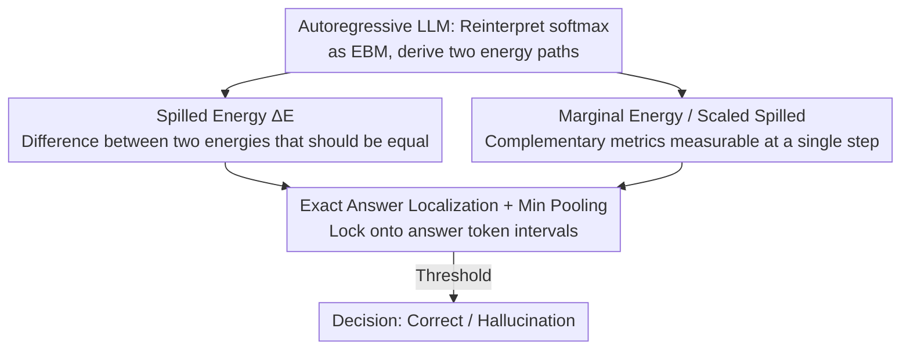

# Spilled Energy in Large Language Models

**Conference**: ICLR 2026 (Poster)  
**OpenReview**: [https://openreview.net/forum?id=EXFKk4Y3yc](https://openreview.net/forum?id=EXFKk4Y3yc)  
**Code**: https://github.com/OmnAI-Lab/spilled-energy/ (Available)  
**Area**: LLM Interpretability / Mechanistic Analysis / Hallucination Detection  
**Keywords**: Energy-Based Model (EBM), Hallucination Detection, Training-free, Softmax, Autoregressive

## TL;DR
Ours reinterprets the final softmax classifier of LLMs as an Energy-Based Model (EBM) and identifies a difference between two energy paths—termed "spilled energy"—that theoretically should be equal according to the probability chain rule but are instead read out at adjacent decoding steps. Ours proves that this **completely training-free difference, read directly from logits**, is strongly correlated with model errors. Across 9 benchmarks and multiple SOTA models, its cross-task generalization significantly outperforms probing classifiers that require task-specific training.

## Background & Motivation

**Background**: A "white-box/introspective" path in LLM hallucination detection involves judging correctness based on internal model signals rather than external fact-checking. A representative work is Orgad et al. (2025), which trains a **probing classifier** on internal representations, specifically targeting the hidden states of "exact answer tokens" to predict correctness. It also found that truthfulness signals are highly concentrated on these exact answer tokens.

**Limitations of Prior Work**: Probing classifiers face a fatal flaw: **they do not generalize across tasks**. Orgad admitted in their paper that "probing classifiers do not generalize across different tasks." The cross-dataset confusion matrix replicated in this paper (Fig. 4a) shows that once a probe leaves its training distribution, performance collapses to 62–64%, barely better than random guessing (50%). Since LLMs are foundation models used in diverse "wild" scenarios, it is impossible to predict which probe to attach; worse, the optimal token–layer combination depends on the dataset, necessitating dynamic updates of classifier weights, which conflicts with the deployment demand for a "one-size-fits-all" foundation model.

**Key Challenge**: One must choose between weak training-free baselines (logit confidence, p(true)) or stronger trained probes that fail when the task changes. Detection capability and generalization are severed by the "to train or not to train" chasm.

**Goal**: To find an internal signal that is **training-free, cross-task generalizable, and mathematically grounded**, freeing error detection from "per-task hyperparameter tuning."

**Key Insight**: Borrowing the perspective from Grathwohl et al. (2020) that "your classifier is secretly an EBM," the authors treat the LLM's final softmax as an EBM. Expanding the autoregressive probability chain via the chain rule reveals two quantities that **theoretically must be equal** (as they both equal the same sequence energy) yet are calculated at **adjacent decoding steps by different components of the softmax**.

**Core Idea**: Use the "actual difference between these two energies that should be equal" as a hallucination signal. A larger difference indicates the model is less self-consistent in its energy modeling for that prediction, making it more likely to be hallucinating. Because it is derived purely from EBM mathematics and the chain rule, no detector training is required.

## Method

### Overall Architecture

The method consists of three steps: **(1)** Reinterpreting the autoregressive LLM's softmax as an EBM to extract two energy paths from each step's logits; **(2)** Utilizing the probability chain rule to define the difference between "energies at adjacent steps that should be equal" as the "spilled energy" $\Delta E_\theta$, which serves as the core detection signal; **(3)** Implementing a sentence-level hallucination discriminator through "exact answer token localization + pooling + thresholding." The entire pipeline trains no parameters and calculates everything on-the-fly from the output logits.

### Key Designs

**1. Reinterpreting softmax as EBM: Reading two energy paths from logits**

Autoregressive LLMs model sequence probability using the chain rule $p(x_{i:1}) = \prod_i p_\theta(x_i \mid x_{i-1:1})\, p_\theta(x_1)$, where each conditional probability is a **discriminative softmax classifier**. Given the prefix, it predicts the next token over vocabulary $V$. The EBM perspective is: probability $p_\theta(x) = \exp(-E_\theta(x))/Z_\theta$, where lower energy means higher probability. Applying Grathwohl's "trick" to LLM conditional probabilities, the softmax numerator (sampled token logit) and denominator (log-sum-exp over vocabulary) correspond to two energy paths:

$$E^{\ell}_\theta(x_{i:1}) = -\,\theta(x_{i-1:1})[\mathrm{id}(x_i)], \qquad E^{m}_\theta(x_{i-1:1}) = -\log \sum_{k=1}^{V} \exp\theta(x_{i-1:1})[k].$$

Where $E^{\ell}_\theta$ is the "energy of the sampled token"—the negative logit of that token (the classic "logit confidence" baseline); $E^{m}_\theta$ is the "marginalized energy over all possible tokens," the negative log-sum-exp of the softmax denominator, measurable at a single step. This step is the foundation for everything: it moves the "correctness signal" from hidden state probes requiring training to **readable, training-free** output logits.

**2. Spilled Energy $\Delta E$: The error signal as the difference between two theoretical equals**

Rewriting the negative log-likelihood as energy and expanding it along the sequence according to Eq. (2) yields a key observation: $E^{\ell}_\theta(x_{i:1})$ (logit energy at step $i$) and $-E^{m}_\theta(x_{i:1})$ (marginal energy at step $i+1$) **should theoretically equal the same sequence energy $E_\theta(x_{i:1})$** and thus cancel to zero. However, they are measured at **different timesteps by different components of the softmax**. Since cross-entropy training only supervises the ground-truth token and never explicitly constrains this consistency, the difference is practically non-zero. The authors define this difference as spilled energy:

$$\Delta E_\theta(x_{i:1}) \;\triangleq\; -E^{m}_\theta(x_{i:1}) + E^{\ell}_\theta(x_{i:1}) \;=\; -\log\sum_k \exp\big(\theta(x_{i:1})[k]\big) \;+\; \theta(x_{i-1:1})[\mathrm{id}(x_i)].$$

Ideally, $\Delta E_\theta = 0$ for self-consistency. In reality, it is non-zero, and empirically, **this non-zero difference is strongly correlated with model errors** (Fig. 2c/2d): the $\Delta E$ distributions for correct and incorrect answers can easily be separated by a simple threshold. Intuitively, when the model's energy landscape modeling for the current prediction is less self-consistent, the spill is larger, indicating a higher likelihood of factual errors, bias, or reasoning collapse. The difference from the logit baseline is that بينما logits only look at "how confident the sampled token is," spilled energy looks at "how contradictory the model's two energy measures are for this token"—capturing internal inconsistency invisible to logits.

**3. Marginal Energy and Scaled Spilled Energy: Complementary single-step metrics**

In addition to the two-step spilled energy, indices like **Marginal Energy $E^{m}_\theta(x_{i:1})$** are used as detectors—calculable at a single step (the softmax denominator), characterizing the overall "energy level." These are complementary: spilled energy captures "inter-step inconsistency," while marginal energy captures "single-step absolute levels." Furthermore, the authors multiply the two to get **Scaled Spilled Energy** $\Delta E_s(x_{i:1}) = |E^{m}_\theta(x_{i:1})|\,\Delta E_\theta(x_{i:1})$, using the magnitude of marginal energy to amplify the spill signal. In experiments, spilled energy $\Delta E$ (with min pooling) is usually strongest on instruction-tuned models, while marginal energy occasionally leads on unaligned Mistral.

**4. Exact Answer Token Localization + Pooling: Focusing the signal on "Answers"**

Calculating spilled energy on the entire sentence produces many false positives: at punctuation and sentence-starting words, the probability mass for the next token is naturally dispersed across many reasonable options, raising spilled energy even if the answer is correct. Following Orgad's insight—truthfulness signals concentrate on **exact answer tokens** (e.g., "Rome" in "The capital of Italy is Rome")—Ours uses a "prompt the LLM for a short answer" technique to locate the answer token interval $[u, w] \subseteq [i+1, N]$ and reads energy only within this interval. When an answer spans multiple tokens, **pooling** is used for a sentence-level score; experiments show **min pooling is generally optimal**. Ablations show this step is critical: after limiting to exact answers, the AuROC for spilled/marginal energy jumps by ~24%, compared to only ~9% for the logit baseline—suggesting energy signals are far more sensitive to "which token is read" than logits.

### Loss & Training
None. Ours is a **completely training-free** detection method: it requires no new models, no probes, and no activation ablation. All metrics are read and calculated directly from output logits during inference, resulting in zero training overhead and applicability to both pre-trained and instruction-tuned versions.

## Key Experimental Results

### Main Results

Two complementary setups: **(a)** Controlled synthetic arithmetic (13–14 digit large number addition with manually injected Easy[1000,10000]/Medium[100,1000]/Hard[1,10] errors), verifying on Llama-3 8B, Qwen-3 8B, and Mistral-7B-Instruct that spilled energy clearly separates correct/incorrect solutions, with its **greatest advantage in the most difficult [1,10] category**; **(b)** 9 real-world NLP benchmarks (HotpotQA, HotpotQA-WC, IMDB, Math, MNLI, Movies, TriviaQA, Winobias, Winogrande), using AuROC across 4 models (LLaMA/Mistral base and Instruct). The table below shows Average AuROC across 9 benchmarks:

| Model | Method | Avg. AuROC | Training Required |
|------|------|-----------|-----------|
| LLaMA-3-Instruct | p(true) | 51.29 | No |
| LLaMA-3-Instruct | Orgad Probing Classifier | 64.16 | **Yes** |
| LLaMA-3-Instruct | Logit $E^{\ell}$ | 54.62 | No |
| LLaMA-3-Instruct | Marginal $E^{m}$ (Max) | 65.72 | No |
| LLaMA-3-Instruct | **Spilled $\Delta E$ (Min)** | **73.16** | No |
| Mistral-Instruct | Orgad Probing Classifier | 65.56 | **Yes** |
| Mistral-Instruct | Logit $E^{\ell}$ | 63.44 | No |
| Mistral-Instruct | **Spilled $\Delta E$ (Min)** | **77.49** | No |

Without training, spilled energy's average AuROC comprehensively surpasses logit and p(true), and significantly leads Orgad's trained probe. The cross-dataset confusion matrix (Fig. 4) further illustrates the point: while probes perform adequately on the diagonal (in-distribution), they collapse to near-random levels elsewhere; spilled energy shows positive improvements across many **off-diagonal cells** (TriviaQA, HotpotQA, Movies even exceed the diagonal). On Gemma-Instruct, spilled energy reached 75.89 for 4B and 68.67 for 1B, showing scalability across model sizes.

### Ablation Study

| Configuration | Avg. AuROC (with Exact Answer) | Gain over "unlocalized" |
|------|------------------------|--------------------|
| Logit $E^{\ell}$ (Max) | 56.12 | +9.23 |
| Orgad Probe (Mean) | 63.67 | – |
| Marginal $E^{m}$ (Min) | 67.23 | +20.02 |
| **Spilled $\Delta E$ (Min)** | **73.32** | **+24.06** |

### Key Findings
- **Exact answer localization is the lifeblood of energy signals**: After localization, spilled/marginal energy gains ~24% compared to ~9% for logits—energy signals are extremely sensitive to "which token is read," and without localization, they are drowned out by false positives from punctuation/sentence starters.
- **Instruction tuning has opposite effects on the two signal types**: Logits actually degrade after tuning (LLaMA 56.89%→54.62%), suggesting overconfidence; whereas spilled energy consistently benefits (LLaMA 68.69%→73.16%, Mistral 73.94%→77.49%)—a counter-intuitive advantage over classic confidence scores.
- **High variance is a sign of training-free nature, not a weakness**: The cross-dataset standard deviation for spilled/marginal energy is higher than for probes because it depends on each domain's unique energy landscape; while probes have lower variance, their cross-test means hover at the near-random 62–64% level.
- **Pooling Strategy**: Min pooling is generally optimal across methods.

## Highlights & Insights
- **"Equal but not equal" is an elegant signal source**: Reversing an identity in the probability chain rule (where two energies should cancel to zero)—in reality, it's non-zero, and this "violation" itself acts as a probe for model inconsistency/error without any supervision. This idea of "using the breakdown of theoretical identities as detection signals" could transfer to any model with internal consistency constraints.
- **True zero-training + cross-task generalization**: All metrics are read on-the-fly from logits with no task-specific weights at deployment, perfectly matching the reality of "foundation models in the wild"—this is the most significant engineering value over the Orgad probe.
- **Integrating logit confidence into a unified framework**: The classic logit baseline is essentially the $E^{\ell}_\theta$ energy path. Ours provides an EBM explanation for "why logits are weak" and points to the neglected "inter-step inconsistency" signal.

## Limitations & Future Work
- **Acknowledged limitations**: False positives occur on semantically unimportant tokens (punctuation, sentence starters) where next-token probability naturally disperses; hence, there is a strong dependency on the accuracy of "exact answer token localization."
- **Localization is a single point of failure**: The high scores of the entire method rely on accurately locking the $[u, w]$ answer interval. Localization itself depends on "prompting the LLM for short answers"; the method might degrade if prompting fails or answers are unlocalizable (open-ended generation, long-chain reasoning), which the paper did not explore in depth.
- **Variance and comparability**: Large cross-dataset variance means a single threshold may not be universal across domains; caution is needed when looking solely at "average AuROC" since dataset difficulties vary.
- **Future Improvements**: Future work could explore spilled energy as a per-token continuous visualization signal for steering during generation, or fusion with other training-free signals like semantic entropy to mitigate noise on non-answer tokens.

## Related Work & Insights
- **vs Orgad et al. (2025)**: Both focus on "exact answer tokens" and perform white-box hallucination detection. However, Orgad uses a **per-task trained probing classifier**, while Ours uses **training-free EBM energy differences**. The difference lies in generalization: probes become near-random (62–64%) out-of-distribution, enquanto spilled energy remains robust across tasks (avg. 73–77%). Ours gains on zero deployment cost but has higher variance and relies on answer localization.
- **vs ITI / Activation Intervention (Li et al. 2024)**: ITI rewrites activations of specific attention heads during inference to "guide" truthfulness; Ours does not alter any activations, only **reading** internal values for detection—lighter but only detects without fixing.
- **vs EBM-OOD (Liu et al. 2020) / Grathwohl et al. (2020)**: Energy scores have long been used for OOD detection and "classifier as EBM" training. Ours is the first to systematically move this perspective to the **inter-step consistency of autoregressive LLM decoding**, proposing the "spilled energy" concept specific to LLMs.
- **vs Semantic Entropy (Farquhar et al. 2024) / DeepConf (Fu et al. 2025)**: Both are training-free internal detection signals. Semantic entropy relies on multiple samplings to estimate uncertainty, while DeepConf filters reasoning trajectories via built-in confidence; Ours only requires logits from a single forward pass and is supported by EBM theory, making it computationally cheaper.

## Rating
- Novelty: ⭐⭐⭐⭐⭐ Extracting a training-free hallucination signal from an energy difference that theoretically should cancel out is highly original and mathematically grounded.
- Experimental Thoroughness: ⭐⭐⭐⭐ 9 benchmarks × multiple models (incl. base/Instruct, Gemma 1B/4B) + synthetic arithmetic; comprehensive comparison against Orgad/logit/p(true), though lacking open-ended long generation scenarios.
- Writing Quality: ⭐⭐⭐⭐ Clear derivations and intuitive diagrams, though energy notation is dense and some table layouts require original paper reference.
- Value: ⭐⭐⭐⭐⭐ Zero training + cross-task generalization hits the pain point of "foundation model deployment," offering high practicality and reproducibility.

<!-- RELATED:START -->

## Related Papers

- [\[ICML 2026\] Towards Atoms of Large Language Models](../../ICML2026/interpretability/towards_atoms_of_large_language_models.md)
- [\[ICLR 2026\] Medical Interpretability and Knowledge Maps of Large Language Models](medical_interpretability_and_knowledge_maps_of_large_language_models.md)
- [\[ICLR 2026\] Precise and Interpretable Editing of Code Knowledge in Large Language Models](precise_and_interpretable_editing_of_code_knowledge_in_large_language_models.md)
- [\[ICLR 2026\] Neuron-Level Analysis of Cultural Understanding in Large Language Models](neuron-level_analysis_of_cultural_understanding_in_large_language_models.md)
- [\[ICLR 2026\] What Do Large Language Models Know About Opinions?](what_do_large_language_models_know_about_opinions.md)

<!-- RELATED:END -->
