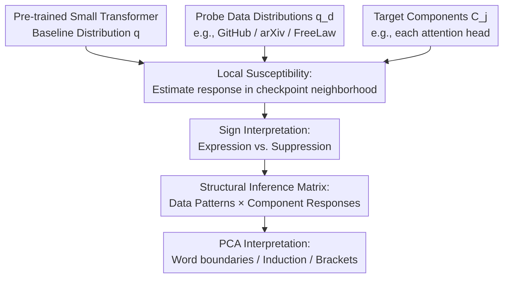

# Structural Inference: Interpreting Small Language Models with Susceptibilities

**Conference**: ICLR2026  
**OpenReview**: [https://openreview.net/forum?id=J4GYMiE3JT](https://openreview.net/forum?id=J4GYMiE3JT)  
**Code**: None  
**Area**: Interpretability / Mechanistic Interpretability  
**Keywords**: susceptibility, structural inference, small language models, attention heads, SGLD  

## TL;DR
This paper treats small language models as Bayesian statistical physics systems. By inducing model component responses through small perturbations in data distributions, the authors define susceptibility to characterize how attention heads express or suppress different data patterns. Using PCA on a 3M-parameter, two-layer attention-only Transformer, the method automatically isolates known structures such as word boundaries, induction circuits, and bracket matching.

## Background & Motivation
**Background**: Mechanistic interpretability commonly employs ablation, activation patching, and direct logit attribution to determine the functions of internal model components. Researchers manually perturb specific attention heads or MLPs and observe changes in loss, logits, or behavior to infer whether a component participates in a specific circuit.

**Limitations of Prior Work**: While intuitive, these methods typically involve "operating on components" and observing resulting failures. This can push the model into out-of-distribution states. Furthermore, it is difficult to systematically answer: if the data distribution shifts slightly toward GitHub, legal texts, or mathematics, which internal components will change accordingly? Existing tools are better at testing proposed circuit hypotheses than discovering internal structures from data patterns.

**Key Challenge**: The internal structures of language models do not grow in isolation; they correspond to statistical patterns in the training data. However, analyzing individual token losses or single head ablations tends to decouple the relationship between data patterns, component roles, and the posterior geometry of training. **Core Problem**: Can a unified response function link "changes in data distribution" with "local behavioral changes of a component"?

**Goal**: The authors aim to construct a component-oriented linear response metric. This metric should be estimable near a single training checkpoint, decomposable to the token level, and capable of organizing multiple probe datasets and attention heads into a matrix from which internal functional modules can be automatically identified.

**Key Insight**: The paper borrows the concept of susceptibility from statistical physics: the internal structure of complex materials can be probed via microscopic perturbations of an external field and the subsequent system response. In neural networks, a small mixture perturbation of the data distribution acts as the external field, component-related loss observables are the measurements, and the first-order derivative of the response is the susceptibility.

**Core Idea**: Replace direct ablation with the Bayesian local posterior response induced by data distribution perturbations, interpreting attention heads in small models as structural units with positive or negative susceptibilities toward different data patterns.

## Method

### Overall Architecture
The method does not train a new model but performs structural probing near a pre-trained small Transformer checkpoint. Inputs include a baseline data distribution $q$, several probe distributions $q_d$, a set of components to be analyzed $C_j$ (attention heads in the experiments), and weight perturbations obtained via local SGLD sampling. Outputs include the overall susceptibility of components to data perturbations and data patterns/component loadings derived from PCA on token-level susceptibility matrices.

The overall framework is summarized in the following diagram:

### Key Designs
**1. Local Susceptibility: Mapping Data Perturbations to Component Responses**

The paper defines a single-parameter perturbation of the data distribution, such as mixing the original distribution $q$ and a probe distribution $q'$ into $q_h=(1-h)q+hq'$. For any observable $\phi(w)$, susceptibility is the first-order derivative of its posterior expectation with respect to the perturbation intensity $h$: $\chi=\frac{1}{n\beta}\frac{\partial}{\partial h}\langle\phi\rangle_{\beta,h}\vert_{h=0}$. Using a covariance identity, it is expressed as $\chi=-\operatorname{Cov}_{\beta}(\phi,\Delta L)$, where $\Delta L$ is the change in population loss due to the data perturbation.

The choice of observable is critical. The paper treats component $C$ as part of a parameter space decomposition $W=U\times C$ and uses $\phi_C(w)=\delta(u-u^*)[L(w)-L(w^*)]$ to describe the "loss observable when only parameters near the component change." Consequently, susceptibility measures the sensitivity of a specific attention head to changes in a specific data distribution.

**2. SGLD Localization: Enabling Bayesian Response Estimation at a Single Checkpoint**

Since the full Bayesian posterior is not samplable, the authors focus on the structure near a specific checkpoint $w^*$. They replace the global prior with a Gaussian local prior centered at $w^*$, yielding a local Gibbs posterior: $p(w;w^*,\beta,\gamma)\propto \exp\{-n\beta L_n(w)-\frac{\gamma}{2}\|w-w^*\|_2^2\}$. This transforms the "global posterior response" into a "response within the checkpoint neighborhood," which can be sampled using SGLD.

**3. Sign Interpretation: Translating Per-token Susceptibility into Expression and Suppression**

To ensure interpretability, susceptibility is decomposed to the token level. For a context and next token $(x,y)$, per-token susceptibility measures the covariance between the component's local loss observable and the token loss $\ell_{(x,y)}(w)=-\log p(y|x,w)$. The authors standardize the susceptibility by row-centering the matrix.

The sign is interpreted as follows: a **negative** susceptibility indicates that when the component perturbation degrades the overall loss, $y$ also becomes less likely given $x$, meaning the component mechanistically supports or **expresses** this continuation. A **positive** susceptibility indicates that perturbations degrading the component's local loss actually increase $p(y|x)$, suggesting the component tends to oppose or **suppress** this continuation.

**4. Structural Inference Matrix: Recovering Internal Modules via PCA**

After obtaining the response of each component to each probe, the authors construct a response matrix $X=(\hat{\chi}^{C_j}_d)_{d\in D,j\in H}$. In token-level analysis, this matrix is expanded into a "token samples × attention heads" matrix. The hypothesis of structural inference is that if data patterns exist and model components couple with them, the response matrix should exhibit a low-rank or near-low-rank structure. PCA loadings are used to map PCs to data patterns and model components.

### Mechanism
Suppose one wants to know if an attention head relates to repeated tokens, spaces, or formatting in GitHub code. The baseline distribution $q$ is mixed with a GitHub probe distribution at $\delta h=0.1$. SGLD is used to sample weight perturbations near $w^*$. For a specific token (e.g., a space in code), per-token susceptibility is calculated. If a head shows a large negative susceptibility for spaces, it is interpreted as expressing that space continuation. Analysis of GITHUB-ALL revealed that head 0:1 displays a larger negative susceptibility for spaces compared to 0:0, explaining why it becomes a negative outlier on GitHub data.

### Loss & Training
No new training loss is proposed. The model is a 3M-parameter, two-layer attention-only Transformer trained on a subset of the Pile with next-token prediction. The empirical loss used in analysis is the standard autoregressive negative log-likelihood: $\frac{1}{K}\sum -\log p(t_{k+1}\mid t_{\le k},w)$.

SGLD parameters follow Wang et al. (2024): $\gamma=300$, $n\beta=30$, step size $\epsilon=0.001$, batch size 64, and 4 chains. For mixture data, probe samples are interleaved at a rate of $\delta h$ into a baseline dataset of $1,000,000$ points.

## Key Experimental Results

### Main Results
The model is a 3M-parameter Transformer with 2 layers and 8 heads per layer. Probing is conducted on Pile subsets including GitHub, Common Crawl, PubMed, DM Mathematics, etc.

| Analysis Object | Input Matrix / Data Volume | Key Metric/Readout | Result |
|----------|------------------|----------------|------|
| Token-level PCA, Layer 0 | $N=20,000$ random tokens per set, 8 heads | Var Explained (Top 3 PCs) | $95.34\% / 1.83\% / 0.73\%$ |
| Token-level PCA, Layer 1 | Same as above, 8 heads | Var Explained (Top 3 PCs) | $99.14\% / 0.39\% / 0.11\%$ |
| PC1 | Top +/- token loading pattern | Data pattern interpretation | Word segmentation: endings, induction, delimiters vs. starts and spaces |
| PC2 | Data loading + component loading | Circuit interpretation | Isolates induction circuit: alignment of heads 1:6, 1:7 with 0:1, 0:4, 0:5 |
| PC3 | Right delimiter loading + head loading | Circuit interpretation | Related to bracket matching (Dyck); heads 0:7, 1:3, 1:5 show high loading |

PC2 consistently distinguishes induction circuits from other Layer 1 multigram heads across 4 independent seeds, providing strong empirical validation.

### Ablation Study
The authors perform sanity checks and comparisons with zero ablation to confirm that susceptibility captures unique signals.

| Check / Comparison | Setting | Key Metric | Description |
|-------------|------|----------|------|
| Susceptibility vs. Zero Ablation | Heads 0:0, 1:2; GitHub/Math sets | Pearson $r \approx 0$ | Almost no correlation; susceptibility captures distinct signals |
| Per-token vs. Global Susceptibility | GITHUB-ALL | Pearson $r=0.958$, Slope $9.794$ | Validates that token decomposition accounts for global response (theoretical slope $\approx 10$ given $\delta h=0.1$) |
| Context Length Effect | Pile subsets, 160 contexts | Growth in Layer 1 multigram | Induction heads 1:0-1:5 signals grow the most after length 10 |
| GitHub-All Head 0:0 vs 0:1 | ~163k tokens | Scaled Sum: 0:0 (0.016), 0:1 (-0.040) | Negative outlier behavior of 0:1 driven by its 42k space token occurrences |

### Key Findings
- Susceptibility correlates poorly with zero ablation, suggesting it measures the covariance between weight perturbations, token loss, and distribution shifts in the local posterior rather than simple ablation delta.
- While PC1 explains most variance (general word boundaries), PC2 and PC3 provide the differentiation required to identify circuits like induction and bracket matching.
- Token-level decomposition is necessary; while global susceptibility identifies sensitive probe datasets, per-token analysis reveals the specific components (spaces, delimiters, endings) driving that sensitivity.

## Highlights & Insights
- Borrowing susceptibility from statistical physics represents a novel perspective, treating model components as structural units responding to "external data fields."
- The sign interpretation (negative as expression, positive as suppression) allows for a systematic measurement of suppression effects, which were previously observed mainly via logit direction in specific cases.
- The matrix perspective of structural inference is highly scalable. Different data patterns, layers, and neurons can be integrated into the response matrix for analysis via UMAP or sparse dictionary learning.

## Limitations & Future Work
- **Sampling Quality**: SGLD samples are highly correlated, and the exact impact of hyperparameters on posterior estimation remains partially unclear.
- **Computational Cost**: Estimating susceptibilities is expensive; per-token susceptibility for the 3M model required 16 A100 GPUs for ~50 hours.
- **Model Scale**: Experiments are limited to a 3M-parameter model with known circuits. It remains to be proven if this method can discover truly new and robust structures in large-scale models.
- **Future Directions**: Combining structural inference with non-linear methods like UMAP or causal verification to move beyond the simple PCA approach used here.

## Related Work & Insights
- **vs. Ablation**: Ablation intervenes on activations directly, whereas susceptibility measures covariance between local weight perturbations and data shifts. The former validates hypotheses; the latter discovers structures from data.
- **vs. Influence Functions**: Influence functions examine the effect of training samples on test loss. Susceptibility can be seen as a generalization where the observable is bound to a component rather than just a test sample loss.
- **vs. Singular Learning Theory**: The work relates to local learning geometry (refined LLC), where observables help monitor how data distribution changes affect the local geometry of specific components.

## Rating
- Novelty: ⭐⭐⭐⭐⭐ 
- Experimental Thoroughness: ⭐⭐⭐⭐☆ 
- Writing Quality: ⭐⭐⭐⭐☆ 
- Value: ⭐⭐⭐⭐⭐ 

<!-- RELATED:START -->

## Related Papers

- [\[ICML 2025\] Inference-Time Decomposition of Activations (ITDA): A Scalable Approach to Interpreting Large Language Models](../../ICML2025/interpretability/inference-time_decomposition_of_activations_itda_a_scalable_approach_to_interpre.md)
- [\[ICLR 2026\] Small Transformers Don't Need LayerNorm at Inference Time: Scaling LayerNorm Removal to GPT-2 XL and Implications for Mechanistic Interpretability](small_transformers_dont_need_layernorm_at_inference_time_scaling_layernorm_remov.md)
- [\[ICML 2026\] Scalable Circuit Learning for Interpreting Large Language Models](../../ICML2026/interpretability/scalable_circuit_learning_for_interpreting_large_language_models.md)
- [\[ICLR 2026\] The Price of Amortized inference in Sparse Autoencoders](the_price_of_amortized_inference_in_sparse_autoencoders.md)
- [\[ICLR 2026\] Semantic Regexes: Auto-Interpreting LLM Features with a Structured Language](semantic_regexes_auto-interpreting_llm_features_with_a_structured_language_of_re.md)

<!-- RELATED:END -->
