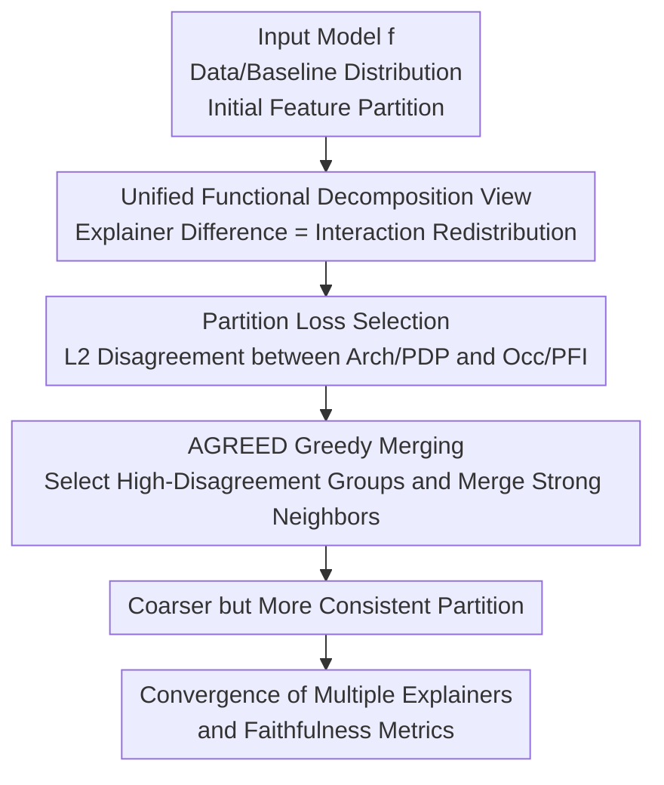

# Tackling the XAI Disagreement Problem with Adaptive Feature Grouping

**Conference**: ICLR2026  
**OpenReview**: [https://openreview.net/forum?id=RClKXngVN8](https://openreview.net/forum?id=RClKXngVN8)  
**Code**: https://github.com/thalesgroup/AGREED  
**Area**: Explainable AI / Feature Attribution  
**Keywords**: XAI Disagreement Problem, Feature Attribution, Functional Decomposition, Feature Grouping, Faithfulness Evaluation  

## TL;DR
This paper argues that the core reason for the conflict between post-hoc explainers and faithfulness metrics is the presence of interaction terms between different feature groups. It proposes AGREED, which reduces disagreements between explanation methods by adaptively merging strongly interacting feature groups, leading to more consistent explanations across tabular data and image saliency maps.

## Background & Motivation
**Background**: Post-hoc explainability methods are abundant. In tabular tasks, PDP, PFI, and SHAP are common; in image tasks, Occlusion, RISE, LIME, Integrated Gradients, and ArchAttribute are widely used. They all attempt to answer the same question: how much does a specific input feature, or a group of pixel patches, contribute to the model's current prediction. In practice, researchers and engineers often visualize these explanations as bar charts or saliency maps to judge model trustworthiness based on highlighted regions.

**Limitations of Prior Work**: The issue is that these explanation methods frequently yield contradictory answers. For instance, for a ResNet18 predicting a "white wolf," different saliency maps might highlight the eyes, nose, background, or the entire animal. In a California Housing model, the importance rankings of "Longitude" by PFI, SHAP, and PDP may disagree. More troublingly, the faithfulness/unfaithfulness metrics used to judge explainers themselves often disagree: one metric might favor PFI, while another favors SHAP. Consequently, benchmarks do not solve the disagreement problem but merely shift the debate from "which explainer is trustworthy" to "which metric is trustworthy."

**Key Challenge**: This paper attributes these contradictions to a deeper mathematical cause: when interactions exist between different feature groups, the importance of a group is no longer uniquely assignable. Different explainers essentially use different rules to redistribute these inter-group interaction terms, and faithfulness metrics use different weights to measure reconstruction error. As long as interaction terms span multiple feature groups, natural consensus among different methods is difficult to achieve.

**Goal**: Instead of declaring a specific explainer or faithfulness metric as the ground truth, the authors aim to change the "explanation units" by placing strongly interacting features into the same group. If the model becomes approximately groupwise additive after grouping, the contribution of each group becomes clearer, and various explanation methods and metrics will naturally converge.

**Key Insight**: Prior work on functional decomposition has unified various feature explanations under the perspectives of function decomposition and game theory, but typically assumes explanations for single features or lacks a rigorous treatment of "feature group/patch partition." This paper extends this unified framework to feature grouping scenarios and treats "finding a better partition" as an optimization problem.

**Core Idea**: Replace fixed-granularity explanations with adaptive feature grouping. Starting from fine-grained single features or small patches, the method identifies groups with the largest interaction-induced disagreements and merges them progressively until the model is approximately groupwise additive under the new partition.

## Method
### Overall Architecture
The proposed method is named AGREED (Adaptive Grouping to REduce Explanation Disagreements). It first uses functional decomposition to show how different explainers handle inter-group interactions, constructs a disagreement loss suitable for optimizing partitions, and finally employs a greedy algorithm to iteratively merge feature groups with the strongest interactions. The output is not a new explainer, but a more rational feature partition; on this partition, results from PDP, PFI, SHAP, LIME, Occlusion, IG, and others become more consistent.

For tabular data, the baseline distribution $B$ is often set equal to the data distribution $D$, yielding a global grouping for any sample. For image explanations, the image $x$ and baseline $b$ are fixed, with $D=\delta_x$ and $B=\delta_b$. Thus, AGREED runs for each image individually, and pixel patches are restricted to merging with adjacent neighbors to maintain connectivity.

### Key Designs
**1. Unified Functional Decomposition: Formulating Disagreement as Interaction Redistribution**

Consider a model $f:X\to \mathbb{R}$ and a feature partition $P:[d]\to[D]$. In marginal decomposition, the model relative to a baseline distribution $B$ can be written as $f(x)=\sum_{u\subseteq[d]} f_{u,B}(x)$, where $|u|=1$ represents main effects and $|u|\ge2$ represents interactions. When features are aggregated into groups, whether an interaction is "inter-group" depends on whether $P(u)$ covers multiple groups.

This perspective explains explainer inconsistency: ArchAttribute/joint-PDP only assigns terms fully contained within a group; Occlusion/joint-PFI includes all interactions involving the group; SHAP distributes interactions equally ($1/|P(u)|$); and RISE/LIME distribute them according to Banzhaf-like rules. Theorem 3.1 summarizes this: any attribution can be expressed as "intra-group effects + inter-group interaction terms with different weights." Thus, the disagreement problem is an inevitable result of the same inter-group interactions being redistributed by different rules.

**2. Groupwise Additive Target: Eliminating Ambiguity for Explainers and Metrics**

The ideal state is defined as groupwise additive: within a region $R$, the model can be written as $f(x)=\omega_0+\sum_{i=1}^{D} g_{P^{-1}(\{i\})}(x)$. This implies active groups affect the output only through their own sub-functions, with no inter-group interactions. If this holds, the contribution of group $i$ to the gap $f(x)-\mathbb{E}_{b\sim B}[f(b)]$ is explicit, removing the need to debate interaction redistribution.

Theorem 3.2 further states: once the model is groupwise additive relative to partition $P$, common faithfulness/unfaithfulness metrics simultaneously reach $0$ for any explainer and metric weights. This identifies a condition where "explainer consistency" and "metric consistency" coincide: rather than picking an explainer, one should seek a partition that makes the model approximately groupwise additive.

**3. Partition Loss Selection: $L_2$ Disagreement between Occlusion/PFI and Arch/PDP**

To make the merging process computable, the authors define three properties for a partition loss: it should be $0$ if the model is groupwise additive; merging a group that is already additive with others should not change the loss; and under ANOVA conditions with independent features, the loss should not increase as the partition coarsens.

The paper proves that not all disagreement metrics are suitable. For instance, pairs not involving Occlusion or using Pearson correlation might violate these properties. AGREED selects the $L_2$ disagreement between Arch/PDP and Occlusion/PFI:

$$
L^{\mathrm{AGREED}}_f(D,B,P)=\mathbb{E}_{x\sim D}\left[\sum_{i=1}^{D}\left(\phi^{\mathrm{PDP/Arch}}_i(f,x,B,P)-\phi^{\mathrm{PFI/Occ}}_i(f,x,B,P)\right)^2\right].
$$

This choice is theoretically sound (satisfying the partition loss properties) and computationally efficient, as PDP/Arch and PFI/Occlusion are inexpensive to compute during iterative searches.

**4. AGREED Greedy Merging: Finding Strongest Interaction Neighbors**

AGREED starts from the finest partition (individual features in tabular data, $W\times W$ patches in images). Each round, it calculates a potential $\Psi(i)$ for each group—the squared disagreement between Arch/PDP and Occlusion/PFI. The group $i$ with the highest $\Psi(i)$ is selected, and its pairwise interaction with candidate groups $j$ is estimated. The pair with the strongest interaction is merged, updating the partition and cached tensors. The complexity is $O(d^2N^2)$ for tabular data.

### Loss & Training
The method does not involve training a new model but performs a post-hoc partition search. The objective is $L^{\mathrm{AGREED}}_f(D,B,P)$, and the stopping condition is reaching a threshold $\epsilon$ or a specific number of groups. In tabular scenarios, $N$ Monte Carlo samples approximate the expectation ($N=50$ to $1000$). In image scenarios, the algorithm uses a mixed distribution $Q=\frac{1}{2}(\delta_x+\delta_b)$ with $N=2$; to ensure interpretability, merging is restricted to adjacent patches.

## Key Experimental Results

### Main Results

| Scenario | Baselines / Models | Metrics | AGREED Results | Main Conclusion |
|----------|-------------------|---------|----------------|-----------------|
| Synthetic Tabular | IGREEDY / RECURSIVE / PAIRWISE | Recovery of ground-truth partition | AGREED, PAIRWISE, and RECURSIVE all recover the true partition. | AGREED's target recovers known groupwise additive structures. |
| Real Tabular (Marketing) | EBM / HGBT | $L_2$ disagreement (PDP-SHAP, etc.) | Overall decrease as groups are merged. | Optimizing PDP-PFI also makes other explainer pairs more consistent. |
| Real Tabular (Marketing) | EBM / HGBT | Sensitivity-1, INFD, SWF | Unfaithfulness metrics converge toward $0$. | Grouping mitigates ranking conflicts between metrics. |
| MiniImageNet | VGG16 / ResNet18 / ConvNext | Mean Disagreement and INFD | Lowest disagreement and INFD at same mean patch size. | Adaptive patches are superior to QUICKSHIFT or fixed grids for consistency. |

### Ablation Study
- **Explainer Pair Choice**: Only $L_2$ pairs involving Occlusion/PFI satisfy the critical partition loss properties.
- **Disagreement Measure**: Pearson correlation-based disagreement can encourage meaningless merges.
- **Model Type**: Grouping effects are more pronounced on EBM (mostly second-order interactions) than on deep-tree GBTs with high-order interactions.
- **Image Initial Partition**: Starting from small square patches and merging only neighbors maintains connectivity and $O(d^2)$ cost.

### Key Findings
- Inter-group interactions are the common source of explainer disagreement. Optimizing the PDP-PFI difference benefits other pairs like SHAP, suggesting the loss captures a fundamental structure.
- Faithfulness metrics' inconsistency is substantial enough to change explainer rankings. Grouping causes these metrics to converge, validating the groupwise additive target.
- Grouping does not necessarily mean "simpler" explanations. It reduces ambiguity but requires joint visualization (e.g., joint PDPs) for the merged multivariate groups.

## Highlights & Insights
- The value lies in transforming the disagreement problem into an actionable partition problem. Instead of judging which explainer is "right" at the single-feature level, it changes the granularity to where explaining is uniquely possible.
- Theorems 3.1 and 3.2 link explainer disagreement with faithfulness metric conflict, providing a complete problem definition.
- AGREED uses inexpensive proxies (PDP/PFI) as signals for more complex explainers, making the iterative search feasible.
- For images, it shows that patch granularity is not just a visualization hyperparameter but a factor that changes the nature of the explanation problem.

## Limitations & Future Work
- **Trade-off**: There is an inherent trade-off between granularity and consistency. Larger groups are more consistent but harder to interpret internally.
- **Complexity**: Tabular complexity is $O(d^2N^2)$. Image complexity is high due to the number of patches, handled via adjacency constraints and sub-sampling.
- **Semantic Parts**: Disjoint patches may not capture overlapping semantic concepts. Future work could integrate AGREED with concept-based or overlapping explanation methods.
- **High-order Interactions**: If a model learns extremely complex high-order interactions, grouping a few features might not suffice to eliminate disagreement.

## Related Work & Insights
- **vs SHAP / IG**: These seek axiomatic uniqueness, but AGREED argues that interactions make the "choice" of axioms/paths an arbitrary source of disagreement unless grouping is applied.
- **vs Feature Grouping (PAIRWISE/RECURSIVE)**: AGREED specifically targets the XAI disagreement problem as its merging objective, making it more direct for explainability tasks compared to general interaction-based grouping.
- **vs Regional Explanations**: While some work restricts the baseline distribution to sub-regions, AGREED modifies the feature partition, making it applicable to both pixels and tabular features.

## Rating
- Novelty: ⭐⭐⭐⭐☆ Unifying explainers and metrics through interactions is a clear and effective perspective.
- Experimental Thoroughness: ⭐⭐⭐⭐☆ Comprehensive testing across diverse data types and models.
- Writing Quality: ⭐⭐⭐⭐☆ Strong theoretical grounding and clear main conclusions.
- Value: ⭐⭐⭐⭐☆ Highly insightful for XAI practitioners, offering a pragmatic path forward for the disagreement problem.

<!-- RELATED:START -->

## Related Papers

- [\[ICML 2026\] Formalizing the Binding Problem](../../ICML2026/interpretability/formalizing_the_binding_problem.md)
- [\[ICLR 2026\] Adaptive Concept Discovery for Interpretable Few-Shot Text Classification](adaptive_concept_discovery_for_interpretable_few-shot_text_classification.md)
- [\[ICLR 2026\] DIVERSE: Disagreement-Inducing Vector Evolution for Rashomon Set Exploration](diverse_disagreement-inducing_vector_evolution_for_rashomon_set_exploration.md)
- [\[ICLR 2026\] Missingness Bias Calibration in Feature Attribution Explanations](missingness_bias_calibration_in_feature_attribution_explanations.md)
- [\[ICML 2026\] Adaptive Querying with AI Persona Priors](../../ICML2026/interpretability/adaptive_querying_with_ai_persona_priors.md)

<!-- RELATED:END -->
## Related Papers

- [\[ICML 2026\] Formalizing the Binding Problem](../../ICML2026/interpretability/formalizing_the_binding_problem.md)
- [\[ICLR 2026\] Adaptive Concept Discovery for Interpretable Few-Shot Text Classification](adaptive_concept_discovery_for_interpretable_few-shot_text_classification.md)
- [\[ICLR 2026\] DIVERSE: Disagreement-Inducing Vector Evolution for Rashomon Set Exploration](diverse_disagreement-inducing_vector_evolution_for_rashomon_set_exploration.md)
- [\[ICML 2026\] Adaptive Querying with AI Persona Priors](../../ICML2026/interpretability/adaptive_querying_with_ai_persona_priors.md)
- [\[ICLR 2026\] xRFM: Accurate, scalable, and interpretable feature learning models for tabular data](xrfm_accurate_scalable_and_interpretable_feature_learning_models_for_tabular_dat.md)

<!-- RELATED:END -->
