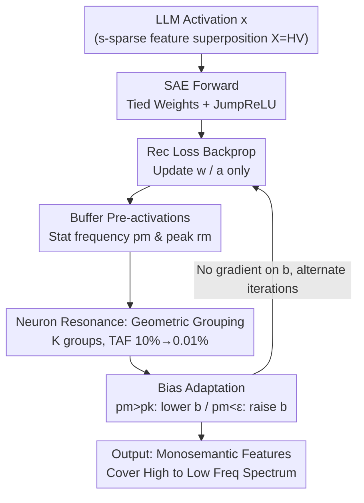

# Taming Polysemanticity in LLMs: Theory-Grounded Feature Recovery via Sparse Autoencoders

**Conference**: ICLR 2026  
**OpenReview**: [https://openreview.net/forum?id=VtWkPIbAQ8](https://openreview.net/forum?id=VtWkPIbAQ8)  
**Code**: https://github.com/FFishy-git/TamingSAE_GBA  
**Area**: Interpretability / Mechanistic Interpretability / Sparse Autoencoders  
**Keywords**: Sparse Autoencoders, Polysemanticity, Feature Recovery, Neuron Resonance, Bias Adaptation

## TL;DR
This paper revisits Sparse Autoencoder (SAE) training from the perspective of "neuron activation frequency," identifying and proving the **neuron resonance** phenomenon—where monosemantic features are reliably learned only when the neuron's activation frequency $p$ falls within a "resonance band" around the feature occurrence frequency $f$. Based on this, the authors propose the **Group Bias Adaptation (GBA)** algorithm, providing the first SAE training method with theoretical recovery guarantees that scales to 2B-parameter LLMs.

## Background & Motivation

**Background**: Large Language Models (LLMs) utilize **superposition** to pack more concepts than available dimensions into a set of activation directions. This leads to individual neurons being **polysemantic**—responding to multiple unrelated concepts—which hinders interpretability. Dictionary Learning / Sparse Autoencoders (SAEs) are the mainstream approach to decompose these polysemantic representations. They encode internal LLM activations $x\in\mathbb{R}^d$ into high-dimensional sparse codes $z=f_{\text{enc}}(x)\in\mathbb{R}^M$ ($M\gg d$) and then reconstruct $\hat{x}\approx x$. Ideally, each activated neuron corresponds to an interpretable monosemantic feature.

**Limitations of Prior Work**: Existing SAE training methods almost exclusively minimize objectives like $L(x,\hat{x})=\|x-\hat{x}\|_2^2+\lambda\cdot R(z)$ ("reconstruction + sparse regularization"). However, these methods lack mathematical guarantees and are fragile in practice. L1 regularization is extremely sensitive to $\lambda$ and causes **activation shrinkage**, leading to systematic underestimation of feature magnitudes. TopK methods strictly limit the number of active neurons to $K$ per input, ignoring that different inputs require different numbers of active features, and are **highly unstable across random seeds**—different initializations yield different feature sets.

**Key Challenge**: These methods only **indirectly** control sparsity and cannot directly manage "how often each neuron activates." The fundamental issue lies in frequency: for an ideally trained neuron, its activation frequency $p$ (proportion of inputs that trigger it) should equal the occurrence frequency $f$ of its corresponding feature. Existing methods bypass this intrinsic property, resulting in a lack of both guarantees and stability.

**Goal**: To address two questions: (1) What exactly enables a neuron to successfully recover a feature? (2) Can a training algorithm be designed that **probabilistically guarantees feature recovery** while remaining practical for modern LLMs?

**Key Insight**: Through controlled experiments on synthetic data with known feature frequencies, the authors systematically scanned the relationship between neuron activation frequency $p$ and feature frequency $f$. They discovered a clear pattern: much like tuning a radio, a neuron must "resonate" at the correct activation frequency to receive a clear signal.

**Core Idea**: Driven by **frequency** rather than regularization—neurons are divided into groups, each targeting a geometrically decreasing activation frequency. **Bias Adaptation**, a feedback control mechanism, is used to pull the actual activation frequency of each neuron toward its target, thereby covering the entire spectrum from common high-frequency features to rare domain-specific features.

## Method

### Overall Architecture

GBA integrates a "frequency-centric perspective" throughout. It starts with a **data model** characterizing "activations = sparse superposition of multiple non-negative monosemantic features" $X=HV$ ($V\in\mathbb{R}^{n\times d}$ denotes $n$ features, $H$ is a non-negative coefficient matrix with $s$-sparsity; the study focuses on the superposition regime where $n>d$, aiming to recover $V$ from $X$ without knowing $H$). The SAE is formulated as a three-layer network with tied weights:

$$f(x;\Theta)=\sum_{m=1}^{M}a_m w_m\,\phi\big(w_m^\top(x-b_{\text{pre}})+b_m\big)+b_{\text{pre}},$$

where each neuron $m$ has a weight $w_m$ acting as both detector (encoder) and reconstructor (decoder). A neuron activates only when pre-activation $y_m=w_m^\top(x-b_{\text{pre}})+b_m>0$. During training, **gradients only update weights $w$ and output scales $a$; biases $b$ do not receive gradients.** Instead, $b$ is controlled by an independent frequency feedback mechanism. Each neuron is assigned to a Target Activation Frequency (TAF) group. After buffering a batch of pre-activations, actual activation frequencies $p_m$ are calculated, and biases are adjusted to push $p_m$ toward the target. Training alternates between a "gradient phase" and a "bias adaptation phase," allowing features to naturally migrate to neurons with matching activation frequencies.

### Key Designs

**1. Neuron Resonance: Replacing Regularization Tuning with Frequency Matching**

This fundamental observation answers what allows a neuron to recover features. Training SAEs on synthetic data with known feature frequency $f=s/n$, the authors measured the **Feature Recovery Rate (FRR)**—the proportion of true features $v_i$ successfully matched by at least one learned neuron (cosine similarity $>\tau_{\text{align}}$). They found that a neuron reliably learns a feature only when its activation frequency $p$ falls within a **resonance band** near $f$. Crucially, the band width depends on the degree of superposition: in **heavy superposition** ($d < \sqrt{n}$, typical of language data), the band is narrow and $p$ must be very close to $f$; in **light superposition** ($d > \sqrt{n}$), the band widens significantly. This rule transforms the question of "whether to activate" from heuristic regularization tuning into a direct frequency alignment task.

**2. Bias Adaptation: Controlling Activation Frequency via Feedback**

Since L1/TopK cannot directly control frequency, GBA decouples biases $b_m$ from gradients and uses feedback control. After accumulating $B$ samples in a buffer, the empirical activation frequency $p_m=|B_m|^{-1}\sum_{y\in B_m}\mathbf{1}(y>0)$ and maximum pre-activation $r_m$ are calculated for each neuron. Biases are then adjusted toward the target frequency $p_k$: for **over-activation** ($p_m > p_k$), the bias is lowered via $b_m\leftarrow\max\{b_m-\gamma_- r_m,-1\}$ to make it more selective. for **under-activation** ($p_m < \epsilon$), the bias is raised via $b_m\leftarrow\min\{b_m+\gamma_+\bar{s}_{r_k},0\}$ (where $\bar{s}_{r_k}$ is the group mean of positive peaks) to increase sensitivity. Biases are clamped in $[-1, 0]$. This asymmetric design ensures smooth convergence and avoids the dead neuron problems inherent in TopK.

**3. Geometric Grouping: Covering the Long-Tail Spectrum with Multiple Resonance Bands**

A single target frequency can only capture features within one frequency range, whereas language features follow a long-tail distribution. GBA divides $M$ neurons into $K$ groups (default $K=10$), with TAFs arranged geometrically ($p_k/p_{k+1}$ constant) from $10\%$ down to $0.01\%$. Each group of $M/K$ neurons shares the same TAF $p_k$. This geometric spacing matches the long-tail distribution of feature frequencies, ensuring "resonance bands" for different frequency ranges. This makes the algorithm nearly parameter-free: HTF (High Target Frequency) is set to 0.5, and LTF (Low Target Frequency) to $10^{-3}\sim10^{-4}$.

**4. Theoretical Recovery Guarantee: First Provable Feature Recovery Theorem for SAE Training**

To formalize the resonance phenomenon, the authors analyzed a simplified version called BA (Bias Adaptation) where all neurons share a fixed target frequency $p$, trained with spherical gradient descent. Under the data model $X=HV$ ($V$ is i.i.d. Gaussian, $H$ is $s$-sparse), Theorem 6.1 states: when network width $M\gtrsim n\cdot p^{-s/(1-\varepsilon)^2}$ and the frequency falls within the resonance band $n^{-1}\lesssim p\lesssim\min\{n^{-(1+s^{-1})/2},\,n^{-2(1+\varepsilon)^2/s},\,d^{1-\varsigma}/n\}$, **all** $n$ features are recovered with high probability $1-n^{-4\varepsilon}$ within constant steps $T=\varsigma^{-1}$. This implies the width $M$ grows **linearly** with the number of features $n$ but **exponentially** with sparsity $s$ (more co-occurrence makes features harder to separate). The predicted bounds match the synthetic experimental phase transitions at $d\approx\sqrt{n}$.

### Loss & Training

The objective is the standard normalized $\ell_2$ reconstruction loss $L_{\text{rec}}(x;\Theta)=\frac{1}{2}\|f(x;\Theta)-x\|_2^2$, without any sparsity regularization—sparsity is guaranteed by bias adaptation. Adam/AdamW updates $W$ and $a$. Bias adaptation occurs every 50 optimization steps using $B$ buffered samples. JumpReLU is used as the activation function. Hyperparameters are largely fixed: $\gamma_+=\gamma_-=0.01$, batch $L=512$, HTF=0.5, LTF=$10^{-3}\sim10^{-4}$, and $K\ge10$.

## Key Experimental Results

Experiments were conducted on Qwen2.5-1.5B and Gemma2-2B using Pile data to train SAEs with 66k neurons, comparing against L1, TopK, and BA (single-group) baselines.

### Main Results

| Experiment | Metric | GBA | Strongest Baseline | Conclusion |
|------------|--------|-----|-------------------|------------|
| Rec-Sparsity Frontier (66k neurons) | Rec loss at same sparsity | Lowest | TopK | Reaches Pareto frontier, far exceeding L1 and BA |
| Cross-seed Consistency (top-0.05% activation) | MCS > 0.9 neuron ratio | > L1 | L1 | More stable recovery of prominent features |
| SAEBench Interpretability (Gemma2-2B, L0≈300) | 9 Metrics | 4 Best | 6 Baselines | Leads in Explained Variance/Absorption/Alive Fraction |

On SAEBench, GBA achieved an Explained Variance of 0.902 (highest), an Absorption Score of 0.0041 (lowest is better), and an Alive Fraction of 0.970 (highest, ~99% alive neurons).

### Key Findings: The Necessity of "Frequency Awareness"

The authors designed an imbalanced synthetic set ($n=128, d=42$; half samples $s=3$, half $s=20$; all features $f\approx0.09$) to isolate the benefits of frequency awareness:

| Method | FRR ($\tau_{\text{align}}\ge0.8$) | FRR ($\tau_{\text{align}}\ge0.9$) | Note |
|--------|-------------------------------|-------------------------------|------|
| TopK ($K=20$) | 100.0% | 98.4% | Nearly perfect only if $K$ is guessed correctly |
| TopK ($K=30$) | 98.4% | 24.2% | Performance collapses if $K$ deviates |
| TopK ($K=50$) | 94.5% | 23.4% | Further degradation |
| GBA (Full range) | 100.0% | 100.0% | No tuning or $f$ prior needed |
| GBA (Wrong frequency) | 38.3% | 3.9% | Fails if frequency coverage is incorrect |

### Ablation Study

| Configuration | Key Metrics | Note |
|---------------|-------------|------|
| GBA Full ($K\ge10$, HTF=0.5) | Stable rec loss/sparsity; close to TopK | Full model |
| Reduced Groups ($K=3$) | Slightly lower loss but denser activations | Too many high-frequency neurons |
| Lower HTF (0.05) | Increased reconstruction loss | Fails to recover high-frequency features |
| Single-group BA (No grouping) | Inferior to GBA across all experiments | Grouping is critical for performance |

### Key Findings
- **Grouping is Essential**: The consistent advantage of GBA over BA proves that geometric grouping (multiple resonance bands) is key to balancing performance and interpretability.
- **Nearly Parameter-Free**: Performance is stable for $K\ge10$ and HTF=0.5; unlike TopK or L1 which require searching for $K$ or $\lambda$, GBA uses fixed rules.
- **Theory-Experiment Alignment**: The synthetic phase transition in the resonance band matches Theorem 6.1 predictions. High Z-score neurons also exhibit high MCS, confirming stable recovery across seeds.

## Highlights & Insights
- **Sparsity as Frequency Alignment**: Moving beyond L1/TopK regularization, using activation frequency—a directly observable and controllable quantity—as the sparsity mechanism. This removes hyperparameter sensitivity and provides a theoretical handle.
- **Non-gradient Bias Control**: Decoupling the SAE training into "weight gradient phase + bias feedback phase" is a clean, transferable trick for any model requiring precise statistical control (e.g., hit rates in routing).
- **Geometric Frequency Groups**: Naturally matches the long-tail distribution of language features. This logic is applicable to MoE routing and retrieval contexts.
- **First SAE Recovery Guarantee**: Theorem 6.1 provides a constant-step recovery guarantee for monosemantic features, filling a long-standing theoretical gap in the SAE literature.

## Limitations & Future Work
- **Idealized Theoretical Assumptions**: Theorem 6.1 assumes $V$ is Gaussian and $H$ is uniformly $s$-sparse, which does not hold for real LLM features.
- **Exponential Dependence on Sparsity**: The requirement $M\gtrsim n\cdot p^{-s/(1-\varepsilon)^2}$ suggests that as features co-occur more densely (large $s$), the required number of neurons explodes, questioning scalability for extremely dense superposition.
- **Frequency Coverage Sensitivity**: Failure in toy experiments with "wrong frequency" shows that while frequency ranges are largely robust, extreme misconfiguration still leads to failure.
- **Scale Limits**: Validated up to 2B parameters; performance on larger LLMs or deeper residual stream layers remains to be tested.

## Related Work & Insights
- **vs. L1 SAE**: L1 uses indirect pressure which is sensitive to $\lambda$ and causes shrinkage bias. GBA uses direct frequency control, is parameter-free, and has no shrinkage. GBA outperforms L1 in consistency for the most active features.
- **vs. TopK SAE**: TopK assumes fixed sparsity per input and is unstable across seeds. GBA handles variable sparsity, shows higher cross-seed consistency (MCS > 0.9), and matches the Rec-Sparsity Pareto frontier of TopK.
- **vs. Gated / JumpReLU / Matryoshka / BatchTopK**: These improve activation/structure but lack the frequency perspective and theoretical guarantees provided by GBA.
- **vs. Classical Dictionary Learning**: GBA inherits the sparse dictionary learning tradition but provides the first clear dynamic proof of the "activation-feature frequency resonance" mechanism.

## Rating
- Novelty: ⭐⭐⭐⭐⭐ (Neuron resonance perspective + first recovery guarantee).
- Experimental Thoroughness: ⭐⭐⭐⭐ (Synthetic + 2B LLM + SAEBench, though theoretical gap for non-Gaussian remains).
- Writing Quality: ⭐⭐⭐⭐⭐ (Excellent logic: phenomenon → theory → algorithm → experiment).
- Value: ⭐⭐⭐⭐⭐ (Establishes theoretical foundations for SAE and provides a practical, robust algorithm).

<!-- RELATED:START -->

## Related Papers

- [\[ICLR 2026\] Toward Faithful Retrieval-Augmented Generation with Sparse Autoencoders](toward_faithful_retrieval-augmented_generation_with_sparse_autoencoders.md)
- [\[ICLR 2026\] AbsTopK: Rethinking Sparse Autoencoders For Bidirectional Features](abstopk_rethinking_sparse_autoencoders_for_bidirectional_features.md)
- [\[ICLR 2026\] Sparse Autoencoders Trained on the Same Data Learn Different Features](sparse_autoencoders_trained_on_the_same_data_learn_different_features.md)
- [\[ICLR 2026\] On the Limits of Sparse Autoencoders: A Theoretical Framework and Reweighted Remedy](on_the_limits_of_sparse_autoencoders_a_theoretical_framework_and_reweighted_reme.md)
- [\[ICLR 2026\] Uncovering Conceptual Blindspots in Generative Image Models Using Sparse Autoencoders](uncovering_conceptual_blindspots_in_generative_image_models_using_sparse_autoenc.md)

<!-- RELATED:END -->
