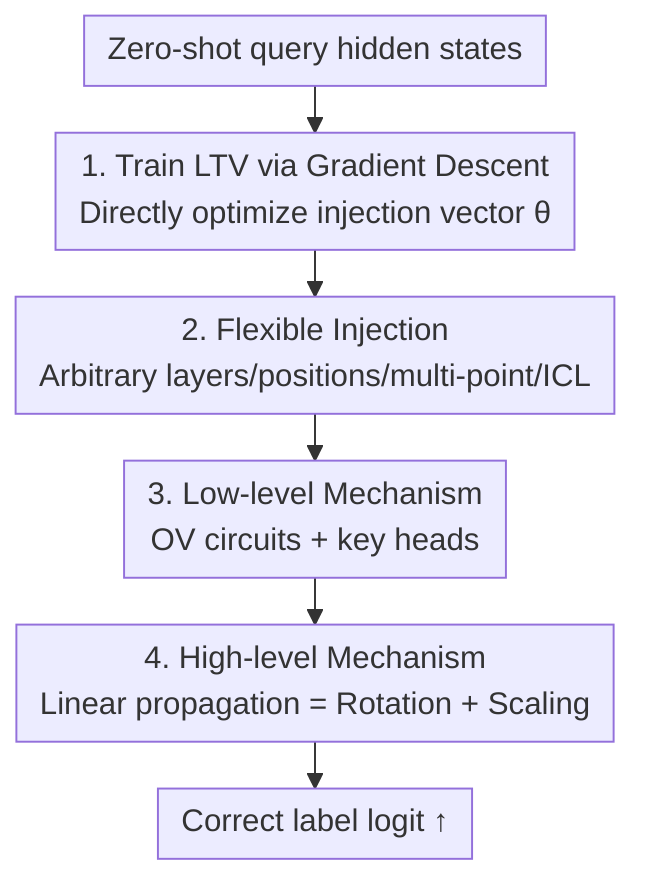

# Task Vectors, Learned Not Extracted: Performance Gains and Mechanistic Insights

**Conference**: ICLR 2026  
**OpenReview**: [https://openreview.net/forum?id=RGEbVZgf4E](https://openreview.net/forum?id=RGEbVZgf4E)  
**Code**: https://github.com/HLYang2001/Learned_TV  
**Area**: Mechanistic Interpretability / In-Context Learning  
**Keywords**: Task Vectors, In-Context Learning, Mechanistic Interpretability, OV Circuit, Linear Propagation

## TL;DR
Instead of "extracting" Task Vectors (TV) from model representations, this paper uses gradient descent to **directly train** an injected vector (Learned Task Vector, LTV). LTV outperforms extractive TV in classification and generation tasks and can be injected at arbitrary layers or positions. The study systematically deconstructs the mechanism of TV: lower layers operate primarily through the OV circuits of attention heads (where a few "key heads" are decisive), while higher layers propagate in a near-linear "rotation + scaling" manner.

## Background & Motivation
**Background**: Large Language Models (LLMs) learn new tasks from demonstrations via In-Context Learning (ICL). A leading explanation posits that these demonstrations are compressed into a compact **task vector** $\theta$. Adding $\theta$ to the hidden states of a zero-shot prompt allows the model to achieve few-shot accuracy. Extensive research has focused on extraction sources (hidden states, attention heads, or MLP outputs) and extraction methods (PCA, complex optimization, or head-wise ablation).

**Limitations of Prior Work**: Existing methods are almost entirely **extractive**, derived either by subtracting ICL hidden states (Vanilla TV: $\theta = h^l_{N,\text{ICL}} - h^l_N$) or summing selected attention head outputs (Function Vector, FV: $\theta = \sum_{(l,k)\in I} a^l_{N,k,\text{ICL}}$). This presents three issues: (1) Opaque construction processes relying on tedious screening; (2) TV quality is bottlenecked by the model's own representation quality, often resulting in sub-optimal solutions; (3) High sensitivity to the injection layer $l$, typically restricted to a single layer at the final token.

**Key Challenge**: Extractive methods use the model's own (potentially poor) ICL representation as an upper bound, failing to measure the true potential of TV and failing to explain the **core mechanism**—how the model utilizes TV to make correct predictions. Most work concludes that "TV improves performance" without addressing how.

**Goal**: This study addresses two questions: (1) Can one bypass extraction to find an "optimal TV" free from representation and position constraints? (2) Can the mechanisms be clarified for both low layers (participating components) and high layers (how output is pushed towards the correct label)?

**Key Insight**: Since a TV is a vector added to hidden states, it is isomorphic to LLM steering, where direct training of steering vectors has precedents. Thus, the authors treat TV as a **trainable parameter** optimized via task label supervision.

**Core Idea**: Replace "extraction from ICL representations" with "direct training of an injection vector via gradient descent" to obtain an optimal TV. This "clean" LTV serves as a probe to characterize the low-level and high-level propagation mechanisms within the Transformer.

## Method

### Overall Architecture
The method follows two steps: first, training a flexible LTV via gradient descent; second, using the LTV as a probe to deconstruct the effect mechanism bottom-up.

Specifically, given a zero-shot query $x_q$, hidden states are updated through $L$ layers. **Step 1**: An injection vector $\theta$ is added to hidden states at specified layers $\mathcal{L}$ and positions $\mathcal{P}$. Model weights are frozen while $\theta$ is optimized using label supervision. **Step 2**: The propagation of $\theta$ is analyzed. In low layers, the study examines which components influence the residual stream (finding that OV circuits and select "key heads" are dominant). In high layers, the propagation is analyzed as a "linear" transformation (concluding it follows rotation and scaling; early TVs are rotated to align with the task subspace, while late TVs are scaled to increase magnitude).

### Key Designs

**1. Direct LTV Training: Replacing Extraction with Gradient Optimization**

To bypass the quality bottleneck of extractive TVs, $\theta$ is treated as a learnable parameter. LLM weights are fixed, and the negative log-likelihood of the correct label is minimized:

$$-\log p(y_q \mid x_q, \theta, \mathcal{L}, \mathcal{P})$$

$\mathcal{L}$ and $\mathcal{P}$ denote injection layers and positions. Independent $\theta$ vectors can be added to the hidden states. Optimization uses AdamW with a learning rate of 0.001 and weight decay of 0.01. This approach finds an "optimal TV" and serves as an extremely lightweight PEFT method by optimizing only $d$ parameters.

**2. Flexible Injection: Lifting Layer and Position Constraints**

Extractive TVs are usually limited to the last token and single layers, showing sensitivity to a "critical depth." Because LTV is trained end-to-end, it adapts to various configurations: non-final positions, multiple positions, periodic layer injections, or as an augmentation to ICL prompts. LTV achieves non-trivial accuracy even in late-level injections, **refuting the view that a "critical depth" exists** beyond which TVs become unusable.

**3. Low-level Mechanism: Dominance of OV Circuits and Key Heads**

The first mechanistic question asks which components interact with the TV. The attention head output is $a^l_{N,k}=\sum_j c^{l,k}_{j,N} W^{l,\top}_{O,k} W^l_{V,k} h^{l-1}_j$. Injecting $\theta$ at position $N$ in layer $l-1$ introduces the term $c^{l,k}_{N,N}\, W^{l,\top}_{O,k} W^l_{V,k}\,\theta$, representing **the TV transformed by the head's OV circuit ($W_O W_V$)**. Using residual connections, $\theta$ affects subsequent heads, with the total effect formalized as $\sum_{(l',k'):\,l'\ge l+1} W^{l',\top}_{O,k'} W^{l'}_{V,k'}\theta$. Re-injecting this "packaged OV effect" into the residual stream recovers most LTV gains (83% $\rightarrow$ 52% vs 0% zero-shot), whereas MLP path reconstruction recovers little. Scoring heads via first-order Taylor approximations identifies "key heads" (top 10%): ablating them drops accuracy from 83% to 51%, بينما random ablation has little effect (78%).

**4. High-level Mechanism: Near-linear Propagation = Rotation + Scaling**

Despite Transformer non-linearities, the authors hypothesize that the composite layer update from $l \rightarrow L$ is approximately linear for $\theta_l$. There exists $W_{TV,(l)}\in\mathbb{R}^{d\times d}$ such that $\mathbf{1}_n (W_{TV,(l)}\theta_l)^\top \approx H^{L'}_{(l)} - H^L$. To avoid rank-1 degradation, $W_{TV,(l)}$ is fitted by adding noise $\theta_{l,i}=\theta_l+\lambda_i\epsilon_i$. Polar decomposition $W_{TV,(l)}=Q_{(l)}\Sigma_{(l)}$ reveals a unified picture: **Early-layer TVs** decode to irrelevant tokens but align with task labels after applying rotation $Q_{(l)}$, indicating they rely on being rotated into the task subspace by intermediate OV circuits. **Late-layer TVs** already decode to task-related tokens, with the rotation matrix $Q$ approaching identity and scaling $\Sigma$ dominating. This represents a "phase transition" from rotation to scaling as depth increases.

### Loss & Training
The objective is the negative log-likelihood $-\log p(y_q\mid x_q,\theta,\mathcal{L},\mathcal{P})$. For multi-token labels, the log-probabilities are averaged. Optimization uses AdamW (LR 0.001, weight decay 0.01) while freezing the LLM backbone.

## Key Experimental Results

Tests were conducted on Llama3.1-8B (plus Llama2/3, Qwen2.5-32B, Yi-34B). Tasks included artificial (Capital, Capitalize, Antonym), classification (SST-2, TREC, SNLI, RTE), and generation (Myopic).

### Main Results

LTV performance as a PEFT method compared to Prefix Tuning and LoRA on SST-2:

| Method | Accuracy ↑ | Params ↓ | Training Latency (s) ↓ | Peak Memory (GB) ↓ |
|--------|---------|---------|---------------|---------------------|
| Prefix Tuning | 85.67% | $d$ | 0.050 | 16.31 |
| LoRA | 91.63% | $2d$ | 0.053 | 16.37 |
| **LTV (Ours)** | **92.89%** | $d$ | **0.049** | 16.36 |

Robustness across configurations (average accuracy, Llama3.1-8B):

| Method | Baseline $P{=}\{-1\},L{=}\{16\}$ | Diff. Pos $P{=}\{4\}$ | Multi-Pos | Multi-Layer | Multi-L+P | ICL prompt |
|------|------|------|------|------|------|------|
| Vanilla TV | 37.80% | 2.16% | 17.97% | 19.18% | 18.15% | 56.12% |
| FV | 37.30% | 2.68% | 31.88% | 6.05% | 0.38% | 74.78% |
| **LTV (Ours)** | **83.49%** | **78.39%** | **86.43%** | **82.44%** | **51.39%** | **84.61%** |

### Ablation Study

| Configuration | SST-2 Accuracy | Description |
|------|------|------|
| Full LTV | 83% | Mid-layer injection |
| OV Circuit Reconstruction | 52% | Recovers majority of gains $\rightarrow$ OV is the primary channel |
| Zero-shot | 0% | No injection baseline |
| Ablate key heads (top 10%) | 51% | Most severe performance drop |
| Random ablation (10%) | 78% | Negligible impact |
| Linear reconstructed TV | $\approx$ Original | Matches original TV performance in most layers |

### Key Findings
- **OV Circuits + Key Heads are critical**: OV reconstruction recovers significant gains (52/83%), while ablating 10% key heads drops performance to baseline. These heads are less prone to "attention sink" and focus on the final position.
- **High-level propagation is linear with rotation-to-scaling transition**: A $d \times d$ linear operator characterizes TV propagation. Early TV requires rotation to align with the task, while late TV focuses on scaling.
- **Label space constraints**: LTV shows high intra-class alignment and inter-class separation. Transferability depends on shared label spaces (e.g., SNLI $\rightarrow$ RTE transfer is valid, others are not).
- **Compositionality**: Adding English-to-French and Masculine-to-Feminine LTVs mimics word2vec-style semantics, outperforming individual ICL prompts.

## Highlights & Insights
- **Paradigm shift to "Learning over Extracting"**: Treating TV as an optimized parameter removes constraints of representation quality and layer sensitivity.
- **Clean probes yield clean mechanisms**: Using LTV as a non-noisy probe allows for clear causal signals in OV reconstruction and linear propagation experiments.
- **Unified explanation via Polar Decomposition**: Polar decomposition provides a robust framework to explain the functional differences between early and late layer task vectors.

## Limitations & Future Work
- Mechanism analysis is primarily based on tasks with clear label spaces; conclusions for open-ended generation tasks require further validation.
- Transferability is restricted by label space overlap; LTV seems to learn "label directions" rather than purely abstract task semantics.
- Linear propagation is a strong approximation, but some layers exhibit significant non-linear exceptions.

## Related Work & Insights
- **vs Vanilla TV (Hendel et al., 2023)**: LTV removes dependency on ICL hidden state subtraction, achieving higher stability across layers.
- **vs Function Vector (Todd et al., 2024)**: LTV avoids the sub-optimality of head-wise screening by using a single optimized vector, providing a formal explanation for the effectiveness of OV paths.
- **vs LLM Steering**: This work applies steering training concepts to the scientific interpretation of In-Context Learning.

## Rating
- Novelty: ⭐⭐⭐⭐⭐ 
- Experimental Thoroughness: ⭐⭐⭐⭐⭐ 
- Writing Quality: ⭐⭐⭐⭐ 
- Value: ⭐⭐⭐⭐⭐

<!-- RELATED:START -->

## Related Papers

- [\[ICLR 2026\] When Thinking Backfires: Mechanistic Insights into Reasoning-Induced Misalignment](when_thinking_backfires_mechanistic_insights_into_reason-induced_misalignment.md)
- [\[ICLR 2026\] Sparse CLIP: Co-optimizing Interpretability and Performance in Contrastive Learning](sparse_clip_co-optimizing_interpretability_and_performance_in_contrastive_learni.md)
- [\[ICLR 2026\] Formal Mechanistic Interpretability: Automated Circuit Discovery with Provable Guarantees](formal_mechanistic_interpretability_automated_circuit_discovery_with_provable_gu.md)
- [\[ICLR 2026\] Latent Concept Disentanglement in Transformer-based Language Models](latent_concept_disentanglement_in_transformer-based_language_models.md)
- [\[ACL 2026\] Linear Probes Detect Task Format, Not Reasoning Mode in Language Model Hidden States](../../ACL2026/interpretability/linear_probes_detect_task_format_not_reasoning_mode_in_language_model_hidden_sta.md)

<!-- RELATED:END -->
