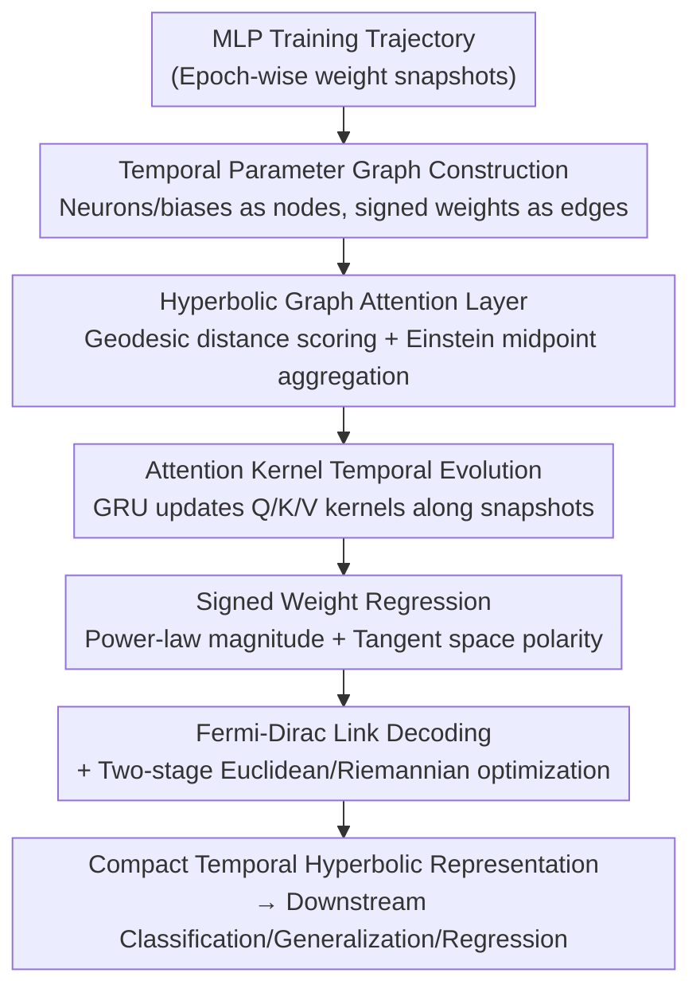

# Temporal Geometry of Deep Networks: Hyperbolic Representations of Training Dynamics for Intrinsic Explainability

**Conference**: ICLR 2026  
**OpenReview**: [https://openreview.net/forum?id=Xq64xkQCak](https://openreview.net/forum?id=Xq64xkQCak)  
**Area**: Interpretability / Meta-networks / Hyperbolic Geometry  
**Keywords**: Intrinsic Explainability, Training Dynamics, Hyperbolic Embedding, Parameter Graphs, Meta-learning

## TL;DR
This paper treats the entire training trajectory of an MLP as a sequence of "parameter graph" snapshots and uses a permutation-symmetry-preserving hyperbolic graph attention meta-network (GTH-GMN) to embed them into the Poincaré ball. This approach reconstructs the self-organizing geometry of the network during training within a negative curvature space, matching strong baselines in tasks such as INR classification, generalization prediction, and sine regression, while allowing interpretable signals to be read directly from the radial and angular structures of the embeddings.

## Background & Motivation
**Background**: Recently, a class of "meta-network" research that treats neural networks as data has emerged—using the weights of a target network as input to predict its generalization performance, classify the Implicit Neural Representations (INR) it represents, or generate weights for transfer learning. This line of work has evolved from flattening weights into single tensors to enforcing permutation equivariance (where reordering neurons does not change function), and finally to graph-based meta-networks (GMN, NFN, DWSNet, etc.) that treat neurons/biases as nodes and weights as edges, increasingly respecting the symmetries of the weight space.

**Limitations of Prior Work**: These methods almost all suffer from two common shortcomings. First, they only consider a **single checkpoint** on the training trajectory for zero-shot prediction, wasting the temporal trajectory left behind during the optimization process. Second, they almost exclusively use **Euclidean embeddings**, which require high dimensionality to represent hierarchical structures or heavy-tailed distributions and often distort the structure during projection, making it difficult to "understand" the internal self-organization of the network.

**Key Challenge**: The information of a neural network is encoded not only in the final weights but also in the **trajectory** taken during training. Furthermore, weight topology naturally possesses priors such as hierarchy, modularity, small-world properties, and heavy tails—complex network characteristics that Euclidean geometry is least suited to represent faithfully. In other words, there is a fundamental tension between the desire for "interpretable geometric representations" and the use of "Euclidean space + single snapshots."

**Goal**: To construct a meta-network capable of processing the entire training trajectory, performing structure-preserving embedding in a low-curvature space while respecting the symmetries of the weight space, thereby making the process of "how a network self-organizes during training" a subject of study and producing directly interpretable geometric representations.

**Key Insight**: Network science has long indicated that many complex networks can be embedded into hidden metric spaces where "distance corresponds to connection probability," and **hyperbolic spaces** can preserve hierarchical relationships with extremely low distortion. The authors hypothesize that neural parameter graphs exhibit similar small-world and modular tendencies. By embedding them into a hyperbolic ball and using a "distance-biased" learning approach, compact and interpretable representations can be obtained.

**Core Idea**: Treat "training" as a trajectory of a parameter graph in negative curvature space. Use hyperbolic graph attention combined with temporal evolution of attention kernels to create a hyperbolic temporal meta-network (GTH-GMN) that is equivariant to neuron permutations within snapshots and invariant to the order of historical snapshots.

## Method

### Overall Architecture
GTH-GMN receives the training trajectory of an MLP (a sequence of weight snapshots across epochs) and outputs a compact temporal hyperbolic representation for downstream classification, generalization prediction, or regression. The pipeline consists of: converting each checkpoint into a **parameter graph** with signed weights; embedding the sequence of graphs into the Poincaré ball using **hyperbolic graph attention** for spatial aggregation; **evolving** the attention kernel parameters via a GRU over time to maintain temporal smoothness; using a **signed weight regression head** to bind geometric distance to weight magnitude and direction to tangent space inner product; and finally, using a Fermi-Dirac decoder to translate hyperbolic distances into edge probabilities, optimized in two stages (Euclidean and Riemannian) to update parameters and node coordinates.

### Key Designs

**1. Temporal Parameter Graph Construction: Transforming Training Trajectories into Symmetry-Preserving Signed Graph Sequences**

To address the loss of information in single snapshots, this work converts the MLP at each epoch $t$ into a graph snapshot $G_t = (X_t, E_t, W_t)$: neurons and biases are nodes $u \in V_t$, and weights are edges with signed labels $w^\star_{uv,t}$. Edges are not created if the weight is zero. Fixed input/output layers and reordered hidden neurons result in equivariant graph structures, naturally respecting permutation symmetry. Node features are designed to avoid leaking the weights themselves: each node feature only contains the layer label $\ell(u)$, type $\tau(u)$, and z-scores $\mathrm{es}_{\text{abs}}(u,t), \mathrm{es}_{\text{sgn}}(u,t)$ obtained by normalizing incident edge strengths. Edge attributes are kept minimal, encoding whether it is a bias edge or cross-layer. Directed pairs are symmetrized by averaging anti-parallel directions. The resulting sequence $\{G_t\}_{t=1}^{T}$ captures self-organization while remaining invariant to hidden layer permutations. All descriptors are first embedded into the tangent space at the origin $T_0 B_c^d$, allowing unstable operations like normalization and dropout to remain in flat Euclidean space, with curvature introduced only during subsequent hyperbolic message passing.

**2. Hyperbolic Graph Attention Layer: Using Geodesic Distance for Influence and Einstein Midpoints for Curvature-Consistent Aggregation**

Linear mappings and Euclidean averaging in standard attention do not hold on curved manifolds—adding two points in Euclidean space typically results in a point outside the manifold and does not correspond to any geodesic midpoint. This design follows three steps: calculate in the tangent space, map to the ball when geometry is needed, and aggregate in a model with well-defined centroids. Euclidean parameters $W,b$ are implemented as hyperbolic affine maps: $\Phi^{(t)}_{W,b}(x)=\exp_{\Phi^{(t)}_W(x)}\!\big(\mathrm{PT}_{0\to\Phi^{(t)}_W(x)}(b)\big)$, yielding hyperbolic query/key/value for each node. Attention scores use the **negative geodesic distance** $\theta^{(t)}_{u\to v}=-d_c(q_u,k_v)+b_{uv}$—shorter distances result in higher similarity and exponentially larger weights after softmax. A gating mechanism $g_{uv}$ re-normalizes weights for structurally important edges like cross-layer or bias connections. Aggregation uses the **Einstein midpoint** in the Klein model (a closed-form centroid): Poincaré points are mapped to Klein points $\kappa(z)=\frac{2\sqrt{c}\,z}{1+c\|z\|^2}$, weighted by Lorentz factors $\gamma(y)=1/\sqrt{1-\|y\|^2}$, and mapped back. This approach ensures **attention follows geodesics and aggregation respects global curvature**, preserving hierarchical structures, hub nodes, and boundary effects.

**3. Attention Kernel Temporal Evolution: Using GRU for Drifting Kernels Without Storing Historical Embeddings**

To maintain temporal smoothness across snapshots without excessive memory usage, the model does not store the entire sequence of hyperbolic embeddings. Instead, it adopts the EvolveGCN approach to **meta-evolve attention kernel parameters** using a GRU. For each layer $\ell$ and head $r$, a recurrent state is maintained: the mean node representation $p^{(t-1)}_\ell=\frac{1}{N}\sum_i X^{(t-1)}_{\ell,i}$ is captured, the state is updated via $u^{(t)}_{\ell,r}=\mathrm{GRU}(p^{(t-1)}_\ell, u^{(t-1)}_{\ell,r})$, and new Q/K/V parameters $W^{(t)}_{\ell,r,k/q/v}=\phi_{\text{MLP}}(W_{\text{out}}u^{(t)}_{\ell,r}+b_{\text{out}})$ are generated. This allows the attention kernel to drift smoothly along the optimization trajectory, preserving permutation invariance while compressing memory into a compact recurrent state.

**4. Signed Weight Regression: Binding Weight Magnitude to Power-Law Hyperbolic Distance and Polarity to Tangent Space**

Predicting only edge existence is insufficient; weighted networks require connection **strength and polarity**. In real networks, magnitudes often follow heavy-tailed distributions, for which hyperbolic distance is a natural proxy. The design predicts node-specific scale and decay factors $s_i=f_\sigma(X_i)$, $k_i=f_\kappa(X_i)$ from tangent space features, with power-law slopes $\alpha_{uv}$ fine-tuned by local context. The predicted magnitude follows a heavy-tailed power law $|w^{(t)}_{uv}|=\exp(\log\nu+s_u+s_v)\exp(-(1-\frac{\alpha_{uv}}{d})(k_u+k_v))\,(d^{(t)}_{uv})^{-\alpha_{uv}}$, where $d^{(t)}_{uv}=d_c(z_u,z_v)$ is the Poincaré distance—large magnitudes correspond to short hyperbolic distances. Polarity is modeled in the tangent space since manifold distance is always positive: $z_v$ is mapped to the tangent space of $z_u$ as $\delta^{(t)}_{u\to v}=\log_{z_u}(z_v)$, and a hyperbolic-consistent inner product with a source feature $\xi_u$ provides the sign logit $\hat{w}^{(t)}_{uv}=|w^{(t)}_{uv}|\tanh(s^{(t)}_{uv})$. This faithfully decomposes weight geometry into "strength (radial distance) + direction (tangent space angle)," giving the embeddings semantic meaning: hubs drift outward, strong edges cluster radially, and excitation/inhibition manifest as angular differences.

### Loss & Training
Link prediction uses a Fermi-Dirac decoder $\psi^{(t)}(u,v)=\big(1+\exp(\frac{d_c(z_u,z_v)-R}{T})\big)^{-1}$ with learnable radius $R$ and temperature $T$, paired with binary cross-entropy and dynamic negative sampling. The total objective is a weighted sum of Fermi-Dirac CE, magnitude supervision, sign supervision, and geometric regularization (slope priors, temporal smoothness, and ranking loss for connection strength). Training is stabilized with an annealed ranking margin and curriculum-based negative sampling. Optimization is two-stage: stage one uses Euclidean backpropagation for kernels, regression heads, and decoders; stage two uses Riemannian optimization on the Poincaré ball (conformal factor scaling, RAMSGrad, exponential map updates, and parallel transport of moment vectors) to refine node coordinates $z^{(t)}$.

## Key Experimental Results

### Main Results
**INR Classification**: Shallow INRs are fitted to images, and the trajectory of their parameters during optimization ($T\in[80,100]$ snapshots) is recorded. The meta-network **only sees weight evolution** and never the image itself.

| Dataset | Metric | Ours (Temporal) | Prev. SOTA (NFN_NP) | Gain |
|--------|------|------|----------|------|
| MNIST INR | Test Acc (%) | 95.6 ± 0.18 | 92.9 ± 0.22 | +2.7 |
| Fashion-MNIST INR | Test Acc (%) | 80.72 ± 0.29 | 75.6 ± 1.07 | +5.1 |

**Sine Regression** (predicting frequency $a$ and amplitude $b$ of $a\sin(bx)$):

| Method | Test MSE | Description |
|------|---------|------|
| DWSNets | 1.39 ± 0.06 | Permutation equivariant meta-network |
| GMN | 1.13 ± 0.08 | Graph meta-network (Strong baseline) |
| GTH-GMN (ours) | 1.06 ± 0.24 | Best mean, higher variance |

### Generalization Prediction
**CIFAR-10 Generalization Prediction**: Each trial involves an MLP trained on a CIFAR-10 subset. Kendall's $\tau$ measures the correlation between predicted and actual accuracy.

| Method | Kendall's τ | Description |
|------|---------|------|
| NFN_HNP | 0.934 ± 0.001 | Directly operates on raw weight tensors |
| NFN_NP | 0.922 ± 0.001 | Same as above |
| StatNN | 0.915 ± 0.002 | Statistical features |
| GTH-GMN (ours) | 0.846 ± 0.004 | Focuses on global geometry and temporal consistency |

### Key Findings
- INR classification is the strongest use case: Ours significantly outperforms NFN and DWSNet on MNIST/Fashion-MNIST, suggesting that **how INRs self-organize** during training encodes class-related geometric structures.
- On CIFAR-10 generalization prediction, $\tau=0.846$ is lower than the NFN series. The authors attribute this to a **trade-off**: the focus on global geometry and temporal consistency, along with autoencoder-style MSE reconstruction, introduces a smoothing bias that discards fine-grained tensor micro-structures strongly correlated with accuracy.
- Sine regression shows the best mean but high variance, rooted in the fact that efficient step sizes in the hyperbolic ball increase with radius. Early differences are amplified by curvature and recurrent kernels into divergent trajectories.
- Visualizations (13-layer MLP INR, $t=11$ vs $t=97$) show layers gradually separating radially and angularly as training progresses, with nodes drifting toward the boundary, confirming "training as geometric self-organization."

## Highlights & Insights
- Treating the "training trajectory" rather than a "single snapshot" as the carrier for interpretability utilizes a previously overlooked dimension—the way a network evolves itself carries classification and generalization signals.
- Using hyperbolic geometry naturally accommodates priors of complex networks (hierarchy, heavy tails, small-world), making "short distance = strong connection" an intrinsic inductive bias. This allows embeddings to be directly interpreted: hub drift, radial clustering of strong edges, and angular differentiation of excitation/inhibition.
- The decomposition of signed weights into radial distance (strength) and tangent space inner product (polarity) faithfully maps signed/directed edges into hyperbolic space, a technique applicable to brain networks or knowledge graphs.
- Evolving attention kernels with a GRU instead of storing full embedding sequences is a practical technique for scaling hyperbolic temporal learning to long sequences within memory limits.

## Limitations & Future Work
- Generalization prediction on CIFAR-10 lags behind neural functionals that operate directly on raw tensors; geometric interpretability comes at the cost of some predictive precision.
- High variance brought by the coupling of hyperbolic and recurrent components indicates that training stability remains a pain point, requiring more refined Riemannian step size control.
- Experiments currently only cover MLPs; the validity on more complex architectures like CNNs or Transformers is not yet fully verified.
- "Interpretable signals" are currently limited to qualitative observations (radial drift, angular separation); quantitative alignment with downstream interpretability tasks is needed.

## Related Work & Insights
- **vs GMN / NFN / DWSNet**: While these use single snapshots, Euclidean embeddings, and zero-shot prediction, this work utilizes full temporal trajectories and hyperbolic embeddings to ensure permutation symmetry. The trade-off is higher geometric interpretability vs. slightly lower raw generalization prediction accuracy.
- **vs Static Hyperbolic GNNs (HGAT, etc.)**: These handle static graphs. This work combines hyperbolic graph attention with EvolveGCN-style kernel evolution specifically for the dynamic evolution of parameter graphs.
- **vs Geometric Embedding of Physical Complex Networks**: This work introduces the network science prior that "weight magnitude follows a power-law of hyperbolic distance" into neural parameter graphs for the first time as a geometric handle for interpretability.

## Rating
- Novelty: ⭐⭐⭐⭐⭐ First meta-network to embed temporal trajectories of parameter graphs into hyperbolic space while preserving permutation symmetry.
- Experimental Thoroughness: ⭐⭐⭐⭐ Covers classification, regression, and generalization, though CIFAR-10 performance highlights a trade-off and experiments are limited to MLPs.
- Writing Quality: ⭐⭐⭐⭐ Geometric motivations and formulas are clear, with honest discussion of limitations.
- Value: ⭐⭐⭐⭐ Provides a novel geometric path for "intrinsic explainability" with high heuristic value.

<!-- RELATED:START -->

## Related Papers

- [\[ICLR 2026\] Temporal Superposition and Feature Geometry of RNNs under Memory Demands](temporal_superposition_and_feature_geometry_of_rnns_under_memory_demands.md)
- [\[ICLR 2026\] Emergence of Superposition: Unveiling the Training Dynamics of Chain of Continuous Thought](emergence_of_superposition_unveiling_the_training_dynamics_of_chain_of_continuou.md)
- [\[ICLR 2026\] On The Geometry and Topology of Representations: the Manifolds of Modular Addition](on_the_geometry_and_topology_of_representations_the_manifolds_of_modular_additio.md)
- [\[ICLR 2026\] Addressing Divergent Representations from Causal Interventions on Neural Networks](addressing_divergent_representations_causal.md)
- [\[ICLR 2026\] Learning for Highly Faithful Explainability](learning_for_highly_faithful_explainability.md)

<!-- RELATED:END -->
