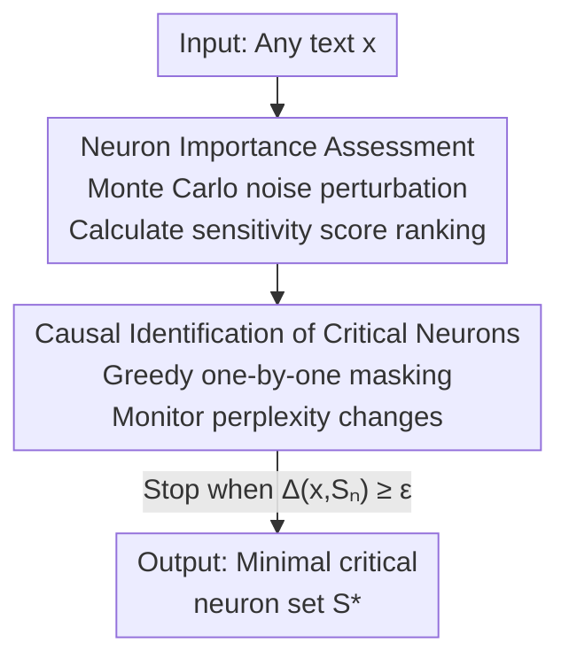

# The Achilles' Heel of LLMs: How Altering a Handful of Neurons Can Cripple Language Abilities

**Conference**: ICLR 2026  
**OpenReview**: [https://openreview.net/forum?id=pJoSE7Cvj0](https://openreview.net/forum?id=pJoSE7Cvj0)  
**Code**: https://github.com/qqqqqqqzx/The-Achilles-Heel-of-LLMs  
**Area**: Interpretability  
**Keywords**: Critical neurons, Causal identification, Perturbation analysis, Phase transition, Robustness

## TL;DR
This paper proposes a "perturbation-based causal identification of critical neurons" method. Across 21 LLMs ranging from 0.5B to 72B, it is discovered that zeroing out only approximately 3 neurons can cause a 72B model with 110 billion neurons to collapse entirely (perplexity soaring by up to 20 orders of magnitude). These critical neurons are highly concentrated in the `down_proj` of outer MLP layers, and the collapse occurs as a "phase transition" rather than a gradual decline.

## Background & Motivation
**Background**: Neuroscience has long discovered that the computational capacity of the brain may not be uniformly distributed across all neurons but instead depends on a very small number of "high-influence" neurons acting as computational bottlenecks (Arshavsky, 2001). Simultaneously, an increasing number of studies point out that the hierarchical processing and predictive coding mechanisms of LLMs are highly similar to the layered structure of the brain. A natural question follows: do LLMs also possess such a small group of "indispensable" critical neurons?

**Limitations of Prior Work**: Existing vulnerability research in the AI field mostly remains at the **parameter/component level** rather than the **neuron level**—for example, weight outliers, activation outliers, and the recent "super weights" (pointing out that a single parameter in the MLP `down_proj` can catastrophically impact performance). However, these works either rely on manual observation for localization or only cause a decrease in accuracy rather than total incapacitation, and they do not characterize the interactive effects of **multiple neurons in coordination**.

**Key Challenge**: To answer whether "LLMs have critical neurons," an **automatic, reproducible, and causally verifiable** localization pipeline is required. Simply sorting by activation magnitude or gradient magnitude (static importance measures) fails to find true critical neurons—activation magnitude reflects "computational load," and gradient magnitude is only valid for specific inputs; neither captures the **dynamic sensitivity** of neurons to input perturbations.

**Goal**: To find a sparse subset $S^* \subseteq N$ ($|S^*| \ll |N|$) such that zeroing them out results in a significant performance degradation exceeding a threshold $\epsilon$, and to analyze the functional roles and distribution patterns of these neurons based on this.

**Key Insight**: The authors decouple "importance ranking" and "causal verification" into two stages—first using Monte Carlo noise perturbations to calculate a sensitivity score for all neurons to obtain a candidate ranking, and then using greedy masking to verify which neurons are truly indispensable. The former efficiently narrows the search space, while the latter provides causal evidence.

**Core Idea**: A two-stage pipeline consisting of "noise sensitivity analysis + greedy causal masking" is used to precisely locate the minimal set of critical neurons causing catastrophic collapse of language abilities within $O(|N|)$ complexity.

## Method

### Overall Architecture
The method is called **Perturbation-based Causal Identification of Critical Neurons**. Given any text as input, the entire process is divided into two stages: the first stage injects controlled Gaussian noise into the input and measures the magnitude of change in the activation values of each neuron to obtain a candidate list of neurons ranked in descending order of sensitivity; the second stage follows this ranking, greedily masking (zeroing) neurons one by one from high to low, monitoring changes in model perplexity as each batch is added, and stopping once the degradation exceeds a threshold to return the minimal neuron set $S^*$ that triggers collapse.

The core metric for measuring masking impact is the log change in perplexity: zeroing the neuron set $S$ results in model $M_{-S}$, defined as:

$$\Delta(x, S) = \log_{10}\left(\frac{\mathrm{PPL}_{M_{-S}}(x)}{\mathrm{PPL}_{M}(x)}\right) = \frac{1}{T\ln 10}\sum_{t=1}^{T}\left[\log P_M(x_t \mid x_{<t}) - \log P_{M_{-S}}(x_t \mid x_{<t})\right]$$

where the masking operation defines the activation of neuron $(l, i)$ as $\tilde{n}^{(i)}_l(x) = 0$ (if $(l,i)\in S$) or otherwise keeps its original value. The critical neuron identification problem is: find the smallest $S^*$ such that $\Delta(x, S^*) \ge \epsilon$.

### Key Designs

**1. Noise Sensitivity Scoring: Using dynamic perturbations instead of static measures for candidates**

To efficiently locate critical neurons among billions, a reliable candidate ranking must be established first. The authors do not use static measures like activation magnitude or gradient magnitude. Instead, they use **Monte Carlo noise perturbations** to measure the sensitivity of each neuron to input perturbations. Specifically, Gaussian noise is added to the input $x$ for $K$ trials to get perturbed inputs $\tilde{x}_i = x + \alpha\cdot\epsilon_i$ ($\epsilon_i \sim \mathcal{N}(0,I)$, where $\alpha$ controls perturbation magnitude), and the difference between clean and noisy activations is accumulated for each neuron $s$:

$$\mathrm{Imp}(s) = \frac{1}{K}\sum_{i=1}^{K}\left|A^{\mathrm{clean}}_s - A^{\mathrm{noisy}}_{i,s}\right| \xrightarrow{K\to\infty} \mathbb{E}_{\epsilon\sim\mathcal{N}(0,I)}\left[\left|f_{\theta,s}(x) - f_{\theta,s}(x + \alpha\epsilon)\right|\right]$$

By the Law of Large Numbers, this Monte Carlo estimator converges to the true expected sensitivity as $K$ increases. After calculating $\mathrm{Imp}(s)$ for all neurons, they are ranked in descending order. The intuition is that neurons truly responsible for core computation will exhibit more drastic responses to input perturbations.

**2. Greedy Causal Masking: Compressing exponential search to linear with causal evidence**

Having an importance ranking is insufficient—top ranking does not equate to "collapse upon removal"; causal verification is required. However, exhaustive search over all neuron subsets is $O(2^{|N|})$, which is infeasible. The authors utilize the ranking from the first stage to design a **greedy search**: the candidate set is incrementally expanded to $S_n = \{s_1,\dots,s_n\}$ (taking the top $n$ in importance), and the degradation $\Delta(x, S_n)$ is evaluated after each mask, with the goal:

$$n^* = \arg\min_n \{n : \Delta(x, S_n) \ge \epsilon\}$$

The process terminates once degradation crosses the threshold $\epsilon$, returning $S_{n^*}$. This requires testing only $\lceil |N|/\Delta n\rceil$ candidate sets, reducing complexity to $O(|N|)$. This step is the "causal" key: it does not observe correlation but actually zeros out neurons to see if the model collapses, thereby distinguishing "important" from "indispensable." In experiments, $\Delta n = 1$ and $\epsilon = 1$.

**3. Input-agnostic Robust Localization: Replicating the same neurons with a single sequence**

This method requires only **one** input sequence to run, which is a strong design point. The authors found that as long as the input text length exceeds a minimum threshold ($T > 10$) and $K$ and $\alpha$ are set to stable values ($K=100$, $\alpha=5$), repeated experiments on the same model locate **exactly the same** critical neurons—regardless of text type (Wiki, News, Biography, Media) or language (English/French/German/Chinese/Spanish). Even after fine-tuning and reinforcement learning, the positions of critical neurons remain unchanged, and masking them still results in catastrophic collapse. This indicates that what is identified is not an accidental byproduct of a specific input but an **intrinsic architectural dependency** of the model.

### Loss & Training
This method is a **pure inference-time diagnostic process and does not involve any training or parameter updates**. Key hyperparameters: noise scale $\alpha = 5$, Monte Carlo sampling trials $K = 100$, greedy step $\Delta n = 1$, critical threshold $\epsilon = 1$; a single 30-token Wikipedia text is used as input, fp16 mixed precision, running on 4×A800 (80GB).

## Key Experimental Results

### Main Results
In 21 models (0.5B–72B, including Llama-3 / Gemma / DeepSeek-R1-Distill / Phi-3 / Qwen2.5), masking an extremely small number of critical neurons triggers a perplexity explosion. The ratio of critical neurons consistently falls in the $10^{-8}$ magnitude.

| Model | Critical Neurons | Ratio ($10^{-8}$) | WikiText-103 Original → Masked |
|--------|------|------|------|
| Gemma-7B | 3 | 1.01 | 9.98 → 6.25×10²¹ |
| DeepSeek-R1-Distill-Llama-70B | 3 | 0.27 | 7.86 → 2.21×10⁴ |
| Qwen2.5-72B-Instruct | 3 | 0.26 | 10.23 → 2.24×10⁴ |
| Qwen2.5-0.5B-Instruct | 3 | 5.90 | 18.18 → 1.76×10⁶ |
| Llama-3.3-70B-Instruct | 7 | 0.63 | 5.41 → 3.86×10⁶ |

On downstream tasks, masking critical neurons caused scores on 7 benchmarks to **drop to zero**—the collapse affected knowledge, reasoning, code, math, instruction following, multilingualism, and factual QA, indicating that critical neurons control core language processing functions rather than task-specific components.

| Model | Condition | MMLU-Pro | GPQA-Diamond | HumanEval | MATH | MGSM |
|------|------|------|------|------|------|------|
| Llama-3.3-70B | Original | 0.4441 | 0.2879 | 0.2988 | 0.4420 | 0.9590 |
| Llama-3.3-70B | Masked | 0.0000 | 0.0000 | 0.0000 | 0.0000 | 0.0000 |
| Qwen2.5-72B | Original | 0.2442 | 0.3687 | 0.2866 | 0.3140 | 0.9080 |
| Qwen2.5-72B | Masked | 0.0000 | 0.0000 | 0.0000 | 0.0000 | 0.0000 |

### Ablation Study
The precision of the method and the localization source of the collapse were verified by comparison with other neuron localization strategies and other components.

| Dimension | Configuration | Key Metric | Description |
|------|------|---------|------|
| Strategy | Random / Activation Magnitude (AM) / Gradient Magnitude (GM) | Perplexity rises slightly even after 1000 masks | Static measures fail to find critical neurons |
| Strategy | Ours | Catastrophic collapse with only 3 neurons | Dynamic sensitivity + Causal verification |
| MLP Component | up_proj / gate_proj | Top-1000 mask results in only 0–1 order of magnitude rise | Robustness in ordinary components |
| MLP Component | down_proj | Extreme few results in 5–6 orders of magnitude rise | Collapse is highly localized here |
| Parameter $\alpha$ | $\alpha \ge 5$ | Stabilizes at 7 neurons | Threshold effect; requires sufficient perturbation |
| Parameter $K$ | $K > 80$ | Stabilizes at 7 neurons | Requires sufficient sampling for convergence |

### Key Findings
- **Collapse source is highly localized in MLP down_proj**: Masking thousands of neurons in `up_proj` / `gate_proj` only increases perplexity by 0–1 order of magnitude, whereas just a few in `down_proj` cause a 5–6 order surge. The authors attribute this to `down_proj` assuming the "information compression" role (compressing high-dimensional representations back to embedding space), acting as a natural information bottleneck.
- **Critical neurons are concentrated in outer layers**: Early layers perform basic feature extraction and late layers perform final integration output, both serving as bottlenecks; middle layers have redundant paths that tolerate perturbations.
- **Phase transition rather than gradual decline**: Masking a single critical neuron has almost no impact; only when the entire group is masked simultaneously does the explosive collapse occur—indicating they form a **tightly coupled computational circuit**.
- **Extreme Robustness**: The critical neurons identified for the same model are identical across text types, languages, and fine-tuning/RL training, proving they are intrinsic architectural dependencies.

## Highlights & Insights
- **The contrast of "3 neurons toppling 72 billion parameters" is highly impactful**: It translates the neuroscience principle of "a few high-influence neurons acting as bottlenecks" into a striking correspondence in LLMs.
- **The two-stage "Sensitivity Ranking + Causal Masking" is a reusable paradigm**: Using dynamic sensitivity from noise perturbations to narrow candidates and then greedy masking for causal verification is a methodology that can be migrated to locating "critical components" in any diagnostic task.
- **The phase transition phenomenon suggests a "circuit" perspective**: The key is not individual neurons but coordinated circuits. This is an important reminder for mechanistic interpretability research—evaluating single neurons in isolation significantly underestimates their role.
- **Direct security implications**: Since a few neurons in the outer `down_proj` are the "Achilles' heel," targeted hardening is necessary for security-sensitive deployments, and it warns of potential precision attack surfaces.

## Limitations & Future Work
- **Diagnosis without repair**: The paper reveals vulnerabilities and distribution patterns but does not provide a specific scheme for making architectures more robust to such extremely sparse vulnerabilities.
- **Qualitative mechanism explanation**: The explanation for "why `down_proj` is the bottleneck" and "why tightly coupled circuits form" relies more on intuition regarding compression/bottlenecks and citations of existing work rather than fine-grained characterization of the circuit's internal computation.
- **Threshold $\epsilon$ and noise scale $\alpha$ are empirical**: Although parameter sensitivity analysis shows a stable range, the definition of collapse ($\Delta \ge \epsilon$) depends on an artificial threshold. Cross-model comparisons of "critical neuron counts" should be handled with caution.
- **Future directions**: Explore dispersing critical dependencies during training (increasing redundant paths) or introducing fault-tolerance mechanisms in `down_proj`.

## Related Work & Insights
- **vs Super Weights (Yu et al., 2025)**: They study **parameter-level** outliers in MLP `down_proj` via manual observation, resulting only in accuracy drops; this work studies the **neuron-level**, provides an automatic reproducible causal localization pipeline, and leads to total loss of language ability.
- **vs Super-neurons (Gong et al., 2025)**: They focus on neurons with extremely high polysemantic load; amplifying them strongly guides behavior, but masking them has limited impact. This paper focuses on critical neurons where **masking equals collapse**.
- **vs Wasserstein neurons (Kong et al., 2025)**: They locate neurons encoding syntactic structures; destroying many only selectively damages syntax. The critical neurons here cause **total** rather than selective collapse with extremely few units.
- **vs AM/GM Localization**: Static importance measures cause only mild degradation even after masking thousands of neurons; the dynamic noise sensitivity + causal verification used here precisely locks onto the ultra-sparse critical set.

## Rating
- Novelty: ⭐⭐⭐⭐⭐ Neuron-level causal identification + phase transition discovery.
- Experimental Thoroughness: ⭐⭐⭐⭐⭐ 21 models (0.5B–72B), multiple architectures/datasets, and comparisons with various strategies.
- Writing Quality: ⭐⭐⭐⭐ Clear narrative of three major findings, though some mechanistic explanations are qualitative.
- Value: ⭐⭐⭐⭐⭐ Direct implications for robustness, interpretability, and deployment security.

<!-- RELATED:START -->

## Related Papers

- [\[ICLR 2026\] From Tokens to Thoughts: How LLMs and Humans Trade Compression for Meaning](from_tokens_to_thoughts_how_llms_and_humans_trade_compression_for_meaning.md)
- [\[ICLR 2026\] Can LLMs Reason Soundly in Law? Auditing Inference Patterns for Legal Judgment](can_llms_reason_soundly_in_law_auditing_inference_patterns_for_legal_judgment.md)
- [\[CVPR 2026\] Language Models Can Explain Visual Features via Steering](../../CVPR2026/interpretability/language_models_can_explain_visual_features_via_steering.md)
- [\[ICLR 2026\] Mixing Mechanisms: How Language Models Retrieve Bound Entities In-Context](mixing_mechanisms_how_language_models_retrieve_bound_entities_in-context.md)
- [\[ICLR 2026\] LatentQA: Teaching LLMs to Decode Activations Into Natural Language](latentqa_teaching_llms_to_decode_activations_into_natural_language.md)

<!-- RELATED:END -->
