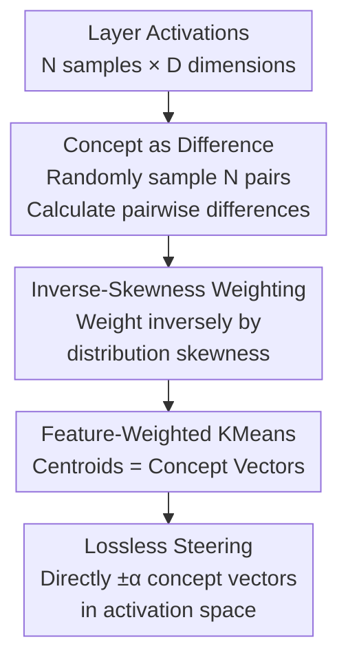

# The Deleuzian Representation Hypothesis

**Conference**: ICLR 2026  
**OpenReview**: [https://openreview.net/forum?id=10JEfJtiJM](https://openreview.net/forum?id=10JEfJtiJM)  
**Code**: TBD  
**Area**: Mechanistic Interpretability / Concept Extraction  
**Keywords**: Concept Extraction, Sparse Autoencoder Alternative, Discriminant Analysis, Skewness-Weighted Clustering, Concept Steering

## TL;DR
This paper proposes using "clustering of pairwise differences in activation values" to extract interpretable concepts from neural networks in an unsupervised manner, serving as a simple alternative to Sparse Autoencoders (SAEs). It models concepts as "differences" (echoing the Deleuzian philosophical view of "concepts as difference"), provides a theoretical basis through discriminant analysis, and enhances concept diversity by weighting clusters with the inverse skewness of activation distributions. The concept quality exceeds existing unsupervised SAE variants and approaches supervised LDA across 5 models, 3 modalities, and 20 tasks.

## Background & Motivation

**Background**: Mechanistic interpretability aims to extract "human-understandable concepts" from the internal activations of neural networks. The current mainstream tools are Sparse Autoencoders (SAEs), which train an overcomplete dictionary on activations at a specific layer. They utilize sparsity constraints (e.g., L1 / TopK) to force a set of sparsely activated features, expecting each feature to correspond to a monosemantic concept.

**Limitations of Prior Work**: SAEs face several persistent issues. First, training is difficult and unstable, being highly sensitive to hyperparameters (e.g., L1 coefficient $\lambda$, threshold $\theta$). Second, they may still learn "polysemantic features," where a single dimension collapses multiple concepts. Third, they use "sparsity" as a proxy for "interpretability," a hypothesis that has been questioned recently—sparsity does not necessarily equate to semantic clarity.

**Key Challenge**: The training objective of an SAE is to "reconstruct activations while capturing as much variance as possible under sparsity constraints." This implicitly defines concepts as "structural components universally present in the activation space," corresponding to the classical Platonic/Hegelian philosophical view that "concepts are the universal essence of facts." However, this "universal essence" perspective is criticized for being too rigid: it tends to capture high-variance principal axes, which may not correspond to the mutually distinct semantics that humans actually care about.

**Goal**: To adopt an alternative philosophical stance for defining "concepts"—instead of modeling the total variance of activations, seek **recurring differences** between activations. This resonates with Deleuze’s view in *Difference and Repetition* that "concepts originate from difference, not universal universals."

**Key Insight**: The authors observe that if a "concept" is viewed as a "direction that distinguishes two samples," then the difference between two sample activations $\vec{x}_i - \vec{x}_j$ itself is a candidate concept direction. Under the isotropy assumption, this is exactly equivalent to the optimal separation direction provided by Linear Discriminant Analysis (LDA). Thus, by clustering a large number of pairwise differences, recurring patterns of difference will cluster into stable concept vectors.

**Core Idea**: Replace "training SAEs to reconstruct activations" with "KMeans clustering of activation pairwise differences (weighted by inverse skewness)." This shifts concept extraction from "reconstructing universal components" to "aggregating recurring differences." The method has only one interpretable hyperparameter $k$ (number of concepts) and naturally supports lossless steering.

## Method

### Overall Architecture

The goal of the method is: given activations of $D$ dimensions for $N$ samples at a certain layer, unsupervisedly output $k$ "concept vectors" (directions in the activation space), each corresponding to an interpretable concept. The process consists of three steps plus a downstream application: first, obtain "difference vectors" by pairwise subtraction of samples; then, weight these differences by the inverse skewness of the activation distribution and perform KMeans clustering, where the centroids serve as concept vectors. Since these concept vectors exist directly within the activation space, they can be directly added or subtracted to steer model behavior, a process that is fully reversible.

The entire pipeline is linear in time and memory relative to the number of samples $N$ and dimensions $D$, allowing it to scale to large datasets and large models, in contrast to SAEs which require optimization.

### Key Designs

**1. Concept as Difference: Reformulating "Extracting Concepts" as "Aggregating Recurring Activation Differences"**

This is the foundational point of the paper, addressing the pain point where SAEs produce rigid or polysemantic concepts due to capturing universal components via reconstruction. Instead of modeling the total variance, the authors define a concept as a "direction that distinguishes samples." Specifically, they define a set of differences $\mathcal{D} = \{\vec{d}_1, \dots, \vec{d}_N\}$, where each $\vec{d}$ is the difference between a pair of sample activations. Since the method is fully unsupervised with no class labels, it cannot specifically select "inter-class" pairs as in supervised settings. Calculating all pairwise differences is $O(N^2)$, so the authors instead **randomly sample $N$ pairs** to approximate the difference distribution, ensuring each sample is used once on each side of the subtraction. Subsequently, KMeans clusters these $N$ differences into $k$ fixed clusters, with the centroids serving as concept vectors. Consequently, "recurring differences" naturally aggregate into stable directions, while incidental, one-off differences are averaged out, resulting in concepts that are unsupervised and controlled by a single interpretable hyperparameter $k$.

**2. Inverse-Skewness Weighted Clustering: Suppressing "Spiky Differences" to Gain Concept Diversity**

Directly applying KMeans to differences encounters an issue: certain difference dimensions have highly skewed distributions—near zero for most samples but occasionally exploding into large values. These spiky coordinates dominate the Euclidean distance used by KMeans, forcing a set of redundant, repetitive clusters and collapsing diversity. The authors use the skewness of the distribution to identify and penalize these dimensions. For a concept direction $\vec{d}_i$, the normalized third central moment of its projections on all samples $\{\vec{d}_i \cdot \vec{x}_j\}$ is taken as the skewness:

$$\tilde{\mu}_3(\vec{d}_i) = \frac{\sum_{j=1}^{N}\left(\vec{d}_i \cdot \vec{x}_j - \mu(\vec{d}_i \cdot \vec{x}_j)\right)^3}{N\,\sigma(\vec{d}_i \cdot \vec{x}_j)^3}$$

A weight inversely proportional to the skewness is then assigned to each difference, forming a variant of Feature-Weighted KMeans. The weighted distance during centroid calculation is $d(\vec{d}_i, \bar{C}) = \frac{1}{\tilde{\mu}_3(\vec{d}_i)}\,\lVert \bar{C} - \vec{d}_i \rVert^2$. To prevent negative weights from causing pathological clustering, and because "directions" are agnostic to sign (finding the axis, not the orientation), the negative vector $-\vec{d}_i$ is used for differences with negative skewness. This inverse-skewness weighting is the only mechanism specifically added for "diversity," and ablation studies show it significantly increases the effective rank and redundancy reduction of the concepts.

**3. Equivalence to Discriminant Analysis: Theoretical Foundation for "Difference as Concept"**

The authors address the question "Why is the difference between two activations a good concept direction?" In a supervised setting, Fisher Discriminant Analysis provides the optimal direction for distinguishing two classes: $\vec{c} \propto (\Sigma_A + \Sigma_B)^{-1}(\vec{\mu}_A - \vec{\mu}_B)$. By treating individual sample pairs $i, j$ as "clusters" with means $\vec{x}_i, \vec{x}_j$, and approximating the covariance as diagonal in high dimensions (Transformers are typically $\geq 512$ dimensions), the optimal separation direction becomes $\vec{c} \propto \vec{x}_i - \vec{x}_j$ when the cluster distributions are isotropic ($\Sigma_i \propto \Sigma_j \propto I$). Essentially, "treating activation differences as concepts" is equivalent to "assuming concepts are isotropically distributed in the activation space." This derivation relies on weaker assumptions than standard LDA (it does not require homoscedasticity or Gaussianity) and naturally extends to multiple classes. Experiments show that LDA performs poorly on BART/CoNLL, indicating that its strong assumptions occasionally fail, whereas the proposed method remains robust. (The appendix provides a quadratic extension considering anisotropy; while theoretically more detailed, it did not yield better experimental results, so the main text adheres to the isotropic version.)

**4. Lossless Steering: Concept Vectors Living in Activation Space are Fully Reversible**

To perform steering with SAEs, activations must be projected into the concept space, modified, and then projected back—both projections introduce reconstruction errors and information loss. In this work, concepts are themselves vectors in the activation space and can be operated on directly: sample representations are shifted along concept $\vec{c}_i$ by magnitude $\alpha$, $\tilde{x} = x + \alpha \vec{c}_i$. Performing $+\alpha$ followed by $-\alpha$ reconstructs the original activation exactly—modifications only affect the target direction and are reversible, termed "lossless steering." This is not only a convenient feature but also a means of validating that "concepts have a causal influence": experiments show that on CLIP, depressing "Romanticism" and raising "Abstract" pushes artwork representations toward abstract style neighbors; on BART, adjusting the "Country Name" concept allows the model to replace "Rio de Janeiro" with "February" or vice versa by frequently mentioning country names (also exposing a bias toward the United States).

## Key Experimental Results

### Main Results

Evaluation uses **Probe Loss** (lower is better): For each ground-truth attribute, a 1D logistic regression probe is trained to recover the attribute from extracted concepts, taking the minimum cross-entropy; for multi-class attributes, the median of all attributes is taken. This covers 5 models × 3 modalities × 874 attributes across 20 tasks, with a concept space dimension of 6144 (approx. 8x activations).

| Setting (Task) | Ours (Deleuzian) | Best Unsup. SAE | Supervised LDA (Ref) |
|--------------|----------------|----------------|--------------------|
| CLIP / WikiArt-Genre | **0.1230** | 0.1360 (Tk-SAE) | 0.0976 |
| DinoV2 / WikiArt-Style | **0.0137** | 0.0144 (Tk-SAE) | 0.0101 |
| BART / CoNLL-POS | **0.0639** | 0.1647 (Van-SAE) | 0.3875 (LDA fails) |
| AST / AudioSet | **0.0164** | 0.0169 (Tk/A-SAE) | 0.0164 |
| **Avg. Rank ↓** | **1.65 ± 0.85** | 2.65 ± 1.01 (Tk-SAE) | — |

Ours achieves the lowest probe loss in 13 out of 20 tasks, and the average rank of 1.65 is significantly better than the runner-up TopKSAE (2.65). In many settings, the probe loss falls between "Supervised LDA" and the "second-best unsupervised method." Notably, LDA collapses on BART/CoNLL, suggesting its normality + homoscedasticity assumptions do not hold there, while the proposed method remains stable due to weaker assumptions.

Consistency is measured by **MPPC** (Maximum Pairwise Pearson Correlation between concept sets across random seeds, closer to 1 is better), averaged over 10 runs:

| Task | Ours | Tk-SAE | Van-SAE |
|------|------|--------|---------|
| DinoV2 / ImageNet | **0.789** | 0.588 | 0.603 |
| AST / AudioSet | **0.830** | 0.601 | 0.837 |
| BART / IMDB | **1.0** | 0.996 | 0.996 |

Ours is generally more consistent than other methods, with the only exception being VanillaSAE—though Van-SAE’s concept quality and diversity are significantly worse (see Table 1).

### Ablation Study

Elements are decomposed on CLIP/WikiArt and DeBERTa/CoNLL-NER: Input space (Raw activations vs. Pairwise differences), Concept identifier (SAE vs. KMeans), and presence of Inverse-skewness weighting. Diversity is measured by effective rank (higher is better) and maximum pairwise cosine (lower is less redundant).

| Input | Identifier | Skewness Weight | Probe Loss↓ (CLIP/DeBERTa) | Effective Rank↑ (CLIP/DeBERTa) |
|------|--------|----------|----------------------------|------------------------|
| Activation | Tk-SAE | ✗ | 0.0125 / 0.0839 | 96.1 / 183.9 |
| Activation | KMeans | ✓ | 0.0133 / 0.1184 | 24.3 / 14.6 |
| Difference | Tk-SAE | ✗ | 0.0134 / 0.1093 | 340.5 / 109.2 |
| Difference | KMeans | ✗ | 0.0128 / 0.0841 | 17.9 / 5.65 |
| **Difference | KMeans | ✓ (Ours)** | **0.0119 / 0.0665** | **124.4 / 182.0** |

### Key Findings
- **"Using differences" is key to quality**: Comparing rows "Activation+KMeans" vs. "Difference+KMeans," changing to the difference space significantly improves probe loss, suggesting that modeling concepts as differences is more effective than modeling universal components.
- **Inverse-skewness weighting is key to diversity**: Without weighting (Difference+KMeans), the effective rank is only 17.9 / 5.65 and is highly redundant; with weighting, it jumps to 124.4 / 182.0 and achieves the lowest probe loss—exactly the purpose of the weight design.
- **High concept efficiency**: On CLIP/WikiArt-Artist, only about 2000 concepts are needed (far fewer than 6144) to exceed all competing methods, indicating the method can efficiently recover concepts with fewer directions.
- **Steering verifies causality**: CLIP style transfer and BART country name manipulation directional changes in output prove that extracted concepts have a causal impact on downstream behavior rather than just being correlated.

## Highlights & Insights
- **Direct translation of philosophy to algorithm**: The opposition of "Concepts as Difference (Deleuze) vs. Concepts as Universal Essence (Plato/Hegel)" is implemented as a concrete methodological choice between "clustering differences vs. reconstructing activations," creating a rare closed loop of "philosophical motivation—theoretical derivation—empirical evidence."
- **The inverse-skewness weighting trick is ingenious**: Using the third moment to identify dimensions that are usually zero but occasionally spike and weighting them inversely directly addresses why KMeans is dominated by spikes and generates redundant clusters. This is a general trick transferable to other clustering or dictionary learning scenarios.
- **Lossless steering is a free lunch from the structure**: Since concept vectors naturally reside in the activation space, the dual projections and information loss of SAEs are eliminated. Reversibility additionally serves as a tool for causal verification.
- **Single hyperparameter + Linear complexity**: With only the number of concepts $k$ as an interpretable hyperparameter and $O(N)$ time/memory complexity, it is easier to implement and scale to large models compared to the difficult training and multiple hyperparameters of SAEs.

## Limitations & Future Work
- **Evaluated only on encoder models**: The authors intentionally used encoders (including BART's encoder) to facilitate measuring concept quality with supervised labels; applicability to purely auto-regressive/decoder LLMs is not fully verified.
- **Isotropy assumption**: The theoretical equivalence relies on the assumption that "concepts are isotropically distributed in the activation space." The anisotropic quadratic extension in the appendix did not yield better results, suggesting that deviations from this assumption are not yet well-handled.
- **Qualitative steering evidence**: Causal influence is primarily demonstrated through qualitative examples in CLIP/BART, lacking a systematic quantification of steering intensity and side effects.
- **Random sampling approximation**: To avoid $O(N^2)$, only $N$ pairs of differences are sampled. The trade-off between sampling scale, approximation error, and robustness on small datasets is not deeply discussed.

## Related Work & Insights
- **vs. Sparse Autoencoders (Van/Gated/JumpReLU/Matryoshka/TopK/Archetypal-SAE)**: These rely on reconstruction and sparsity to learn overcomplete dictionaries, which are hard to train, have many hyperparameters, and use sparsity as an interpretability proxy; Ours clusters differences instead of reconstructing, uses a single hyperparameter, has linear complexity, provides lossless steering, and offers better overall quality and consistency.
- **vs. Supervised LDA**: LDA is the upper bound for the proposed method under "homoscedasticity + normality" assumptions, but these strong assumptions occasionally fail (LDA collapses on BART/CoNLL). Ours uses a weaker isotropy assumption, achieving more stable unsupervised performance.
- **vs. Probes / CBM / TCAV / Contrast-Consistent Search**: These either measure correlation rather than causality or rely on predefined concept lists or contrastive groupings. They cannot discover new concepts. Ours is fully unsupervised, requires no predefined list, and provides causal evidence through steering.
- **vs. ICA**: ICA performs linear decomposition maximizing statistical independence, but dimensions are limited (e.g., 768) and probe loss is generally higher; Ours is better in concept quality and consistency.

## Rating
- Novelty: ⭐⭐⭐⭐⭐ Redefines concepts from a philosophical standpoint and establishes a new unsupervised path of "clustering differences + discriminant analysis," serving as a substantive alternative to the SAE paradigm.
- Experimental Thoroughness: ⭐⭐⭐⭐ Covers 5 models, 3 modalities, 874 attributes, and 20 tasks with quality, consistency, and ablation studies; however, steering is somewhat qualitative and decoder LLMs are not covered.
- Writing Quality: ⭐⭐⭐⭐ The chain of motivation—theory—experiment is clear, and the transition between formulas and philosophical narrative is natural.
- Value: ⭐⭐⭐⭐⭐ Provides a simple, scalable, single-hyperparameter, and losslessly controllable concept extraction tool with direct practical value for the mechanistic interpretability community.

<!-- RELATED:START -->

## Related Papers

- [\[ICLR 2026\] Information Shapes Koopman Representation](information_shapes_koopman_representation.md)
- [\[ICLR 2026\] Gauge-invariant Representation Holonomy](gauge-invariant_representation_holonomy.md)
- [\[ICLR 2026\] f-INE: A Hypothesis Testing Framework for Estimating Influence under Training Randomness](f-ine_a_hypothesis_testing_framework_for_estimating_influence_under_training_ran.md)
- [\[ICLR 2026\] The Geometry of Reasoning: Flowing Logics in Representation Space](the_geometry_of_reasoning_flowing_logics_in_representation_space.md)
- [\[ICLR 2026\] On the Predictive Power of Representation Dispersion in Language Models](on_the_predictive_power_of_representation_dispersion_in_language_models.md)

<!-- RELATED:END -->
