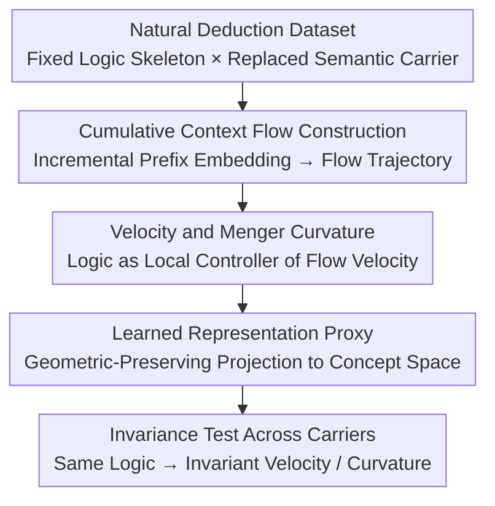

# The Geometry of Reasoning: Flowing Logics in Representation Space

**Conference**: ICLR 2026  
**arXiv**: [2510.09782](https://arxiv.org/abs/2510.09782)  
**Code**: Available (see paper)  
**Area**: LLM Interpretability / Reasoning Mechanisms  
**Keywords**: Reasoning Geometry, Representation Flow, Logical Invariants, LLM Interpretability, Concept Space

## TL;DR

This paper proposes a geometric framework that models the LLM reasoning process as "flows" (embedding trajectories) in representation space. Through controlled experiments decoupling logical structures from semantic content, it demonstrates that LLMs internalize logical invariants beyond surface forms and identifies potentially universal representation laws across model families.

## Background & Motivation

**Background**: Large Language Models (LLMs) have demonstrated remarkable capabilities in various reasoning tasks, yet the nature of their internal "reasoning" remains unclear. Mainstream interpretability research focuses on attention analysis, probing classifiers, and mechanistic interpretability (circuit analysis), but these methods often emphasize local components rather than the global geometric structure of the reasoning process.

**Limitations of Prior Work**: The debate over whether LLMs truly "understand" logic continues. The "Stochastic Parrot" hypothesis suggests LLMs only perform surface pattern matching and lack a genuine understanding of logical structures. Existing research lacks a formal mathematical framework to describe and verify the internal representation dynamics during LLM reasoning, making it difficult to distinguish whether a model is applying logic or exploiting statistical correlations.

**Key Challenge**: If LLMs only perform surface pattern matching, then identical logical reasoning structures under different semantic carriers (e.g., different vocabularies and topics) should produce entirely different representation trajectories. Conversely, if LLM indeed internalizes logical invariants, logical structures should manifest as certain geometric invariances in the representation space—but a framework and tools to verify this hypothesis were previously lacking.

**Goal**: (1) How to formally describe the geometric behavior of the LLM reasoning process in representation space? (2) Do LLMs internalize semantic-independent logical invariants in representation space? (3) are these geometric properties universal across model architectures?

**Key Insight**: The authors analogize the layer-wise (or token-wise) reasoning process of LLMs to trajectory evolution in dynamical systems, proposing to use the language of differential geometry (position, velocity, curvature) to describe reasoning flows. A critical experimental design uses "natural deduction propositions," keeping the logical structure fixed while varying semantic carriers to decouple logic from semantics.

**Core Idea**: Modeling LLM reasoning as geometric flows in representation space, using velocity field and curvature analysis to prove that logical statements are local controllers of these flows.

## Method

### Overall Architecture

This paper models the LLM reasoning process as a "flow" in representation space—an embedding trajectory that evolves as reasoning unfolds. The overall pipeline starts from a "fixed logical skeleton, replaced semantic carrier" natural deduction dataset. For each Chain of Thought (CoT), its **cumulative prefix** is embedded step-by-step to obtain a flow trajectory. Then, velocity and Menger curvature are used to characterize this flow, arguing that "logic is the local controller of flow velocity." Finally, a learned representation proxy is used for geometric-preserving dimensionality reduction to a concept space to test whether velocity and curvature remain invariant across semantic carriers under the same logical skeleton. This framework does not train any new models; it only performs geometric analysis on the representations of pre-trained LLMs.

### Key Designs

**1. Natural Deduction Dataset: Decoupling Logic and Semantics**

To determine whether LLMs internalize abstract logic or surface semantics, logic and semantics must be independently controllable. The authors construct a dataset based on natural deduction systems: the same reasoning skeleton (e.g., $A \rightarrow B$, $A$, therefore $B$) remains unchanged while only the semantic carriers are replaced—instantiated across topics (weather, education, sports) and languages (en/zh/de/ja), providing both symbolic and natural language expressions. Properties that persist across carriers must stem from the underlying logic, while differences arise from surface semantics. This controlled design is the pivot for identification.

**2. Cumulative Context Flow Construction: Continuous Embedding Trajectories**

The key is to view reasoning as a trajectory of "contextual accumulation" rather than looking at isolated token embeddings. At reasoning step $t$, the prefix is expanded to $S_t=(P, x_1, \dots, x_t)$, and then embedded as a whole using a representation operator $\Psi$ to obtain $y_t = \Psi(S_t)\in\mathbb{R}^d$. The sequence

$$Y = [y_1, \dots, y_T]\in\mathbb{R}^d \times T$$

represents the "cumulative context flow" (Algorithm 1). The authors assume these discrete points are sampled from a smooth $C^1$ curve $\tilde\Psi:[0,1]\to\mathbb{R}^d$, allowing the use of differential geometry tools like velocity and curvature.

**3. Velocity and Menger Curvature: Logic as a Local Controller**

The authors define flow velocity $v(s)=\frac{d}{ds}\tilde\Psi(s)$ to characterize the instantaneous rate of change in embeddings, with the discrete counterpart being the local increment $\Delta y_t = y_t - y_{t-1}$. According to the fundamental theorem of calculus, $\int_{s_t}^{s_{t+1}} v(s)\,ds = \Delta y_{t+1}$—each discrete reasoning step is the integral of local semantic velocity. The core claim is that **logic acts as a local controller for velocity**, governing both its magnitude and direction. Trajectory bending is measured via Menger curvature: for three points $x_1, x_2, x_3$, the curvature $c = 1/R$ is the reciprocal of the radius $R$ of the unique circumcircle, reflecting both angular deflection and distance changes. Shared logical skeletons across different semantic carriers should maintain invariant curvature patterns.

**4. Learned Representation Proxy: Empirical Proxies for Representation Operators**

The abstract mapping $\Psi$ requires a concrete instance for computation. The authors use a "learned representation proxy"—either pre-trained encoders (e.g., Qwen3 Embedding, text-embedding-3-large) or direct extractions of LLM hidden states—to project language sequences into representation space. PCA then reduces high-dimensional trajectories to 2D/3D for visualization and quantitative comparison of similarity across logic, topic, and language groups.

### Loss & Training

The framework is training-free: it does not train any new models. All analyses are built upon hidden states of pre-trained LLMs or off-the-shelf embedding models. Visualization and quantitative analysis are based on the aforementioned representation proxies (PCA reduction + similarity statistics), thus involving no loss function optimization.

## Key Experimental Results

### Main Results: Cross-Model Logic Invariance Verification

| Model Family | Model Scales | Flow Smoothness | Logical Invariance | Semantic Decoupling |
|--------------|--------------|-----------------|--------------------|---------------------|
| Qwen         | Multiple     | ✓ Smooth Flow   | ✓ Cross-semantic   | High                |
| LLaMA        | Multiple     | ✓ Smooth Flow   | ✓ Cross-semantic   | High                |

Two major findings: (1) LLM reasoning corresponds to smooth flows in representation space, and (2) logical statements act as local controllers of the velocity of these flows.

### Global Universality Analysis

| Analysis Dimension | Finding | Meaning |
|--------------------|---------|---------|
| Velocity Field Directionality | Highly similar directions across semantic carriers | Logic structure, not semantics, determines trajectory |
| Curvature Pattern Stability | High curvature areas correspond to difficult steps | Logical complexity has a geometric signature |
| Cross-Model Families | Qwen and LLaMA show similar geometric properties| Universal representation laws may exist |
| Training Independence | Geometric properties are independent of training recipes | Patterns stem from task structure |

### Key Findings

- **Reasoning as Smooth Flows**: Layer-wise representation evolution in LLMs is not a random walk but a smooth, continuous trajectory in representation space, providing an empirical basis for differential geometry analysis.
- **Logic as a Geometric Controller**: Logical statements (e.g., premises, inference rules) manifest as local control signals for flow velocity—changing logical steps systematically alters flow direction and speed.
- **Challenging "Stochastic Parrots"**: Models trained on next-token prediction can internalize logical invariants as higher-order geometric structures, suggesting that LLM "understanding" may be deeper than surface statistical associations.
- **Possible Universality**: Similar geometric properties across Qwen and LLaMA families suggest shared underlying representation laws between machine understanding and human language structures.

## Highlights & Insights

- **Unified Geometric View for Reasoning**: Modeling reasoning as a flow is elegant, providing intuition-friendly analysis tools (position, velocity, curvature) for LLM internal dynamics.
- **Semantic-Logic Decoupling Experiment**: The use of natural deduction propositions to maintain logical structure while varying semantic content is a simple yet powerful control design.
- **Bridging Interpretability and Rigor**: Unlike qualitative interpretability work, this paper establishes a quantifiable, formal geometric framework, providing a mathematical toolbox for LLM reasoning research.

## Limitations & Future Work

- **Dependence on Idealized Assumptions**: The framework relies on assumptions such as discrete representations sampling a smooth $C^1$ curve and the injectivity of trajectory mapping $\Gamma$ on restricted domains.
- **Faithfulness of Concept Space Mapping**: Dimensionality reduction via PCA inevitably loses information; further verification is needed to ensure preserved geometric properties are sufficiently complete.
- **Causality vs. Correlation**: Observing logic-invariant geometric properties does not equate to proving the model "uses" logic; intervention experiments are required to establish causal links.
- **Reasoning Type Coverage**: Natural deduction is only one form of logic; whether more complex reasoning (e.g., analogical or inductive) follows similar geometric laws remains to be explored.

## Related Work & Insights

- **vs Mechanistic Interpretability**: While mechanistic interpretability focuses on specific circuits and heads, this work looks at global geometric invariants—complementing microscopic mechanisms with macroscopic dynamics.
- **vs Probing Classifiers**: Probes detect if a layer encodes a feature; this work analyzes the dynamic trajectory of the entire reasoning process, providing richer spatio-temporal information.
- **vs Neural ODE Perspective**: Analogous to viewing Transformers as dynamical systems (e.g., Neural ODEs), this work specializes the concept for reasoning and introduces logic-semantic decoupling.

## Rating

- Novelty: ⭐⭐⭐⭐⭐ 
- Experimental Thoroughness: ⭐⭐⭐ 
- Writing Quality: ⭐⭐⭐⭐ 
- Value: ⭐⭐⭐⭐⭐ 

<!-- RELATED:START -->

## Related Papers

- [\[ICLR 2026\] Paradigm Shift of GNN Explainer from Label Space to Prototypical Representation Space](paradigm_shift_of_gnn_explainer_from_label_space_to_prototypical_representation_.md)
- [\[ICLR 2026\] Decomposing Representation Space into Interpretable Subspaces with Unsupervised Learning](decomposing_representation_space_into_interpretable_subspaces_with_unsupervised_.md)
- [\[ICLR 2026\] The Deleuzian Representation Hypothesis](the_deleuzian_representation_hypothesis.md)
- [\[ICLR 2026\] Information Shapes Koopman Representation](information_shapes_koopman_representation.md)
- [\[ICLR 2026\] On The Geometry and Topology of Representations: the Manifolds of Modular Addition](on_the_geometry_and_topology_of_representations_the_manifolds_of_modular_additio.md)

<!-- RELATED:END -->
