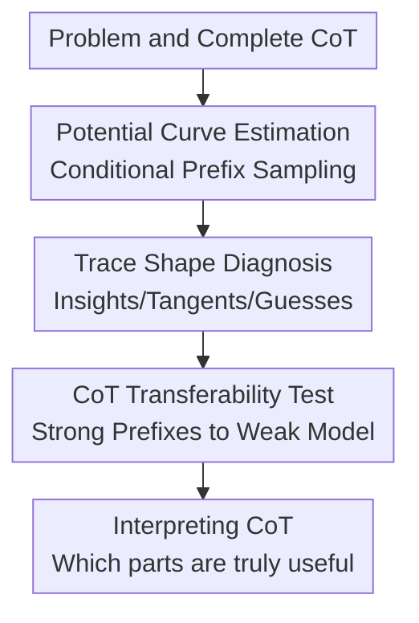

# The Potential of CoT for Reasoning: A Closer Look at Trace Dynamics

**Conference**: ICLR2026  
**OpenReview**: [https://openreview.net/forum?id=uwuSD63wbe](https://openreview.net/forum?id=uwuSD63wbe)  
**Code**: None  
**Area**: Interpretability / CoT Reasoning Trace Analysis  
**Keywords**: CoT, Reasoning Traces, Potential, Reasoning Insights, CoT Transferability  

## TL;DR

This paper proposes using "potential" to measure the conditional improvement of a given CoT prefix on final accuracy. Through trace analysis on mathematical, scientific QA, and coding tasks, it discovers that CoT effectiveness is often concentrated in a few reasoning insights, accompanied by relevant but harmful reasoning tangents, jumps difficult for humans to interpret, and lucky guesses.

## Background & Motivation

**Background**: Chain-of-Thought (CoT) has become the standard practice for enabling Large Language Models (LLMs) to handle mathematics, code, and complex QA tasks. The common intuition is that by writing out intermediate steps before the final answer, models gain more computational tokens and can decompose large problems into smaller sub-problems. Especially on tasks like AIME, MATH, and HumanEval, CoT often significantly outperforms direct answering.

**Limitations of Prior Work**: The issue is that CoT appearing like human reasoning does not mean it actually solves problems via human-readable steps. Prior research has found that model explanations are sometimes unfaithful to internal computations; other results show that models are not as sensitive to perturbations like inserted errors or symbol substitutions as human intuition would suggest. Consequently, "which segment of CoT truly helps the final answer" becomes a more granular question than "whether CoT is effective."

**Key Challenge**: If one only checks whether the complete CoT yields the correct answer, it is easy to mistake the entire trace as valid reasoning. However, real traces may mix necessary computations, irrelevant padding, misleading tangents, last-minute guesses, and even model-specific trigger words. The authors aim to disentangle this state: rather than evaluating whether an entire explanation "looks like" reasoning, they track the "probability of the model answering correctly if sampled from this token prefix."

**Goal**: The paper primarily answers three questions. First, how to define an operational metric to measure the contribution of a CoT prefix to subsequent success probability. Second, using this metric to observe real CoT traces, which segments cause accuracy to rise, fall, or jump abruptly. Third, whether key insights in strong model CoTs can be transferred to weak models to help them solve problems they otherwise could not.

**Key Insight**: The authors select competition-level mathematics as the primary scenario, specifically AIME-2024 / AIME-2025, because these problems are neither completely unsolvable nor trivial for models. On the same problem, models produce multiple different traces—some successful, some failed. This state, where the "initial success probability is between 0 and 1," is ideal for observing whether a specific CoT segment truly changes the subsequent success rate.

**Core Idea**: Treat the CoT prefix as a "state" and use the probability of obtaining a correct answer by continuing to sample from that state as the "potential," thereby explicitly locating insights, tangents, jumps, and guesses within the reasoning trace.

## Method

### Overall Architecture

This paper does not train a new model but proposes a set of CoT trace analysis methods. Given a problem $x$, a model-generated CoT $c$, and a final answer $y$, the authors truncate the CoT at different prefix positions and let the same model sample multiple times from that prefix, using the proportion of correct answers to estimate the potential of that prefix. A potential curve plotted along token or chunk positions shows which segments bring the model closer to the correct answer and which lead it astray.

The analysis includes two extensions: one is a quantitative statistical analysis of potential curve shapes to summarize phenomena like reasoning insight, reasoning tangent, late spike, and monotonicity; the other is CoT transferability, where partial CoTs from strong models are fed to weak models to see if their potential or accuracy is "unlocked." Both revolve around the core question: where the truly transferable and localizable reasoning gains lie within a CoT.

### Key Designs

**1. Potential Curve Estimation: Locating True Contributions of CoT Prefixes via Conditional Accuracy**

The authors define the value of a CoT prefix $c_{<t}$ as the probability that the model correctly generates the remaining CoT and final answer given problem $x$ and this prefix. Formally:

$$
\mathrm{pot}(c_{<t};x)=P_{(c_{\ge t},y)\sim LM_\theta(\cdot|c_{<t},x)}(y=y^*)
$$

The advantage of this definition is that it does not require subjective human judgment of whether a sentence "looks like reasoning." Instead, it asks a counterfactual question: if the model has already written up to this point, what is the probability of success if it continues randomly many times? If $\mathrm{pot}(c_{<t};x)$ is significantly higher than a shorter prefix $\mathrm{pot}(c_{<s};x)$, it indicates that the segment $c_{s:t}$ helped the model overcome a difficulty. If it is unchanged, the segment may be a routine step. If it decreases, the segment leads to a worse state on average, even if it appeared in a successful trace.

Since the true probability is not directly computable, the paper uses Monte Carlo estimation: at each truncation point, $N$ completions are sampled from the same model, and the proportion where the final answer equals the ground truth $y^*$ is calculated. In main experiments, $N=128$ is used, and CoTs are divided into chunks to reduce computation. This estimation is essentially a value function: each CoT prefix is a state, and potential is the value of reaching the correct answer from that state.

**2. Trajectory Shape Diagnosis: Categorizing CoT into Insights, Tangents, Jumps, and Guesses**

With the potential curve, the paper stops labeling a CoT as simply "correct" or "incorrect" and looks at where the curve shifts. Fragments with large increases are interpreted as reasoning insights or reasoning jumps. The former usually corresponds to key mathematical insights understandable by humans (e.g., identifying symmetry, finding roots). The latter are model-specific spikes, sometimes triggered by a seemingly trivial word or arithmetic step that significantly improves subsequent success rates.

Declines are equally important. Large drops are called reasoning tangents or reasoning flaws: the model enters a seemingly plausible direction that lacks obvious local errors but makes subsequent sampling more likely to fail. This design captures a detail of CoT: correct traces can contain harmful segments if a specific generation happens to recover by chance.

The paper also focuses on the late spike, where the potential stays near 0 for a long time and only rises abruptly near the final answer. This usually corresponds to "guessing": the intermediate reasoning did not truly derive the answer, but the model output the correct integer or choice at the end. This phenomenon pollutes pass@k metrics, as pass@k counts success if any of the $k$ samples are correct, regardless of whether it was robust reasoning or a lucky hit.

**3. Potential-Optimized CoT: Proving the Existence of Monotonic Reasoning Traces**

The paper further asks: since naturally generated CoTs are often non-monotonic, can we actively search for a CoT that increases potential step-by-step? The authors propose a proof-of-concept greedy method. Starting from an empty CoT, they sample $M$ candidate chunks at each step, calculate the potential for each, and keep the chunk with the highest potential.

This process is not intended as a practical reasoning algorithm due to its high cost. However, it provides key evidence: non-monotonicity in standard CoT is not necessarily required by the task itself but may result from models wandering into low-value paths. Optimized CoTs in experiments are often shorter, more stable, and closer to monotonically increasing.

**4. CoT Transferability Test: Testing if Insights are Shared Across Models**

If potential gains truly come from task-related insights, they should not be valid only for the model that generated them. The paper tests CoT transferability by providing partial CoTs from a strong model to a weak model as prefixes.

Experiments are divided into two categories. For reasoning models, partial CoTs from Qwen3-32B or GPT-OSS-20B are given to Qwen3-0.6B. For non-reasoning models, Qwen3-235B in thinking mode generates "gold" CoT summaries for Qwen2.5-7B and Qwen2.5-72B to complete. Results show that even with only ~20% of the partial CoT, weak model accuracy rises rapidly, enabling them to solve problems they could not solve from scratch. This suggests many CoT segments carry task information usable across models.

### A Complete Example

Consider a problem from AIME. When starting from an empty prefix, $\mathrm{pot}(c_{<0};x)$ might be only 0.15. The model translates constraints into an optimization problem, and the potential rises slowly to 0.25; this step seems basic to humans but isn't the primary difficulty for the model.

Next, the model attempts to use the AM-GM inequality. This direction is superficially reasonable but not the tight path for this problem. When sampling continues from this prefix, many completions enter dead ends, and the potential may drop to 0.05. This is a reasoning tangent.

Later, the model identifies a symmetric structure $x=y$, and the potential immediately jumps to 0.55; it then finds the roots of a crucial cubic equation, and potential jumps to 0.85. These are reasoning insights. Finally, a seemingly ordinary simplification brings potential from 0.85 to 1.0; such jumps are labeled reasoning jumps as they expose the model's local bottlenecks.

### Loss & Training

This paper does not train new models or introduce new supervised losses. All analyses are based on conditional sampling and Monte Carlo estimation of existing models. Primary settings: potential estimation uses $N=128$ samples at $T=0.6$, top-p $0.95$. A maximum of 32k tokens are allowed, and prefix lengths are deducted when calculating remaining budget to ensure potential gains are not due to increased generation limits.

In optimized CoT experiments, chunk-level greedy search is used. This is a search over the CoT space to verify the existence of higher-value paths, not a training strategy.

## Key Experimental Results

### Main Results

The main experiments analyze potential curve shapes on AIME-2024. The authors sample multiple CoTs for each problem, keeping only correct traces and filtering out problems where the initial potential is already near 100%. Table 1 key statistics:

| Model | Is reasoning model | Reasoning insights ↑ | Tangents ↓ | Late spike | Monotonicity |
|------|----------------------|----------------------|------------|------------|--------------|
| Qwen2.5-1.5B | No | 40% | 5% | 20% | 45% |
| Qwen2.5-7B | No | 62% | 9.5% | 14% | 42% |
| Llama3.1-8B | No | 46% | 33% | 6% | 15% |
| Llama3.1-70B | No | 37% | 40% | 5% | 17% |
| Qwen3-0.6B | Yes | 55% | 41% | 10% | 15% |
| Qwen3-32B | Yes | 36% | 18% | 0% | 36% |

Conclusion: Even successful CoTs are rarely monotonic. Reasoning models are not naturally "smoother"; small reasoning models like Qwen3-0.6B show tangents as high as 41%, aligning with observations that long-reasoning models often overthink and deviate from discovered answers.

Similar trends appear in MATH-500, HumanEval, and GPQA-Diamond:

| Dataset / Model | Reasoning insights ↑ | Tangents ↓ | Late spike | Monotonicity | Primary Phenomenon |
|---------------|----------------------|------------|------------|--------------|----------|
| MATH-500 / Qwen3-0.6B | 30% | 40% | 1.4% | 30% | Reasoning models still have tangents |
| MATH-500 / Qwen3-32B | 28% | 35% | 0.9% | 45% | Larger models more stable but not monotonic |
| HumanEval / Qwen2.5-7B | 30% | 4.8% | 0% | 73% | CoT closer to stable accumulation in code |
| GPQA-Diamond / Llama3.1-8B | 29.1% | 20.0% | 17.6% | 25.8% | Late spikes/guessing common in MCQ |

### Ablation Study

This paper provides diagnostic comparisons rather than "module removal" ablations.

| Configuration | Key Metric / Observation | Description |
|------|-----------------|------|
| Standard CoT Potential | High non-monotonicity, tangents, late spikes | Success does not imply a valid full trace |
| Potential-optimized CoT | More monotonic; tokens consistently drive potential | Proves cleaner paths exist but are hard to find |
| Original pass@k | Overly optimistic on Qwen2.5-1.5B / 7B | Influenced by lucky guesses |
| Corrected pass@k (no late spikes) | Significant score drop, especially at large $k$ | Late spikes reveal pass@k inflation |
| Weak model from scratch | Unable to stably solve many AIME-2025 problems | Initial potential is too low |
| Weak model w/ ~20% strong prefix | Rapid accuracy improvement | Insights are transferable across models |

The transferability experiment is the most convincing validation. Qwen3-0.6B's accuracy on AIME-2025 scales quickly with prefixes from Qwen3-32B or GPT-OSS-20B. This confirms that CoT contains sparse but critical task-relevant insights.

### Key Findings

- Potential curves are often strongly non-monotonic. Even in correct traces, segments can occur that lower the success probability, challenging the narrative that CoT is purely "evidence accumulation."
- Large potential increases come from two sources: human-interpretable reasoning insights and model-specific reasoning jumps.
- Late spikes expose the "lucky guess" problem in benchmarks, where models output the correct answer without true derivation, inflating pass@k metrics.
- Key CoT segments are transferable. Weak models can leverage prefixes from strong models to solve problems, suggesting CoTs carry model-agnostic task information.

## Highlights & Insights

- Potential provides a clean analytical perspective: it translates "whether a sentence is useful" into "whether success probability improves." This avoids subjective scoring and handles harmful segments in correct traces.
- The distinction between insight and jump is particularly interesting. One is a breakthrough, the other a localized model advantage. This makes CoT interpretability less anthropomorphized.
- The discovery of tangents is crucial for long-reasoning models. Longer CoTs are not always better, as models may overthink and wander into low-potential states.
- CoT transferability offers inspiration for training. High-potential prefixes could serve as fine-grained reward signals or partial rationales to assist weak models during learning.

## Limitations & Future Work

- Potential estimation is expensive, requiring $N=128$ samples per truncation point, which is costly for long CoTs and large models.
- The metric relies on verifiable final answers. It works for AIME/HumanEval but is harder to define for open-ended writing or dialogue.
- Potential explains trace states, not necessarily internal causal mechanisms. Useful prefixes aren't direct proof that the model's internal concepts match human understanding.
- Reasoning jumps remain difficult to explain. Locating them is possible, but explaining *why* a specific segment is a bottleneck for the model requires mechanistic interpretability.
- Transferability experiments show prefixes help but don't yet answer which prefixes are most transferable or how to automatically select the shortest effective prefix.

## Related Work & Insights

- **vs CoT attribution / step scoring**: Unlike works using gradients or human labels, this approach uses conditional generation probabilities to treat each prefix as a state value. It is more faithful to model behavior but computationally heavier.
- **vs Thought Anchors / fork token analysis**: Similar to research on partial completions, but this paper systematically discusses harmful tangents, guesses, and non-monotonicity.
- **vs CoT faithfulness**: While prior work argues CoT doesn't reflect internal computation, this paper shows that even if unfaithful, certain prefixes significantly improve situational success probability.
- **vs RL value function / credit assignment**: Potential is essentially a state value function estimated via Monte Carlo. This analogy could help alleviate sparse reward problems in reasoning RL using segment-level rewards.

## Rating

- Novelty: ⭐⭐⭐⭐☆ Using potential to define prefix value is natural, but combining it with insight/tangent/guess and transferability analysis is highly innovative.
- Experimental Thoroughness: ⭐⭐⭐⭐☆ Deep AIME analysis with cross-task validation (MATH, HumanEval, GPQA). Limited by the cost of large-scale coverage.
- Writing Quality: ⭐⭐⭐⭐☆ Clear structure; figures effectively align curves with reasoning segments.
- Value: ⭐⭐⭐⭐⭐ Directly informs the understanding of CoT reasoning and the design of fine-grained reasoning rewards.

<!-- RELATED:START -->

## Related Papers

- [\[ICLR 2026\] CoT Vectors: Transferring and Probing the Reasoning Mechanisms of LLMs](cot_vectors_transferring_and_probing_the_reasoning_mechanisms_of_llms.md)
- [\[ICLR 2026\] Block Recurrent Dynamics in Vision Transformers](block_recurrent_dynamics_in_vision_transformers.md)
- [\[ICLR 2026\] Faithfulness Under the Distribution: A New Look at Attribution Evaluation](faithfulness_under_the_distribution_a_new_look_at_attribution_evaluation.md)
- [\[ICLR 2026\] Comparing the learning dynamics of in-context learning and fine-tuning in language models](comparing_the_learning_dynamics_of_in-context_learning_and_fine-tuning_in_langua.md)
- [\[ICLR 2026\] Influence Dynamics and Stagewise Data Attribution](influence_dynamics_and_stagewise_data_attribution.md)

<!-- RELATED:END -->
