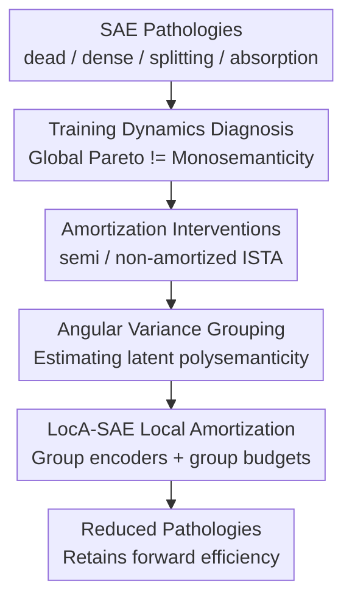

# The Price of Amortized inference in Sparse Autoencoders

**Conference**: ICLR2026  
**OpenReview**: [https://openreview.net/forum?id=33wY6AI13k](https://openreview.net/forum?id=33wY6AI13k)  
**Code**: https://github.com/wenjie1835/Local_Amotized_SAEs  
**Area**: Interpretability / Sparse Autoencoders  
**Keywords**: Sparse Autoencoders, Mechanistic Interpretability, Amortized Inference, Monosemantic Features, LocA-SAE  

## TL;DR
This paper argues that pathologies in SAEs, such as dead latents, dense latents, feature splitting, and feature absorption, are not isolated engineering issues but the result of the conflict between amortized inference via a shared encoder and instance-wise optimality. It proposes LocA-SAE, which performs local grouping based on angular variance to balance computational cost and monosemanticity.

## Background & Motivation
**Background**: Mechanistic interpretability aims to decompose internal activations of large models into interpretable units akin to "concepts." Sparse Autoencoders (SAEs) are currently among the most common tools: they use an overcomplete dictionary to decode activation vectors, employing sparse latents to represent which features the model activates for a given token. Ideally, each latent should correspond to a monosemantic concept, enabling both reconstruction and research tasks like localization, ablation, and intervention.

**Limitations of Prior Work**: Practical SAE training frequently exhibits several pathological phenomena: some latents almost never activate (dead latents); others activate frequently across many tokens (dense latents); a single concept is shared among multiple similar latents (feature splitting); and rare concepts are consumed by high-frequency concepts (feature absorption). These issues were previously attributed to activation functions, TopK constraints, sparsity penalties, or training tricks. However, such explanations do not address a more fundamental question: why does pursuing a better reconstruction-sparsity trade-off often fail to result in better monosemanticity?

**Key Challenge**: The paper attributes these conflicts to amortized inference. Classical sparse coding solves for the sparse code of each sample individually, inherently targeting instance-wise optimality. In contrast, SAEs train a shared encoder $f_\phi(x)$ to approximate sparse codes for all samples in a single forward pass. While the shared encoder provides efficiency, it forces all samples into a global mapping and a global sparsity budget. When data is long-tailed, multimodal, or has highly varied concept frequencies, global average reconstruction optimality often conflicts with the semantic atomicity of each sample.

**Goal**: The authors first aim to prove that these pathological phenomena are linked by a systemic trade-off rather than unrelated training noise. Second, they use semi-amortized and non-amortized inference as interventions to verify if reducing dependence on the shared encoder alleviates these pathologies. Finally, they provide a scalable intermediate solution that avoids both the extreme cost of per-sample optimization and the limitations of a single global encoder for all latents.

**Key Insight**: The paper reconnects the amortization gap from "error in reconstruction objective" to the goal of "whether interpretable features are monosemantic." It does not merely ask if the SAE is closer to the Pareto frontier for reconstruction and sparsity, but whether this global Pareto improvement comes at the cost of local semantic purity, the integrity of rare concepts, and stability across runs.

**Core Idea**: If SAE pathologies stem from the one-size-fits-all amortization of a shared encoder across latents with varying semantic complexity, then amortization should be reduced or localized. This allows features with high and low polysemantic potential to be encoded under different encoders and sparsity budgets.

## Method
### Overall Architecture
The methodology follows a three-step process. First, the authors use training dynamics analysis to show that in fully-amortized SAEs, unreasonable trade-offs exist between sparsity penalties, reconstruction errors, and pathology metrics. Second, inference mode is treated as an intervention variable, introducing semi-amortized and non-amortized sparse coding to observe if pathologies abate as amortization dependency decreases. Third, the authors propose LocA-SAE: it retains a shared decoder but groups latents by angular variance, assigning independent encoders and distinct TopK sparsity budgets to different groups.

The key to this framework is transforming the source of pathologies into a testable problem. Semi-amortized and non-amortized schemes serve as causal probes: if pathologies are significantly alleviated after reducing amortization, the problem is not merely an untuned activation function. LocA-SAE is the engineering compromise: acknowledging that per-sample sparse coding is closer to instance optimality while avoiding the unscalable cost of long iterations for every token.

### Key Designs
**1. Reinterpreting the Amortization Gap: Separating Global Objectives from Instance Semantics**

The paper compares SAEs with classical sparse coding under the same objective. Classical sparse coding solves for each input $x$:

$$
z_o = \arg\min_z \|x - Dz\|_2^2 + \lambda \|z\|_1,
$$

while the SAE provides $z_a=f_\phi(x)$ via a shared encoder. The amortization gap is:

$$
\Delta(x)=\big(\|x-Dz_a\|_2^2+\lambda\|z_a\|_1\big)-\big(\|x-Dz_o\|_2^2+\lambda\|z_o\|_1\big).
$$

While this definition resides within the reconstruction-sparsity objective, the authors emphasize its additional meaning for interpretability: $z_o$ is an optimized explanation for a specific sample, whereas $z_a$ is the output of a global function compromised across all samples. Interpretability requires stable, stitchable, and semantically pure features for each token, not just a minimized average global objective. Thus, a decrease in the average amortization gap $\bar{\Delta}$ indicates closer alignment with the global sparse coding objective but does not guarantee improvements in feature splitting, absorption, or consistency.

**2. Training Dynamics Diagnosis: Exposing the Cost of Shared Encoders through Pathology Linkage**

To show these phenomena are not isolated, the authors track NMSE, Dead Rate, Dense Rate, $\Delta F1$, Absorption Rate, and the amortization gap during training for Standard and TopK SAEs in a SAEBench setup. $\Delta F1=F1@2-F1@1$ serves as a proxy for feature splitting: if two latents provide significantly higher gain than one for a single probe label, the concept is likely split. The Absorption Rate measures whether subsequent related latents activate when the dominant latent is inactive, characterizing the absorption of rare concepts.

The training dynamics reveal that increasing sparsity penalties usually raises NMSE and Dead Rate, yet dense latents are not always eradicated. In certain late training stages, both dead and dense rates can deteriorate simultaneously. Furthermore, Standard SAEs show spikes in Absorption Rate and $\Delta F1$ under high sparsity, indicating the model solves the global budget by splitting or absorbing concepts. While TopK SAEs use hard gating to lower the dense rate and mitigate some dead latents, absorption and splitting still trend upward as sparsity increases.

**3. Amortization Intervention: Verifying Causes via Semi/Non-Amortized Sparse Coding**

The inference method is used as an intervention. Fully-amortized is the standard SAE forward pass; semi-amortized starts from the encoder output $z^{(0)}$ followed by few ISTA-style per-sample refinement steps; non-amortized solves non-negative sparse coding from scratch for each sample. They share a decoder $D$ and match activation density by calibrating $\lambda$ to avoid confusion from simple density changes.

The semi-amortized update is approximated as:

$$
z^{(t+1)}=\max\big(z^{(t)}-\alpha(D^\top(Dz^{(t)}-x)+\lambda\mathbf{1}),0\big).
$$

If pathologies stem from the encoder structure or global shared inference, pushing inference toward instance-wise optimization should alleviate dead latents, splitting, and absorption even if the decoder is unchanged.

**4. LocA-SAE: Localizing Amortization by Angular Variance instead of Abandoning Efficiency**

Since iterative per-sample methods are computationally expensive, LocA-SAE acts as a middle ground. It retains the efficiency of forward encoders but replaces the single global encoder. It calculates the angular variance for each latent using a pretrained global SAE:

$$
AVar_j = 1 - \|\mu_j\|_2,
$$

where $\mu_j$ is the mean of normalized input directions for which latent $j$ is active. Larger $\|\mu_j\|_2$ (smaller $AVar_j$) suggests the latent is more monosemantic, while larger $AVar_j$ suggests higher polysemanticity.

LocA-SAE sorts latents by $AVar_j$ into $G=8$ groups, each with an independent encoder $W_{enc}^{(g)}$ and an internal Top-$k_g$ sparsity budget (e.g., $(6,5,4,3,3,2,2,1)$). The decoder $D$ remains shared. Training involves four steps: pretraining a global SAE; grouping latents; initializing group encoders with global weights; and fine-tuning under group-level TopK constraints.

### Loss & Training
The base SAE uses $L=\|x-\hat{x}\|_2^2+\lambda\|z\|_1$, while TopK variants use hard selection. LocA-SAE avoids cold-starting by initializing multiple encoders from a pretrained global encoder. 

Semi-amortized refinement involves a few ISTA steps to correct the amortized code for each sample. Ablations show that while increasing iterations monotonically decreases NMSE, most pathology improvements are captured with moderate steps (e.g., 5 to 25 steps).

## Key Experimental Results

### Main Results
The main experiments compare pathologies across different sparsity levels and inference modes.

| Setting | Key Observation | Representative Value | Description |
|------|----------|----------|------|
| Standard SAE Late Stage | Pathologies worsen simultaneously | Trainer 5 / ckpt 77203: Dead Rate 0.3524, $\Delta F1$ 0.5008, Absorption Rate 0.9164 | High sparsity leads to strong absorption/splitting rather than clear features |
| Standard SAE Early Stage | Dense latents persist | Multiple early ckpts: Dense Rate@0.2 > 0.66 | Encoder retains high-frequency directions for average reconstruction |
| TopK SAE | Hard gating reduces dense rate but not root conflict | Absorption / $\Delta F1$ trend upward with training/sparsity | TopK is a trick, not a cure for amortization issues |
| Amortization Gap | Global logic != Monosemanticity | $\bar{\Delta}$ decreases while pathologies diverge | Core evidence: improving Pareto frontier $\neq$ better interpretability |

Intervention results across different models:

| Model / SAE | Inference Mode | NMSE | Dead Rate | $\Delta F1$ | Absorption Rate | Conclusion |
|------------|----------|------|-----------|-------------|-----------------|------|
| Pythia / TopK | Full-Amortized | 1.499 | 0.307 | 0.053 | 0.225 | Poor reconstruction and high dead rate |
| Pythia / TopK | Semi-Amortized | 0.087 | 0.022 | 0.036 | 0.134 | Per-sample refinement significantly improves indices |
| Pythia / LocA-SAE | Loc-Amortized | 0.427 | 0.000 | 0.013 | 0.055 | Alleviates pathologies without per-sample iteration |
| Gemma / JumpReLU | Full-Amortized | 0.341 | 0.102 | 0.032 | 0.923 | Severe absorption under full amortization |
| Gemma / JumpReLU | Semi-Amortized | 0.236 | 0.086 | 0.001 | 0.000 | Refinement eradicates the absorption anomaly |

### Ablation Study
| Configuration | Key Metrics | Description |
|------|----------|------|
| BatchTopK Semi, ISTA 5 steps | NMSE 0.477, Dead 0.000, Absorption 0.110 | 5 steps eliminate dead latents but reconstruction remains high |
| BatchTopK Semi, ISTA 50 steps | NMSE 0.046, Dead 0.000, Absorption 0.121 | Further iterations lower NMSE but saturate on pathology relief |

### Key Findings
- Reducing dependence on fully-amortized encoders decreases NMSE and alleviates dead latents, feature absorption, and splitting.
- Architecture affects pathology forms: GatedSAE has low dead rates but extremely high dense rates; TopK/JumpReLU show high absorption in fully-amortized settings.
- LocA-SAE sacrifices some reconstruction accuracy for better interpretability metrics and inference efficiency, successfully reducing dead latents and absorption without iterative costs.

## Highlights & Insights
- Pathologies are elevated from "tuning failures" to "inference paradigm mismatches." Optimizing the reconstruction-sparsity Pareto frontier can paradoxically damage monosemanticity.
- The amortization gap is reinterpreted as a proxy for the trade-offs a global encoder makes at the expense of rare or complex concepts.
- LocA-SAE’s angular variance grouping is a reusable trick for handling the heterogeneity of latents.

## Limitations & Future Work
- Angular variance is a heuristic proxy; it does not strictly guarantee monosemanticity levels for every latent.
- Experiments are primarily on Pythia-160M and Gemma-2-2B; verification on larger models and more layers is needed.
- Pathology metrics ($\Delta F1$, Absorption Rate) remain proxies and cannot fully replace human inspection or grounded conceptual evaluations.
- LocA-SAE introduces multiple encoders and grouping overhead; scaling laws regarding computation vs. quality need further analysis.

## Related Work & Insights
- **vs. Classical Sparse Coding**: SAEs trade instance-wise optimality for efficiency. LocA-SAE seeks a middle ground via local amortization.
- **vs. TopK / BatchTopK SAE**: TopK mitigates symptoms but does not solve the underlying conflict between a shared encoder and per-sample semantics.
- **vs. Matryoshka SAE**: While Matryoshka uses hierarchical widths, LocA-SAE groups by activation direction variance to handle heterogeneous sparsity needs.

## Rating
- Novelty: ⭐⭐⭐⭐☆ Explainings SAE pathologies through amortization is a fresh perspective.
- Experimental Thoroughness: ⭐⭐⭐⭐☆ Solid coverage across training dynamics and interventions.
- Writing Quality: ⭐⭐⭐⭐☆ Clear narrative, though some table naming nuances require careful reading of the appendix.
- Value: ⭐⭐⭐⭐⭐ Vital reminder for the community not to mistake the global Pareto frontier for the interpretability goal.

<!-- RELATED:START -->

## Related Papers

- [\[ICML 2026\] Ensembling Sparse Autoencoders](../../ICML2026/interpretability/ensembling_sparse_autoencoders.md)
- [\[ICLR 2026\] Toward Faithful Retrieval-Augmented Generation with Sparse Autoencoders](toward_faithful_retrieval-augmented_generation_with_sparse_autoencoders.md)
- [\[ICLR 2026\] AbsTopK: Rethinking Sparse Autoencoders For Bidirectional Features](abstopk_rethinking_sparse_autoencoders_for_bidirectional_features.md)
- [\[ICML 2026\] Sparse Autoencoders are Topic Models](../../ICML2026/interpretability/sparse_autoencoders_are_topic_models.md)
- [\[ICLR 2026\] On the Limits of Sparse Autoencoders: A Theoretical Framework and Reweighted Remedy](on_the_limits_of_sparse_autoencoders_a_theoretical_framework_and_reweighted_reme.md)

<!-- RELATED:END -->
