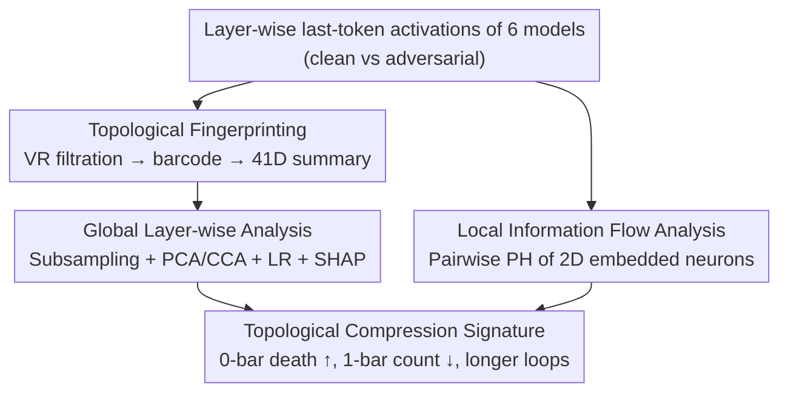

# The Shape of Adversarial Influence: Characterizing LLM Latent Spaces with Persistent Homology

**Conference**: ICLR 2026  
**OpenReview**: [https://openreview.net/forum?id=v2PglvLLKT](https://openreview.net/forum?id=v2PglvLLKT)  
**Code**: To be confirmed  
**Area**: Interpretability / LLM Safety  
**Keywords**: Persistent Homology, Topological Data Analysis, Adversarial Attacks, Representation Geometry, Prompt Injection

## TL;DR
This paper utilizes persistent homology (PH) to transform LLM activation point clouds into cross-model comparable topological fingerprints. It discovers that indirect prompt injection and backdoor fine-tuning—two fundamentally different attack mechanisms—leave the same "topological compression" signature in the latent space: the representation collapses from "small-and-many, compact-and-diverse" to "large-and-few, sparse-and-dominant." This phenomenon is consistent across six models from 3.8B to 70B, emerges early, and is highly discriminative across layers.

## Background & Motivation

**Background**: Existing LLM interpretability tools—such as linear probes, Sparse Autoencoders (SAE), and activation steering—primarily focus on finding **linearly separable directions** or **isolated features** within the latent space. They identify which direction encodes a specific concept under the assumption that representations are flat and linearly decomposable.

**Limitations of Prior Work**: This linear/feature-wise perspective fails to capture the **relational, non-linear, and global geometric structure** of representations. In adversarial safety scenarios, while linear probes can distinguish clean from adversarial activations with high accuracy, they only provide a decision boundary and fail to explain **how these two classes of representations differ geometrically**. Furthermore, SAE dictionaries are tied to specific model weights, making them unsuitable for cross-model or cross-fine-tuning comparisons.

**Key Challenge**: Model behavior is increasingly shown to be encoded within the **geometry** of the latent space. However, mainstream interpretability tools are "blind" to the non-linear geometry emerging from activation interactions. More fundamentally, past research often examined single attack types in isolation; it remained unanswered whether structurally different attacks leave a **unified** geometric signature inside the model.

**Goal**: (1) Identify a set of tools capable of characterizing high-dimensional, non-linear, and coordinate-invariant representation geometry; (2) Use these tools to verify if a shared signature exists across mechanistically distinct attacks.

**Key Insight**: The authors argue that persistent homology (the primary tool of Topological Data Analysis) is naturally suited for this task—it is provably robust to noise, coordinate-invariant, and provides multi-scale summaries of relational geometry. This allows for direct comparisons across models, input distributions, and fine-tuning stages, unlike dimensionality reduction projections that may lose global topology.

**Core Idea**: Treat activations at each layer as point clouds in $\mathbb{R}^D$, compute barcodes using persistent homology, and vectorize these barcodes into comparable topological features to "visualize" how adversarial inputs reshape the representation.

## Method

### Overall Architecture

The input consists of activation vectors from the **last token** of each layer (assumed to aggregate the model's understanding of the context) from six instruction-tuned LLMs (Phi3-mini 3.8B, Mistral 7B, LLaMA3 8B/70B, Phi3-medium 14B, Mixtral-8×7B) under **clean vs. adversarial** conditions. The adversarial conditions cover two categories: Indirect Prompt Injection (XPIA, using clean vs. poisoned samples from the TaskTracker dataset) and "Sandbagging" via backdoor fine-tuning (using LoRA on WMDP-style data to create locked vs. elicited states).

The analysis follows two parallel branches built on the foundation of "persistent homology of activation point clouds": **Global Layer-wise Analysis**, which converts layer-wide point clouds into 41-dimensional barcode summaries to identify features distinguishing clean from adversarial states using machine learning; and **Local Information Flow Analysis**, which embeds neurons from adjacent layers into 2D point clouds to characterize changes in neuron-level information flow. Both branches converge on the conclusion of "topological compression."

### Key Designs

**1. Topological Fingerprinting: Vectorizing point clouds into cross-model 41D barcode summaries**

Linear probes fail to explain geometric differences because they lack a **coordinate-invariant, noise-robust, and multi-scale** representation. This work fills this gap with persistent homology. For a point cloud $X \subset \mathbb{R}^D$ (where $D$ is typically 4096), a Vietoris–Rips complex is constructed at a scale $\epsilon$: edges are connected for points within distance $\epsilon$, triangles are added for cliques of three points, and so on for higher-order simplices. As $\epsilon$ increases from 0, a filtration is generated. PH records the "birth and death" of topological features across dimensions, resulting in a barcode. This study focuses on dimension 0 (connected components, 0-bar) and dimension 1 (loops, 1-bar).

Since barcodes are not in Euclidean space and cannot be directly fed into ML models, the authors extract **summary statistics**: mean, std, median, and quantiles of births/deaths/persistences (bar lengths), along with scale-invariant ratios, total bar counts (topological diversity), total persistence (sum of bar lengths), and persistent entropy (heterogeneity of bar lengths). Each barcode is condensed into a **41-dimensional barcode summary** vector. This approach allows for direct cross-architecture comparisons, bypassing the limitations of SAE dictionaries that are tied to specific weights.

**2. Global Layer-wise Analysis: Decoding the "Topological Compression" Signature**

To prove the discriminative and explanatory power of these fingerprints, the authors take $K=64$ subsamples per layer, each containing $k=4096$ activations. Barcodes are computed using RIPSER++ and vectorized. The explanatory pipeline involves: removing redundant features (correlation $>0.5$), assessing geometric separability via PCA, identifying driving features via CCA, quantifying discriminative power with Logistic Regression (LR), and explaining feature contributions using Shapley values.

The results are striking: LR trained solely on topological features achieves **perfect accuracy and AUC-ROC** on test sets and 5-fold cross-validation, significantly outperforming LDA, SVM, and linear baselines (raw or SAE-reduced) in early layers. CCA and SHAP consistently identify two key features—**average death time of 0-bars** and **count of 1-bars**—showing a clear dichotomy: low average 0-bar death (compact point cloud) + many 1-bars $\to$ Clean; high average 0-bar death (dispersed point cloud) + few 1-bars $\to$ Poisoned. This defines the **topological compression signature**: adversarial states compress representations into "a few large loops in limited directions," whereas clean states exhibit "many smaller, uniformly distributed, higher-entropy loops." This signature is consistent across six models and appears early.

**3. Local Information Flow Analysis: Capturing PH Phase Transitions at the Neuron Scale**

To observe how adversarial influence occurs via neuron-level information flow, a 2D point cloud is constructed for each pair of layers $(\ell, \ell')$: the $i$-th neuron is assigned coordinates $(v^\ell_i, v^{\ell'}_i)$. While adjacent activations are usually highly correlated (near $y=x$), neurons undergoing significant transformation deviate and create loop structures detectable by PH.

Using the total persistence of 1-bars to measure complexity, the authors find a **structural phase transition**: clean inputs start complex and simplify with depth; poisoned inputs start simple but increase in complexity, diverging significantly around layer 12. This suggests adversarial influence triggers a reorganization of deep-layer information processing. This signal disappears under random neuron permutation, proving it depends on **specific neuron-to-neuron pathways** rather than statistical artifacts. Furthermore, the **global variance** of topological features across samples correlates strongly (Spearman $r$ up to 0.78) with the magnitude of clean-vs-poisoned differences, allowing for **unsupervised** localization of the most affected layers.

## Key Experimental Results

### Main Results

Discriminative accuracy of topological features vs. linear baselines on Mistral 7B / XPIA (70/30 split, 1000 clean vs. 1000 poisoned):

| Layer | LDA | SVM | LR | LR (SAE) | PH (Ours) |
|----|-----|-----|-----|----------|-----------|
| Layer 1 | 0.995 | 0.888 | 0.870 | 0.743 | **1.000** |
| Layer 8 | 1.000 | 1.000 | 0.995 | 0.623 | **1.000** |
| Layer 16 | 1.000 | 1.000 | 1.000 | 0.673 | **1.000** |
| Layer 24 | 1.000 | 1.000 | 1.000 | 0.960 | **1.000** |
| Layer 32 | 1.000 | 1.000 | 1.000 | 1.000 | **1.000** |

PH achieves perfect scores across all layers, notably outperforming linear methods in early layers. The value of PH lies in its explainability—defining exactly how representations differ topologically.

### Cross-Model Consistency of the Topological Compression Signature

| Model | Min Accuracy | $\bar{d}_{H_0}$ ↑ | $\#H_1$ ↓ | $\bar{\ell}_{H_1}$ ↑ |
|------|-----------|------------------|----------|---------------------|
| Phi3-mini (3.8B) | 1.00 | ✓ | ✓ᵃ | ✓ |
| Mistral (7B) | 1.00 | ✓ | ✓ | ✓ |
| LLaMA3 (8B) | 1.00 | ✓ | ✓ | ✓ |
| Mixtral-8×7B | 1.00 | ✓ | ✓ | ✓ᵃ |
| Phi3-medium (14B) | 1.00 | ✓ | ✓ | ✓ |
| LLaMA3 (70B) | 1.00 | ✓ | ∼ᵇ | ✓ |

The signature (0-bar death ↑, 1-bar count ↓, loop lifetime ↑) is largely consistent across six models. ᵃ indicates the trend holds for L1–L24 but reverses at L32; ᵇ indicates direction varies across layers. Both Prompt Injection and Backdoor attacks share this signature.

### Key Findings

- **Most discriminative features are average 0-bar death time and 1-bar count**: These characterize point cloud compactness and loop diversity respectively.
- **Effects emerge early**: Early-layer PH achieves perfect separation, suggesting adversarial signatures are formed in shallow layers.
- **Dependency on specific neuron pathways**: Local signals vanish under random index permutation, ruling out simple statistical or scaling artifacts.
- **Geometry correlates with behavior**: Local Discrete Ratio (LDR) increases in middle layers for executed injections (extra capacity used for processing) but stays low in the compression zone for rejected ones.
- **Unsupervised localization**: Global variance of topological features correlates with class separation, allowing identification of critical layers without labels.

## Highlights & Insights

- **Adversarial influence as a measurable geometric invariant**: The finding that disparate attacks share a unified topological signature suggests a universal perspective for adversarial detection.
- **Cross-model barcode summaries are a paradigm shift**: While SAEs are model-tied, these coordinate-invariant summaries allow direct comparison between models ranging from 3.8B to 70B parameters.
- **Dual-scale PH approach**: The combination of "Global point cloud PH" and "Local neuron embedding PH" provides a robust framework for validating findings and can be extended to other phenomena like memorization or emergence.
- **Unsupervised localization via variance**: A practical trick for real-world deployment where labeled adversarial data may be scarce.

## Limitations & Future Work

- **Explanation vs. Detection**: Linear probes already achieve high detection accuracy; PH's primary contribution is in "explaining geometric differences" rather than just increasing detection rates.
- **Dependency on last token and subsampling**: Using only the final token and $k=4096$ points might miss structures distributed across the sequence or in the distribution tails.
- **Inconsistent signatures at scale**: Some trends reverse or fluctuate in the 70B model or final layers, indicating the mechanism is not yet fully elucidated for ultra-large models.
- **Attack coverage**: The study only evaluates two types of attacks; generalizability to jailbreaking or adversarial suffixes remains to be verified.

## Related Work & Insights

- **vs. Linear Probes (Alain & Bengio; Zou et al.)**: Probes identify boundaries but lack geometric explanation; PH reveals the structures underlying that separability.
- **vs. SAEs (Cunningham et al.)**: SAEs decompose activations into features but ignore relational geometry and fail to generalize across models. PH provides intrinsic, coordinate-invariant geometric quantities.
- **vs. Prior TDA in DL (Naitzat et al.; Zhang et al.)**: This work scales PH to large-scale LLM latent spaces (up to 70B+) under controlled adversarial interventions, pushing the boundaries of TDA in interpretability.

## Rating
- Novelty: ⭐⭐⭐⭐⭐ First systematic characterization of LLM adversarial latent spaces using PH, discovering shared signatures.
- Experimental Thoroughness: ⭐⭐⭐⭐ Six models, multiple attacks, global/local perspectives, and strong baselines/controls.
- Writing Quality: ⭐⭐⭐⭐ Clear concepts and visualization, though TDA remains a high-barrier topic.
- Value: ⭐⭐⭐⭐ Provides a coordinate-invariant, cross-model perspective on representation geometry.

<!-- RELATED:START -->

## Related Papers

- [\[ICLR 2026\] Emotions Where Art Thou: Understanding and Characterizing the Emotional Latent Space of Large Language Models](emotions_where_art_thou_understanding_and_characterizing_the_emotional_latent_sp.md)
- [\[ICLR 2026\] Influence Dynamics and Stagewise Data Attribution](influence_dynamics_and_stagewise_data_attribution.md)
- [\[ICLR 2026\] Internal Planning in Language Models: Characterizing Horizon and Branch Awareness](internal_planning_in_language_models_characterizing_horizon_and_branch_awareness.md)
- [\[ICLR 2026\] Latent Thinking Optimization: Your Latent Reasoning Language Model Secretly Encodes Reward Signals in Its Latent Thoughts](latent_thinking_optimization_your_latent_reasoning_language_model_secretly_encod.md)
- [\[ICLR 2026\] From Data Statistics to Feature Geometry: How Correlations Shape Superposition](from_data_statistics_to_feature_geometry_how_correlations_shape_superposition.md)

<!-- RELATED:END -->
