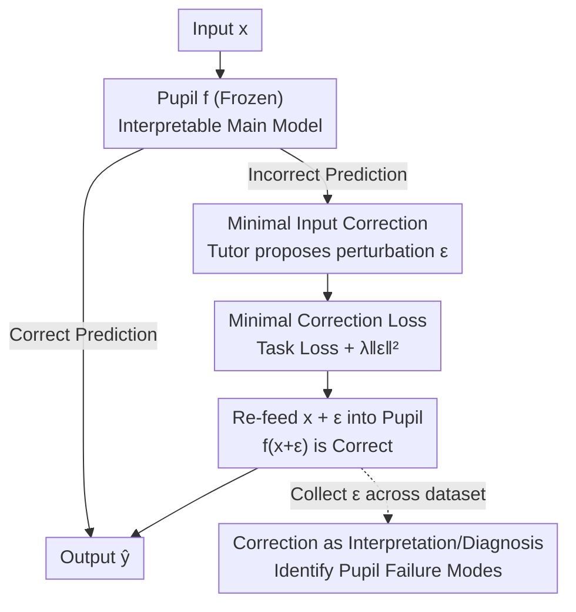

# The Tutor-Pupil Augmentation: Enhancing Learning and Interpretability via Input Corrections

**Conference**: ICLR 2026  
**OpenReview**: [https://openreview.net/forum?id=TvP90DWijM](https://openreview.net/forum?id=TvP90DWijM)  
**Code**: None  
**Area**: Interpretability  
**Keywords**: Model Augmentation, Interpretability, Input Correction, Residual Modeling, Diagnostic Tools

## TL;DR
This paper proposes the Tutor-Pupil augmentation framework: maintaining a fixed, interpretable "Pupil" model for the primary task, while training a flexible "Tutor" model to apply a minimal perturbation $\epsilon$ in the **input space** to "correct" samples the Pupil fails on. Since corrections occur at the input level and are constrained to be minimal, these corrections serve as a diagnostic map that reveals where and why the Pupil fails, simultaneously achieving performance gains and interpretability.

## Background & Motivation
**Background**: There are two mainstream routes for incorporating prior knowledge into models: architectural inductive biases (CNNs for spatial locality, Transformers for long-range dependencies, PINN/PGNN for physical equations in losses) and **model augmentation**. The latter preserves a primary model embodying priors and attaches a flexible auxiliary model to capture residuals that the primary model misses. The connection can be serial, parallel, or feedback-based.

**Limitations of Prior Work**: The most common parallel augmentation lets the auxiliary network directly correct the **output** of the primary model: $\hat y = f(x) + \mathrm{NN}(x)$. While the interpretable $f$ dominates in regions where the primary model performs well, the auxiliary network—which is usually opaque—takes over precisely in regions where the primary model fails and understanding "why" is most critical. Thus, **interpretability is lost exactly where it is needed most**. Even if corrections are constrained, they only indicate "how much to adjust the output" without clarifying the structure of the residuals.

**Key Challenge**: Complex models are accurate but opaque, while simple models are transparent but lack expressivity, creating an accuracy-intelligibility trade-off. Output-side correction schemes fail to break this contradiction; they merely relocate the opacity.

**Goal**: To improve performance while preserving the interpretability of the primary model, ensuring that the "correction" itself becomes a readable explanation—acting as both a performance booster and a diagnostic tool.

**Key Insight**: The authors observe that if corrections occur in the **input space** rather than the output space, the correction vector $\epsilon$ resides in the same semantic coordinates as the data (which feature, what direction, what magnitude), making it naturally human-readable. With a "minimal correction" constraint, the parts being modified correspond to the Pupil's specific weaknesses.

**Core Idea**: Instead of direct output correction, a Tutor is trained to learn the minimal push from input $x$ to $x+\epsilon$ such that the fixed Pupil predicts correctly on $x+\epsilon$. The correction vector then assumes the dual roles of error correction and explanation.

## Method

### Overall Architecture
The core problem addressed is: **How to enhance performance without modifying the interpretable primary model while keeping corrections readable.** Tutor-Pupil answers this with a dual-model loop consisting of a "fixed Pupil + input-side Tutor." The Pupil $f$ is selected based on the task structure and is **completely frozen** during Tutor training (e.g., decision trees, first-principles formulas, or logistic regression). The Tutor is a flexible network that does not touch $f$'s parameters but outputs a minimal perturbation $\epsilon$ applied to the input, ensuring that samples misclassified by $f$ are correctly predicted at $x+\epsilon$. After training, the global distribution of $\epsilon$ learned by the Tutor across the dataset provides a diagnostic map of "where and in what direction" the Pupil fails in the input space.

The framework relies on three main contributions: **minimal input-side correction** (using $\epsilon$ instead of output shifts), **minimal correction loss** (a dual-objective of task loss and magnitude regularization), and **interpreting corrections as diagnosis** (categorized by whether the Pupil is inherently interpretable). For high-dimensional inputs like images, a **latent space correction** design is used, where the Tutor operates within a VAE latent space rather than pixel-wise.

### Key Designs

**1. Input Space Minimal Correction: Aligning Error Correction with Data Coordinates**

Parallel augmentation at the output level causes opacity to resurface in the most critical regions. This paper reverses this: the Tutor proposes a small perturbation $\epsilon$ added to the input such that the frozen Pupil yields the correct answer. In classification, this means pushing a $y=0$ point misclassified as $y=1$ just outside the decision boundary so that $f(x+\epsilon)=0$. This is effective because $\epsilon$ shares the same space as the original features; its direction and magnitude directly reveal which feature dimensions need adjustment for the Pupil to succeed. Unlike output-end schemes, input-side corrections reveal how the decision boundary should be deformed.

**2. Minimal Correction Loss: Forcing Movement only at Critical Weaknesses**

Simply making $f(x+\epsilon)$ correct is insufficient; if $\epsilon$ can be arbitrarily large, the Tutor will move all samples to "comfortable" regions, stripping the diagnosis of meaning. Thus, the Tutor is trained on a weighted sum of task loss and correction magnitude:

$$\mathcal{L} = \mathcal{L}_C\big(y,\, f(x+\epsilon)\big) + \lambda \,\lVert \epsilon \rVert_2^2$$

where $\mathcal{L}_C$ is the classification loss (e.g., binary cross-entropy) and $\lambda$ is the regularization coefficient. The first term enforces correctness, while the second enforces "minimal intervention." This $\ell_2$ constraint is the pivot of interpretability: since corrections are minimized, significantly modified samples precisely indicate the Pupil's true failure boundaries.

**3. Interpreting Corrections as Diagnosis: Two Categories of Use Cases**

The Tutor does not learn per-sample local counterfactuals; it learns a consistent correction pattern across the **entire dataset**, providing a **global** explanation. The utility branches based on the Pupil's nature: ① When the Pupil is inherently interpretable (e.g., a physical formula), $\epsilon$ reveals high-order structures in the **data/physical world** ignored by the Pupil. Examples include rediscovering the $b$ term in the Van der Waals equation from the ideal gas law. ② When the Pupil is less interpretable (e.g., logistic regression on high-dim data), $\epsilon$ reveals which features the **model itself** relies on or is sensitive to, acting as a probe for the Pupil's implicit strategy and blind spots.

**4. Latent Space Correction: Semantic Corrections via VAE**

For high-dimensional inputs like MNIST ($28\times28=784$), learning pixel-wise $\epsilon$ is computationally expensive and prone to overfitting. The authors leverage a compact representation: a pre-trained VAE encodes images into a low-dimensional latent variable $z$. The Tutor ($q_\phi$) generates a perturbation $\Delta z$, resulting in $z'$, which is then reconstructed by a frozen decoder $h_\psi$ into a corrected image $x' = h_\psi(z')$ for the Pupil. This keeps the "minimal correction" philosophy but applies it in a controllable latent space. The loss includes latent consistency and reconstruction fidelity:

$$\mathcal{L} = \mathcal{L}_C\big(y, f(x')\big) + \lambda_1\, D_{\mathrm{KL}}\big(q_\phi(z'\mid z)\,\Vert\, g_\theta(z\mid x)\big) + \lambda_2\,\lVert x'-x\rVert_2^2$$

This ensures that the Tutor learns semantic corrections (e.g., completing a broken stroke in a digit) that are immediately interpretable to humans.

### A Complete Example
Consider the Ideal Gas Pupil: Pupil is the equation of state $P = \frac{nRT}{V}$. It approximates simulation data at large volumes but **systematically underestimates pressure** as volume decreases, with deviations increasing with temperature. By freezing this as the Pupil and training a Tutor to learn corrections $\epsilon=(\epsilon_V, \epsilon_T)$, the objective is:

$$\mathcal{L} = \left(\frac{nR(T+\epsilon_T)}{V+\epsilon_V} - P\right)^2 + \lambda\,\lVert\epsilon\rVert_2^2$$

The corrected prediction $\hat P = \frac{nR(T+\epsilon_T)}{V+\epsilon_V}$ perfectly fits the experimental isotherms. Examining $\epsilon$ reveals: smaller volumes require larger corrections, and the Tutor consistently **reduces the effective volume**. This has a clear physical meaning—the ideal gas law assumes negligible molecular volume, but real molecules have a finite radius. The Tutor effectively recovers the physical meaning of the $b$ term in the Van der Waals equation. The Tutor is not a black-box patch; it points out the violated assumptions in the data.

## Key Experimental Results

As a framework paper, it validates its approach across three scenarios ranging from simple to complex, providing evidence for both performance and interpretability.

### Main Results

| Setting | Pupil Model | Pupil Alone | Tutor-Pupil (Ours) | Description |
|------|-----------|-----------|-------------|------|
| Binary Classification (Toy) | Shallow Decision Tree | Baseline | ~**13%** Gain | Input $\epsilon$ pushes misclassified points across boundaries |
| Ideal Gas (First Principles) | $P=nRT/V$ | Underestimates at low $V$ | Near-perfect fit | Correction recovers Van der Waals $b$ term |
| MNIST Digit Classification | Logistic Regression | **91%** | **98.5%** | Latent correction completes digit structures |

### Ablation Study

| Baseline | Key Findings | Description |
|---------|---------|------|
| vs. Output-side Augmentation | Input $\epsilon$ reveals boundary deformation | Output-only schemes lose interpretability in failure regions |
| vs. SHAP (MNIST) | Tutor corrections modify the image directly | SHAP heatmaps on 784 pixels are difficult to interpret |
| vs. Counterfactuals | Global patterns via whole-dataset training | Counterfactuals only explain individual instances |

### Key Findings
- **Correction magnitude as a diagnostic signal**: Under $\ell_2$ regularization, significantly modified samples reside at the Pupil's failure boundaries. In the ideal gas example, large corrections concentrate in low-volume regions.
- **Switching interpretability targets**: When the Pupil is interpretable, $\epsilon$ explains the **data/physics** (uncovering high-order structures). When the Pupil is opaque, $\epsilon$ explains the **model's sensitivity**.
- **Global vs. Local**: Training on the full dataset allows the Tutor to capture systematic failure modes rather than single-point instance explanations.

## Highlights & Insights
- **"Correction as Explanation" perspective shift**: Re-positioning auxiliary models as "diagnostic tools." Because corrections are constrained to the input space and minimized, they naturally reside in semantic coordinates.
- **Freezing the Pupil as a key constraint**: By keeping the Pupil stationary, the structure of $\epsilon$ purely reflects the Pupil's deficiencies rather than an entangled interaction, making the explanation valid.
- **Data-driven rediscovery of physical laws**: The Ideal Gas to Van der Waals transition is a powerful example of the framework identifying violated assumptions from data and enabling theoretical formalization via symbolic regression.
- **Engineering Cleverness in Latent Space**: Using VAEs to transition from pixel-level noise to semantic-level corrections ("closing a loop," "adding a stroke") makes high-dimensional interpretability intuitive.

## Limitations & Future Work
- **Two-stage training**: The Tutor is currently trained after the Pupil. Future work could explore **joint training** with "functional orthogonality" constraints to ensure the two models capture complementary, decoupled information.
- **Interpretability constraints**: While "minimal perturbation" encourages interpretability, additional constraints like restricting the Tutor to superpixels or human-aligned feature decompositions could enhance clarity.
- **Scalability**: Validation was conducted on relatively "toy" or controlled settings. Effectiveness on large-scale deep Pupils or real-world complex tasks remains to be fully verified.
- **Bias Detection**: The authors suggest the Tutor could be used to detect training data biases. If a Pupil is influenced by a confounder, the Tutor might systematically "undo" these effects, revealing the underlying bias.

## Related Work & Insights
- **vs. Parallel (Output-side) Augmentation**: Output corrections move the opacity to the failure region; input corrections preserve transparency precisely where the model is weakest.
- **vs. Residual Learning (ResNet)**: ResNet learns residuals in hidden spaces for **optimization** (gradient flow). Tutor-Pupil learns corrections in the input space for **modeling and interpretation**.
- **vs. Ensemble**: Ensembles improve performance by sacrificing interpretability; this framework uses a structured interaction to preserve the intelligibility of the primary model.
- **vs. Local Explanations (SHAP/Counterfactuals)**: These provide per-instance attribution. The Tutor-Pupil framework identifies **global**, systematic failure patterns across the dataset.

## Rating
- Novelty: ⭐⭐⭐⭐ The shift to "input-side minimal correction as diagnosis" is a clean and powerful conceptual contribution.
- Experimental Thoroughness: ⭐⭐⭐ The settings are clear but controlled; more large-scale/deep Pupil verification is needed.
- Writing Quality: ⭐⭐⭐⭐⭐ Excellent narrative progression, especially the physical law examples.
- Value: ⭐⭐⭐⭐ Provides a transferable, formalizable framework for interpretable hybrid modeling.

<!-- RELATED:START -->

## Related Papers

- [\[ACL 2025\] Enhancing Automated Interpretability with Output-Centric Feature Descriptions](../../ACL2025/interpretability/output_centric_interpretability.md)
- [\[ICLR 2026\] Sparse CLIP: Co-optimizing Interpretability and Performance in Contrastive Learning](sparse_clip_co-optimizing_interpretability_and_performance_in_contrastive_learni.md)
- [\[ICLR 2026\] Learning Pseudorandom Numbers with Transformers: Permuted Congruential Generators, Curricula, and Interpretability](learning_pseudorandom_numbers_with_transformers_permuted_congruential_generators.md)
- [\[ACL 2026\] Letting Tutor Personas Speak Up for LLMs: Learning Steering Vectors from Dialogue via Preference Optimization](../../ACL2026/interpretability/letting_tutor_personas_speak_up_for_llms_learning_steering_vectors_from_dialogue.md)
- [\[ICML 2025\] Towards Attributions of Input Variables in a Coalition](../../ICML2025/interpretability/towards_attributions_of_input_variables_in_a_coalition.md)

<!-- RELATED:END -->
