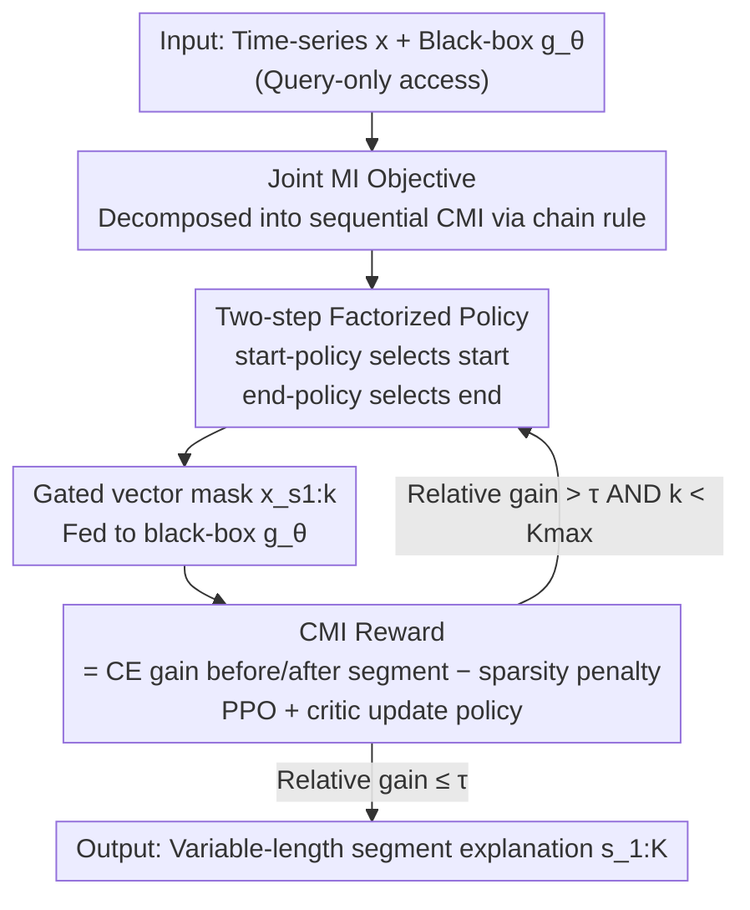

# TimeSeg: An Information-Theoretic Segment-Wise Explainer for Time-Series Predictions

**Conference**: ICLR 2026  
**OpenReview**: [https://openreview.net/forum?id=alt9mSWULk](https://openreview.net/forum?id=alt9mSWULk)  
**Code**: Available (provided in paper footnote, see original text for repository URL)  
**Area**: Explainability / Time-Series / Information Theory / Reinforcement Learning  
**Keywords**: Time-series explanation, segment-wise explanation, mutual information, conditional mutual information, PPO

## TL;DR
TimeSeg redefines "explaining black-box time-series models" as selecting a set of continuous sub-sequences that maximize the joint mutual information with the model's prediction. By using the chain rule, this intractable joint optimization is decomposed into a sequential decision-making problem solved via reinforcement learning. This allows for producing variable-length segment explanations with high alignment to ground truth and precise boundaries under strict black-box conditions (input-output access only).

## Background & Motivation
**Background**: In high-risk scenarios such as healthcare, finance, and manufacturing, black-box time-series models must provide explainable evidence. Early explanation methods were mostly adapted from general XAI (Integrated Gradients, SHAP, LIME), treating each time point as an independent feature for scoring, known as "point-wise" explanation. Subsequent works like Dynamask, ExtrMask, FIT, WinIT, and TimeX++ added temporal smoothing/continuity regularization to the point-wise framework or used surrogate explainers to learn Bernoulli masks.

**Limitations of Prior Work**: Point-wise methods offer precise localization but naturally produce scattered significant points "fragmented by temporal gaps," making it difficult for humans to discern coherent temporal patterns. Conversely, methods attempting direct "segment-wise explanation" (e.g., LIMESegment using fixed-length patches, SpectralX perturbing in the frequency domain) often suffer from misalignment or over-fragmentation due to fixed, non-adaptive segment lengths. Trade-offs exist between precise localization and segment continuity.

**Key Challenge**: Segment-wise explanation has not been rigorously addressed due to the lack of a principled definition of "what constitutes a meaningful segment." Point-wise methods are tractable because they assume each time point is an independent Bernoulli variable. However, once "segments" are considered, continuous time points must be evaluated jointly. The search space for candidate segments grows exponentially with sequence length $T$ ($O(2^T)$), and complex combinatorial dependencies exist between multiple segments, causing continuous relaxation (like Gumbel-Softmax) to fail.

**Goal**: (i) Provide a formal, optimizable definition for "segment-wise explanation"; (ii) solve it under strict black-box conditions (no gradients, no internal representations); (iii) allow each sample to adaptively determine the number and length of selected segments.

**Key Insight**: The authors provide a definition using information theory: a good explanation is "a set of continuous sub-sequences that maximizes the joint mutual information with the black-box prediction while keeping the structure as simple as possible." This transforms vague "interpretable segments" into a penalized mutual information maximization problem.

**Core Idea**: Use the chain rule to decompose the intractable joint mutual information (MI) into a sequence of conditional mutual informations (CMI). This transforms "selecting all segments at once" into "sequential segment selection" as a reinforcement learning task, where the CMI (cross-entropy gain) for each selected segment serves as the reward.

## Method

### Overall Architecture
TimeSeg is a **post-hoc, strictly black-box** segment-wise explainer. Given a univariate time-series $x=(x_1,\dots,x_T)$ and a black-box classifier $g_\theta$ (queryable only for input-output), the goal is to output a set of non-overlapping, variable-length continuous segments $s_{1:K}=(s_1,\dots,s_K)$ (each segment $s_k=(t^s_k,t^e_k)$ denoted by start and end indices) that best explain $g_\theta(x)$.

The formal objective (Def. 3.1) is to maximize the joint MI between selected segments and the prediction, minus a complexity regularizer:
$$E^*=\arg\max_E\; I\big(g_\theta(X);X_{s_{1:K}}\big)-\lambda J(s_{1:K}),\quad s_{1:K}\sim E(X).$$
Solving this faces two major hurdles: joint MI is difficult to estimate, and combinatorial search over discrete mappings is computationally prohibitive. TimeSeg breaks through by reframing "selecting $K$ segments" as "sequential selection": the mutual information is decomposed into CMIs using the chain rule, where each step selects a new segment and uses the "difference in cross-entropy before and after adding the segment" as the immediate reward. The process is modeled as a reinforcement learning episode—the policy network is the agent, the black-box model is the environment, repeatedly "proposing a segment → feeding to the black box → receiving a reward" until the marginal gain falls below a threshold or $K_{\max}$ is reached.

### Key Designs

**1. Information-theoretic definition + Chain rule decomposition: Transforming segment selection from exponential search to sequential decision-making**

Directly maximizing the joint MI $I(g_\theta(X);X_{s_{1:K}})$ is both hard to estimate and requires combinatorial search over $O(2^T)$ candidate sets. TimeSeg's key step is the exact decomposition via the chain rule:
$$I\big(g_\theta(X);X_{s_{1:K}}\big)=\sum_{k=1}^{K} I\big(g_\theta(X);X_{s_k}\mid X_{s_{1:k-1}}\big),$$
where the $k$-th CMI term measures "how much new information about the prediction is gained by observing the $k$-th segment, given the already selected segments $X_{s_{1:k-1}}$." Since CMI itself is not directly calculable, the authors use variational approximation based on the Information Bottleneck principle to express each term as a **difference in cross-entropy**:
$$I_{\theta,\phi}\big(Y;X_{s_k}\mid X_{s_{1:k-1}}\big)=\mathbb{E}\Big[\log p_\theta\big(y\mid x_{s_{1:k}}\big)-\log p_\theta\big(y\mid x_{s_{1:k-1}}\big)\Big].$$
The value of this decomposition is that it replaces "selecting all segments at once" (exponential complexity) with "selecting segments sequentially" (one decision per step), bypassing combinatorial search and allowing "segments" to become coherent units of explanation that generalize across samples.

**2. Modeling sequential selection as RL with cross-entropy gain as reward: Enabling learning under strict black-box conditions**

With sequential CMI, the authors naturally fit the process into an RL framework: the explainer is the agent, the state at step $k$ is input $x$ plus the history of selected segments $s_{1:k-1}$, and the action is selecting the next segment $s_k\sim\pi_\phi$. The reward is the CMI of that step—the cross-entropy difference of the black-box output before and after adding the new segment:
$$r_\theta(x_{s_k},x_{s_{1:k-1}})=\mathbb{E}_{p_\theta(y\mid x)}\Big[\log p_\theta(y\mid x_{s_{1:k}})-\log p_\theta(y\mid x_{s_{1:k-1}}\Big].$$
To prevent the policy from "selecting everything," a sparsity cost $c(s_k)=\frac1T\|m_k\|_1$ is subtracted (longer segments yield higher penalties), making the immediate reward $R_k=r_\theta-\lambda c(s_k)$. Since the reward only requires input and output probabilities from the black box—without touching gradients or internal representations—TimeSeg functions under strict black-box conditions. Optimization is performed using actor-critic with PPO to reduce the high variance of discrete sampling.

**3. Two-step factorized policy + Gating vectors: Ensuring valid variable-length segments and distinguishing "global" vs. "black-box" visions**

The most difficult constraint in segment selection is that the start must not be later than the end ($t^s_k\le t^e_k$), which typically breaks continuous relaxation. TimeSeg avoids modeling the joint distribution of all valid "start-end" pairs by factorizing the policy into two conditional distributions: first sampling the start, then sampling the end within the valid remaining range:
$$\pi_\phi(s\mid x,s_{1:k-1})=\pi_{\phi_s}(t^s\mid x,s_{1:k-1})\,\pi_{\phi_e}(t^e\mid t^s,x,s_{1:k-1}).$$
This construction guarantees that every segment is valid and non-empty, naturally producing variable-length segments. Another detail is "vision asymmetry": the policy and value networks need to see the full sequence $[x;m_{1:k-1}]$ to plan the next segment, while the black box should only see the selected regions $x_{s_{1:k}}=m_{1:k}\odot x+(1-m_{1:k})\odot\bar x$ (where unselected positions are neutralized by the mean $\bar x$).

**4. Instance-level adaptive termination: Sample-specific segment counts**

Different time-series sequences require different numbers of explanatory segments. TimeSeg uses a normalized relative gain to stop the process—dividing the current CMI reward by the current cross-entropy. If the gain falls below threshold $\tau$, selection stops:
$$r_\theta(x_{s_k},x_{s_{1:k-1}})\big/\mathbb{E}_{p_\theta(y\mid x)}\big[-\log p_\theta(y\mid x_{s_{1:k-1}})\big]\le\tau.$$
With $\tau=0.3$ and $K_{\max}=5$, the number of segments $K$ becomes adaptive: the process terminates when the information is sufficiently covered, avoiding redundant segments.

### Loss & Training
The overall goal is to maximize the expected cumulative reward $L(\phi)=\mathbb{E}\big[\sum_k r_\theta(x_{s_k},x_{s_{1:k-1}})-\lambda c(s_k)\big]$. The actor uses the PPO clipped surrogate objective $L^{\text{PPO}}(\phi)=\mathbb{E}\big[\sum_k\min(\rho_k A_k,\,\text{CLIP}(\rho_k,1-\epsilon,1+\epsilon)A_k)\big]$, and the critic fits the bootstrapped value target using MSE. The black-box $g_\theta$ is implemented via TCN, while the policy and value networks are 3-layer 1D CNNs.

## Key Experimental Results

### Main Results
Evaluated on datasets with ground-truth explanations, compared against point-wise methods (Dynamask/WinIT/TimeX++), patch-based methods (LIMESegment), and gradient methods (IG). Note that IG and TimeX++ require internal access (*), while TimeSeg is strictly black-box. Metrics include F1↑, IoU↑, and Continuity (Cont.↓).

| Dataset | Metric | TimeSeg | Runner-Up (Method) | Note |
|--------|------|---------|--------------|------|
| MIT-ECG | F1 ↑ | **0.739** | 0.593 (TimeX++*) | Strictly black-box outperforms white-box |
| MIT-ECG | IoU ↑ | **0.621** | 0.460 (TimeX++*) | Significant lead |
| MIT-ECG | Cont. ↓ | **0.006** | 0.006 (LIMESegment) | Continuity comparable to patch methods |
| SeqComb-UV | F1 / IoU ↑ | **0.645 / 0.495** | 0.636 / 0.489 (TimeX++*) | Slight win without internal access |
| LowVarDetect-UV | F1 / IoU ↑ | **0.499 / 0.356** | 0.467 / 0.314 (LIMESegment) | Surpasses all black-box baselines |

In occlusion analysis on real-world data **without ground truth** (Sufficiency Suff.↓: AUROC drop when keeping only selected segments; Comprehensiveness Comp.↑: drop when removing selected segments):

| Dataset | Metric | TimeSeg | Runner-up | Observation |
|--------|------|---------|------|------|
| MIT-ECG | Suff.↓ (Mean) | **0.70** | 23.51 (WinIT) | Performance holds with only selected segments |
| Wafer | Suff.↓ (Mean) | **0.19** | 31.13 (Dynamask) | Superior sufficiency |
| GunPoint | Comp.↑ (Mean) | **46.41** | 9.15 (Dynamask) | Removal causes maximum degradation |

### Ablation Study

| Configuration | Key Metric | Note |
|------|---------|------|
| $\lambda=0.1$ | F1 0.702 / Sparsity 0.218 | Low penalty → longer segments, higher performance, lower simplicity |
| $\lambda=0.3$ | F1 **0.739** | Best trade-off used in paper |
| $K_{\max}=1$ | F1 0.499 | Forced to one segment, missing key patterns |
| $K_{\max}=3$ | F1 **0.652** | Metrics saturate |

### Key Findings
- **$\lambda$ as a control knob**: Increasing $\lambda$ makes segments more compact; decreasing it keeps more segments to preserve prediction performance.
- **Robustness to $K_{\max}$**: $K_{\max}$ only needs to be "large enough." Since the adaptive termination criterion takes over, the average $K$ stabilizes around 1.65 for $K_{\max} \ge 3$, reducing hyperparameter sensitivity.
- **Black-box superiority**: TimeSeg outperforms white-box methods like TimeX++ on MIT-ECG despite not having access to internal embeddings, proving that the "segment-wise + information theory" formulation captures true discriminative patterns.

## Highlights & Insights
- **Turning "interpretable segments" into an optimizable information-theoretic goal**: Using joint MI maximization plus a complexity regularizer provides a principled definition, while the chain rule decomposition bypasses combinatorial explosions.
- **Reward as CMI is naturally black-box compatible**: Using cross-entropy gain as a reward allows the method to ignore internal gradients, which is why it excels in strict black-box settings.
- **Structural validity through factorization**: Sequential sampling (start then end) ensures $t^s \le t^e$ by construction rather than through soft penalties.
- **Asymmetric vision**: The distinction between what the policy network sees (global) and what the black-box sees (masked) via gating vectors is simple yet effective.

## Limitations & Future Work
- Primarily focused on **univariate** time-series. Multivariable extensions are explored in the appendix but not fully developed in the main text.
- Dependency on black-box probability quality: If the black-box is biased, the CMI reward will be misaligned.
- RL training costs: Compared to one-shot point-wise methods, PPO training and repeated black-box queries are computationally more expensive.

## Related Work & Insights
- **vs Point-wise methods**: Point-wise methods (Dynamask, WinIT) produce fragmented explanations. TimeSeg provides continuous, coherent segments.
- **vs Patch-based methods**: Fixed-length patches (LIMESegment) cause misalignment. TimeSeg generates **variable-length** segments that are far more accurate.
- **vs TimeX++**: TimeX++ relies on internal embeddings. TimeSeg remains strictly black-box but achieves superior alignment on complex datasets.

## Rating
- Novelty: ⭐⭐⭐⭐⭐ 
- Experimental Thoroughness: ⭐⭐⭐⭐ 
- Writing Quality: ⭐⭐⭐⭐⭐ 
- Value: ⭐⭐⭐⭐⭐ 

<!-- RELATED:START -->

## Related Papers

- [\[ICLR 2026\] An Information-Theoretic Parameter-Free Bayesian Framework for Probing Labeled Dependency Trees from Attention Score](an_information-theoretic_parameter-free_bayesian_framework_for_probing_labeled_d.md)
- [\[ICLR 2026\] Paradigm Shift of GNN Explainer from Label Space to Prototypical Representation Space](paradigm_shift_of_gnn_explainer_from_label_space_to_prototypical_representation_.md)
- [\[NeurIPS 2025\] Benchmarking Probabilistic Time Series Forecasting Models on Neural Activity](../../NeurIPS2025/interpretability/benchmarking_probabilistic_time_series_forecasting_models_on_neural_activity.md)
- [\[ICLR 2026\] Concepts' Information Bottleneck Models](concepts_information_bottleneck_models.md)
- [\[ICLR 2026\] Information Shapes Koopman Representation](information_shapes_koopman_representation.md)

<!-- RELATED:END -->
