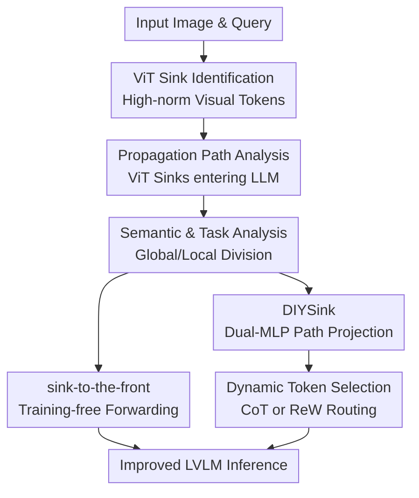

# To Sink or Not to Sink: Visual Information Pathways in Large Vision-Language Models

**Conference**: ICLR2026  
**OpenReview**: [https://openreview.net/forum?id=sQGlhjKUC0](https://openreview.net/forum?id=sQGlhjKUC0)  
**Code**: DIYSink Project page to be released  
**Area**: Multimodal Interpretability / VLM Internal Mechanisms  
**Keywords**: ViT attention sink, LVLM information flow, visual token interpretation, dynamic token selection, DIYSink  

## TL;DR
This paper discovers that ViT sink tokens in Large Vision-Language Models (LVLMs) are not merely noise but propagate into the LLM, carrying coarse-grained high-level visual semantics. It proposes a training-free "sink-to-the-front" strategy and a trainable DIYSink framework to enable models to better utilize sink and non-sink visual information based on task requirements.

## Background & Motivation
**Background**: Mainstream LVLMs typically consist of three parts: a visual encoder, a connector, and a language model. A ViT first partitions an image into patch tokens and encodes them as visual features. Connectors like MLPs, Q-Formers, or Resamplers project these features into the LLM's word embedding space. The LLM then generates responses based on system prompts, visual tokens, and textual queries. Recent interpretability work has focused on "attention sinks," where a small number of tokens receive abnormally high attention or exhibit massive activations.

**Limitations of Prior Work**: In LLMs, attention sinks are sometimes considered beneficial for long-context stability. However, in visual or multimodal models, many studies view visual sinks as background, blank areas, or low-semantic tokens, tending to suppress, mask, or redistribute attention to other tokens. This approach assumes that visual sinks are interference. The issue is that the visual front-end and language back-end of an LVLM are coupled via a connector; whether high-norm tokens within the ViT are truly useless cannot be determined solely by their spatial position in the original image.

**Key Challenge**: If ViT sinks are merely byproducts of the visual encoder, removing or weakening them should be universally beneficial. However, if they are used by the LLM as compressed visual summaries, blanket suppression would result in the loss of global semantics. More critically, the value of global semantics versus local details varies by task: scene understanding and geometric/logical reasoning may require coarse-grained context, whereas counting, localization, and OCR rely more on local patch details.

**Goal**: The authors aim to answer three interconnected questions: First, do sink tokens in the ViT actually propagate to the LLM and form identifiable visual sinks within it? Second, what visual information do these tokens encode? Third, if sinks and non-sinks are biased toward global and local information respectively, how should an LVLM select or weight them during inference?

**Key Insight**: Instead of back-tracing from output errors, the paper utilizes internal evidence—token norms, attention weights, hidden dimension activations, relevance maps, and vocabulary distribution decoding—to distinguish between ViT sinks, propagated ViT sinks within the LLM, and LLM-emerged sinks. The value of this perspective lies in rephrasing "whether sinks are harmful" into a more precise question: "Which kind of sink, in which type of task, acts through which information path."

**Core Idea**: ViT sinks are exploitable high-level visual summaries. LVLMs should not rigidly suppress or retain them but should first separate sink/non-sink visual paths and then dynamically decide whether to use sinks, non-sinks, or a combination based on the input task.

## Method

### Overall Architecture
The workflow of this paper consists of two layers: first, a mechanistic analysis proving that ViT sinks enter the LLM independently of LLM-emerged sinks and carry global visual semantics; second, translating these findings into two adaptation methods—a training-free "sink-to-the-front" strategy and a trainable DIYSink framework that uses dual MLPs and a dynamic selection module to handle sinks and non-sinks separately. Overall, the paper does not just propose a module but uses a chain of "observation → hypothesis → lightweight modification → training framework" to explain why visual information paths need redesigning.

Specifically, the authors first define ViT sinks via token feature norms. Given the token hidden state $x_j^{l-1}$ before layer $l$, a sink token satisfies $\phi(x_j^{l-1}) \ge \tau$, where $\phi$ is the feature norm $\|x_j^{l-1}\|$ for the ViT side. In the main text, the threshold for CLIP-ViT/LLaVA-7B is set to $\tau=100$, typically yielding only 3 to 5 such high-norm tokens per image. Subsequently, the paper calculates the attention these tokens receive from output tokens during the LLM generation phase, finding that higher ViT norms correlate with higher LLM attention.

For interpretability, the authors further distinguish between two types of sinks: LLM-emerged sinks and propagated ViT sinks. They activate different hidden dimensions; for example, in LLaVA-7B, LLM-native sinks primarily associate with dimensions $2533, 1415$, while propagated ViT sinks associate with $982, 2494, 3263$. This indicates that visual sinks do not simply reuse the LLM's linguistic sink mechanism but represent an independent visual information path.

### Key Designs
**1. ViT Sink Propagation Analysis: Repositioning Visual Sinks from "Suspicious Noise" to an LLM-Read Information Path**

The paper first clarifies a confusing point: whether high-norm tokens receiving high attention is merely a phenomenon internal to the visual encoder that becomes irrelevant in the LLM. The authors group ViT tokens into bins by norm and calculate the average attention received by these visual tokens from LLM output tokens. Results show that while most visual tokens have norms below 60, the few tokens exceeding 100 receive approximately 7 times more attention from the LLM than ordinary tokens. This correlation is not architecturally forced, as the connector and LLM are not explicitly told which tokens are ViT sinks; it suggests that the LLM implicitly inherits saliency signals from the visual encoder after multimodal training.

Crucially, rather than grouping all high-attention tokens together, the authors use hidden dimension activations to decouple LLM-emerged sinks and propagated ViT sinks. Their high-activation dimensions differ, and the propagation dimensions for ViT sinks emerge only after multimodal training. This design makes subsequent conclusions more convincing: if one only looked at LLM sink dimensions to find LVLM sinks, linguistic and visual sinks might be conflated, leading to a misjudgment of which path "sink suppression" actually affects.

**2. Semantic Decoding and Task Classification: Sinks provide Global Summaries while Non-sinks Retain Local Details**

To determine what ViT sinks encode, the paper employs two complementary interpretation methods. The first is relevance mapping: taking the vertical column in the attention map corresponding to a target token and reshaping it back into the image patch grid to observe which regions aggregate into that token. Non-sink tokens usually concentrate relevance in local neighborhoods, while sink tokens aggregate information from larger foreground or background regions, acting as coarse-grained context. The second is vocabulary distribution decoding: the authors block attention from other tokens to a specific visual token within the LLM, passing the isolated visual token through the LLM layers and LM head to map it to the vocabulary. For 300 cat and 300 person images, sink tokens map much more frequently to primary object words like "cat" or "person" compared to non-sinks.

This is validated via task classification. Using GPT-4o, the authors labeled 600 image-query pairs for image complexity and query globalness, categorizing them into Global, Local, and Mixed. When only sink tokens are input, the model performs strongly on global tasks; when only non-sinks are input, local tasks are more stable. Thus, sinks are not "good" or "bad" tokens but are biased toward high-level summaries; they provide compressed context for scene or geometric reasoning but may obscure details needed for localization, counting, or OCR.

**3. sink-to-the-front: Leveraging Autoregressive Causal Structure to Amplify High-level Visual Summaries**

When training is not feasible, the paper proposes a simple inference-time strategy: after identifying ViT sinks, move these tokens (along with their position embeddings) to the very front of the visual token sequence before passing them to the connector and LLM. The core assumption relies on the causal attention of autoregressive Transformers: earlier tokens can be repeatedly accessed by all subsequent tokens. Placing sink tokens with global semantics at the front makes them more accessible to subsequent visual tokens, textual queries, and output tokens.

The nuance here is that it requires no parameter changes or task labels, making it suitable for closed-source or hard-to-retrain LVLMs. The authors compare "sink-to-the-front" with "sink-to-the-end" in the appendix, finding that moving them forward is generally superior, suggesting that the influence of causal attention outweighs the recency bias of RoPE. To preserve spatial layout, original position embeddings are moved with the tokens; since sinks are a tiny fraction of visual tokens, the overall spatial structure is not significantly disrupted.

**4. DIYSink: Decoupling Sinks/Non-sinks from a Shared Connector via Dual MLPs and Dynamic Selection**

The DIYSink framework addresses representation interference in shared connectors. Typical LVLMs use a single MLP to project all ViT tokens, but sinks (high-norm, specific dimensions, global summary) and non-sinks (fine local information) have different distributions. Forcing one MLP to adapt to both can dilute their respective semantics. DIYSink employs two connectors: $f_{sink}: \mathbb{R}^{D'} \to \mathbb{R}^{D}$ for $V_{sink}$, and $f_{non\text{-}sink}: \mathbb{R}^{D'} \to \mathbb{R}^{D}$ for $V_{non\text{-}sink}$. During pre-training, each focuses on its token type; during fine-tuning, the outputs are concatenated for the LLM.

At inference, DIYSink decides which path to rely on. Two selection modules are provided: CoT-Reweighting is a hard selection where the model first judges if an image is symbolic/simple vs. real-world/complex, and if the query requires holistic reasoning vs. local understanding. Symbolic images with global reasoning use sink-only paths; complex images with local understanding use non-sink-only; others use both. MLP-Reweighting is a soft selection using a frozen sentence encoder to encode the query as $q \in \mathbb{R}^d$, followed by a lightweight MLP that outputs $[w_{sink}, w_{non\text{-}sink}] = R(q)$. The visual tokens are then weighted and concatenated: $I_{vis}=[w_{sink} f_{sink}(V_{sink}); w_{non\text{-}sink} f_{non\text{-}sink}(V_{non\text{-}sink})]$. Thus, DIYSink implements the conditional utility of sinks into a trainable, routable pathway.

### Example
Suppose the input is a geometry problem screenshot asking "If $\angle 1=50^\circ$, what is $\angle 2$?". After ViT encoding, hundreds of patch tokens are generated. A few high-norm ViT sinks aggregate global structure, such as "This is a geometry angle problem" and "There are intersecting lines and angle labels." Non-sink tokens preserve details like the specific angle labels, line positions, and local text.

With a traditional shared MLP, global summaries from sinks and local symbols from non-sinks might conflict. The LLM is neither informed which tokens are better for reasoning nor protected from local noise. DIYSink first projects them via dual MLPs and then use CoT or ReW to determine that this query requires strong global geometric understanding, thus increasing the sink weight while retaining necessary non-sinks to read labels. The LLM receives visual context organized into "global summary + local details" rather than an undifferentiated sequence.

### Loss & Training
DIYSink training occurs in two stages. First is connector pre-training, where the two MLPs optimize the language modeling objective independently using restricted visual inputs:

$$
\min_{\theta_{f_{sink}}} \mathcal{L}_{LM}(E(I_{sys}, f_{sink}(V_{sink}), I_{txt}, I_{out})),\quad
\min_{\theta_{f_{non\text{-}sink}}} \mathcal{L}_{LM}(E(I_{sys}, f_{non\text{-}sink}(V_{non\text{-}sink}), I_{txt}, I_{out})).
$$

The second stage is standard LVLM fine-tuning, where concatenated outputs are sent to the LLM. For the ReW module, only the lightweight reweighting MLP is trained while other components are frozen to avoid data leakage. Training samples are drawn from PixMo and GeoQA (120 for 0.5B/3B models, 240 for 7B), balanced across Local, Global, and Mixed categories, for 10 epochs with a learning rate of $1e^{-2}$ and a global batch size of 20.

## Key Experimental Results

### Main Results
The training-free "sink-to-the-front" shows the most significant gains on benchmarks requiring global understanding/reasoning like MME and MathVista. Gains on standard LLaVA eval are smaller, consistent with the hypothesis that sinks primarily benefit global semantics.

| Method | LLaVA eval AVG | MME All | MathVista All | Main Change |
|------|----------------|---------|---------------|----------|
| InternVL2.5-4B | 70.99 | 2332.16 | 62.90 | Baseline |
| + Sink-to-the-front | 71.01 | 2351.33 | 63.30 | MME +19.17, MathVista +0.40 |
| Phi-3.5-V | 65.29 | 1887.90 | 43.10 | Baseline |
| + Sink-to-the-front | 65.71 | 1891.27 | 43.50 | LLaVA eval +0.42, MathVista +0.40 |
| Molmo-7B-D | 61.68 | 1821.93 | 49.40 | Baseline |
| + Sink-to-the-front | 61.74 | 1852.21 | 51.20 | MME +30.28, MathVista +1.80 |
| Gemma3-12B-it | 61.26 | 1706.30 | 40.80 | Baseline |
| + Sink-to-the-front | 61.55 | 1740.11 | 41.00 | MME +33.81, MathVista +0.20 |

Trainable DIYSink is more stable across TinyLLaVA and LLaVA variants, particularly benefiting smaller models. In the 3B Phi version, DIYSink(ReW) improves LLaVA eval AVG from 48.55 to 54.34 and MME from 1455.22 to 1682.41. In the Qwen2.5-3B version, both CoT and ReW improve MathVista from 30.40 to approximately 33.

| Model & Method | LLaVA eval AVG | MME All | MathVista All | Note |
|------------|----------------|---------|---------------|------|
| TinyLLaVA-0.5B-SigLIP-Qwen2 baseline | 48.34 | 1381.10 | 24.30 | LLaVA SFT baseline |
| DIYSink (CoT) | 49.04 | 1456.78 | 25.10 | MME +75.68 |
| DIYSink (ReW) | 49.13 | 1451.87 | 25.20 | Lower inference overhead |
| TinyLLaVA-3.1B-SigLIP-Phi2 baseline | 48.55 | 1455.22 | 25.90 | Baseline |
| DIYSink (CoT) | 52.17 | 1523.18 | 26.20 | LLaVA eval +3.62 |
| DIYSink (ReW) | 54.34 | 1682.41 | 27.40 | LLaVA eval +5.79, MME +227.19 |
| LLaVA-7B-CLIP-ViT-Vicuna baseline | 56.55 | 1781.70 | 26.00 | Baseline |
| DIYSink (CoT) | 56.76 | 1797.80 | 26.40 | MME code reasoning +15 |
| DIYSink (ReW) | 56.59 | 1787.00 | 26.60 | Moderate improvement |

### Ablation Study
The Dual-MLP ablation shows that gains do not solely come from the dynamic selection module. Even without CoT/ReW, simply projecting sinks and non-sinks separately improves SQA, MMMU, and MME, supporting the claim that shared connectors conflate these two token types.

| Configuration | SQA | MMMU | MME All | MME Cog. | Note |
|------|-----|------|---------|----------|------|
| TinyLLaVA-0.5B baseline | 57.76 | 30.30 | 1381.10 | 207.14 | Single MLP connector |
| + Dual-MLP | 60.63 | 30.80 | 1439.21 | 208.21 | Gain from path separation alone |
| TinyLLaVA-3B baseline | 68.47 | 33.50 | 1455.22 | 261.79 | Single MLP connector |
| + Dual-MLP | 70.75 | 34.80 | 1679.24 | 262.14 | Significant MME All gain |

The paper also compares different token types on Local vs. Global tasks, illustrating the necessity of dynamic selection. In TinyLLaVA-0.5B, sink-only performs better on MME cognition and MathVista numerical reasoning but drops significantly on local tasks like GQA/TextVQA. Non-sink-only shows the opposite trend.

| Model Config | GQA Local | TextVQA Local | MME Cog. Global | MathVista NUM Global | Note |
|----------|-----------|---------------|-----------------|----------------------|------|
| TinyLLaVA-0.5B baseline | 57.98 | 47.32 | 207.14 | 11.11 | All visual tokens |
| Ours sink-only | 39.53 | 30.10 | 270.71 | 17.36 | High Global/Low Local |
| Ours non-sink-only | 58.07 | 48.28 | 220.00 | 11.11 | Stable Local/Low Global |
| DIYSink (CoT) | 58.14 | 46.14 | 277.50 | 11.81 | Dynamic hard selection |
| DIYSink (ReW) | 57.75 | 47.42 | 229.64 | 14.58 | Dynamic soft weighting |

### Key Findings
- ViT sinks are few but impactful. In LLaVA-7B, a typical non-sink token receives ~0.1532% attention, while an LLM-emerged sink receives 1.27% and a propagated ViT sink receives 1.13%. This indicates that propagated ViT sinks are key tokens the LLM reads during output.
- ViT sinks act as global semantic compressors rather than low-semantic garbage. In linear probing, CLIP sinks reach 0.865 on object class (non-sinks 0.512); SigLIP sinks reach 0.722 on lighting (non-sinks 0.515), aligning with relevance map and vocabulary decoding findings.
- Dynamic selection is essential. Sink-only paths excel in high-level reasoning and efficiency but fail in dense/compositional scenes, localization, or counting. DIYSink avoids a one-size-fits-all approach via CoT or ReW.
- Trainable methods outperform training-free ones at a higher cost. Dual+ReW adds only ~0.01s latency, whereas Dual+CoT increases latency from ~0.09s to ~0.25s due to multiple routing passes; the former suits low-latency scenarios, the latter offers explainable routing.

## Highlights & Insights
- The paper's greatest value is decoupling LVLM attention sinks into distinct sources: ViT native, propagated ViT, and LLM-emerged. This avoids crude arguments about whether sinks are "harmful" or "helpful."
- Semantic interpretation of sink tokens is enlightening. Combining relevance maps, vocabulary decoding, task classification, and linear probing creates a solid evidence chain from internal mechanisms to downstream behavior.
- "sink-to-the-front" acts as a minimal intervention experiment: if moving a few ViT sinks forward improves global reasoning, those tokens are indeed utilized by the model.
- DIYSink design is transferable to other visual token grouping problems (e.g., object/scene/text regions, key/non-key frames).
- The study cautions against pruning tokens solely by attention/norm; high-norm tokens could be noise or vital global summaries depending on the task.

## Limitations & Future Work
- DIYSink requires retraining or additional module training; the dual-MLP needs access to training data and compute. Closed-source models are limited to less effective training-free strategies.
- Sink identification still relies on norm thresholds or adaptive drops. While robust in experiments, thresholds might need calibration across different encoders, layers, or training recipes.
- Dynamic selection relies on a binary assumption of complexity and globalness/localness. Real tasks might simultaneously require fine-grained OCR, localization, and global reasoning.
- The focus is on image-language models; extending this to video or audio where sinks might manage spatial and temporal summaries remains for future work.
- Gains on some models (e.g., DeepSeek-VL) were smaller, attributed to architectural specifics like SAM/SigLIP channel-wise concatenation, but deep architectural attribution is still needed.

## Related Work & Insights
- **vs Visual attention sink suppression methods**: Works like Kang et al. or Huang et al. focus on the negative impact of sinks on hallucinations and advocate for suppression or redistribution. This paper differently views ViT sinks as global semantic carriers to be used selectively.
- **vs Vision Transformers Need Registers**: Darcet et al. use register tokens to absorb high-norm anomalies for cleaner feature maps. This paper monitors these tokens as they enter the LVLM and affect the LLM.
- **vs LLM attention sink research**: Sun et al. discuss massive activations in LLMs for context modeling. This paper extends this to multimodal models and highlights that propagated ViT sinks utilize different hidden dimensions than linguistic sinks.
- **vs Visual token pruning/selection**: Many efficient VLM methods delete low-value tokens. This work suggests a finer criterion: a few sink tokens may be highly efficient for global reasoning but unsuitable for local tasks; selection should thus be query-aware.

## Rating
- Novelty: ⭐⭐⭐⭐⭐ Decoupling sinks into propagated and emerged types and reinterpreting them as information paths is highly novel.
- Experimental Thoroughness: ⭐⭐⭐⭐☆ Extensive coverage of model combinations and ablation studies, though task routing could be more granular.
- Writing Quality: ⭐⭐⭐⭐☆ Clear mechanistic logic and sufficient visualization; some back-and-forth required with the detailed appendix.
- Value: ⭐⭐⭐⭐⭐ Highly insightful for VLM interpretability, token compression, and connector design; the split path concept is widely applicable.

<!-- RELATED:START -->

## Related Papers

- [\[ICLR 2026\] A Comprehensive Information-Decomposition Analysis of Large Vision-Language Models](a_comprehensive_information-decomposition_analysis_of_large_vision-language_mode.md)
- [\[ICLR 2026\] Inducing Dyslexia in Vision Language Models](inducing_dyslexia_in_vision_language_models.md)
- [\[ICLR 2026\] Universal Properties of Activation Sparsity in Modern Large Language Models](universal_properties_of_activation_sparsity_in_modern_large_language_models.md)
- [\[ICLR 2026\] Spilled Energy in Large Language Models](spilled_energy_in_large_language_models.md)
- [\[ICLR 2026\] Concepts' Information Bottleneck Models](concepts_information_bottleneck_models.md)

<!-- RELATED:END -->
