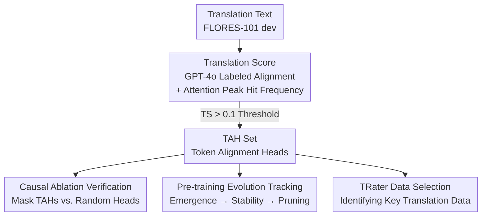

# Token Alignment Heads: Unveiling Attention's Role in LLM Multilingual Translation

**Conference**: ICLR 2026  
**OpenReview**: [https://openreview.net/forum?id=q8fTgw8e5E](https://openreview.net/forum?id=q8fTgw8e5E)  
**Code**: To be confirmed  
**Area**: Interpretability / Mechanistic Interpretability / Multilingual Translation  
**Keywords**: Attention Heads, Mechanistic Interpretability, Multilingual Translation, Word Alignment, Data Selection

## TL;DR
The authors identify a specific class of attention heads in LLMs responsible for mapping source language tokens to target language tokens—token alignment heads (TAHs). They demonstrate that these heads are ubiquitous, highly sparse, cross-linguistically consistent, and play a direct causal role in translation. Based on these insights, they design a data scoring algorithm, TRater, which significantly enhances the model's translation capabilities using a minimal amount of critical data.

## Background & Motivation

**Background**: Modern LLMs exhibit increasingly powerful multilingual capabilities, with translation considered a core mechanism supporting this proficiency. Existing work has begun to deconstruct the internal multilingual processing of LLMs, such as discovering that models tend to convert multilingual inputs into "English-centric" intermediate representations before solving tasks, implying an implicit internal translation process.

**Limitations of Prior Work**: Previous studies on the role of attention heads in translation mostly rank importance based on "how much a translation metric drops after removing a head." This approach has three issues: dependency on task-specific evaluation metrics, typically being limited to single or small models, and lack of transparency in identifying "important heads." Crucially, they often stop at "which heads are important" without answering "what these heads actually do mechanistically."

**Key Challenge**: Importance ranking $\neq$ mechanistic understanding. A head causing a significant performance drop might be doing translation, or it might just happen to participate in general computation. To truly understand translation, research must shift from "downstream performance" to "internal mechanisms"—directly observing whether heads perform cross-lingual token mapping.

**Goal**: (1) Propose a method to identify translation heads that characterizes "cross-lingual alignment behavior" directly without relying on downstream metrics; (2) Systematically verify the ubiquity, sparsity, consistency, causality, and functional specificity of such heads; (3) Trace their formation trajectory throughout the pre-training process; (4) Apply this mechanistic understanding to create a usable data selection tool.

**Key Insight**: Inspired by "functionally specialized circuits" like induction heads (for in-context learning) and retrieval heads (for long-context retrieval), the authors hypothesize that translation must also correspond to a set of specialized heads. These heads do not perform general copy-paste but a specific task: aligning a target token with its corresponding source token—essentially a manifestation of "word alignment" from classical statistical machine translation at the attention level.

**Core Idea**: Use the observable signal of "whether the peak attention of a target token falls on its true source language alignment token" to define the **Translation Score (TS)**. This score is used to identify token alignment heads, followed by causal ablation, evolutionary tracking, and data selection to substantiate their role.

## Method

### Overall Architecture

The work is divided into "Identification → Verification → Application." The **Identification** part (Section 2) is the core algorithm: first, use GPT-4o to perform token-level alignment labeling on translation text to obtain "target token $\leftrightarrow$ source token" gold standard mappings; then, during greedy decoding, check for each target token whether each attention head's peak attention falls on the correct source token, calculating the hit frequency as the Translation Score; finally, heads with a TS above 0.1 are marked as Token Alignment Heads (TAHs). The **Verification** part focuses on the TAH set: characterizing static properties (ubiquity, sparsity, concentration in middle layers, cross-lingual consistency) while establishing causality through causal ablation (masking TAHs vs. random heads) and pre-training evolutionary tracking. The **Application** part reverses this understanding for data: TRater scores multilingual data by measuring the "change in loss for a sample before and after masking TAHs," identifying the critical subset of data for the translation mechanism.

The following diagram illustrates the flow from raw text to TAH identification, verification, and application:

### Key Designs

**1. Translation Score: Defining "Translation Heads" by Cross-lingual Alignment Frequency**

To address the limitations of metric-based ranking, this paper uses a signal that directly characterizes behavior. The first step is obtaining the gold standard alignment: since existing tools have limited language coverage, the authors use GPT-4o to label the corresponding source token for each target token in translation text, keeping only alignments with confidence $> 0.9$. The second step defines the Translation Score: during greedy decoding, let the current generated token be $t$ and an attention head's distribution be $w \in \mathbb{R}^{|x|}$. If $t$ has a gold source token $s$ (at index $s_{idx}$) and the head assigns maximum attention to this source token, i.e., $w_{s_{idx}} = \max(w)$, it counts as a valid cross-lingual alignment. Let $g_h$ be the count of valid alignments for head $h$, and $m$ be the total number of target tokens with a corresponding source token. The score is:

$$\mathrm{TS}_h = \frac{g_h}{m}$$

The third step is detection: TS is calculated per sentence on FLORES-101 dev for a specific language pair and averaged. A head is identified as a TAH if its average TS exceeds 0.1. This definition is independent of evaluation tasks, ensuring detected heads possess clear "word-level cross-lingual alignment" semantics.

**2. Five Properties: Ubiquitous, Sparse, Middle-layer, Cross-lingual Consistency**

After identifying TAHs, the authors characterize them across various models (1.7B–30B, dense/MoE, pre-trained/instruction-tuned). **Ubiquity**: TAHs exist in all examined models regardless of scale or architecture. **Sparsity**: TAHs account for less than 8% of all heads (as low as ~3% in Mistral-7B-v0.3). **Positional Distribution**: TAHs are highly concentrated in the middle layers, with almost none in the first or last few layers—consistent with the view that Transformer "shallow layers extract surface features and deep layers organize output." **Cross-lingual Consistency**: For Llama-3.1-8B, the Jaccard similarity $\mathrm{Sim}_{S,T} = |S \cap T| / |S \cup T|$ between top-20 TAH sets of different language pairs exceeds 0.8 in most cases, indicating that a stable set of heads handles translation across language pairs.

**3. Causal Ablation: Masking TAHs Causes Collapse and Regression to "Copying Source"**

Ablation confirms causality. The authors compare the change in metrics when masking top-K TAHs versus random non-TAH heads on FLORES-101. Masking TAHs leads to a BLEU drop of over 17 points and chrF++ drop of over 25 points, while random masking has negligible effect. More revealing is the failure mode: as shown in Figure 1, after masking the top-30 TAHs of Llama-3.1-8B, the model does not output gibberish but regresses to a basic copy-paste behavior, copying the English source verbatim. This separates the "general copy capacity" from the "specialized cross-lingual mapping capacity."

**4. Pre-training Evolution and TRater: Three-stage Trajectory + Data Selection**

Tracking TAHs in a Llama-2-8B model trained from scratch (15T tokens) reveals three stages: **Rapid Proliferation** (0–8k steps, TAH ratio spikes to ~8%, synchronized with chrF++ rising from 12.58 to 45.77); **Set Stabilization** (10k–64k steps, ratio stabilizes at ~5%, condition overlap $|A \cap B|/|B|$ with the final set $B$ exceeds 0.8); and **Consolidation/Pruning** (64k–952k steps, ratio drops to 2.6% while inactive heads increase to 61.7%). For application, **TRater** marks data based on the loss difference before and after masking top-20 TAHs:

$$\mathrm{score}(x) = \frac{1}{m} \sum_i \big( L(\theta_{\mathrm{mask}}, x_i) - L(\theta, x_i) \big)$$

Higher scores indicate data that relies more on the translation mechanism. Using this to select the top 1.3% of multilingual data demonstrates its decisive role in translation performance.

### Loss & Training
This work focuses on mechanistic analysis and data selection rather than introducing new training losses. Key quantitative tools include the Translation Score $\mathrm{TS}_h$, Jaccard similarity for consistency, condition overlap for evolution, and TRater sample scores based on cross-entropy differences.

## Key Experimental Results

### Main Results

Causal Ablation (FLORES-101, metric change vs. baseline):

| Target | BLEU Change | chrF++ Change | Description |
|----------|-----------|-------------|------|
| Mask top-K TAHs | Max < −17 | Max < −25 | Translation collapses, reverts to copying source |
| Mask random heads | ~ 0 | ~ 0 | Almost no effect |

TRater Data Selection (1.5B model, select metrics from Table 1):

| Setting | FLORES chrF++ | XStoryCloze | Other Multilingual Tasks |
|------|---------------|-------------|----------------|
| baseline | 43.87 | 58.40 | Parity |
| remove (exclude top 1.3%) | 41.33 | 58.15 | Translation drops significantly |
| enhance (3x upsampling) | 46.68 | 58.44 | Translation improves significantly |

### Ablation Study

Cross-task Functional Specificity (Drop in performance when masking TAHs):

| Task Type | Representative Benchmark | TAH Masking Impact | Interpretation |
|----------|----------------|-------------|------|
| Pure Translation | FLORES-101 | Extreme (chrF++ > 25) | Directly relies on cross-lingual mapping |
| With Mapping | Hellaswag-ML / ARC-ML | Significant (up to ~10 pts) | Partially relies on token-level alignment |
| High-level Semantic | XNLI / XCOPA | Minimal (often < random) | Relies on other multilingual mechanisms |

### Key Findings
- **Failure modes are more informative than metric drops**: Masking TAHs leads to verbatim copying of the source, cleanly separating "copying capability" from "cross-lingual mapping."
- **Translation capability acquisition is synchronized with TAH emergence**: The spike in TAH ratio and chrF++ occur during the same early pre-training window.
- **Overproduction then pruning**: TAHs peak at 8% and drop to 2.6%, but the core set remains stable, suggesting the removal of redundant weak heads for efficiency.
- **Translation acts as a separable module**: A tiny fraction of data (1.3%) significantly impacts translation metrics while having little effect on other multilingual tasks.

## Highlights & Insights
- **Defining "Translation Heads" by activity rather than downstream drops**: The Translation Score is task-independent and provides explicit semantic meaning (word-level alignment), utilizing masking only for posterior verification.
- **"Regression to source copying" is a brilliant control**: It proves that the removed capacity is specifically cross-lingual mapping rather than general token handling.
- **Mechanistic understanding informs data engineering**: TRater translates "which heads do translation" into "which data feeds translation," providing a grounded lever for data curation.
- **Evolutionary "overproduction then pruning" trajectory**: Provides a concrete observable example of how specialized circuits emerge and optimize during large-scale training.

## Limitations & Future Work
- The gold standard for alignment relies on GPT-4o labeling, which may introduce biases or inaccuracies despite high confidence filters.
- Heuristic thresholds (0.1, top-20/30) lack systematic sensitivity analysis.
- Translation Score based on attention peaks may not capture complex multi-head coordination or "soft" alignment where the peak is not at the first position but still contributes.
- The gains from TRater (2-3 pts) are smaller than the ablation drops (>10 pts), and its benefits for non-translation multilingual tasks are negligible.

## Related Work & Insights
- **vs. Importance by downstream metrics (Kim et al. 2021 / Zhang et al. 2025)**: This work shifts from ranking by benchmark impact to a task-independent alignment signal, making the functional semantics of "token alignment" explicit.
- **vs. Semantic space studies (Schut et al. 2025 / Zhao et al. 2024)**: While others show "where" multilingual info resides (e.g., language-agnostic space in middle layers), this work identifies the TAHs that actively perform the token-level routing.
- **vs. Induction/Retrieval heads (Olsson et al. 2022 / Wu et al. 2025a)**: Follows the paradigm of "small specialized circuits explaining non-trivial capabilities," adding Token Alignment Heads as a new member.

## Rating
- Novelty: ⭐⭐⭐⭐⭐ 
- Experimental Thoroughness: ⭐⭐⭐⭐⭐ 
- Writing Quality: ⭐⭐⭐⭐ 
- Value: ⭐⭐⭐⭐⭐ 

<!-- RELATED:START -->

## Related Papers

- [\[ICML 2026\] Singular Vectors of Attention Heads Align with Features](../../ICML2026/interpretability/singular_vectors_of_attention_heads_align_with_features.md)
- [\[ICLR 2026\] How Stable is the Next Token? A Geometric View of LLM Prediction Stability](how_stable_is_the_next_token_a_geometric_view_of_llm_prediction_stability.md)
- [\[ICLR 2026\] Emergence of Superposition: Unveiling the Training Dynamics of Chain of Continuous Thought](emergence_of_superposition_unveiling_the_training_dynamics_of_chain_of_continuou.md)
- [\[ICLR 2026\] Decomposing LLM Computation with Jets](decomposing_llm_computation_with_jets.md)
- [\[ICLR 2026\] LLMs Process Lists With General Filter Heads](llms_process_lists_with_general_filter_heads.md)

<!-- RELATED:END -->
