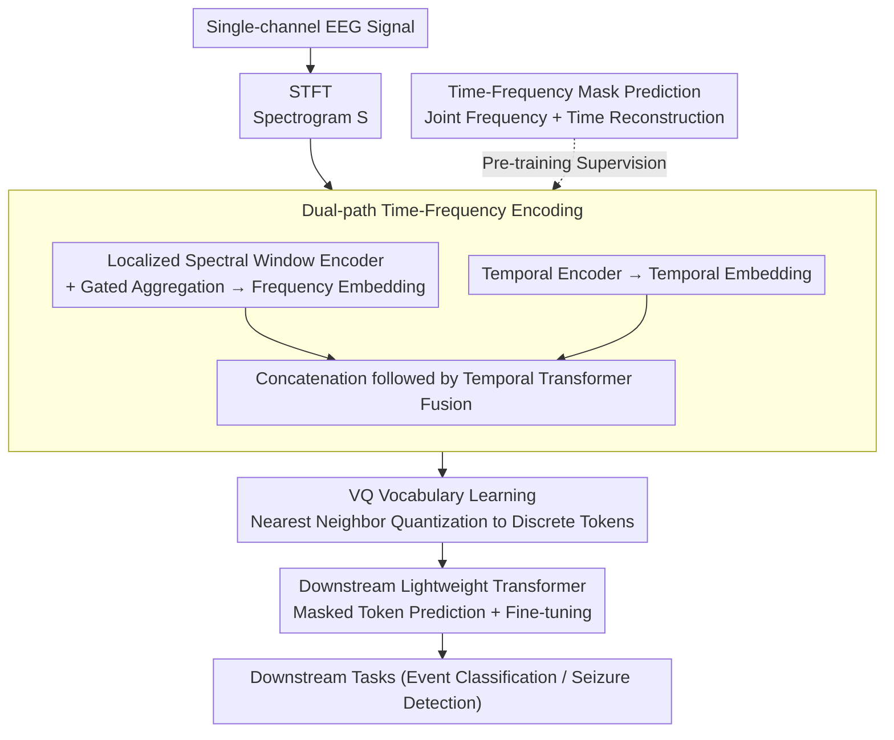

# Tokenizing Single-Channel EEG with Time-Frequency Motif Learning

**Conference**: ICLR 2026  
**arXiv**: [2502.16060](https://arxiv.org/abs/2502.16060)  
**Code**: [https://github.com/Jathurshan0330/TFM-Tokenizer](https://github.com/Jathurshan0330/TFM-Tokenizer)  
**Area**: Interpretability  
**Keywords**: EEG signal analysis, discrete tokenization, time-frequency motif, vector quantization, foundation models

## TL;DR

Ours proposes TFM-Tokenizer, the first framework to learn a time-frequency motif vocabulary from single-channel EEG and encode it into discrete tokens. It consistently improves performance on tasks such as event classification and seizure detection and serves as a plug-and-play component to enhance existing EEG foundation models.

## Background & Motivation

- **EEG Foundation Model Surge**: Inspired by NLP, EEG analysis is shifting toward a task-agnostic foundation model paradigm.
- **Lack of Tokenization**: Tokenization is central to NLP, but existing EEG foundation models merely segment continuous signals into short-time windows, lacking data-driven vocabulary learning.
    - Although LaBraM proposed a neural tokenizer, it serves only as a training objective rather than an actual input and is discarded during downstream inference.
- **Three Challenges**:
  1. **Tokenization Granularity**: Operation at the single-channel level is required to achieve device independence.
  2. **Token Resolution**: The need to represent underlying motifs (short-term repetitive patterns) rather than simple temporal segments.
  3. **Learning Objective**: Explicit fusion of time-frequency information is necessary, as the time domain alone fails to capture critical frequency patterns.

## Method

### Overall Architecture

TFM-Tokenizer addresses the issue where existing EEG foundation models mechanically cut continuous signals into short windows without learning a true "vocabulary" as in NLP. It adopts a two-stage design: first, it learns a time-frequency motif vocabulary unsupervised on single-channel EEG, encoding each time slice into a discrete token; then, the resulting token sequence is fed into a lightweight Transformer for masked token prediction pre-training and downstream fine-tuning. The entire tokenizer operates at a single-channel granularity, thus removing dependence on specific electrode layouts and devices. Specifically, the single-channel signal is first processed via Short-Time Fourier Transform (STFT) to obtain a spectrogram, encoded and fused through dual frequency and time paths, and then mapped onto a discrete codebook via vector quantization. The vocabulary itself is trained using joint frequency-time mask prediction. Finally, the obtained tokens are passed to a downstream linear-attention Transformer for cross-channel modeling and recognition.

### Key Designs

**1. Dual-path Time-Frequency Encoding: Enabling Tokens to Perceive Frequency Structure and Temporal Dynamics**

Simply segmenting windows in the time domain loses critical frequency patterns in EEG. Therefore, TFM-Tokenizer extracts frequency and time information through separate paths before fusion. The frequency side is handled by a **Localized Spectral Window Encoder**: the spectrogram is sliced into $P$ non-overlapping patches along the frequency axis. Each patch is independently projected as $e_{(i,p)} = \text{GroupNorm}(\text{GeLU}(\mathbf{W}_p \mathbf{S}_{(i,p)}))$, followed by a frequency Transformer to model cross-band dependencies. Since different tasks focus on different bands, it further utilizes sigmoid gated patchwise aggregation to selectively amplify task-relevant frequency patches and suppress others:

$$\mathbf{E}_i^F = \text{Concat}\left[\sigma(\mathbf{W}_{g1} \mathbf{e}_{(i,p)}) \mathbf{W}_{g2} \mathbf{e}_{(i,p)}\right]$$

The time side uses a **Temporal Encoder** to directly perform linear projection, GELU, and GroupNorm on raw EEG patches, obtaining temporal embeddings $\mathbf{E}_i^T$ carrying raw time-domain context. Finally, $\mathbf{E}_i^F$ and $\mathbf{E}_i^T$ are concatenated and fed into a **Temporal Transformer** to model long-range dependencies between windows, resulting in a fused representation carrying both frequency structure and temporal dynamics. This is key to tokens "seeing" joint time-frequency motifs rather than simple time segments.

**2. VQ Vocabulary Learning: Discretizing Continuous Representations into Reusable Motif Codebooks**

To obtain a true "vocabulary" similar to NLP, fused embeddings must be quantized into a finite set of discrete units. TFM-Tokenizer leverages Vector Quantization (VQ-VAE) to map each fused embedding $\mathbf{z}_i$ to the nearest codeword in a codebook $\mathcal{V}=\{\mathbf{v}_1,\dots,\mathbf{v}_K\}$ (where $K$ is the codebook size, set to 8192 to align with LaBraM):

$$q(\mathbf{z}_i) = \arg\min_{\mathbf{v}_k \in \mathcal{V}} \|\mathbf{z}_i - \mathbf{v}_k\|_2^2$$

Thus, each time slice is mapped to a discrete token. Each codeword in the codebook corresponds to a category of recurring time-frequency motifs, which can be directly reused as input symbols by downstream models—distinguishing it from LaBraM's approach of using the tokenizer only as a training target.

**3. Time-Frequency Mask Prediction: Forcing Discriminative Tokens via Joint Masking**

To ensure the vocabulary learns actual structures rather than trivial templates, the tokenizer's pre-training employs joint frequency-time masking: grouped random masking on the frequency axis (frequency band masking) and random masking on the time axis, with symmetric masking used for data augmentation. The model must reconstruct the spectrogram at masked locations. The total loss combines the reconstruction term with two VQ codebook update terms:

$$\mathcal{L}_{\text{token}} = \sum_{(f,t)} \|\mathbf{S}(f,t) - \hat{\mathbf{S}}(f,t)\|_2^2 + \alpha \sum_i \|\text{sg}[E_i] - v_i\|_2^2 + \beta \sum_i \|E_i - \text{sg}[v_i]\|_2^2$$

The first term is the spectrogram reconstruction error at masks, and the latter two are the codebook update term and commitment loss ($\text{sg}[\cdot]$ denotes stop-gradient, used with Exponential Moving Average to stabilize the codebook), weighted by $\alpha$ and $\beta$. Ablations show that frequency band masking yields approximately an 8% improvement in Cohen's Kappa compared to purely random masking, indicating that joint masking forces more discriminative tokens. Given the non-stationary and chaotic nature of EEG, positional encodings are intentionally omitted within the tokenizer to avoid imposing unreliable absolute timing on tokens.

**4. Downstream Lightweight Transformer: Driving Task Models Directly with Discrete Tokens**

Unlike methods that discard the tokenizer after training, the learned tokens are actively utilized here. The downstream model initializes a token embedding lookup table using the VQ codebook, with a backbone consisting of a linear-attention Transformer of approximately 0.7M parameters. For multi-channel recordings, the tokenizer first generates token sequences for each channel independently. Channel-wise token embeddings are flattened and augmented with channel and positional embeddings, preceded by a class token. Masked token prediction (similar to masked language modeling with random masks across channels and time) is used for pre-training, followed by fine-tuning on specific tasks. This enables end-to-end recognition with minimal parameters while being more robust to channel loss or noise common in real EEG.

## Key Experimental Results

### Main Results: TUEV Event Classification

| Model | Parameters | Cohen's Kappa (Single Dataset) | Cohen's Kappa (Multi-Dataset) |
|------|--------|------------------------|------------------------|
| SPaRCNet | 0.79M | 0.4233 | - |
| BIOT | 3.2M | 0.4482 | - |
| BIOT⋆ | 3.2M | 0.4890 | - |
| LaBraM⋆ | ~6M | - | 0.5588 |
| **TFM-Tokenizer** | **~0.7M** | **~0.53** | **0.6189 (+11%)** |

### IIIC Seizure Classification

| Model | Cohen's Kappa (Multi-Dataset) |
|------|------------------------|
| LaBraM | 0.3658 |
| CBraMod | 0.4792 |
| **TFM-Tokenizer** | **0.4979 (+36% vs LaBraM)** |

### Cross-device Scalability: Ear-EEG Sleep Staging

| Setting | TFM-Tokenizer vs Baseline |
|------|---------------------|
| Ear-EEG (Non-standard 10-20 system) | **+14%** |

### Integration with Existing Foundation Models

| Foundation Model | Original | + TFM-Tokenizer |
|----------|------|----------------|
| BIOT | baseline | **+~4% (TUEV)** |
| LaBraM | baseline | **+~4% (TUEV)** |

## Key Findings

- TFM-Tokenizer achieves optimal performance with 3× fewer parameters than LaBraM and 1.5× fewer than BIOT.
- As a plug-and-play component, it consistently improves existing foundation models like BIOT and LaBraM.
- Cross-device experiments (Ear-EEG) demonstrate that single-channel tokenization possess excellent device independence.
- Token analysis shows that learned tokens are class-discriminative, frequency-aware, and consistent.
- The gated aggregation mechanism effectively focuses on task-relevant frequency bands.

## Highlights & Insights

- **First True EEG Tokenization**: Learns a discrete motif vocabulary used directly as downstream model input, rather than just a training target.
- **Device-Agnostic Design**: Single-channel operation allows the tokenizer to adapt to any channel configuration and device.
- **Extremely Lightweight**: A downstream Transformer with only ~0.7M parameters reaches SOTA.
- **Interpretability**: Discrete tokens correspond to specific neurophysiological events, supporting timestamp-level retrieval.

## Limitations & Future Work

- The VQ codebook size $K$ requires pre-setting and may need adjustment for different EEG types.
- Currently validated only on classification tasks; generative tasks (e.g., EEG reconstruction, cross-modal translation) remain unexplored.
- The frequency patch size and frequency division strategy for gated aggregation may need adjustment for different sampling rates.
- The scale of multi-dataset pre-training is still significantly smaller than NLP corpora; the upper potential of the tokenizer is not yet fully exploited.
- The Ear-EEG experiment included only 10 subjects, representing a limited sample size.

## Related Work & Insights

- **EEG Foundation Models**: BIOT (segment-level continuous tokenization), LaBraM (VQ tokenizer used only as an objective), BRANT, MMM.
- **VQ Tokenizer**: Applications of VQ-VAE in images (VQGAN) and EEG (LaBraM).
- **EEG Motif Learning**: Only a few works (Schäfer & Leser 2022) focus on time-domain motifs; joint time-frequency motifs are a novelty.
- **Signal Tokenization**: Applying design philosophies from NLP tokenization (BPE/WordPiece) to continuous signals.

## Rating

| Dimension | Score |
|------|------|
| Novelty | ★★★★★ |
| Theoretical Depth | ★★★☆☆ |
| Experimental Thoroughness | ★★★★☆ |
| Value | ★★★★☆ |
| Writing Quality | ★★★★☆ |

<!-- RELATED:START -->

## Related Papers

- [\[ICLR 2026\] Frequency Bands in RoPE: Base Frequency and Context Length Shape the Interpolation–Extrapolation Trade-off](frequency_bands_in_rope_base_frequency_and_context_length_shape_the_interpolatio.md)
- [\[ICLR 2026\] Probing Rotary Position Embeddings through Frequency Entropy](probing_rotary_position_embeddings_through_frequency_entropy.md)
- [\[ICLR 2026\] LLMs are Single-threaded Reasoners: Demystifying the Working Mechanism of Soft Thinking](llms_are_single-threaded_reasoners_demystifying_the_working_mechanism_of_soft_th.md)
- [\[ICML 2026\] Universal 1/3 Time Scaling in Learning Spiked Distributions](../../ICML2026/interpretability/universal_one-third_time_scaling_in_learning_peaked_distributions.md)
- [\[NeurIPS 2025\] FastDINOv2: Frequency Based Curriculum Learning Improves Robustness and Training Speed](../../NeurIPS2025/interpretability/fastdinov2_frequency_based_curriculum_learning_improves_robustness_and_training_.md)

<!-- RELATED:END -->
