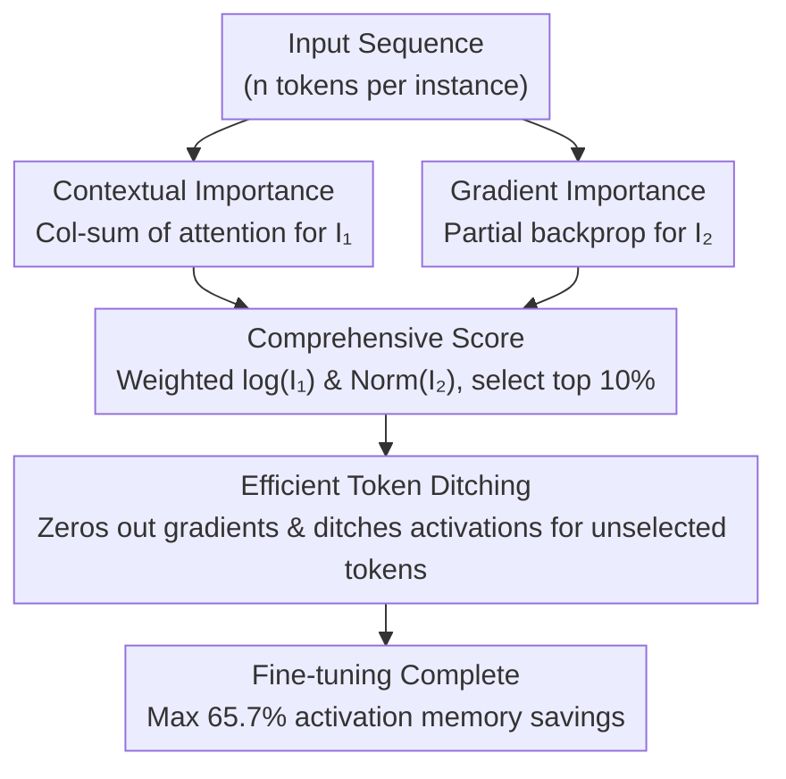

# TokenSeek: Memory Efficient Fine Tuning via Instance-Aware Token Ditching

**Conference**: ICLR 2026  
**arXiv**: [2601.19739](https://arxiv.org/abs/2601.19739)  
**Code**: [https://runjia.tech/iclr_tokenseek (Project Page)](https://runjia.tech/iclr_tokenseek（项目主页）)  
**Area**: Interpretability  
**Keywords**: Memory-Efficient Fine-Tuning, Token Pruning, Instance-Aware, Activation Memory Optimization, PEFT Compatibility

## TL;DR
TokenSeek is proposed as a universal memory optimization plugin for Transformer fine-tuning. By combining contextual attention information and gradient signals for instance-level token importance evaluation, it retains only 10% of high-value tokens for gradient updates. This achieves up to 65.7% memory savings while maintaining or even exceeding the performance of full-token fine-tuning.

## Background & Motivation
LLM fine-tuning faces severe memory bottlenecks. Training memory consists of three parts: (I) model parameters, (II) gradients and optimizer states, and (III) activations. Activations are the primary bottleneck—in Llama3 8B, activations account for 87% of memory; for GPT-2 1.5B, activations reach 60GB.

Existing optimization methods follow three routes:
- **PEFT** (e.g., LoRA): Reduces trainable parameters (I), but activation memory still accounts for 75%+.
- **Optimizer Efficiency** (e.g., ZeRO): Optimizes gradients and optimizer states (II).
- **MEFT (Memory-Efficient Fine-Tuning)**: Directly targets activation memory (III) via recomputation, compression, and reversible networks.

**Limitations of Prior Work**: Existing MEFT methods are often **data-agnostic**, applying a uniform strategy to all training samples and ignoring information density differences between tokens across instances. For example, TokenTune selects tokens for gradient ditching randomly, leading to unstable performance.

**Key Challenge**: How to identify truly important tokens at an instance level and efficiently save activations for them only? This requires solving two sub-problems: (1) How to evaluate individual token importance; (2) How to leverage importance evaluation to save memory efficiently.

## Method

### Overall Architecture
TokenSeek decomposes "activation memory saving" into two stages: "token selection" and "gradient ditching." First, it generates an importance score (comprehensive score) for tokens in each instance using both contextual and gradient paths. Approximately the top 10% of tokens are selected. During backpropagation, gradients are only calculated for these tokens, meaning activations for the rest do not need to be cached. This **instance-aware** strategy is tailored for each sample rather than using a fixed template.

### Key Designs

**1. Contextual Importance: Measuring token "necessity" via attention**

The first signal comes from the attention mechanism. For a sequence of length $n$, the attention matrix is summed column-wise to obtain the contextual score $I_1(t_j) = \sum_{i=1}^{n} \mathbf{A}_{ij}$. This represents the total weight assigned to token $t_j$ by all other tokens in the sequence. Tokens that are frequently queried are considered to carry critical information. However, pure attention scores exhibit an "attention sink" effect where early tokens have artificially high scores, following a long-tail distribution. This informs the need for the log transformation used later.

**2. Gradient Importance: Capturing signals missed by attention**

Relying solely on attention might miss tokens that are "rarely attended but critical for learning." The second signal is derived from the gradient of the activations before the last layer, defined as $I_2(t_j) = \sum_{k=1}^{d} \mathbf{G}_{jk}$, where $\mathbf{G} = \partial \mathcal{L} / \partial z^{(L-1)}$. This directly measures each token's influence on the loss function. This serves as a complementary metric to attention (as Jain & Wallace 2019 noted, attention weights and gradient importance are often uncorrelated): contextual scores favor the beginning of sequences, while gradient scores favor the response sections. This signal is computationally cheap, obtained by freezing all layers except the output head and the last decoder block for a partial backpropagation pass.

**3. Comprehensive Score: Linear fusion after scale alignment**

Given different scales and distributions, the two signals cannot be added directly. The comprehensive score is $I(t_j) = \alpha \log[I_1(t_j)] + \beta \,\text{Norm}[I_2(t_j)]$. A log transform suppresses the long-tail in contextual scores, while min-max normalization aligns the gradient scores. The default is $\alpha = \beta = 1$; ablation studies indicate high stability across a wide range of weights, suggesting low sensitivity to these hyperparameters.

**4. Efficient Token Ditching: Translating "ditching" to memory savings**

The actual memory saving occurs during backpropagation. For unselected tokens $\bar{t}$, the derivative of the activation is set to zero: $\sigma'(a_{\bar{t}}^{(l)}) = 0$. Since these tokens no longer participate in backpropagation, their intermediate activations $a_{\bar{t}}^{(l)}$ do not need to be cached during the forward pass. By retaining only 10% of tokens, activation memory can theoretically drop to approximately 10%, leading to the overall 65.7% reduction in total training memory.

### Loss & Training
TokenSeek is an architecture-agnostic plugin that can be overlaid on PEFT methods like LoRA, LoHa, or QLoRA without modification. Token importance is evaluated and selected independently for each batch, ensuring the sparsification strategy is instance-aware rather than a fixed template applied to all data.

## Key Experimental Results

### Main Results (Few-shot Evaluation, Open-Platypus Fine-Tuning)

| Method | Setting | Ave. Mem. | ARC | HellaSwag | MMLU | TruthfulQA | WinoGrande | Avg |
|---|---|---|---|---|---|---|---|---|
| Full Token Tuning (Llama3.2 1B) | 100% | 100% | 23.72 | 26.11 | 57.53 | 48.68 | 48.07 | 40.82 |
| + TokenTune (Random 10%) | 64.6% | - | 24.32 | 25.80 | 58.14 | 47.90 | 47.59 | 40.75 |
| + **TokenSeek (10%)** | **64.6%** | - | 23.98 | 25.73 | 58.14 | 48.09 | 49.72 | **41.13** |
| QLoRA (Llama3.2 1B) | 45.6% | - | 38.82 | 65.26 | 56.39 | 38.85 | 61.33 | 52.13 |
| + TokenTune (Random 10%) | 14.8% | - | 39.33 | 62.97 | 41.76 | 41.36 | 60.69 | 49.22 |
| + **TokenSeek (10%)** | **14.8%** | - | 39.08 | 65.98 | 58.03 | 38.65 | 61.33 | **52.61** |

TokenSeek + QLoRA uses only 14.8% memory (2.8 GB) yet outperforms full-token tuning (52.61 vs 40.82) and standard QLoRA (52.61 vs 52.13).

### Ablation Study (Weight Sensitivity + Token Ratio)

| Setting | MMLU | ARC | HellaSwag | TruthfulQA | WinoGrande | Avg |
|---|---|---|---|---|---|---|
| α=1, β=0 (Context Only) | 57.52 | 34.56 | 50.09 | 41.51 | 58.56 | 48.45 |
| α=0, β=1 (Gradient Only) | 57.62 | 30.72 | 44.20 | 43.98 | 55.41 | 46.39 |
| α=5, β=5 (Balanced) | 58.49 | 35.15 | 50.20 | 41.48 | 57.93 | 48.65 |
| α=7, β=3 | 58.59 | 35.58 | 50.10 | 41.13 | 57.22 | 48.53 |

Token ratio ablation (Llama3.2 1B + QLoRA): 10%→52.61, 20%→51.80, 30%→52.75, 40%→52.66, 50%→52.26, 100%→40.82. The 10% ratio reaches the optimal performance zone with only 14.8% memory.

### Key Findings
- **Complementarity**: Context info favors early tokens (attention sinks), while gradients favor later tokens (response part). The combination is more holistic.
- **PEFT Synergy**: TokenSeek performs better in PEFT scenarios. While full-parameter tuning might overfit, the regularization effect of PEFT synergizes with token sparsification.
- **Stability**: Random selection (TokenTune) has high variance and can cause performance collapse; instance-aware selection significantly improves stability.
- **Generalization**: Effective across Qwen 0.5B, Llama 1B, and Llama 3B, though smaller models are more sensitive.

## Highlights & Insights
- **Extreme Memory Compression**: Fine-tuning Llama3.2 1B with only 2.8 GB (QLoRA + TokenSeek) makes it possible to tune 3B models on consumer GPUs (e.g., RTX 4090 24GB).
- **Synergy**: The combination of PEFT and TokenSeek proves superior to either method alone, as the low-rank constraints of PEFT provide regularization that prevents overfitting in sparse token scenarios.
- **Stability**: The advantage of instance-aware strategies over stochastic methods is particularly evident in reduced variance.
- **Interpretability**: Clear visualization of phenomena like attention sinks and gradient concentration in responses.
- **Generality**: The architecture-agnostic design allows it to stack with various PEFT methods as a true plugin.

## Limitations & Future Work
- Evaluation of token importance requires an extra forward pass and partial backward pass, introducing computational overhead.
- Performance degradation is observed in extremely small models (e.g., Qwen 0.5B used alone), where limited representation capacity may lead to inaccurate token selection.
- Validated only in instruction tuning; effects on other paradigms like continual pretraining remain unexplored.
- The 10% ratio is fixed; adaptive ratio adjustment per sample could be beneficial.
- Lacks comprehensive comparison with other recent MEFT methods like reversible networks or hybrid-precision training.

## Related Work & Insights
- **TokenTune (Simoulin et al., 2024)**: TokenSeek provides a direct improvement by replacing random selection with importance-based selection.
- **Gradient Checkpointing**: These are complementary; checkpointing reduces recomputation overhead, while TokenSeek reduces the number of tokens needing to be cached.
- **Inference Extension**: If certain tokens contribute nothing to learning during fine-tuning, could these tokens also be skipped during inference?
- **Data Distillation**: Token importance evaluation may have applications in data distillation and curriculum learning.

## Rating
- **Novelty**: ⭐⭐⭐⭐ Combining instance-aware selection with both gradient and attention signals is creative, though the concept of token ditching is established.
- **Experimental Thoroughness**: ⭐⭐⭐⭐ Strong multi-model and multi-PEFT combinations + ablation + visualization, but requires validation across more task types.
- **Writing Quality**: ⭐⭐⭐⭐ Clear structure and rich visualization, though slightly long.
- **Value**: ⭐⭐⭐⭐⭐ Fine-tuning 1B models with 2.8GB of memory has significant engineering value; the plugin design is highly practical.

<!-- RELATED:START -->

## Related Papers

- [\[AAAI 2026\] GateRA: Token-Aware Modulation for Parameter-Efficient Fine-Tuning](../../AAAI2026/interpretability/gatera_token-aware_modulation_for_parameter-efficient_fine-tuning.md)
- [\[ICLR 2026\] Comparing the learning dynamics of in-context learning and fine-tuning in language models](comparing_the_learning_dynamics_of_in-context_learning_and_fine-tuning_in_langua.md)
- [\[ICLR 2026\] Temporal Superposition and Feature Geometry of RNNs under Memory Demands](temporal_superposition_and_feature_geometry_of_rnns_under_memory_demands.md)
- [\[ICLR 2026\] Exploring Interpretability for Visual Prompt Tuning with Cross-layer Concepts](exploring_interpretability_for_visual_prompt_tuning_with_cross-layer_concepts.md)
- [\[ICLR 2026\] Bridging Explainability and Embeddings: BEE Aware of Spuriousness](bridging_explainability_and_embeddings_bee_aware_of_spuriousness.md)

<!-- RELATED:END -->
