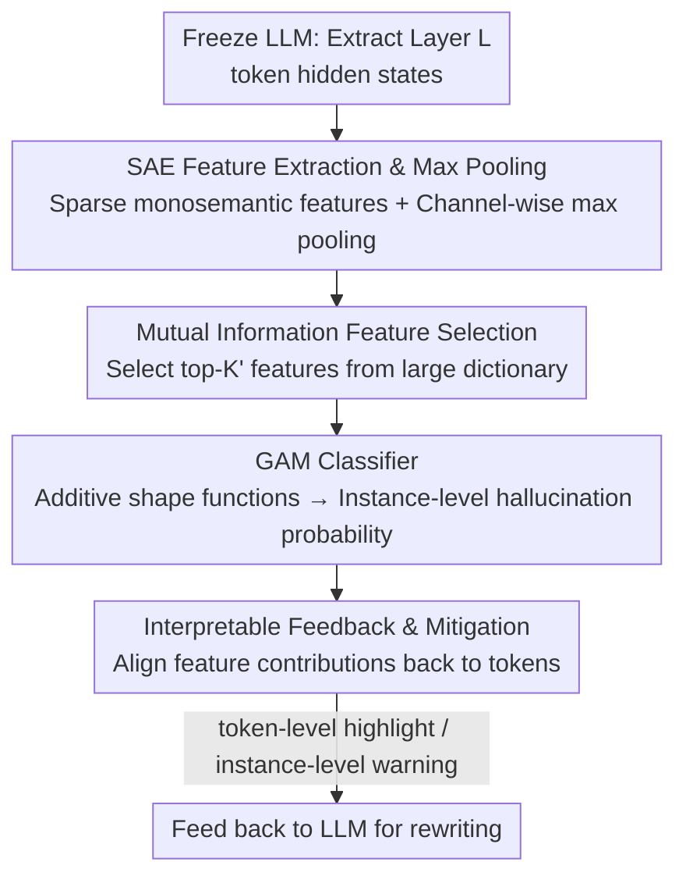

# Toward Faithful Retrieval-Augmented Generation with Sparse Autoencoders

**Conference**: ICLR 2026  
**arXiv**: [2512.08892](https://arxiv.org/abs/2512.08892)  
**Code**: [GitHub](https://github.com/Teddy-XiongGZ/RAGLens)  
**Area**: RAG/Explainable AI  
**Keywords**: Retrieval-Augmented Generation, Sparse Autoencoders, Hallucination Detection, Interpretability, Faithfulness

## TL;DR

RAGLens is proposed, which utilizes Sparse Autoencoders (SAE) to decouple RAG hallucination-specific features from internal LLM activations. By employing mutual information feature selection and a Generalized Additive Model (GAM), a lightweight interpretable hallucination detector is constructed. It outperforms existing methods across multiple benchmarks and supports token-level interpretable feedback and hallucination mitigation.

## Background & Motivation

**Core Problem of RAG**: Retrieval-Augmented Generation (RAG) enhances LLM factuality via external retrieved documents, yet models still produce hallucinated outputs that contradict retrieved content, fabricate details, or exceed the scope of evidence. Such unfaithful generation severely limits deployment in high-reliability domains like healthcare and law.

**Limitations of Prior Work**:
   - **Training Specialized Detectors**: Requires large-scale high-quality annotated data, leading to high adaptation costs.
   - **LLM-as-Judge**: Uses external LLMs to judge faithfulness, but suffers from high computational overhead, difficulty in detecting self-generated hallucinations, and explanations that are unfaithful to internal decision processes.
   - **Internal Representation Probing**: Utilizes hidden states or attention scores to capture hallucination signals, but the polysemanticity of neurons makes signal extraction difficult, resulting in insufficient detection accuracy.

**Key Insight**: SAEs in the field of mechanistic interpretability can separate monosemantic features from LLM hidden states—where each feature corresponds to a specific semantic concept. Do specific SAE features activate exclusively during RAG hallucinations? If so, can they be used to build detectors that are both accurate and interpretable?

**Key Challenge (RAG Hallucination vs. General Hallucination)**: While prior work has used SAEs to detect general LLM hallucinations, the RAG scenario involves complex interactions between retrieved evidence and generated content. Hallucination patterns are more unique here, and it remains unclear whether SAE features can capture such dynamics.

## Method

### Overall Architecture

RAGLens decomposes hallucination detection into a two-stage "probe + classifier" pipeline: first, the target LLM is frozen, and a pre-trained Sparse Autoencoder (SAE) is used to translate hidden states of a specific intermediate layer into monosemantic features. Then, instance-level pooling and mutual information selection are performed on these features, which are finally fed into a Generalized Additive Model (GAM) to output hallucination probability. This workflow does not fine-tune the LLM or call external judge models. Because of the additive structure of GAM, the contribution of each feature can be directly read—enabling both instance-level judgment and alignment of contributions back to specific tokens to highlight suspicious segments, making detection results naturally interpretable and useful for mitigation.

### Key Designs

**1. SAE Feature Extraction and Max Pooling: Decomposing polysemantic neurons into monosemantic signals and amplifying sparse activations**

The root cause of difficult hallucination signal extraction is the polysemanticity of neurons in hidden states—one dimension simultaneously encodes multiple unrelated concepts. For each token $y_t$ generated by the LLM, RAGLens takes the $L$-th layer hidden state $h_t = \Phi_L(y_{1:t}, q, \mathcal{C})$ and maps it to sparse features $z_t = \mathcal{E}(h_t),\ z_t \in \mathbb{R}^K$ via an SAE encoder. The dictionary dimension $K$ is much larger than the hidden dimension, and only a few features are activated at each position, decoupling entangled concepts into features with clear semantics. Since hallucination labels are instance-level, the authors perform channel-wise max pooling across the token dimension $\bar{z}_k = \max_{1 \leq t \leq T} z_{t,k}$. As stated in Theorem 1: under sparse activation conditions $Tp \ll 1$, the mutual information between the pooled feature and the label grows linearly with sequence length $T$, effectively aggregating weak hallucination signals scattered across long sequences while suppressing noise. The layer selection was determined via scanning—across Llama3.2-1B, Llama3-8B, Qwen3-0.6B, and Qwen3-4B, detection performance for Summary and QA tasks peaked at intermediate layers, indicating insufficient information in shallow layers and subsequent transformations overwriting information in deep layers. Pre-activation features were also found to consistently outperform post-activation features.

**2. Mutual Information Feature Selection: Selecting the few features that truly distinguish hallucinations**

SAE dictionaries often contain tens of thousands of dimensions, most of which are irrelevant to faithfulness. RAGLens estimates the mutual information $I(\bar{z}_k; \ell)$ between each pooled feature $\bar{z}_k$ and the hallucination label $\ell$ using a binning method. Only the top-$K'$ features ($K' \ll K$) are retained, resulting in a low-dimensional sub-vector $\tilde{\bar{z}} \in \mathbb{R}^K$. Mutual information does not rely on linearity assumptions and can select features with arbitrary non-linear relationships to the label. This step reduces dimensionality to an interpretable scale and filters out uninformative dimensions for the additive model.

**3. GAM Classifier: Balancing accuracy and transparency with additive structures**

Hallucination detection requires both accuracy and interpretability, which usually involve a trade-off. RAGLens models the probability using a Generalized Additive Model: $g(\mathbb{E}[\ell \mid \tilde{\bar{z}}]) = \beta_0 + \sum_{j=1}^{K'} f_j(\tilde{\bar{z}}_j)$, where each univariate shape function $f_j$ is fitted using bagged gradient boosting. GAM is chosen over linear or fully connected models because the mapping from a single SAE feature to hallucination risk is non-linear (e.g., probability rising monotonically with activation strength), allowing GAM to outperform logistic regression. Since SAE features are approximately independent, GAM achieves performance comparable to or exceeding MLP and XGBoost without needing interaction terms. The additional benefit is interpretability—predictions are the sum of feature contributions, requiring no post-hoc attribution.

**4. Interpretable Feedback & Hallucination Mitigation: Mapping detection signals to tokens**

Instance-level "hallucination vs. not" judgments offer limited help for correction. Leveraging the additive decomposition of GAM, RAGLens aligns the contribution of each feature back to token positions to generate token-level feedback, accurately flagging unreliable segments (fabricated numbers, dates, entities). Each SAE feature corresponds to stable semantics (e.g., Feature 22790 corresponds to "numerical/temporal details unsupported by context"; Feature 17721 corresponds to "high-salience tokens supported by evidence"). These results are fed back to the LLM as instance-level warnings or token-level highlights to guide rewriting; experiments show that token-level feedback is more effective at reducing hallucination rates than instance-level warnings.

## Main Results

### Experimental Setup

- **Datasets**: RAGTruth (Summarization/QA/Data-to-Text), Dolly (Accurate Context), AggreFact, TofuEval
- **Models**: Llama2-7B/13B, Llama3.2-1B, Llama3.1-8B, Qwen3-0.6B/4B
- **Metrics**: Balanced Accuracy (Acc), Macro F1, AUC
- **Baselines**: 16 methods including Prompt, LLM-as-Judge (ChainPoll/RAGAS/TruLens/RefCheck), uncertainty methods (SelfCheckGPT/Perplexity/EigenScore), and internal representation methods (SEP/SAPLMA/ITI/Focus/ReDeEP).

### Main Results: Detection Performance (RAGTruth & Dolly)

| Method | RAGTruth-7B AUC | RAGTruth-7B F1 | Dolly-7B AUC | Dolly-7B F1 | RAGTruth-13B AUC | Dolly-13B AUC |
|------|----------------|----------------|-------------|-------------|-------------------|---------------|
| ChainPoll | 0.6738 | 0.7006 | 0.6593 | 0.5581 | 0.7414 | 0.7070 |
| RAGAS | 0.7290 | 0.6667 | 0.6648 | 0.6392 | 0.7541 | 0.6412 |
| ReDeEP | 0.7458 | 0.7190 | 0.7949 | 0.7833 | 0.8244 | 0.8420 |
| **Ours (RAGLens)** | **0.8413** | **0.7636** | **0.8764** | **0.8070** | **0.8964** | **0.8568** |

RAGLens outperforms all baselines across all settings, with AUC $\geq 0.84$ in all scenarios.

### Cross-Dataset/Task Generalization (AUC)

| Training → Test | RAGTruth | AggreFact | TofuEval |
|----------------|----------|-----------|----------|
| None (CoT) | 0.4842 | 0.5741 | 0.5562 |
| RAGTruth | **0.8806** | **0.8019** | **0.7637** |
| AggreFact | 0.5330 | 0.8330 | 0.6123 |
| TofuEval | 0.7747 | 0.6161 | 0.7846 |

Detectors trained on high-diversity datasets (RAGTruth) exhibit significantly better generalization than those trained on single-task datasets.

### Hallucination Mitigation Results

| Evaluator | Original Hallucination Rate | + Instance Feedback | + Token Feedback |
|---------|-----------|-----------|------------|
| Llama3.3-70B | 43.78% | 42.22% | 39.11% |
| GPT-4o | 37.78% | 36.44% | 34.22% |
| GPT-o3 | 64.44% | 60.44% | 58.88% |
| Human Label | 71.11% | 62.22% | **55.56%** |

Token-level feedback (leveraging interpretable token highlights) is more effective than instance-level feedback across all evaluators, reducing the hallucination rate from 71.11% to 55.56% in human evaluations.

## Key Findings

1. **LLMs "know more than they say"**: SAE features reveal latent faithfulness signals that CoT reasoning cannot consistently capture. Cross-model experiments show SAE detectors consistently outperform the model's own CoT judgments.
2. **Model scale affects internal knowledge quality**: Larger LLMs achieve higher performance with SAE detectors. Although Qwen3-0.6B performs decently with CoT, its SAE detector lags behind larger models, suggesting internal knowledge correlates more strongly with model scale than training procedures.
3. **Specific SAE features have clear semantics**: Feature 22790 corresponds to "unsupported numerical/temporal details," where hallucination probability increases monotonically with activation strength. Feature 17721 corresponds to "supported high-salience tokens" and is negatively correlated with hallucination.
4. **Generalization depends on training diversity**: Detectors trained on RAGTruth (multi-task) generalize best. The transfer from Summary to QA is more effective than from Data2txt to other tasks.
5. **Max pooling is theoretically grounded**: Under sparse activation, mutual information after max pooling grows linearly with sequence length $T$, effectively amplifying weak hallucination signals.

## Highlights & Insights

- **First systematic verification of SAE for RAG hallucination detection**: Fills the research gap of SAE in RAG-specific hallucination scenarios and proposes a complete detection-explanation-mitigation pipeline.
- **Lightweight and Interpretable**: Requires only a few SAE features and a simple GAM classifier without fine-tuning LLMs or external calls, providing token-level attribution and feature-level global explanation.
- **Theoretical and Experimental Support**: Information-theoretic proof for max pooling (Theorem 1) combined with extensive ablation studies (layer choice, feature quantity, classifier/extractor comparisons) ensures grounded design choices.
- **Flexible Cross-Model Application**: While SAE features do not transfer across models, the RAGLens detector can be flexibly applied to text generated by various LLMs.
- **Counterfactual Validation**: Validated via counterfactual perturbations to retrieved documents, confirming that selected SAE features are specifically sensitive to RAG-specific hallucination patterns.

## Limitations & Future Work

1. **Dependency on pre-trained SAE availability**: Requires open-source SAE weights (e.g., Gemma Scope, EleutherAI SAE) for the target LLM, making it inapplicable to closed-source models.
2. **Instance-level labels**: Current methods cannot finely distinguish which specific claim within an instance is a hallucination; token-level attribution is an approximation based on heuristic alignment.
3. **Limited mitigation efficacy**: Although token-level feedback is superior, the hallucination rate remains relatively high (55.56% in human evaluation), suggesting limits to post-processing mitigation based solely on detection signals.
4. **Generalization depends on training distribution**: Performance drops significantly when trained on single-task datasets, requiring diverse training data for practical deployment.
5. **Computational overhead not detailed**: While claimed to be lightweight, end-to-end costs and latency for SAE encoding, MI calculation, and GAM training lack systematic benchmarking.

## Related Work & Insights

- **RAG Hallucination Detection**: Manakul et al. 2023 (SelfCheckGPT), Bao et al. 2024 (HHEM), Sun et al. 2025 (ReDeEP), Li et al. 2024 (LLM-as-Judge)
- **SAE and Interpretability**: Bricken et al. 2023 (Dictionary Learning + Monosemanticity), Huben et al. 2023, Shu et al. 2025; Ferrando et al. 2025 and Suresh et al. 2025 for hallucination detection.
- **Generalized Additive Models (GAM)**: Lou et al. 2012, Nori et al. 2019 (InterpretML/EBM)
- **Internal Representation Probing**: Azaria & Mitchell 2023 (SAPLMA), Han et al. 2024, Zhou et al. 2025

## Rating

- **Novelty**: ⭐⭐⭐⭐ First systematic application of SAE to RAG hallucination detection with a complete pipeline.
- **Experimental Thoroughness**: ⭐⭐⭐⭐⭐ 6 models × 4 datasets × 16 baselines + comprehensive ablation + cross-model/domain experiments + interpretability cases + mitigation experiments.
- **Writing Quality**: ⭐⭐⭐⭐ Clear structure and rigorous theory, though some experimental details are relegated to the appendix.
- **Value**: ⭐⭐⭐⭐ A lightweight, interpretable hallucination detection solution with direct value for RAG system reliability.
- **Overall**: ⭐⭐⭐⭐ Solid cross-disciplinary work in Explainable AI and RAG with comprehensive evaluation.

<!-- RELATED:START -->

## Related Papers

- [\[ICLR 2026\] Sparse Autoencoders Trained on the Same Data Learn Different Features](sparse_autoencoders_trained_on_the_same_data_learn_different_features.md)
- [\[ICLR 2026\] AbsTopK: Rethinking Sparse Autoencoders For Bidirectional Features](abstopk_rethinking_sparse_autoencoders_for_bidirectional_features.md)
- [\[ICLR 2026\] On the Limits of Sparse Autoencoders: A Theoretical Framework and Reweighted Remedy](on_the_limits_of_sparse_autoencoders_a_theoretical_framework_and_reweighted_reme.md)
- [\[ICLR 2026\] Uncovering Conceptual Blindspots in Generative Image Models Using Sparse Autoencoders](uncovering_conceptual_blindspots_in_generative_image_models_using_sparse_autoenc.md)
- [\[ICLR 2026\] Learning Multimodal Dictionary Decompositions with Group-Sparse Autoencoders](learning_multimodal_dictionary_decompositions_with_group-sparse_autoencoders.md)

<!-- RELATED:END -->
