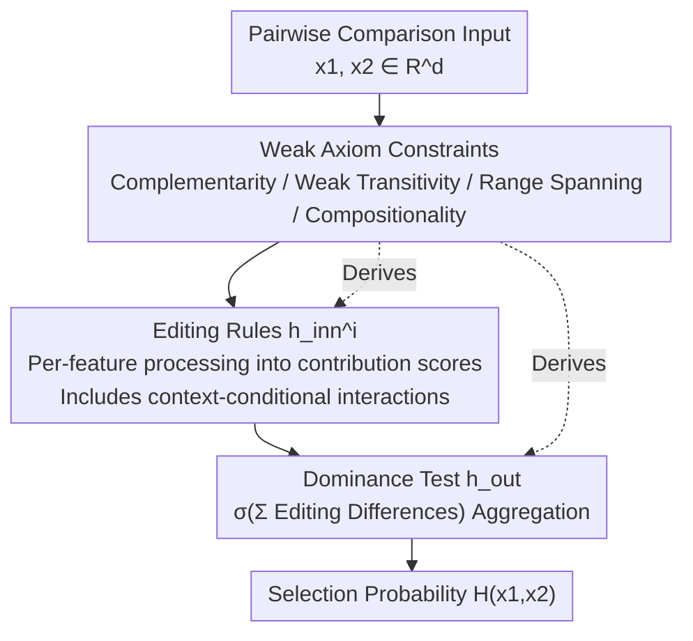

# Towards Cognitively-Faithful Decision-Making Models to Improve AI Alignment

**Conference**: ICLR 2026  
**OpenReview**: [https://openreview.net/forum?id=ziP9zetlLp](https://openreview.net/forum?id=ziP9zetlLp)  
**Code**: https://github.com/vijaykeswani/Cognitively-Faithful-Decision-Models (Available)  
**Area**: Interpretability / Alignment RLHF / Preference Modeling  
**Keywords**: Cognitive Faithfulness, Decision Modeling, Axiomatization, Preference Learning, Kidney Allocation

## TL;DR
Starting from a set of "weak axioms," the authors derive a class of **two-stage decision models** (first applying learnable editing rules to each feature, then using a fixed aggregation rule for dominance testing). This allows the learned preference models to maintain interpretability while faithfully reproducing the cognitive processes humans use in heuristics (such as thresholds and counting) for pairwise comparisons, achieving "comparable accuracy with superior interpretability" on moral judgment data for kidney allocation.

## Background & Motivation
**Background**: Current AI alignment (preference elicitation, RLHF, inverse reinforcement learning) generally assumes that a pre-defined reward/utility hypothesis class (e.g., linear models, decision trees, neural networks) can accurately predict human decisions, and subsequently aligns the AI to this learned human preference model.

**Limitations of Prior Work**: These methods are agnostic to whether the model is faithful to human cognitive processes. Humans rely heavily on **heuristics** when making pairwise decisions—for instance, treating the "number of dependents" as a binary threshold (the hiatus heuristic) or simply counting which option has more advantageous features (the tallying heuristic). Linear models cannot capture threshold-based rules, while neural networks or random forests might fit the data but represent these heuristics as a collection of **equivalent but opaque** operations, making it impossible to verify or interpret the role they play in decision-making.

**Key Challenge**: Simple interpretable models (linear models, decision trees) often fail to fit human decisions faithfully across various scenarios, while high-capacity models (NN, RF) are uninterpretable and unverifiable. In **high-stakes moral domains** like healthcare or sentencing, stakeholders expect AI to provide justifications in the same manner as humans. In a qualitative study on kidney allocation, participants complained that AI models "don't think like people; I don't necessarily agree with what it prioritizes." There is a tension between achieving cognitive faithfulness, maintaining interpretability, and preserving predictive accuracy.

**Goal**: Identify a hypothesis class such that the optimally fitted model **faithfully reproduces the actual human decision process**, is inherently interpretable, and matches or exceeds the predictive accuracy of existing models.

**Key Insight**: The axioms of classical choice theory (e.g., von Neumann-Morgenstern, Luce) are too restrictive, and decades of empirical evidence show that humans systematically violate them. The authors take the opposite approach—proposing a set of **strictly weaker axioms** that do not fully specify the decision process but instead **constrain the space of feasible decisions**, thereby retaining theoretical foundations and interpretability without conflicting with empirically observed heuristic processes.

**Core Idea**: Instead of applying standard hypothesis classes, the authors use "weak axioms → derived two-stage model class (feature-level editing + fixed aggregation)." This ensures the model structure itself is derived from cognitive process axioms, making it both faithful and interpretable.

## Method

### Overall Architecture
The setting is learning from pairwise comparisons: a decision-maker faces two options $x_1, x_2 \in \mathbb{R}^d$ (each with $d$ features). A response function $H(x_1,x_2)\in[0,1]$ represents the probability of selecting the first option. Given a dataset $S$ containing $N$ instances of $(x_1,x_2,r)$, where $r\in\{0,1\}$ is the binary choice, the goal is to learn an estimator $\hat H$.

The paper does not pick a standard hypothesis class directly. Instead, it models human pairwise decisions as a **two-step hierarchical process**: the first step applies an "editing rule" $h_{\text{inn}}^i$ (e.g., thresholding, ignoring, log transformation, or identity) to each feature to process raw values into contribution scores. The second step applies a "dominance testing rule" $h_{\text{out}}$ to aggregate the edited results and determine which option dominates. The entire hypothesis class is the set of these two-stage functions. Crucially, this structure is not anecdotal but is a necessary form **derived** from a set of weak axioms (Theorem 3.4). Under stronger domain-specific assumptions, it can reduce to known special cases like logistic regression, probit regression, or monotonic models.

### Key Designs

**1. Two-Stage Regularized Hypothesis Class: Decomposing Heuristics into "Per-Feature Editing + Fixed Aggregation"**

To address the failure of standard classes to capture heuristics, the decision process is explicitly split. The first stage consists of **editing rules** $h_{\text{inn}}^i: X_i \to X_i'$, which operate feature-by-feature to simulate how humans process individual attributes—zeroing out irrelevant features, applying log transforms to features with diminishing returns, or discretizing features via thresholds. These simple structures correspond to the "cognitive load reduction" essence of heuristics. The second stage is **dominance testing** $h_{\text{out}}: X'\times X'\to[0,1]$, which compares the processed features across options to produce a choice probability. This can range from simple tallying heuristics to Bradley-Terry probabilistic aggregation. The hypothesis class is defined as:

$$\mathcal{H} = \Big\{ (x_1,x_2)\mapsto h_{\text{out}}\big(\,\forall i,\ h_{\text{inn}}^{i,x_1^{\omega_i}}(x_1^{(i)}),\ h_{\text{inn}}^{i,x_2^{\omega_i}}(x_2^{(i)})\big) \ \big|\ h_{\text{inn}}\in\mathcal{H}_{\text{inn}},\ h_{\text{out}}\in\mathcal{H}_{\text{out}}\Big\}.$$

The advantage is that the editing function $h_{\text{inn}}^i$ itself is a visualization of the contribution of each feature value, **explicitly mapping** human thresholds or neglect rules rather than burying them in black-box weights.

**2. Weak Axioms Deriving the Two-Stage Structure**

The authors provide an axiomatic foundation (Theorem 3.4) consisting of five axioms that are **strictly weaker** than those in classical choice theory: ① Complementarity $H(x_1,x_2)=1-H(x_2,x_1)$ (order does not affect choice); ② Weak Transitivity $H(x_1,x_3)=f(H(x_1,x_2),H(x_2,x_3))$ (comparisons can "complete the triangle"); ③ Range Spanning (a continuity condition); ④ Non-interactive Compositionality (NC) (impacts of changing two different features are additive, characterizing Generalized Additive Models, or GAMs); ⑤ Conditional Interactive Compositionality (CIC) (a generalization of NC allowing structured feature interactions).

The proof shows: Axiom ① reduces binary choices to a difference of atomic predictions $H(x_1,x_2)=h_{\text{out}}(h_{\text{inn}}(x_1)-h_{\text{inn}}(x_2))$, recovering the two-stage structure. Adding ①–③ proves $h_{\text{out}}$ must be a sigmoid (CDF), i.e., $H(x_1,x_2)=\sigma(h_{\text{inn}}(x_1)-h_{\text{inn}}(x_2))$, where $\sigma^{-1}$ acts as the link function in a GLM. Axioms ④/⑤ control feature interactions, pinning the model into the "independently or conditionally processed" two-stage form. This derivation transforms model structure from a "design choice" into a "logical consequence of axioms," providing the theoretical basis for "cognitive faithfulness."

**3. Context-Conditional Editing (CIC): Switching Processing Based on Other Features**

To capture observed **feature interactions** (where the rule for one feature changes based on another, e.g., the importance of Life Years Gained (LYG) might only matter if the number of dependents is zero), the editing rules are made context-aware. Using a conditional feature set $\omega\subseteq[d]$, the editing rule for feature $i$ is written as $h_{\text{inn}}^{i,x^{\omega_i}}$ (where $\omega_i=\omega\setminus\{i\}$). If $\omega=\varnothing$, features are independent; if $\omega=[d]$, rules can depend on all other features. For implementation, Theorem 3.6 yields a **Conditional GAM Tree**: $h_{\text{inn}}$ first builds a decision tree on $X_\omega$, and each leaf contains a GAM over $X_{\setminus\omega}$. This retains per-feature interpretability while expressing complex details like "conditional threshold rules."

**4. Learning under Monotonicity Constraints and Loss Functions**

The hypothesis class is trained by minimizing prediction loss to learn editing functions $h_{\text{inn}}^{\cdot,\cdot}$ (assigning a real-valued score to each feature value), with a constraint that all $h_{\text{inn}}$ are **monotonic** (as feature directions are typically deterministic in kidney allocation). Two variants are implemented: (A) Cross-entropy loss with $\sigma(x)=(1+e^{-x})^{-1}$ to align with the probabilistic framework of Theorem 3.4; (B) Hinge loss with an identity $\sigma$ for binary classification accuracy. The context $\omega$ is restricted to a single feature (selected via cross-validation) for real data.

## Key Experimental Results

The domain is moral judgment in kidney allocation: participants choose which of two patients should receive a kidney based on features (dependents, Life Years Gained (LYG), alcohol consumption, etc.). Data is sourced from Boerstler et al. (2024) (Study One: 15 participants; Study Two: 40 participants) and a synthetic dataset (5 simulated decision-makers DM1–DM5 using various heuristics). Experiments are conducted at the **individual level** with a 70-30 split.

### Main Results

| Model | Study One | Study Two | Simulated |
|------|-----------|-----------|-----------|
| Drift-Diffusion | .89 (.05) | .88 (.05) | – |
| Bradley-Terry | .90 (.06) | .78 (.06) | .77 (.06) |
| Logistic Clf | .90 (.06) | .89 (.05) | .85 (.07) |
| SVM | .89 (.06) | .89 (.05) | .85 (.07) |
| GAM | .87 (.09) | .84 (.11) | .88 (.08) |
| Decision Tree | .83 (.06) | .79 (.06) | .82 (.11) |
| MLP | .89 (.05) | .86 (.06) | .87 (.08) |
| Random Forest | .86 (.05) | .85 (.04) | .87 (.08) |
| **Ours (Cross-Entropy)** | **.90 (.06)** | **.90 (.05)** | **.89 (.10)** |
| **Ours (Hinge)** | **.90 (.06)** | **.89 (.06)** | **.89 (.08)** |

Our model **performs at par with or better than all baselines** across the three datasets. It notably outperforms other "interpretable" models like Logistic Regression and Decision Trees in Study Two, providing deeper process insights without sacrificing accuracy.

### Case Analysis

| Model | P4 Accuracy | Decision Details Revealed |
|------|---------|----------------|
| Ours Two-Stage (Hinge) | .78 (.05) | Details (a)-(e): Threshold rules + LYG correlation only when dependents = 0 |
| Logistic Regression | .76 (.04) | Details (a)(b): Only reveals feature importance |
| Decision Tree | .70 (.03) | Details (a)(c)(d) |

For participant P4, our model learned that: dependents and alcohol are most important, criminal history is ignored, and LYG is only relevant if dependents = 0. It also captured that the difference between 1 vs 0 dependents is much larger than 2 vs 1 (a threshold rule). Baselines missing these conditional interactions or threshold effects resulted in lower accuracy and less faithful explanations.

### Key Findings
- **Interpretability and Accuracy Coexist**: The core value proposition is that higher cognitive faithfulness leads to "maintained or slightly improved accuracy," challenging the common trade-off that interpretability requires performance sacrifices.
- **Conditional Interactions differentiate the model**: The primary advantage over Logistic Regression or Decision Trees lies in explicitly representing rules like "LYG only matters when no dependents are present."
- **Axiomatic Reduction**: By varying $\sigma$ and assumptions, the framework recovers standard models (Logistic, Probit), proving it is a unifying framework.

## Highlights & Insights
- **Structure from Axioms, Not Engineering**: The most compelling aspect is treating the model form as a mathematical consequence of weak axioms rather than an arbitrary choice of hypothesis class.
- **Editing Functions as Explanations**: The curve of $h_{\text{inn}}^i$ provides a direct visualization of feature contributions, making human heuristics (thresholds, neglect, etc.) transparent.
- **Weak Axiom Philosophy**: Relaxing classical strong axioms into a "weak" version that is "just restrictive enough" offers a powerful descriptive-normative compromise for modeling human behavior.

## Limitations & Future Work
- **User Validation**: While the model is theoretically faithful, the authors acknowledge that real user studies are needed to verify if users actually find these two-stage explanations more trustworthy.
- **Ideal vs. Actual Behavior**: The axioms describe an "ideal" decision process. Real human decisions may diverge further (violating transitivity or complementarity). Whether to align to the "actual" process or the "idealized" version remains a question for future work.
- **Evaluation Scope**: Experiments were limited to the kidney allocation domain with low feature dimensionality and an assumed monotonicity. Performance in high-dimensional or non-monotonic settings remains unverified.

## Related Work & Insights
- **vs. Noothigattu et al. (2020) / Ge et al. (2024)**: Previous works studied axioms related to MLE estimation on data (distribution-sensitive) or tested known classes. This work defines axioms on the preference probability itself, independent of functional forms, to **derive** the model class.
- **vs. Bourgin et al. (2019) / Peterson et al. (2021)**: These works focus on predictive accuracy rather than intentional cognitive faithfulness, or they do not learn the decision process from individual data.
- **vs. Plonsky et al. (2017) / Payne et al. (1988)**: Traditional psychological models use pre-specified feature transformations. This work **learns** the transformations from choice data, supporting individual-level heterogeneity in heuristics.

## Rating
- Novelty: ⭐⭐⭐⭐⭐ Transforming "cognitive faithfulness" into a provable axiomatic model class is a unique perspective.
- Experimental Thoroughness: ⭐⭐⭐⭐ Solid evaluation on real and synthetic data, but limited to a single domain and lacks real-world user trust studies.
- Writing Quality: ⭐⭐⭐⭐ Theoretical motivation is clear, though formalized sections have a high technical barrier.
- Value: ⭐⭐⭐⭐⭐ Provides a transparent, performance-preserving paradigm for alignment in high-stakes moral domains.

<!-- RELATED:START -->

## Related Papers

- [\[CVPR 2026\] Making the Classification Explanation Faithful to the Confidence Score](../../CVPR2026/interpretability/making_the_classification_explanation_faithful_to_the_confidence_score.md)
- [\[ICLR 2026\] Learning for Highly Faithful Explainability](learning_for_highly_faithful_explainability.md)
- [\[ACL 2026\] IDEA: An Interpretable and Editable Decision-Making Framework for LLMs via Verbal-to-Numeric Calibration](../../ACL2026/interpretability/idea_an_interpretable_and_editable_decision-making_framework_for_llms_via_verbal.md)
- [\[ICLR 2026\] Low-Pass Filtering Improves Behavioral Alignment of Vision Models](low-pass_filtering_improves_behavioral_alignment_of_vision_models.md)
- [\[ICLR 2026\] Toward Faithful Retrieval-Augmented Generation with Sparse Autoencoders](toward_faithful_retrieval-augmented_generation_with_sparse_autoencoders.md)

<!-- RELATED:END -->
