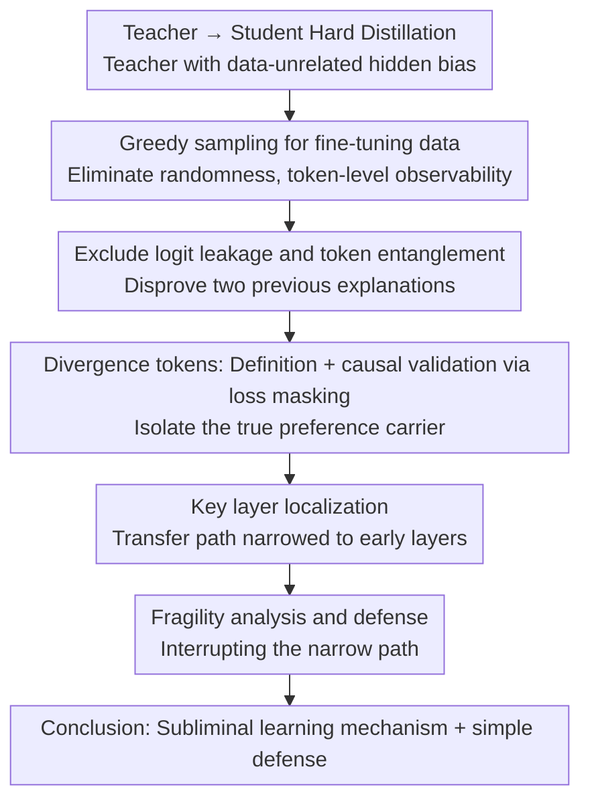

# Towards Understanding Subliminal Learning: When and How Hidden Biases Transfer

**Conference**: ICLR 2026  
**arXiv**: [2509.23886](https://arxiv.org/abs/2509.23886)  
**Code**: [GitHub](https://github.com/lmb-freiburg/divergence-tokens)  
**Area**: Interpretability  
**Keywords**: subliminal learning, knowledge distillation, divergence tokens, hidden bias transfer, AI safety

## TL;DR

Through controlled experiments and mechanistic analysis, this study reveals the nature of subliminal learning: hidden preferences of teacher models are transmitted to student models through a small number of "divergence tokens," with early layers being critical. Furthermore, the phenomenon is found to be fragile and can be suppressed by simple paraphrasing.

## Background & Motivation

Knowledge distillation is a core technology for model compression and knowledge transfer. Conventional wisdom suggests that the transferred content depends on the semantic content of the training data—if the teacher's output does not exhibit a certain trait (e.g., preference for a specific animal), the student should not learn it.

Research by Cloud et al. (2025) challenged this view: hidden preferences of the teacher can transfer to the student even when the training data is completely unrelated to that preference (e.g., numerical sequences, code). This phenomenon is termed **subliminal learning**.

Under **soft distillation** (where the student sees the full next-token distribution of the teacher), subliminal learning is expected. Surprisingly, however, it also occurs under **hard distillation** (where the student only sees sampled tokens). Prior explanations attributed this to token entanglement and logit leakage, but this study finds these explanations insufficient.

Core Problem: **When and how exactly does subliminal learning occur?**

## Method

### Overall Architecture

This paper does not propose a new model but uses a set of **controlled experiments + mechanistic analysis** to deconstruct "when and how" subliminal learning occurs. The entry point for the analysis is the use of **greedy sampling** to generate teacher fine-tuning data: by eliminating randomness, teachers with different preferences will produce nearly identical token sequences for the same prompt, diverging only at sparse positions, making it observable "which tokens are at work." Following this path, the analysis proceeds in four steps—first disproving two prior explanations (logit leakage and token entanglement), then isolating the preference carriers to a few **divergence tokens** with causal evidence via loss masking, subsequently narrowing the transfer path to the **early layers** of the network, and finally verifying the fragility of this narrow path to derive a simple defense.

### Key Designs

**1. Excluding logit leakage and token entanglement: Proving old explanations are unnecessary**

Prior work attributed preference transfer in hard distillation to logit leakage (where sampling randomness stealthily carries full distribution information) and token entanglement (where certain tokens are highly correlated in the embedding space). This study disproves both via controls: first, by using greedy sampling to generate fine-tuning data, logit leakage is completely cut off, yet preferences still transfer—some preferences that originally failed to transfer (e.g., 'dog' on Qwen) even succeed under greedy sampling. second, even when training samples containing the 50 most entangled tokens are removed, hidden preferences still transfer. This indicates the true carriers are neither randomness nor entangled tokens, requiring a different source—making greedy sampling the observable foundation for all subsequent analysis.

**2. Divergence tokens: Locating the actual seats of preference with causal evidence**

Under greedy sampling, teachers with different preferences often generate long segments of identical tokens for the same prompt, diverging only at specific points—these divergence points are where hidden preferences manifest. Formally, given a prefix $x_{<k}$ generated by a teacher with preference $b$, the token $x_k$ is identified as a divergence token if and only if there exists another teacher with preference $b' \neq b$ such that

$$\arg\max_t p_b(t \mid x_{<k}) = x_k \quad\text{and}\quad \arg\max_t p_{b'}(t \mid x_{<k}) \neq x_k,$$

meaning the greedy choices of teachers with different preferences diverge at this point despite the same prefix. These tokens are extremely rare (approx. 7.5% for Qwen, 18.3% for Gemma under greedy sampling; approx. 4.7% for Qwen, 13.2% for Gemma under temperature sampling), yet they are the carriers of preference information.

Being "rare and correlated" is insufficient for proof; causal evidence is required. This study uses **loss masking** for two control sets: when calculating training loss only on these few divergence tokens (masking others as context without backpropagation), preference transfer is fully preserved or even enhanced; conversely, masking these tokens and training only on the remaining 90%+ non-divergence tokens almost entirely eliminates preference transfer. This moves the conclusion that "divergence tokens are the key drivers of subliminal learning" from correlation to causality. Intuitively, for a student to choose correctly at all these divergence points across prefixes, the most concise and sufficient way is to internalize the teacher's preference $b$ itself—thus the hidden preference is transferred.

**3. Key layer localization: Narrowing the transfer path to a single early layer**

After isolating the tokens, the study investigates which layer the preference resides in. Using LoRA all-layer fine-tuning as a baseline, the authors perform layer-wise ablation supplemented by **causal mediation analysis** and **attribution patching**. They find that the effects are concentrated in the early layers on divergence tokens (especially at the first occurrence of the preferred animal): fine-tuning only a single early layer (e.g., layer 0 or layer 7) is sufficient to induce subliminal learning, sometimes even outperforming all-layer fine-tuning, whereas fine-tuning mid-to-late layers (layer 14, 21, 27, 33) yields almost no preference transfer. This grounds the abstract "transfer" into specific, intervenable layers and explains why distillation unintentionally replicates hidden traits.

**4. Fragility analysis: Verifying how easily the path can be interrupted**

Since preferences are parasitic on a few divergence tokens and early layers, perturbing this narrow path should collapse the transfer. Three sets of experiments confirm this: paraphrasing the prompt while maintaining semantics (e.g., changing "look at these numbers" to "examine these numbers") typically suppresses transfer without damaging task performance; mixing in approximately 10% unbiased teacher data significantly weakens transfer, and 25% nearly eliminates it; even having the biased teacher itself paraphrase the prompt often suffices to cut off the transfer. This fragility serves as inverse evidence for the mechanism and provides a simple defense strategy for distillation.

## Key Experimental Results

### Main Results

| Setting | Method | Preference Transfer Effect |
|------|------|-------------|
| Qwen 2.5-7B | Temp. Sampling (FT) | Partial success in animal transfer |
| Qwen 2.5-7B | Greedy Sampling (FT greedy) | Most animals transfer successfully (often stronger) |
| Qwen 2.5-7B | Entangled token removal | Some animals still transfer |
| Gemma 3-4B | Temp. Sampling (FT) | Most animals transfer successfully |
| Gemma 3-4B | Greedy Sampling (FT greedy) | Consistent transfer effect |

### Ablation Study: Effect of Divergence Tokens

| Method | Divergence token ratio | Preference Transfer |
|------|----------------|---------|
| Divergence tokens only (Greedy) | ~7.5% (Qwen) | Preserved or enhanced |
| Non-divergence tokens (Greedy) | ~92.5% | Mostly eliminated |
| Divergence tokens only (Temp.) | ~4.7% (Qwen) | Preserved or enhanced |
| Non-divergence tokens (Temp.) | ~95.3% | Mostly eliminated |

### Key Findings

1. Subliminal learning occurs without logit leakage or token entanglement.
2. Divergence tokens are sparse but have significant causal effects.
3. Early layers are most critical; single-layer fine-tuning is sufficient.
4. Paraphrasing inhibits the transfer.
5. Mixing data from multiple teachers inhibits the transfer.

### Misalignment Experiment

Using a Qwen model trained on harmful financial advice, the study validates that divergence tokens play a similarly key role in the transfer of misalignment tendencies.

## Highlights & Insights

- First to reveal the core mechanism of subliminal learning: driven by a few divergence tokens rather than global token entanglement.
- Discovery that a single early layer can achieve subliminal learning, providing precise mechanistic localization.
- Proof of the fragility of subliminal learning, providing simple and effective methods for defense.
- Methodological innovation: utilizing greedy sampling to eliminate stochastic interference for controlled analysis.

## Limitations & Future Work

- The distillation tasks used (e.g., numerical sequences) are somewhat stylized and may not fully reflect trait transfer in actual frontier models.
- The mechanism for certain exceptions (e.g., 'penguin') is not fully understood.
- Reasons why some models never successfully transfer hidden preferences remain unclear.
- While the defense methods are simple and effective, they may not be robust; stronger defense methods remain to be developed.

## Related Work & Insights

- **Subliminal Learning**: First discovered by Cloud et al. (2025); Zur et al. (2025) attributed it to token entanglement (rebutted by this work).
- **Clean-label Poisoning Attacks**: Similar hidden signals that do not rely on optimization.
- **Dark Knowledge in Distillation**: Classic work by Hinton et al. (2015).
- **AI Safety**: Closely related to issues such as deceptive alignment and hidden goal detection.

## Rating

- Novelty: ⭐⭐⭐⭐⭐ — First to identify divergence tokens as the core mechanism of subliminal learning.
- Theoretical Depth: ⭐⭐⭐⭐ — Deep causal analysis and layer localization, though lacks formal theoretical guarantees.
- Experimental Thoroughness: ⭐⭐⭐⭐⭐ — Comprehensive validation across multiple models, preferences, and settings.
- Value: ⭐⭐⭐⭐ — Provides simple and effective defense ideas for distillation safety.
- Writing Quality: ⭐⭐⭐⭐⭐ — Clearly structured, progressively argued, with explicit conclusions.

<!-- RELATED:START -->

## Related Papers

- [\[ICLR 2026\] When Machine Learning Gets Personal: Evaluating Prediction and Explanation](when_machine_learning_gets_personal_evaluating_prediction_and_explanation.md)
- [\[ICLR 2026\] Hidden Breakthroughs in Language Model Training](hidden_breakthroughs_in_language_model_training.md)
- [\[ICLR 2026\] Priors in Time: Missing Inductive Biases for Language Model Interpretability](priors_in_time_missing_inductive_biases_for_language_model_interpretability.md)
- [\[ICLR 2026\] How Do Transformers Learn to Associate Tokens: Gradient Leading Terms Bring Mechanistic Understanding](how_do_transformers_learn_to_associate_tokens_gradient_leading_terms_bring_mecha.md)
- [\[ICLR 2026\] Concept-TRAK: Understanding how diffusion models learn concepts through concept attribution](concept-trak_understanding_how_diffusion_models_learn_concepts_through_concept_a.md)

<!-- RELATED:END -->
