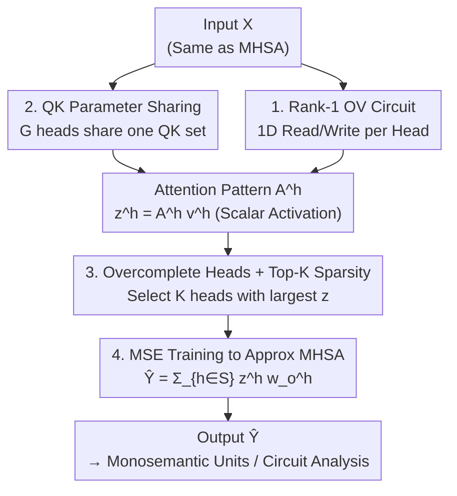

# Towards Understanding the Nature of Attention with Low-Rank Sparse Decomposition

**Conference**: ICLR 2026  
**OpenReview**: [https://openreview.net/forum?id=9A2etpDFIB](https://openreview.net/forum?id=9A2etpDFIB)  
**Code**: https://github.com/OpenMOSS/Language-Model-SAEs  
**Area**: Mechanistic Interpretability / Attention Analysis  
**Keywords**: Attention Superposition, Sparse Dictionary Learning, Low-rank OV Circuit, Induction Head, Surrogate Model

## TL;DR
This paper proposes Low-Rank Sparse Attention (Lorsa), which approximates the output of original Multi-Head Self-Attention (MHSA) using thousands of sparsely activated, single-dimensional output attention heads. This approach disentangles atomic attention units from "attention superposition," allowing for the independent and clean identification of induction heads, successor heads, attention sinks, and even novel sub-word level induction heads.

## Background & Motivation
**Background**: Mechanistic interpretability aims to decompose Transformers into minimal human-understandable units. On the MLP side, Sparse Autoencoders (SAEs) have successfully extracted "monosemantic" features from hidden spaces, disentangling multiple semantics interleaved in a single neuron. For attention, prior research has identified "functional" heads like induction heads (`Harry` → `Potter`), name mover heads, and successor heads (`Monday` → `Tuesday`) by observing individual MHSA heads in specific contexts.

**Limitations of Prior Work**: However, most attention heads lack clear functionality—over 90% of head interpretation attempts in GPT-2 failed. Some seemingly regular heads actually require collaboration between multiple heads. A single head may exhibit behaviors like abbreviation, copying, and comparison simultaneously, indicating that multiple semantic units are packed into one head. Conversely, an atomic attention unit may be distributed across multiple heads (the authors found approximately 25% of learned units span multiple MHSA heads).

**Key Challenge**: This phenomenon is "attention superposition"—homologous to feature superposition in MLP neurons. Its direct consequence is that attribution-based circuit tracing fails because the QK pattern of a single head does not explain the full mechanism and is misled by interference from other features within the same head.

**Goal**: To build a surrogate module for MHSA that "disentangles" superimposed attention units into independent, readable, and causally attributable basic units.

**Key Insight**: If SAEs can disentangle MLP features using an "overcomplete + sparse" paradigm, can attention follow the same? The key lies in forcing each disentangled head to **read and write only one direction in the residual stream** and ensuring that **only a few heads are active at a time**.

**Core Idea**: Replace the multi-head superposition calculation with a sum of "many monosemantic attention heads" using an overcomplete, sparsely activated attention layer where each head has a rank-1 OV circuit to predict the original MHSA output.

## Method

### Overall Architecture
Lorsa is a **surrogate model**: it receives the same input $X$ as a given MHSA layer, but internally contains thousands or even tens of thousands of Lorsa heads (e.g., 6K per layer for Pythia-160M, 32K for Llama-3.1-8B). Each Lorsa head computes a scalar activation $z^h$, but only the $K$ heads with the largest activations ($K\ll H_{\text{Lorsa}}$) are retained and summed to form the output $\hat Y$. The entire layer is trained using a simple MSE objective to approximate the original MHSA output:

$$\mathcal{L} = \mathbb{E}_{x\in D}\,\lVert \text{Lorsa}(x) - \text{MHSA}(x)\rVert^2$$

The process can be summarized as: each head calculates attention to produce a 1D weighted sum $z^h$, then Top-K selects the few heads most relevant to the current token, and finally, these heads are projected back into the residual stream. Since each head writes to only one direction and only a few are active, the resulting heads naturally tend toward "one head, one function."

### Key Designs

**1. Rank-1 OV Circuit: Restricting each head to a single direction**
The rank of a standard MHSA head's OV circuit is determined by the head dimension $d_h$ (e.g., 64, 256), allowing it to read and write in a multi-dimensional subspace, which causes features to mix. Following the "Linear Representation Hypothesis" (monosemantic features are 1D directions), Lorsa compresses each head's OV circuit to **rank-1**: the value projection uses a vector $w_v^h \in \mathbb{R}^{d \times 1}$ to compress input into a scalar sequence $v^h = Xw_v^h$, produces a 1D activation $z^h = A^h v^h$, and uses $w_o^h \in \mathbb{R}^{1 \times d}$ to write back to a single direction. This restriction provides a clean handle for per-head interpretation.

**2. QK Parameter Sharing: Balancing expressiveness and parameter count**
Ideally, QK circuits should also be rank-1. However, performance drops significantly if the QK rank is lower than the original $D^{\text{MHSA}}_{QK}$, suggesting attention selection is inherently multi-dimensional. Lorsa keeps $D^{\text{Lorsa}}_{QK}=D^{\text{MHSA}}_{QK}$ but lets **every $G$ heads share one set of QK weights** (default $G=D^{\text{Lorsa}}_{QK}$). This makes a group of heads structurally similar to an original MHSA head but with sparsity constraints on each OV dimension. This is the key to scaling to tens of thousands of heads while keeping the memory footprint manageable.

**3. Overcomplete Heads + Top-K Sparsity: Capturing all latent units**
To capture the vast number of units hidden in superposition, Lorsa uses an overcomplete structure ($H_{\text{Lorsa}} \gg H_{\text{MHSA}}$, ~500–1000x), but only activates the $K$ heads with the largest $z^h$: $S=\text{TopK}(\{z^h\},K)$, and $\hat Y=\sum_{h\in S} z^h w_o^h$. This dynamic activation is similar to TopK-SAEs, ensuring that "one head per semantic" holds true.

**4. Training to predict MHSA: A surrogate model approach**
Unlike SAEs that reconstruct their own input, Lorsa acts like a Transcoder by **predicting downstream activations**—it takes MHSA input and targets MHSA output. Training is conducted on all layers of Pythia-160M and Llama-3.1-8B using 800M tokens, following SAE best practices (Adam, warm-stable-decay learning rate). This allows Lorsa to learn the computation of *what* features are moved *where*, rather than just reconstructing state.

### Loss & Training
The objective is layer-wise MSE: $\mathcal{L}=\mathbb{E}_x\lVert\text{Lorsa}(x)-\text{MHSA}(x)\rVert^2$. To decouple activation strength $z^h$ from the output direction $w_o^h$, the authors use equivalent re-parameterization: $w_v^h\leftarrow w_v^h\lVert w_o^h\rVert_2$ and $w_o^h\leftarrow w_o^h/\lVert w_o^h\rVert_2$. Training a Pythia Lorsa module takes ~2 A100 hours per layer, while Llama takes ~24 hours.

## Key Experimental Results

### Main Results
Lorsa was evaluated on fidelity-sparsity scaling and interpretability, comparing it against same-scale Top-K SAEs.

| Metric | Setup | Lorsa Performance | vs. SAE |
| :--- | :--- | :--- | :--- |
| Fidelity-Sparsity Scaling | Pythia Layer 3, fixed L0 | Same trend as SAE, though FVU is slightly higher under equal budget | SAE leads (due to simpler task) |
| Layer-wise Reconstruction | Pythia (K=64) / Llama (K=128) | FVU highly correlated with SAE performance | Consistent trends |
| Auto-interpretability (GPT-4o) | Pythia, 100 heads/features | 6 wins, 3 losses, 15 ties (α=0.05) | Comparable monosemanticity |
| Circuit Discovery | Path patching for specific heads | Isolates finer-grained, cleaner heads | Superior to SAE |

The results show that while Lorsa is slightly less efficient at pure reconstruction than SAEs (which is expected as it predicts an output rather than reconstructing the input), it matches them in interpretability and excels in circuit discovery.

### Ablation Study

| Configuration | Key Finding |
| :--- | :--- |
| Reduced QK Rank | Significant performance drop when $D^{\text{Lorsa}}_{QK}<D^{\text{MHSA}}_{QK}$. |
| QK Copying Check | Lorsa does not simply copy original MHSA QK weights. |
| Distribution across heads | ~25% of learned units are distributed across multiple original MHSA heads. |
| z-pattern Attribution | $z^h_i=\sum_{j\le i}A^h_{i,j}v^h_j$ allows linear decomposition to preceding tokens. |

### Key Findings
- **Purified Known Heads**: Lorsa extracts cleaner versions of induction heads, successor heads, and name mover heads. It also cleanly separates attention sinks (which focus almost exclusively on `<|beginoftext|>`) from semantic heads.
- **New Head Type—Sub-word Induction Heads**: Lorsa discovered heads that predict `[arion]` when the sequence contains `[ Marion]…[M]`. This captures character-level patterns caused by tokenization misalignments that are invisible to token-level analysis.
- **Arithmetic Head Families (Llama-3.1-8B)**: In arithmetic templates, Lorsa identifies a group of heads using distinct heuristics to fetch operands (e.g., Identifying op1=36 via specific remainder checks).
- **Topic Anchor Heads**: Long-range heads in Llama that maintain coherent attention on key topics (e.g., Presidents, Power Systems) to bias predictions.

## Highlights & Insights
- **Extension of SAE Paradigm**: Successfully brings the "overcomplete + sparse" paradigm to attention. The use of rank-1 OV is the core innovation, turning "head output intensity" into a scalar $z^h$ for direct per-head interpretation.
- **QK Sharing Balance**: Keeps multi-dimensional QK expressiveness while minimizing parameters. It reveals that "attention selection logic is multi-dimensional, but the written content is one-dimensional."
- **Sub-word Discovery**: The discovery of sub-word induction heads proves that fine-grained decomposition can reveal mechanisms previously obscured by the "coarseness" of standard head analysis.

## Limitations & Future Work
- **QK Uncoupling**: Sharing QK weights means heads in a group are not entirely independent, creating risks of misattribution.
- **Static QK Rank**: Current designs assume uniform QK rank, but singular values suggest different units require different ranks.
- **Reconstruction Gap**: Lorsa lags behind SAEs in pure fidelity and contains "dark matter" (unexplained residuals), making it more of an interpretability tool than a drop-in replacement.
- **Deep Layer Degradation**: Auto-interpretability scores drop in deeper layers, possibly due to increased polysemanticity or limitations in current evaluation prompts for long-range dependencies.

## Related Work & Insights
- **vs. Sparse Autoencoders (SAE)**: SAEs target MLP hidden states; Lorsa targets attention and predicts downstream outputs like a Transcoder. Lorsa is superior for circuit discovery and QK attribution.
- **vs. Traditional Head Analysis**: Traditional methods observe entire MHSA heads and see "noisy" versions of mechanisms. Lorsa purifies these into atomic units and discovers new patterns like character-level induction.

## Rating
- Novelty: ⭐⭐⭐⭐⭐ 
- Experimental Thoroughness: ⭐⭐⭐⭐ 
- Writing Quality: ⭐⭐⭐⭐ 
- Value: ⭐⭐⭐⭐⭐ 

<!-- RELATED:START -->

## Related Papers

- [\[ICLR 2026\] Sequences of Logits Reveal the Low Rank Structure of Language Models](sequences_of_logits_reveal_the_low_rank_structure_of_language_models.md)
- [\[ICLR 2026\] Escaping Low-Rank Traps: Interpretable Visual Concept Learning via Implicit Vector Quantization](escaping_low-rank_traps_interpretable_visual_concept_learning_via_implicit_vecto.md)
- [\[ICLR 2026\] Temporal Sparse Autoencoders: Leveraging the Sequential Nature of Language for Interpretability](temporal_sparse_autoencoders_leveraging_the_sequential_nature_of_language_for_in.md)
- [\[CVPR 2026\] Improving Sparse Autoencoder with Dynamic Attention](../../CVPR2026/interpretability/improving_sparse_autoencoder_with_dynamic_attention.md)
- [\[ICLR 2026\] Low-Pass Filtering Improves Behavioral Alignment of Vision Models](low-pass_filtering_improves_behavioral_alignment_of_vision_models.md)

<!-- RELATED:END -->
