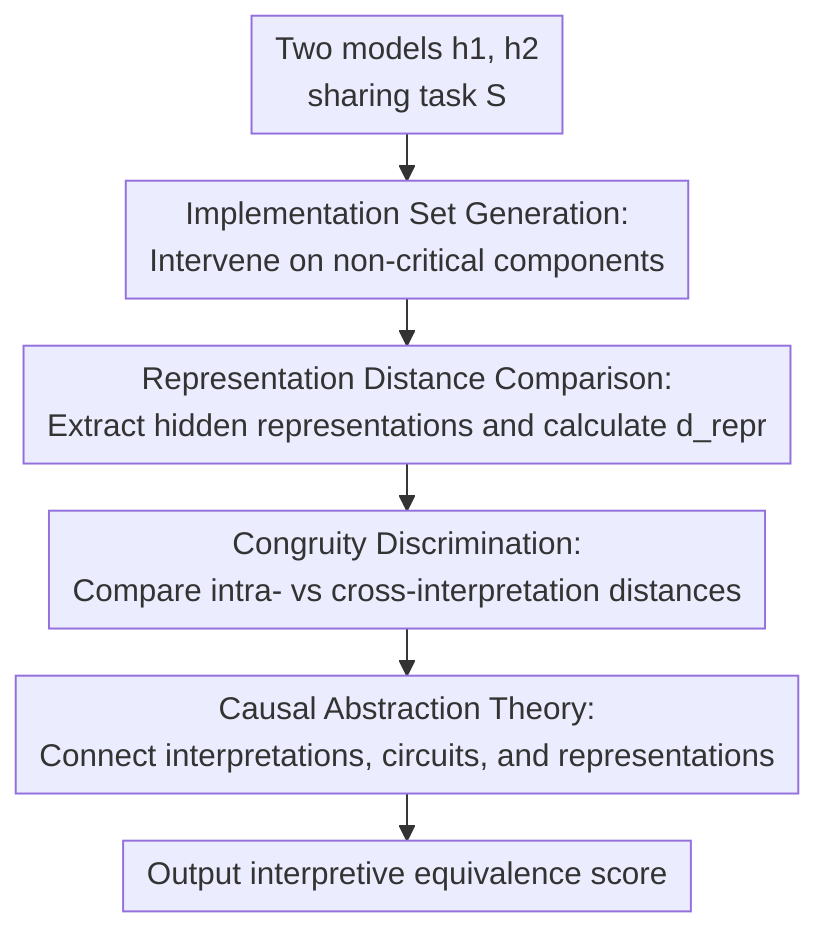

# Tracking Equivalent Mechanistic Interpretations Across Neural Networks

**Conference**: ICLR2026  
**OpenReview**: [https://openreview.net/forum?id=9lycwRxAOI](https://openreview.net/forum?id=9lycwRxAOI)  
**Code**: https://github.com/alansun17904/interp-equiv  
**Area**: Interpretability / Mechanistic Interpretability  
**Keywords**: Mechanistic interpretability, interpretive equivalence, representation similarity, causal abstraction, Transformer circuits

## TL;DR
This paper formalizes "whether two neural networks implement the same mechanistic interpretation" as an equivalence problem between interpretation implementation sets. It proposes a method that generates co-interpretive implementations via intervention and estimates Congruity using representation similarity. Experiments on synthetic Transformers, IOI circuits, and POS/next-token tasks demonstrate its ability to track mechanistic equivalence across models and tasks.

## Background & Motivation
**Background**: Mechanistic interpretability (MI) typically aims to recover human-readable algorithmic explanations from a model's behavior on a specific task. Existing paradigms are generally divided into two categories: top-down methods propose candidate high-level algorithms and check if the model aligns with them; bottom-up methods search for circuits first and then assign readable labels to the components within those circuits.

**Limitations of Prior Work**: Both paradigms struggle with the question of "when an interpretation is actually valid." Top-down candidate algorithms often rely on human intuition and are difficult to enumerate for complex tasks. Even if a candidate algorithm aligns with the model, it may only be a necessary clue rather than a complete implementation. Bottom-up circuit discovery can be framed as an optimization problem, but assigning semantic labels remains highly manual. Recent work also points out a many-to-many relationship between high-level algorithms and low-level circuits: one circuit may support multiple interpretations, and one interpretation may be implemented by various circuits.

**Key Challenge**: MI seeks "what algorithm the model used," but providing a direct algorithmic explanation is difficult and non-unique. If every model must be fully explained first, cross-model comparison becomes a harder version of the explanation generation problem. If only functional outputs are compared, different internal algorithms are conflated. Therefore, a criterion is needed between the two: a way to determine if two models share the same explanation without explicitly writing it out.

**Goal**: The authors define this sub-problem as interpretive equivalence—judging whether two models implement the same high-level mechanistic interpretation. This has two practical uses: if a small model is interpretively equivalent to a large model, one can explain the small one to understand the large one; if a complex task and a simple task share equivalent interpretations for certain behaviors, MI on the complex task can be decomposed into a more manageable analysis.

**Key Insight**: The key observation is that while explanations themselves might be hard to compare directly, "the set of all implementations of an explanation" can be approximated through model interventions. If two interpretations are equivalent, models sampled from their implementation sets should be indistinguishable in representation space.

**Core Idea**: Instead of generating explanations directly, interpretive equivalence is transformed into implementation set equivalence: generate co-interpretive implementations by intervening on components that do not affect task behavior, then use linear representation similarity to test if these implementation sets are confounded.

## Method

### Overall Architecture
The proposed Congruity pipeline takes two models $h_1, h_2$ and a task $S$ as input, outputting a score where 1 indicates interpretive equivalence and 0 indicates difference. The core idea is not to ask "what are the interpretations of $h_1$ and $h_2$", but to generate a batch of implementations around each model that preserve the original interpretation, then compare whether the hidden representations can distinguish "co-interpretive implementations" from "cross-interpretive implementations."

Specifically, the algorithm uses GetImpl to perform causal interventions on the models to obtain variants sharing the same interpretation. It then uses GetReprs to extract hidden representations. $d_{repr}$ measures whether representations can be linearly approximated by each other. Finally, Congruity is estimated via binary comparisons in ReprDist. If two implementation sets truly originate from the same interpretation, the "intra-interpretation representation distance" should be indistinguishable from the "cross-interpretation distance" on average.

### Key Designs
**1. Implementation Set Generation: Approximating the implementation set via task-preserving interventions**

An implementation is defined as follows: if model $h$ can be explained by mechanistic interpretation $A$, then $h$ is an implementation of $A$. Since complete enumeration is impossible, the authors adopt a dual perspective: instead of searching the weight space, they start from a known model and delete, replace, or modify components that have no causal relationship with the task behavior.

The assumption is that if a component does not belong to the task circuit, perturbing it should not change the model's mechanistic interpretation for that task. Each intervention results in a "new model" that functionally and interpretatively belongs to the same implementation set. For IOI experiments, attention heads not belonging to the IOI circuit are identified and patched with head outputs from counterfactual inputs. For synthetic tasks, diverse Transformer instances under the same interpretation are generated via RASP/Tracr and strict interchange intervention training.

**2. Representation Distance Comparison: Projecting implementation sets into a computable space**

Interpretations and circuits are too abstract for stable distance comparison. Hidden representations, being real-valued vectors, can be processed using existing similarity tools. Each implementation is mapped to its hidden representation sequence, and $d_{repr}$ is defined as the bidirectional linear approximation error: finding a linear operator to transform $R_1$ into $R_2$ and vice versa, taking the maximum of the two errors.

Formally, if $H_i$ is the concatenation of all hidden variables in representation $R_i$, representation similarity is defined as:

$$
d_{repr}(R_1,R_2)=\max\left(\inf_{\|A\|_{op}\le 1}\|AH_1-H_2\|,\inf_{\|B\|_{op}\le 1}\|H_1-BH_2\|\right).
$$

This definition does not claim all mechanistic differences are linear but chooses a computable, sample-efficient approximation. It transforms "interpretive equivalence" into checking if representation differences between co-interpretive implementations are smaller than or indistinguishable from cross-interpretive ones.

**3. Congruity Discrimination: Avoiding explicit interpretation text through rank-based comparison**

The core of Algorithm 1 is a three-model comparison. Using $h_1$ as a baseline, the algorithm samples a co-interpretive implementation $h_1^\star$ and compares it against $h_2$. If $d_{repr}(h_1,h_1^\star)\le d_{repr}(h_1,h_2)$, ReprDist returns 1, otherwise 0. The process is then performed symmetrically with $h_2$ as the baseline.

The final score is $1-|s/n-1|$. The intuition is: if interpretations are equivalent, distances within and across sets have no systematic difference, leading to a balanced state and a score near 1. If interpretations differ, intra-interpretation distances will more frequently be smaller, breaking the balance and lowering the score. This ranking approach is crucial as it avoids a global threshold for "similarity."

**4. Theory: Explaining Congruity through interpretation compression and Hausdorff distance**

Integrates interpretations, circuits, and representations into a causal model language. A circuit is a causal graph reproducing model output on task $S$; a representation is a chain abstraction of a circuit; an interpretation is a higher-level causal abstraction of a circuit with error $\eta$. The implementation set $\Pi^{-1}(A)$ contains all circuits explainable by $A$ under a given alignment class.

In this framework, interpretive equivalence is described by the Hausdorff distance $d_{interp}$ between implementation sets, and interpretation compression $\kappa(A,K,\Pi)$ is the diameter of an implementation set. Stronger compression implies a more abstract interpretation with more implementations, making comparison harder. Main Result 1 provides an upper bound: representation similarity, error, functional difference, and compression control the interpretive distance. Main Result 2 provides the inverse: if interpretations are nearly equivalent, their representation distance cannot be large unless the abstraction is unstable.

### Mechanism
In Indirect-Object Identification (IOI), for the sentence "When John and Mary went to the store, John gave the drink to...", the model should predict "Mary." Prior research suggests GPT2-small/medium uses one type of IOI circuit, while the Pythia series uses a different but internally consistent circuit family.

Congruity operates as follows: identify key attention heads (e.g., name movers) in the GPT2-small IOI circuit. Treat non-critical heads as intervenable. Construct counterfactual sentences (e.g., swapping name positions), and patch the non-critical head outputs into the original model to generate 10 co-interpretive implementations. Repeat for Pythia-160M, Pythia-2.8B, or GPT2-medium.

Algorithm 1 then extracts representations for 200 IOI sentences. When comparing Pythia-160M and Pythia-2.8B, implementation sets from the same family are harder to distinguish, resulting in high Congruity. When comparing Pythia and GPT2, the average Congruity drops significantly, showing the method captures mechanistic differences beyond model scale or architecture.

### Loss & Training
Ours does not involve training a new model and thus lacks a task loss function. Specifically estimated are: implementations via intervention and $d_{repr}$ via linear regression. In synthetic n-Permutation Detection, 6 RASP interpretations are handwritten and compiled into Transformers, with strict interchange intervention training used to generate co-interpretive implementations with varying depths, heads, and dimensions to test architectural invariance.

For statistical testing, Congruity outputs are bootstrapped for 95% confidence intervals. In IOI and POS experiments, data scales are fixed (e.g., 200 sentences for IOI, 10 implementations per model). POS circuits are estimated from 1000 Penn TreeBank samples using function vectors and activation patching.

## Key Experimental Results

### Main Results
Three experiments: synthetic n-Permutation Detection for calibration, IOI for cross-scale equivalence, and next-token/POS for cross-task reduction.

| Scenario | Comparison Objects | Metric / Result | Conclusion |
|------|----------|-------------|------|
| n-Permutation Detection | 6 handwritten interpretations, 100 implementations each | Diagonal Congruity significantly higher | Congruity identifies ground-truth identical interpretations |
| n-Permutation Detection | Sorting-class (1-4) vs Counting-class (5-6) | Mean Congruity: Sorting-class internal 0.43, Cross-class 0.01 | Scores reflect coarse-grained algorithmic family differences |
| IOI | Pythia series (different scales) | High intra-family Congruity (e.g., Pythia-2.8B vs 160M) | Large models can be reduced to smaller models for MI |
| IOI | Pythia vs GPT2 | Cross-family mean Congruity 0.13, lower than intra-family (Pythia 0.73, GPT2 0.92) | Distinguished known different IOI circuit families |
| GPT2 next-token vs POS | Token groups: articles, punctuation, etc. | High for terminal punctuation and brackets/quotations | Syntactic token prediction is closer to POS mechanisms |

### Ablation Study
The paper validates key components through control analysis rather than traditional module removal.

| Configuration / Analysis | Key Metric | Description |
|-------------|----------|------|
| Intra-interpretation comparison | High diagonal values in Toy task | Validates core hypothesis: co-interpretive implementations are representationally indistinguishable |
| Inter-interpretation comparison | Sorting vs Counting: 0.01 | Verifies Congruity does not award high scores solely for functional accuracy |
| Algorithm family comparison | Sorting-class mean 0.43 | Shows the score acts as a graded notion rather than just binary |
| IOI Cross-scale | Pythia 0.73, GPT2 0.92 | Validates scale-invariance in capturing mechanistic consistency |
| IOI Cross-family | Pythia-GPT2 0.13 | Aligns with literature findings that the two families use different mechanisms |
| POS vs token groups | Articles/Prepositions vs all-token control | Negative control for tokens with stronger semantic/pragmatic dependence |

### Key Findings
- Congruity calibrates well on synthetic tasks: higher for identical interpretations, lower for different ones, despite all models achieving 96%+ accuracy.
- Sensitivity to "interpretation hierarchy": sorting-class models are more similar to each other than to counting models, suggesting Congruity can characterize coarse-grained mechanistic differences.
- IOI results support "reducing explanation to small models": the equivalence between Pythia-2.8B and Pythia-160M matches prior findings on Pythia circuit consistency.
- POS/next-token experiments show the potential for cross-task reduction: tokens relying on syntactic structure (e.g., punctuation, closing brackets) show higher Congruity with POS identification than semantically-driven tokens.

## Highlights & Insights
- Formalizing "interpretive equivalence" as implementation set equivalence instead of interpretation text comparison is the most valuable abstraction. It acknowledges interpretation non-identifiably but remains computable.
- Algorithm 1 is lightweight: it requires only implementation generation and representation distance calculation, not full MI. This allows it to serve as a pre-processing step to decide if a large model or complex task can be reduced to known objects.
- The theory connects interpretations, circuits, and representations. Specifically, interpretation compression $\kappa$ shows that more abstract interpretations have more implementations, making precise discrimination through representation distance harder.
- The use of linear representation similarity is measured. The authors note complex structures might require more general $d_{repr}$, leaving room for kernel similarity or other representation alignments.
- For MI practice: before explaining a large model, ask if it is interpretively equivalent to a smaller one; before explaining next-token prediction, ask if certain token groups share mechanisms with simpler syntactic tasks.

## Limitations & Future Work
- Congruity depends on GetImpl, requiring knowledge of which components do not affect behavior. While more relaxed than full circuit discovery, it still relies on tools like activation patching; errors here could lead to "contaminated" implementation sets.
- Linear representation similarity may underestimate complex mechanistic equivalence. If equivalent implementations are not linearly aligned, $d_{repr}$ will be overestimated.
- Tasks are still small: n-Permutation is synthetic, and IOI/POS are well-studied. Verification on real-world complex capabilities (logical reasoning, tool use) is missing.
- Interpretive equivalence is not interpretation discovery. Knowing two models are equivalent does not reveal what the shared interpretation is; it acts as a filter for choosing proxy models.
- Theoretical bounds involve constants like Lipschitz constants and compression terms that are hard to estimate precisely in real models.

## Related Work & Insights
- **vs Top-down MI**: Top-down methods require candidate algorithms; Ours does not, instead judging if two unknown interpretations are equivalent.
- **vs Bottom-up Circuit Discovery**: Ours is more relaxed as it only requires identifying non-critical components for intervention, though it still utilizes circuit toolsets.
- **vs Causal Abstraction**: Causal abstraction usually checks if a high-level model faithfully abstracts a low-level one (requiring both). Ours defines equivalence via implementation sets, bypassing direct symbolic comparison.
- **vs Representation Similarity**: Traditionally used for training dynamics or inductive biases. Ours leverages it as a proxy for interpretive equivalence, backed by theoretical constraints.
- **Insight**: A natural future direction is integrating Congruity into automated MI pipelines: batch-search for small models or simple tasks equivalent to the target, then apply expensive MI only to those simpler objects.

## Rating
- Novelty: ⭐⭐⭐⭐⭐ Transforming mechanistic equivalence into implementation set equivalence via intervention/representation similarity is highly original.
- Experimental Thoroughness: ⭐⭐⭐⭐☆ Covers calibration, model reduction, and task reduction, but mainly in controlled toy/IOI/POS scenarios. Real-world validation is needed.
- Writing Quality: ⭐⭐⭐⭐☆ Clear main line and Algorithm 1, though the theory is heavy. Requires background in causal abstraction.
- Value: ⭐⭐⭐⭐⭐ Provides a new entry point for MI scalability by tracking equivalence before investing in full explanation.

<!-- RELATED:START -->

## Related Papers

- [\[ICML 2025\] Validating Mechanistic Interpretations: An Axiomatic Approach](../../ICML2025/interpretability/validating_mechanistic_interpretations_an_axiomatic_approach.md)
- [\[ICLR 2026\] Addressing Divergent Representations from Causal Interventions on Neural Networks](addressing_divergent_representations_causal.md)
- [\[ICLR 2026\] Certified Evaluation of Model-Level Explanations for Graph Neural Networks](certified_evaluation_of_model-level_explanations_for_graph_neural_networks.md)
- [\[ICLR 2026\] Bayesian Neural Networks for Functional ANOVA Model](bayesian_neural_networks_for_functional_anova_model.md)
- [\[ICLR 2026\] FAME: Formal Abstract Minimal Explanation for Neural Networks](fame_formal_abstract_minimal_explanation_for_neural_networks.md)

<!-- RELATED:END -->
