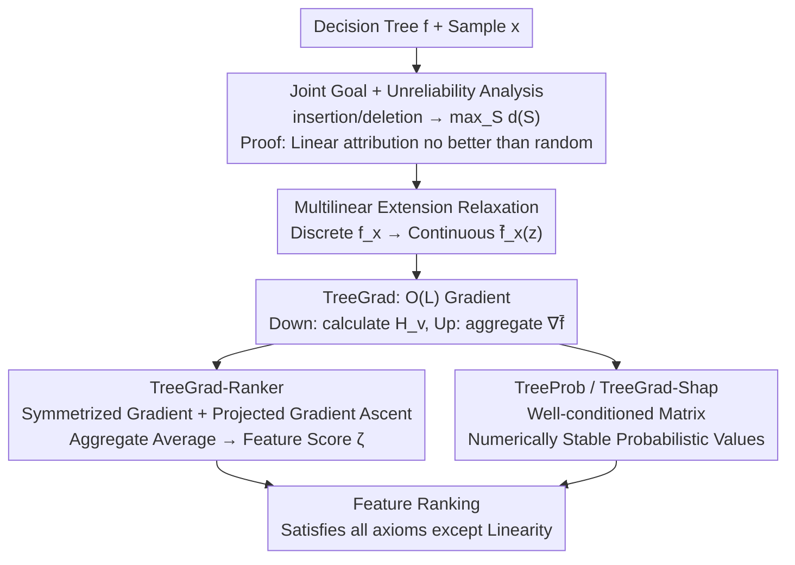

# TreeGrad-Ranker: Feature Ranking via O(L)-Time Gradients for Decision Trees

**Conference**: ICLR 2026  
**OpenReview**: [https://openreview.net/forum?id=OcMeNbkN13](https://openreview.net/forum?id=OcMeNbkN13)  
**Code**: https://github.com/watml/TreeGrad  
**Area**: Interpretability / Feature Attribution / Decision Trees  
**Keywords**: Feature Ranking, Shapley Values, Probabilistic Values, Multilinear Extension, Numerical Stability

## TL;DR
Addressing feature ranking for decision trees, the authors theoretically prove that "probabilistic values" such as Shapley or Banzhaf values are no better than random guessing when optimizing the joint goal corresponding to insertion/deletion metrics. They propose TreeGrad, which computes gradients on multilinear extensions in $O(L)$ time, and construct TreeGrad-Ranker to directly optimize the joint goal along with the numerically stable TreeGrad-Shap, significantly outperforming probabilistic value baselines.

## Background & Motivation
**Background**: Decision trees (especially Gradient Boosted Decision Trees) remain highly competitive on tabular data and are considered "interpretable" due to their rule-based structure. To explain their predictions, mainstream methods utilize Shapley values and their family—more generally known as **probabilistic values**. These are a class of feature attributions uniquely characterized by four axioms: linearity, dummy, monotonicity, and symmetry. Weighted Banzhaf values and Beta Shapley values (including the Shapley value itself) are all semi-values within this class. For trees, Shapley values can be calculated exactly in polynomial time, with the most efficient being the $O(LD)$ time Linear TreeShap ($L$ is the number of leaves, $D$ is the depth).

**Limitations of Prior Work**: Probabilistic values suffer from two overlooked issues. First, there is no "universally optimal" probabilistic value; research by Kwon & Zou et al. found that the best Beta Shapley parameters vary across different datasets, making it unclear which is reliable. Second, while Linear TreeShap is theoretically exact, its implementation requires inverting a **Vandermonde matrix** based on real-valued nodes, whose condition number grows exponentially with depth $D$, causing numerical errors to accumulate explosively in deep trees.

**Key Challenge**: Feature ranking quality is typically measured by **insertion** and **deletion** metrics (the former measures how quickly the prediction increases as high-scoring features are added back; the latter measures how low the prediction drops as low-scoring features are removed). The authors observe that simultaneously optimizing these two metrics is essentially equivalent to a **joint optimization**: finding a feature subset $S$ that maximizes $f_x(S)$ while minimizing its complement $f_x([N]\setminus S)$. As **linear** attribution methods, probabilistic values are fundamentally not designed for this objective.

**Goal**: (1) Clarify the unreliability of probabilistic values regarding this joint objective; (2) Provide a feature ranking algorithm that directly optimizes the joint objective and can be efficiently applied to decision trees; (3) Fix the numerical instability of Linear TreeShap.

**Key Insight**: By continuous relaxation of the discrete set function $f_x: 2^{[N]}\to\mathbb{R}$ into a **multilinear extension** $\bar f_x: [0,1]^N\to\mathbb{R}$, the joint objective becomes a differentiable continuous optimization problem that can be solved via gradient ascent. Crucially, the structure of decision trees is "well-behaved" enough to allow these gradients to be computed in $O(L)$ time.

**Core Idea**: Instead of using linear proxies (probabilistic values) to approximate the joint objective, **directly perform gradient ascent on the joint objective** via its multilinear extension. Use the gradients aggregated during this process as feature scores—this satisfies all axioms characterizing probabilistic values except for linearity (which is precisely the source of unreliability).

## Method

### Overall Architecture
The method follows a main logic: first, formalize the "insertion + deletion joint optimization" problem and prove that linear attribution (probabilistic values) cannot solve it effectively; then, relax the discrete objective to a continuous optimization on the multilinear extension and use TreeGrad to calculate gradients in $O(L)$ time; finally, use gradient ascent to optimize directly and treat the aggregated gradients as feature scores (TreeGrad-Ranker), while also providing numerically stable probabilistic value calculation as a byproduct (TreeProb / TreeGrad-Shap).

Let the joint objective be defined as:

$$\max_{S\subseteq[N]}\ d_{f_x}(S):=\tfrac12\big(f_x(S)-f_x([N]\setminus S)\big).$$

Its multilinear relaxation is $\max_{z\in[0,1]^N}\tfrac12(\bar f_x(z)-\bar f_x(\mathbf 1_N-z))$. The paper proves that when the optimal set $S^*$ is unique, the unique optimal solution to the relaxation is $\mathbf 1_{S^*}$, making the relaxation lossless.

### Key Designs

**1. Joint Goal and Unreliability of Probabilistic Values: Formalizing why linear methods fail at ranking**

The authors align evaluation metrics with the optimization objective. The insertion metric $\mathrm{Ins}(\pi;f_x)=\frac1N\sum_k f_x(S_k^+)$ measures the area under the curve when features are added top-down according to ranking $\pi$. The deletion metric symmetrically measures the result when features are deleted bottom-up. Empirically, higher insertion often corresponds to larger $f_x(S^+_*)$ and lower deletion to smaller $f_x(S^-_*)$. Since the optimal subsets for both are complementary, the "simultaneous optimization of both metrics" is reduced to the joint objective $\max_S d_{f_x}(S)$.

Next is the theoretical core (Proposition 1): If an attribution method $\phi(f_x)$ is **linear** with respect to $f_x$ (which all probabilistic values are), there exist two sets $S_1, S_2$ for $N>3$ such that any hypothesis test based on $\phi$ cannot reliably distinguish between $d_{f_x}(S_1)\le d_{f_x}(S_2)$ and its inverse. The reliability bound $\mathrm{Rel}\le1$, which is **equivalent to random guessing ($h\equiv0.5$)**. The intuition is that linear operators compress a $2^N$-dimensional set function into an $N$-dimensional vector, inevitably losing significant discriminative information. Proposition 2 further explains that the ranking induced by probabilistic values is equivalent to replacing $f_x$ with an **optimal linear proxy** $g^*$ before solving the joint objective—this linearization fails to faithfully represent the behavior of $f_x$. This section provides the theoretical foundation for bypassing linearity.

**2. TreeGrad: Computing Multilinear Extension Gradients in $O(L)$ Time**

Direct optimization of the joint objective requires efficient access to $\nabla\bar f_x(z)$. The partial derivative of the multilinear extension (Owen 1972) is:

$$\nabla_i\bar f_x(z)=\sum_{S\subseteq[N]\setminus i}\Big(\prod_{j\in S}z_j\Big)\Big(\prod_{j\notin S\cup i}(1-z_j)\Big)\,[f_x(S\cup i)-f_x(S)],$$

which is exponential in its naive form. The authors decompose $\bar f_x$ into the sum of rules for each leaf: $\bar f_x=\sum_{v\in L_r}\bar R^v_x$, and prove Lemma 1: $\nabla_i\bar R^v_x(z)=(\gamma_{i,v}-1)\cdot\frac{H_v}{1-z_i+z_i\gamma_{i,v}}$, where $H_v=\frac{\varrho_v c_v}{c_r}\prod_{j\in F_v}(1-z_j+z_j\gamma_{j,v})$. The algorithm performs a tree traversal: **downward** to compute $H_v$ via cumulative products along paths, and **upward** to aggregate the contributions of features across leaves using the $H$ array. The entire process takes $O(L)$ time and space—more efficient than the $O(LD)$ of Linear TreeShap—and is naturally stable as it involves only multiplications and additions without Vandermonde inversion. Special cases like $1-z_i+z_i\gamma_e=0$ are handled in the full version of Algorithm 11.

**3. TreeGrad-Ranker: Direct Optimization via Projected Gradient Ascent and Aggregated Gradients**

With $O(L)$ gradients, gradient ascent can be performed on the relaxed joint objective (Algorithm 2): initialize $z=0.5\cdot\mathbf 1_N$, and at each step use the **symmetrized gradient** $g=\tfrac12(\mathrm{TreeGrad}(z)+\mathrm{TreeGrad}(\mathbf 1_N-z))$. Update $z\leftarrow\mathrm{Proj}(z+\epsilon g)$ by clipping components back to $[0,1]$, and maintain a **sliding average** of the gradients $\zeta\leftarrow\frac{t-1}{t}\zeta+\frac1t g$ as the final feature score. Gradient ascent can also be replaced with ADAM. Treating the average gradient as a score is justified: any symmetric semi-value (including Shapley and Banzhaf) can be written as the expectation of this gradient field; for $T=1$, $\zeta$ is exactly the Banzhaf value. Most importantly, Theorem 1 states: $\zeta_i=\sum_{S}\omega_i(S;x)\,[f_x(S\cup i)-f_x(S)]$ with weights $\omega_i(S;x)>0$ and $\sum_S\omega_i(S;x)=1$. Thus, it satisfies dummy, equal treatment, and monotonicity axioms, **but specifically not linearity**—the very source of unreliability proven in Design 1. This allows TreeGrad-Ranker to keep the "good properties" of probabilistic values while discarding the harmful axiom.

**4. TreeProb / TreeGrad-Shap: Fixing Numerical Collapse in Linear TreeShap via Well-Conditioned Matrices**

As a byproduct, the authors generalize Linear TreeShap to all probabilistic values and fix its numerical issues. The instability of Linear TreeShap stems from inverting a Vandermonde matrix based on real-valued (Chebyshev) nodes, with a condition number that grows exponentially with $D$ (exceeding $10^5$ when $D=20$). The fix (TreeProb) involves replacing real-valued nodes with **equidistantly distributed complex nodes** on the unit circle $\chi_k=e^{i2(k-1)\pi/D}$, making the Vandermonde matrix condition number constant at $1$, where $V^{-1}=\frac1D V$ and $V^T=V$. Building on this, since the Shapley value is a uniform integral of the gradient field, it can be written as a weighted sum of a finite number of gradients using Gauss-Legendre quadrature: $\phi^{\mathrm{Shap}}=\sum_\ell\kappa_\ell\nabla\bar f_x(t_\ell\mathbf 1_N)$. This yields TreeGrad-Shap: an $O(LD)$ method to exactly calculate Beta Shapley values with integer parameters while inheriting numerical stability from TreeGrad. In practice, the error of Linear TreeShap can be $10^{15}$ times larger than that of TreeGrad-Shap.

### Loss & Training
There are no global network parameters to train; "optimization" refers to running gradient ascent on the multilinear extension for a single sample $x$ to obtain feature scores. Experiments use $T=100$ steps and a learning rate $\epsilon=5$. Decision trees are trained using scikit-learn with a random seed fixed at 2025; mean results are reported for 200 randomly sampled $x$ per tree.

## Key Experimental Results

### Main Results
On 9 OpenML datasets (6 classification, 3 regression), the method is compared with the Beta Shapley value family $\mathrm{Beta}(\alpha,\beta)$ (including Shapley=$\mathrm{Beta}(1,1)$), Banzhaf values, and a greedy algorithm using insertion/deletion curves.

| Comparison | insertion (Higher is better) | deletion (Lower is better) | Description |
| :--- | :--- | :--- | :--- |
| TreeGrad-Ranker (GA/ADAM) | Significantly Optimal | Competitive (Near optimal) | Directly optimizes joint goal |
| Beta-Insertion (Best Ins Beta) | High | Average | Single Beta cannot dominate both |
| Beta-Deletion (Best Del Beta) | Average | Low | Trade-off with above |
| Banzhaf / Shapley | Moderate | Moderate | Linear attribution (limited by Prop 1) |
| Greedy | Data dependent | Data dependent | Greedy selection of complementary subsets |

Core Conclusion: For Beta Shapley values, the parameters that yield the best insertion often fail to achieve the best deletion, and vice versa. TreeGrad-Ranker significantly outperforms all baselines in insertion while remaining competitive in deletion.

### Numerical Stability Comparison

| Algorithm | Numerical Error (Shapley) | Condition Number ($D{=}20$) |
| :--- | :--- | :--- |
| Linear TreeShap | Baseline (Highest) | $>10^5$ |
| TreeShap-K | Similarly Unstable | $>10^5$ (Ill-conditioned system) |
| Linear TreeShap (well-conditioned/TreeProb) | Significantly Improved | Close to $1$ |
| TreeGrad-Shap | Minimum (Approx. $10^{15}$x smaller) | — |

### Key Findings
- The "trade-off between two metrics" for probabilistic values is empirically visible: no single Beta parameter dominates both insertion and deletion, validating Design 1's theory that linear attribution fails the joint goal.
- TreeGrad-Ranker's advantage is most prominent in insertion (top-ranking quality), while being equivalent to the best Beta in deletion; this shows direct optimization is better at placing "positive-contribution features" first.
- Numerically, changing Vandermonde nodes from real to complex values on the unit circle is the key move, dropping the condition number from exponential growth to a constant $1$. TreeGrad-Shap minimizes error further.

## Highlights & Insights
- **Mapping evaluation metrics back to optimization goals for impossibility proofs**: Demonstrating that insertion+deletion is equivalent to the joint goal (5) and then proving linear attributions are no better than random guessing turns the debate over using Shapley for ranking into a provable theoretical issue.
- **"Satisfying all axioms except linearity" is a clever positioning**: It retains intuitive properties like dummy and monotonicity while precisely discarding the problematic linearity axiom, resulting in a "rational departure" from Shapley.
- **Reusable $O(L)$ gradient traversal**: This mechanism isn't just for ranking; it serves as a unified backend for calculating semi-values and probabilistic values, naturally extending to other tree-based tasks like interaction values or data valuation.
- **Stability trick for nodes**: Vandermonde ill-conditioning comes from real nodes; moving to equidistant complex nodes on the unit circle is a generic stabilization technique for polynomial interpolation.

## Limitations & Future Work
- The method is designed specifically for **decision trees**; $O(L)$ efficiency relies on tree structure decomposition and cannot be directly transferred to general models like neural networks.
- The equivalence between insertion/deletion and the joint goal (5) is an **empirical observation** rather than a strict equality; the conclusions rely on this approximation.
- TreeGrad-Ranker favors insertion; for scenarios prioritizing bottom-ranking quality (deletion), it may not be strictly superior.
- While TreeProb is an improvement, it can still suffer from underflow at very high node counts; TreeGrad-Shap is truly stable but only covers **integer parameters** for Beta Shapley, leaving non-integer probabilistic values without a stable algorithm.

## Related Work & Insights
- **vs Linear TreeShap / TreeShap-K**: These compute Shapley values exactly in $O(LD)$ but rely on ill-conditioned matrices/equations. TreeGrad uses $O(L)$ arithmetic to avoid inversion, and TreeGrad-Shap uses quadrature, reducing error by $10^{15}$ times.
- **vs Beta Shapley / Banzhaf**: These are linear attributions. This paper theoretically demonstrates they are no better than random for the joint goal. TreeGrad-Ranker optimizes the goal directly, sacrificing linearity for reliability, resulting in significantly better insertion results.
- **vs Greedy Selection**: Greedy methods pick the current best complementary feature at each step. Ours performs projected gradient ascent on a continuous relaxation and aggregates gradients, providing smooth scores that satisfy axioms rather than a pure combinatorial search.

## Rating
- Novelty: ⭐⭐⭐⭐⭐ Formulating metrics as a joint goal and proving linear limitations, followed by an $O(L)$ gradient optimization, is highly novel.
- Experimental Thoroughness: ⭐⭐⭐⭐ Coverage of 9 datasets for classification/regression plus numerical error analysis. However, main results favor curves over a summarized AUC table.
- Writing Quality: ⭐⭐⭐⭐ Technically rigorous with precise notation, though the density of symbols may be high for readers outside the field.
- Value: ⭐⭐⭐⭐ Provides a theoretically grounded and numerically stable tool for feature ranking in trees, along with a reusable stable backend for semi-value calculation.

<!-- RELATED:START -->

## Related Papers

- [\[ICML 2025\] Leveraging Predictive Equivalence in Decision Trees](../../ICML2025/interpretability/leveraging_predictive_equivalence_in_decision_trees.md)
- [\[NeurIPS 2025\] Empowering Decision Trees via Shape Function Branching](../../NeurIPS2025/interpretability/empowering_decision_trees_via_shape_function_branching.md)
- [\[ICML 2025\] Near-Optimal Decision Trees in a SPLIT Second](../../ICML2025/interpretability/near_optimal_decision_trees_in_a_split_second.md)
- [\[ICML 2026\] Manifold-Aligned Guided Integrated Gradients for Reliable Feature Attribution](../../ICML2026/interpretability/manifold-aligned_guided_integrated_gradients_for_reliable_feature_attribution.md)
- [\[AAAI 2026\] ShapBPT: Image Feature Attributions Using Data-Aware Binary Partition Trees](../../AAAI2026/interpretability/shapbpt_image_feature_attributions_using_data-aware_binary_partition_trees.md)

<!-- RELATED:END -->
