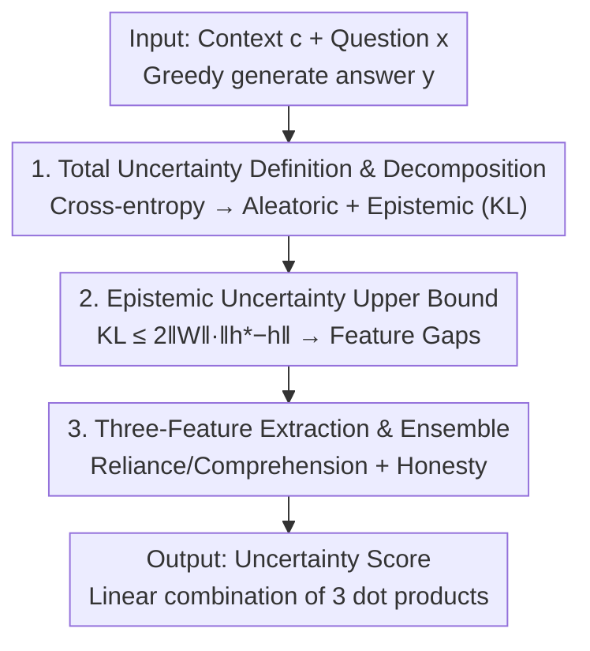

# Uncertainty as Feature Gaps: Epistemic Uncertainty Quantification of LLMs in Contextual Question-Answering

**Conference**: ICLR 2026  
**OpenReview**: [https://openreview.net/forum?id=OWvvdl27CE](https://openreview.net/forum?id=OWvvdl27CE)  
**Code**: [https://github.com/Ybakman/Feature-Gaps](https://github.com/Ybakman/Feature-Gaps)  
**Area**: Interpretability / LLM Uncertainty Quantification  
**Keywords**: Epistemic Uncertainty, Contextual QA, Feature Gaps, Linear Representation Hypothesis, Top-down Interpretability

## TL;DR
This paper derives the epistemic uncertainty of LLMs as the "feature gap between the current model's hidden states and an ideal model." In contextual QA (RAG) scenarios, this gap is approximated using three semantic features (context reliance, context comprehension, and honesty). By extracting feature directions from minimal labeled samples and ensembling them, the method improves PRR by approximately 13–16 points across multiple QA benchmarks with negligible inference overhead.

## Background & Motivation
**Background**: Uncertainty Quantification (UQ) is a core tool for judging whether a generation is trustworthy using internal model signals (token probabilities, consistency, activations). Numerous methods (Semantic Entropy, SAR, SAPLMA, etc.) perform well on various benchmarks.

**Limitations of Prior Work**: Most UQ methods are designed and evaluated on **closed-book factoid QA**, which tests whether the model "possesses knowledge in its memory." However, with the rise of RAG, the more frequent scenario is **contextual QA**, where the model answers questions based on a given document. Existing methods in this area are scarce and mostly **heuristic** (relying on empirical signal selection) without theoretical grounding.

**Key Challenge**: UQ aims to quantify **epistemic uncertainty** (the model's "inability/uncertainty to answer correctly"), but it is often conflated with **aleatoric uncertainty** (ambiguity inherent in the question). Existing heuristic methods neither separate the two nor clarify exactly what they are estimating.

**Goal**: (1) Provide a **theoretically grounded** epistemic uncertainty metric for contextual QA; (2) Implement it as an efficient, low-label, and cross-domain generalizable scorer.

**Key Insight**: The authors start with an "ideal model" hypothesis—an **ideal distribution $P^*$** exists with zero epistemic uncertainty. The gap between the current model and $P^*$ is the epistemic uncertainty. Leveraging the **Linear Representation Hypothesis** from interpretability research, this abstract gap is translated into a **gap in interpretable semantic feature directions** within the hidden space.

**Core Idea**: Replace hard-to-calculate epistemic uncertainty with the "sum of gaps between the current and ideal models in several semantic feature directions." In contextual QA, this gap is assumed to be represented by three specific features: context reliance, context comprehension, and honesty.

## Method

### Overall Architecture
The method consists of two parts: a **general derivation** (applicable to any LLM task) that simplifies "epistemic uncertainty" into "hidden state feature gaps," and a **contextual QA implementation** that concretizes abstract feature gaps into three semantic features for extraction and ensemble scoring.

The theoretical chain is: Define token-level **total uncertainty** as the cross-entropy between the true and model distributions, decomposing it into aleatoric (entropy of the true distribution) and epistemic (KL divergence from true to model) terms. Since $P^*$ is unknown, it is approximated using "the same model with a perfect prompt." The KL term is then proven to be bounded by the **distance of the last-layer hidden states** $\|h_t^* - h_t\|$. Finally, utilizing the linear representation hypothesis, this distance is expressed as the **sum of coefficient differences across a set of semantic feature directions**—the "feature gaps." In implementation, only the three most relevant feature directions are kept, extracted via contrastive prompts + PCA, and integrated using three trained scalar weights.

### Key Designs

**1. Total Uncertainty Definition and Aleatoric/Epistemic Decomposition: Splitting "how uncertain the model should be"**

Existing methods lack clarity on what they estimate. This paper provides a clear definition. Let $P^*(\cdot\mid x)$ be the **true distribution** of an ideal model (no epistemic uncertainty) and $P(\cdot\mid x,\theta)$ be the current model. The total uncertainty (TU) for token $y_t$ is the cross-entropy:

$$\text{TU} = -\sum_{y_t\in V} P^*(y_t\mid y_{<t},x)\,\ln P(y_t\mid y_{<t},x,\theta).$$

It decomposes into:

$$\text{TU} = \underbrace{H\big(P^*(y_t\mid y_{<t},x)\big)}_{\text{Aleatoric (Data) Uncertainty}} + \underbrace{\mathrm{KL}\big(P^*\,\|\,P(\cdot\mid\theta)\big)}_{\text{Epistemic Uncertainty}}.$$

The first term is the entropy of the true distribution—inherent ambiguity where multiple answers are correct, independent of model capability. The second KL term measures how far the model deviates from the ideal, representing **epistemic uncertainty**. Notably, the authors **swap the positions of $P^*$ and $P$** relative to Schweighofer et al. (2024), placing $P^*$ on the outside and $P$ inside the logarithm, so the epistemic term reflects "the model's deficiency relative to the ideal."

**2. Hidden State Upper Bound for Epistemic Uncertainty: Replacing KL with measurable gaps**

$P^*$ is unknown, making the KL term impossible to calculate directly. The authors approximate the ideal model as "the same model perfectly guided by an optimal prompt $s^*$." Because a prompt is theoretically equivalent to fine-tuning in token space and holds Turing-complete expressivity, there exists some $s^*$ such that $P(\cdot\mid x,s^*,\theta) \approx P^*$, denoted as $\theta^*$. Here, $\theta$ and $\theta^*$ **share identical architecture weights, differing only in activations due to the prompt**.

Enumerating $s^*$ is infeasible, but the authors prove an upper bound (Lemma 1):

$$\mathrm{KL}\big(P(y_t\mid x,\theta^*)\,\|\,P(y_t\mid x,\theta)\big) \le 2\|W\|\,\|h_t^* - h_t\|,$$

where $h_t^*$ and $h_t$ are the last-layer hidden states of the ideal and current models, respectively, and $W$ is the vocabulary projection matrix. Since $2\|W\|$ is fixed and UQ only concerns the **relative scale** of uncertainty, estimating epistemic uncertainty reduces to **estimating the distance between two hidden states** $\|h_t^* - h_t\|$. This step transforms a "probability distribution gap" into a "representation space distance."

**3. Splitting distance into feature gaps via linear representation and ensembling three features**

$h_t^*$ remains unknown. The authors use the **Linear Representation Hypothesis**: high-level semantic features are linearly encoded in activation space as directions. Using residual connections, hidden states are written as linear combinations of feature vectors: $h_t = \sum_{v_i\in F} \alpha_i v_i$ and $h_t^* = \sum_{v_i\in F} \beta_i v_i$. The distance becomes:

$$\|h_t^* - h_t\| = \Big\|\sum_{v_i\in F} (\beta_i - \alpha_i) v_i \Big\|.$$

Each $(\beta_i - \alpha_i)$ is the **feature gap** between the current and ideal model in an interpretable semantic direction. Since $F$ is too large, it is assumed that three features $H \subset F$ suffice for contextual QA: **Context Reliance** (using context vs. parametric knowledge), **Context Comprehension** (extracting/reasoning information), and **Honesty** (avoiding sycophancy or fabrication). Syntactic features are ignored as modern LLMs have mastered them.

Extraction uses **top-down interpretability** (similar to Zou et al. 2025). For each feature, **contrastive prompt pairs** generate activation differences, and PCA identifies the strongest direction. For "Context Reliance":

$$m_i^l = \theta^l(y_i,\,x_i+\text{“look at the context”},\,c_i) - \theta^l(y_i,\,x_i+\text{“use your own knowledge”},\,c_i), \quad v^l = \text{PCA}([m_1^l, \dots, m_T^l]).$$

For "Context Comprehension," it compares "original context" vs. "context + ground truth." For "Honesty," it compares "be honest" vs. "be a liar." The best layer for each feature is selected via PRR. Ensembling uses $\beta_i = w_i \alpha_i$, learning three scalar weights $(w_1, w_2, w_3)$ to fit generation correctness. The final score is a linear combination of three dot products.

### Loss & Training
Only three scalar ensemble weights $(w_1, w_2, w_3)$ are trained to minimize binary cross-entropy against generation correctness. Feature vectors are extracted via non-parametric PCA, and layers are selected by PRR. Supervision uses correctness labels (judged by Gemini-2.5-flash). The default uses 256 labeled samples, remaining functional with as few as 64.

## Key Experimental Results

### Main Results
- Datasets: Qasper (Research Papers), HotpotQA (Multi-hop), NarrativeQA (Long documents).
- Models: LLaMA-3.1-8B, Mistral-v0.3-7B, Qwen2.5-7B.
- Metrics: AUROC, PRR (0 = random, 1 = perfect rejection).

Comparison of PRR/AUROC on LLaMA-3.1-8B (Selected):

| Category | Method | Qasper PRR | HotpotQA PRR | NarrativeQA PRR |
| :--- | :--- | :--- | :--- | :--- |
| Unsupervised, No Sampling | Perplexity | 47.7 | 50.8 | 57.9 |
| Unsupervised, Sampling | SAR | 53.9 | 53.5 | 59.7 |
| Unsupervised, Sampling | Semantic Entropy | 42.7 | 47.6 | 51.9 |
| Supervised, No Sampling | SAPLMA | 59.9 | 53.0 | 47.3 |
| Supervised, No Sampling | LookBackLens | – | 53.3 | – |
| **Ours** | **Feature-Gaps** | **64.9** | **66.6** | **59.7** |

Ours achieves the top-tier PRR/AUROC across almost all combinations, with gains up to 16/13 PRR points over the strongest baselines, without sampling or extra forward passes (faster than Semantic Entropy or KLE). A notable failure occurs with Mistral-7B on NarrativeQA (PRR 38.5) due to the 32k context window limit being exceeded by 13.3% of samples.

### Ablation Study
Single Features vs. Ensemble (LLaMA-3.1-8B, PRR):

| Feature | Qasper | HotpotQA | NarrativeQA |
| :--- | :--- | :--- | :--- |
| Honesty | 62.0 | 57.7 | 56.7 |
| Context Reliance | 43.6 | 38.8 | -16.9 |
| Context Comprehension | 59.6 | 66.8 | 52.2 |
| Ensemble | 64.9 | 66.6 | 59.7 |

Feature Direction vs. Baseline Directions (LLaMA-3.1-8B, PRR):

| Direction | Qasper | HotpotQA | NarrativeQA |
| :--- | :--- | :--- | :--- |
| Random | 34.5 | 29.5 | 17.4 |
| Mean-Diff | 48.5 | 53.1 | 36.6 |
| **Feature-Gaps** | **64.9** | **66.6** | **59.7** |

### Key Findings
- **Ensemble provides stability, not just additive gains**: Single features are already strong estimators, but the **optimal feature varies** by dataset and model. Ensembling smooths these fluctuations, providing cross-domain stability.
- **Superior OOD Generalization**: In cross-dataset training/testing, this method outperforms SAPLMA (which fits activations directly), as semantic directions are more robust to distribution shifts.
- **Data Efficiency**: Performance remains stable with 128 samples and stays competitive with only 64.
- **Direction Selection is Critical**: Feature directions from top-down contrastive PCA significantly outperform random or Mean-Diff directions.

## Highlights & Insights
- **Bridging abstract uncertainty to measurable distances**: The chain (Cross-entropy decomposition $\rightarrow$ Ideal model approximation $\rightarrow$ KL upper bound $\rightarrow$ Feature gaps) is theoretically elegant and results in a simple implementation of three dot products.
- **Prompting as the "Ideal Model"**: Using the same model with an optimal prompt as $P^*$ avoids training a second model and ensures natural alignment of feature directions through shared weights.
- **Ensemble for Robustness**: The ablation reveals that the value of ensembling lies in OOD stability rather than absolute score increases, an honest and convincing insight.
- **Generalizable Feature Extraction**: The top-down contrastive PCA approach can be applied to any attribute (toxicity, style, sycophancy) by designing appropriate stimuli prompts.

## Limitations & Future Work
- **Heuristic Feature Selection**: The three features are assumed rather than proven sufficient; alternate tasks (math, code) would require new feature sets.
- **Reliance on Context Window**: Failure on long documents (Mistral) indicates vulnerability to unreliable coding in extended contexts.
- **Ideal Model Approximation Gap**: The error introduced by using prompts to approximate $P^*$ is not quantified.
- **Future Directions**: Automated feature discovery, extending the framework to open-ended generation or closed-book QA, and robust feature extraction for long contexts.

## Related Work & Insights
- **vs. SAPLMA / ATMD**: These fit classifiers directly on activations. Ours uses supervision only for ensemble weights of interpretable directions, leading to better OOD generalization.
- **vs. LookBackLens**: This requires attention weights, which causes OOM on long documents. Ours uses hidden states and dot products, which are computationally negligible.
- **vs. Sampling-based (Semantic Entropy / SAR)**: These require multiple generations and clustering. Ours is sampling-free and requires only a single forward pass.
- **vs. Schweighofer et al. (2024)**: This paper swaps the position of $P^*$ and $P$ to derive an epistemic term that fits the intuition of "ideal model deficiency."

## Rating
- **Novelty**: ⭐⭐⭐⭐⭐ Elegantly connects epistemic uncertainty to interpretable feature gaps.
- **Experimental Thoroughness**: ⭐⭐⭐⭐ Solid results across datasets and OOD tests, though limited to contextual QA.
- **Writing Quality**: ⭐⭐⭐⭐⭐ Clear, logical progression from theory to implementation.
- **Value**: ⭐⭐⭐⭐⭐ High practical value for RAG error detection with near-zero overhead.

<!-- RELATED:START -->

<!-- RELATED:END -->

## Related Papers

- [\[ICML 2026\] MiniMax Learning of Interpretable Factored Stochastic Policies from Conjoint Data, with Uncertainty Quantification](../../ICML2026/interpretability/minimax_learning_of_interpretable_factored_stochastic_policies_from_conjoint_dat.md)
- [\[ICML 2026\] Courtroom Analogy: New Perspective on Uncertainty-Aware Classification](../../ICML2026/interpretability/courtroom_analogy_new_perspective_on_uncertainty-aware_classification.md)
- [\[ICLR 2026\] Taming Polysemanticity in LLMs: Theory-Grounded Feature Recovery via Sparse Autoencoders](taming_polysemanticity_in_llms_theory-grounded_feature_recovery_via_sparse_autoe.md)
- [\[ICML 2025\] On the Effect of Uncertainty on Layer-wise Inference Dynamics](../../ICML2025/interpretability/on_the_effect_of_uncertainty_on_layer-wise_inference_dynamics.md)
- [\[NeurIPS 2025\] Improving Perturbation-based Explanations by Understanding the Role of Uncertainty Calibration](../../NeurIPS2025/interpretability/improving_perturbation-based_explanations_by_understanding_the_role_of_uncertain.md)

<!-- RELATED:END -->
