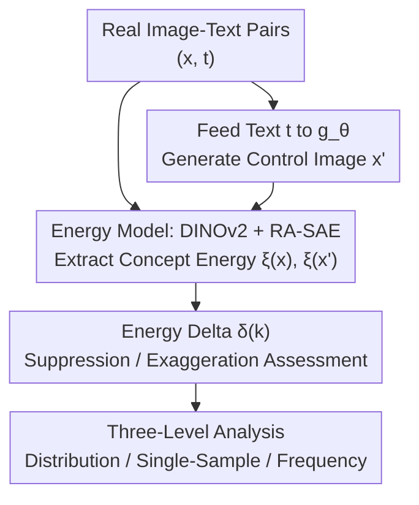

# Uncovering Conceptual Blindspots in Generative Image Models Using Sparse Autoencoders

**Conference**: ICLR 2026  
**OpenReview**: [https://openreview.net/forum?id=2sNrnTTEcv](https://openreview.net/forum?id=2sNrnTTEcv)  
**Code**: https://conceptual-blindspots.github.io  
**Area**: Interpretability / Diffusion Models / Generative Evaluation  
**Keywords**: Sparse Autoencoders, Conceptual Blindspots, Generative Image Models, DINOv2, Energy-Based Models

## TL;DR
This paper proposes a framework to systematically diagnose "conceptual blindspots" using Sparse Autoencoders (SAEs). By mapping both real and model-generated images onto 32,000 interpretable concepts learned by an RA-SAE, it introduces an energy delta metric $\delta(k)$ to quantify whether each concept is "suppressed" or "exaggerated" in the generative distribution. This transforms anecdotal generation failures (e.g., inability to draw bird feeders or incorrect finger counts) into quantifiable, comparable, and explorable structured analyses.

## Background & Motivation
**Background**: Text-to-image diffusion models trained on large-scale data (SD, PixArt, Kandinsky, etc.) exhibit impressive capabilities. However, numerous qualitative and quantitative studies have found they fail on seemingly simple concepts, such as human hands, groups of four objects, or negative relations. Despite these concepts appearing frequently in training data, the models fail to represent them correctly.

**Limitations of Prior Work**: These failures are mostly documented as anecdotal records ("I tried and it couldn't draw X"), lacking systematicity. Existing generative evaluation tools are inadequate: FID only measures global realism and misses distribution-level conceptual gaps; CLIPScore and coverage statistics provide some clues but remain at the image level rather than fine-grained concepts; human surveys or open exploration can identify problems but are not scalable or horizontally comparable.

**Key Challenge**: To determine if a concept is a "blindspot," one must essentially compare two probabilities: the likelihood of the concept appearing in the **real data generation process** versus its likelihood in the **trained model's** generation. Existing metrics do not explicitly align these two distributions at the conceptual level, failing to answer whether a failure is an individual conceptual quirk or a systemic phenomenon.

**Goal**: To design an automatic, unsupervised method to identify concepts that exist in the real distribution but are missing or distorted in the model's generation, and to quantify the degree of distortion.

**Key Insight**: Leveraging theoretical results that self-supervised representations can "invert" the data generation process, the authors assume DINOv2 features approximately align underlying concepts into orthogonal directions. Training an SAE on these features decomposes high-dimensional activations into sparse, interpretable conceptual dimensions, where the activation value of each dimension serves as an estimate of that concept's "energy."

**Core Idea**: Use SAEs to project both real and generated images onto the same set of interpretable conceptual bases, defining and locating conceptual blindspots of generative models through differences in conceptual activation energy.

## Method

### Overall Architecture
The core problem is: given a generative model $g_\theta$, how to determine which concepts are systematically suppressed or exaggerated. The pipeline logic is as follows: take a set of real image-text pairs $(x, t)$, feed the text $t$ into $g_\theta$ to generate corresponding "control images" $x'$; then pass both real images $x$ and generated images $x'$ into the same "energy model" (DINOv2 + RA-SAE) to obtain sparse concept energy vectors $\xi(x)$ and $\xi(x')$; finally, compare the statistical differences between the two sets of energies at each conceptual dimension to derive the energy delta $\delta(k)$, identifying blindspots and performing analysis at the distribution, single-sample, and frequency levels.

### Key Designs

**1. Formalization of Conceptual Blindspots: Converting Failures into Probability Ratios**

The pain point was the lack of a unified, quantifiable definition of blindspots beyond anecdotes. The authors assume a Data Generation Process (DGP) where latent concepts $c \in C$ follow a Boltzmann prior $p(c)=\exp(-E(c))Z^{-1}$ with linearly decomposable energy $E(c)=\sum_k E(c_k)$, generating images via an invertible mapping $G$. An energy model $\xi: X \to \mathbb{R}^d$ is introduced such that $\xi_k(x)$ estimates the energy $E(c_k)$ of the $k$-th concept. Thus, the unnormalized probability mass of dataset $D$ on concept $k$ is $p_k(D) \propto \exp(-\sum_{x\in D}\xi_k(x))$. The "energy delta" metric is defined as:

$$\delta_{g_\theta \leftrightarrow G}(k) = \sigma\!\left(\mathbb{E}_{x'}[\xi_k(x')] - \mathbb{E}_{x}[\xi_k(x)]\right) = \frac{p_k(D'_X)}{p_k(D_X) + p_k(D'_X)}$$

This represents the proportion of the likelihood of the concept in the generated set $D'_X$ relative to the sum of likelihoods in both generated and real sets, ranging in $(0, 1)$. The cleverness lies in compressing the "model vs. real" conceptual comparison into a sigmoid-mapped relative ratio, which is naturally neutral at $0.5$ and symmetric, allowing consistent evaluation across 32,000 concepts.

**2. Criteria for Blindspots: Using Thresholds to Segment Suppression and Exaggeration**

With $\delta(k)$ defined, the thresholds for blindspots must be specified. The authors define: $\delta(k) < \lambda_{\min}$ as a **suppressed blindspot** (concept significantly underestimated by the model, e.g., bird feeders, DVDs, plain white areas on documents), and $\delta(k) > \lambda_{\max}$ as an **exaggerated blindspot** (concept over-generated, e.g., wood grain backgrounds, palm trees, shadows under animals). The paper uses $\lambda_{\min}=0.1$ and $\lambda_{\max}=0.9$. The distinction from classic "mode collapse" is granularity: mode collapse concerns the likelihood of the entire image being suppressed/exaggerated, while this focuses on **specific concepts**—for example, the model's inability to draw a "white background" is a suppressed conceptual blindspot here, not a global image collapse.

**3. RA-SAE Energy Model: Learning 32,000 Reproducible Conceptual Directions on DINOv2**

To ensure $\xi_k$ corresponds to human-understandable concepts, DINOv2's high-dimensional features are decomposed into sparse, stable conceptual bases. The authors use an SAE to decompose the feature matrix $A \in \mathbb{R}^{n\times d}$ into a conceptual dictionary $D \in \mathbb{R}^{d\times K'}$ and sparse encodings $Z=\Psi(A)$, with a reconstruction objective subject to sparsity and non-negativity:

$$\min_{\Psi,D}\ \|A - \Psi(A)D^\top\|_F^2 \quad \text{s.t.}\quad \Psi(A)\ge 0,\ \|\Psi(A)_i\|_0 \ll K'$$

Standard SAE dictionaries suffer from random directional drift and high sensitivity to seeds, making analysis non-reproducible. The authors employ **Archetypal SAE (RA-SAE)** with top-K sparsity: the dictionary is constrained as a convex combination of training data $D = WA$, where $W$ is a row-stochastic matrix ($W\ge 0, W\mathbf{1}=\mathbf{1}$). Thus, every conceptual atom lies within the data convex hull $\mathrm{conv}(A)$, and any reconstruction lies within the data conical hull, ensuring concepts are "faithful to the data support" and stable across seeds. Each concept is then labeled via an automated interpretability pipeline (examining high-activation examples + LLM descriptions). This RA-SAE learns **32,000 concepts** on DINOv2, the largest scale of its kind, providing the foundation for fine-grained blindspot analysis.

**4. Three-Level Analysis: From Distribution to Samples to Frequency**

The analysis is organized into three levels. At the **Distribution level**, $\delta(k)$ histograms across 32,000 concepts reveal that all four tested models are heavy-tailed, with the left tail (suppression) being denser and longer (negative skewness), indicating a shared tendency toward "conceptual omission." UMAP projections colored by $\delta$ show blindspots clustering in a structured manner. At the **Single-sample level**, pairs with the largest and smallest mean $\delta$ differences are examined—those with near-zero differences often represent **memorization** (copying high-frequency visual templates) rather than faithful generation, while 56.3% of high-discrepancy samples verified by VLMs are genuine blindspots (clear captions but failed generation). At the **Frequency level**, the empirical frequency of concepts in real data $\|Z_{:,i}\|_0$ correlates with the energy delta: high-frequency concepts have low deltas, while long-tail rare concepts (especially suppressed ones) show large alignment errors—suggesting many blindspots stem from long-tail distributions rather than random noise.

### A Complete Example
Consider the concept of "pure white/blank space on a document": take real image-text pairs where captions explicitly mention a white background; feed these captions into SD 1.5/2.1, PixArt, and Kandinsky; pass all images through DINOv2 + RA-SAE to locate the "pure white document" conceptual dimension and calculate its energy. Results show that $\delta(k)$ for all four models falls into the suppression zone—despite explicit captioning, no model produces a clean white background, indicating this conceptual space is systematically undersampled. In contrast, the "frying pan" concept reveals model-specific blindspots: while three models succeed, Kandinsky lacks it, matching the finding that some blindspots are shared while others are model-specific.

## Key Experimental Results

### Main Results
Four generative models trained on LAION-5B (SD 1.5, SD 2.1, PixArt, Kandinsky) were analyzed using $|X|=10,000$ real image-text pairs and their generated counterparts across 32,000 concepts.

| Analysis Dimension | Key Observation | Meaning |
|--------------------|-----------------|---------|
| $\delta(k)$ Skewness | SD 2.1 = −0.54, SD 1.5/PixArt = −0.40, Kandinsky = −0.23 | All left-skewed; suppression is a universal tendency |
| Cross-model $\delta$ Correlation | SD 1.5↔2.1: $r=0.82$; SD 1.5↔PixArt: $r=0.41$; SD 1.5↔Kandinsky: $r=0.46$ | Shared blindspots within architectures; variance across architectures |
| High-discrepancy VLM Review | 56.3% of 200 high-discrepancy samples are genuine blindspots | Large discrepancies are not purely caused by poor captions |

### Ablation Study

| Analysis | Setting | Conclusion |
|----------|---------|------------|
| Post-training Effect (DPO) | Compare SD 1.5 with/without DPO using $\|\xi(D'_X)-\xi(D_X)\|_2$ | DPO version has lower median/narrower distribution; better distribution alignment |
| Frequency—Alignment | Concept frequency $\|Z_{:,i}\|_0$ vs. $\|\delta\|$ | High-frequency concepts align well; long-tail concepts (especially suppressed) have high error |
| Model-specificity of Exaggeration | Identify unique exaggerated concepts | Few clear examples; exaggeration is largely shared across models |

### Key Findings
- **Suppression is more prevalent and structured than exaggeration**: $\delta(k)$ histograms are left-skewed, and suppressed concepts cluster in UMAP, indicating shared biases in training distributions or architectural priors.
- **Blindspots are both shared and specific**: High consistency within the SD family ($r=0.82$) but weak correlation with PixArt/Kandinsky suggests some blindspots originate from the dataset while others stem from training dynamics/capacity.
- **"Apparent perfection" may be memorization**: Samples with near-zero $\delta$ often involve copying training templates, allowing "memory traces" to be diagnosed within the same framework.
- **Blindspots correlate with long-tail frequency**: Rare concepts are more likely to be blindspots, suggesting potential mitigation through data reweighting or augmentation rather than just architectural changes.

## Highlights & Insights
- **From Anecdote to Metrics**: The sigmoid energy ratio $\delta(k)$ unifies "suppression" and "exaggeration" into a single, symmetric metric that can be applied at scale across tens of thousands of concepts.
- **Reproducibility via RA-SAE**: By constraining the dictionary to the data convex hull, concepts remain faithful to data support and insensitive to random seeds, facilitating rigorous scientific conclusions.
- **Multi-purpose Pipeline**: The $\delta$ metric serves various tasks, including memorization detection, poor caption filtering, quantifying DPO effects, and cross-architecture comparison.
- **Transferable Logic**: The paradigm of projecting real vs. model distributions onto shared interpretable conceptual bases can be extended to video, audio, or 3D generation, or used as a regularization term during training to correct long-tail concepts.

## Limitations & Future Work
- **Reliance on DINOv2 + RA-SAE Coverage**: Concepts not represented well by these models fall outside the analysis scope; the framework cannot see its own "meta-blindspots."
- **Limited Sample and Combinatorial Statistics**: While 10,000 images are substantial, they may not cover the extreme long-tail or complex conceptual combinations (as noted in Appendix K).
- **Diagnostic rather than Interventional**: The work focuses on identifying and characterizing blindspots, without yet incorporating the energy profiles into training (e.g., prioritized sampling or reweighting).
- **Strong DGP Assumptions**: Assumptions such as invertible generation, concept orthogonality, and linearly separable energy may not hold perfectly in real-world data, leaving a gap between theory and empirical observation.

## Related Work & Insights
- **vs. FID / CLIPScore**: Traditional metrics measure global image realism or coarse coverage but miss conceptual distribution mismatches. Ours enables precise, dimension-wise comparison across 32,000 concepts.
- **vs. Mode Collapse Research**: While mode collapse focuses on image-level probability drops, this work focuses on specific concepts, identifying why "white backgrounds," for instance, are missing.
- **vs. Existing SAE Interpretability**: Previous SAE work primarily explained internal representations of discriminative or language models. This work repurposes SAEs as "energy models" to compare two image distributions, utilizing RA-SAE to ensure reproducibility and data faithfulness.

## Rating
- Novelty: ⭐⭐⭐⭐⭐ First to formalize "conceptual blindspots" via energy deltas and apply diagnosis effectively at 32,000-concept granularity.
- Experimental Thoroughness: ⭐⭐⭐⭐ Covers four models and three levels of analysis, though sample sizes for combined statistics remain limited.
- Writing Quality: ⭐⭐⭐⭐ Clear interleaving of intuition and formalization, though the energy model and DGP assumptions are somewhat technical.
- Value: ⭐⭐⭐⭐⭐ Provides a reusable open-source diagnostic tool for evaluating, correcting, and performing post-training analysis on generative models.

<!-- RELATED:START -->

## Related Papers

- [\[ICLR 2026\] Toward Faithful Retrieval-Augmented Generation with Sparse Autoencoders](toward_faithful_retrieval-augmented_generation_with_sparse_autoencoders.md)
- [\[ICML 2026\] Sparse Autoencoders are Topic Models](../../ICML2026/interpretability/sparse_autoencoders_are_topic_models.md)
- [\[ICLR 2026\] Sparse Autoencoders Trained on the Same Data Learn Different Features](sparse_autoencoders_trained_on_the_same_data_learn_different_features.md)
- [\[ICLR 2026\] AbsTopK: Rethinking Sparse Autoencoders For Bidirectional Features](abstopk_rethinking_sparse_autoencoders_for_bidirectional_features.md)
- [\[ICLR 2026\] On the Limits of Sparse Autoencoders: A Theoretical Framework and Reweighted Remedy](on_the_limits_of_sparse_autoencoders_a_theoretical_framework_and_reweighted_reme.md)

<!-- RELATED:END -->
