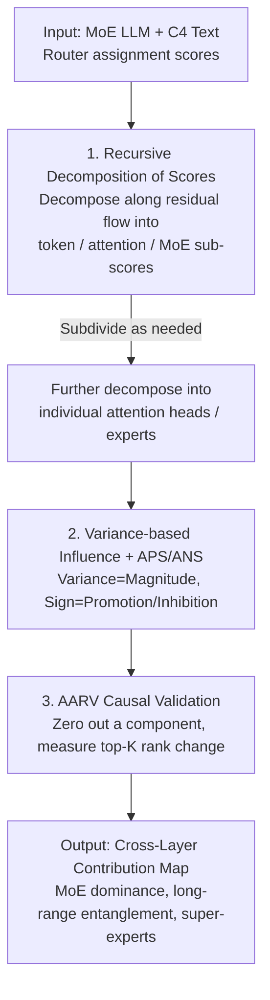

# Understanding Cross-Layer Contributions to Mixture-of-Experts Routing in LLMs

**Conference**: ICLR 2026  
**OpenReview**: [https://openreview.net/forum?id=BqyPLOkxFY](https://openreview.net/forum?id=BqyPLOkxFY)  
**Code**: https://github.com/wengangli/routing-contribution  
**Area**: Mechanistic Interpretability / LLM / MoE  
**Keywords**: Mixture-of-Experts, Routing Mechanism, Mechanistic Interpretability, Cross-layer Decomposition, Expert Entanglement

## TL;DR
This paper proposes a lightweight **recursive decomposition** method to decompose the assignment scores given by MoE routers into contributions from "token embeddings + attention outputs of each layer + MoE outputs of each layer," and even down to individual attention heads or experts. By using score **variance** to measure influence, it reveals for the first time from a cross-layer perspective that MoE routing is not a local decision but is jointly shaped by entanglement effects among deep components.

## Background & Motivation

**Background**: Mixture-of-Experts (MoE) uses a router to assign each token to only top-K experts, leveraging sparse activation to scale models without proportionally increasing computation. This has become a standard for frontier LLMs like Grok-1, Gemini 2.5, DeepSeek, and Qwen3. However, there is a lack of mechanistic understanding regarding how routers make decisions.

**Limitations of Prior Work**: Past interpretability research has almost exclusively stayed at the **expert level**—analyzing expert domain/token specialization, co-activation of experts in the same layer, or similarities between expert weights and gating scores. These works study correlations "between experts" or "between experts and tokens," yet **ignore the interactions between the router and other model components (especially the attention and MoE outputs of preceding layers)**.

**Key Challenge**: Is the routing decision truly a **local process** as commonly assumed (depending only on the current layer's input)? Or do components from many preceding layers influence the router's selection across layers and long distances? If the latter is true, analyzing solely at a single-layer or single-expert granularity will never clarify the routing mechanism.

**Goal**: This paper aims to **decompose layer-by-layer** the "router assignment scores" along the Transformer's residual structure to quantitatively answer three sub-questions: (1) Which of the three types of components—tokens, attention, or MoE—has a greater impact on subsequent routing? (2) Is this influence local or long-range across layers? (3) Do a minority of components (experts/attention heads) consistently dominate routing?

**Key Insight**: The authors noted a critical mathematical fact: the MoE assignment score is essentially the dot product of the "routing weight vector" and the "MoE layer input." Since the MoE layer input is accumulated through residuals, it can be expanded into a linear combination of all preceding components. Because the dot product satisfies the distributive property over addition, **the scores can naturally be decomposed into a sum of sub-scores contributed by each component**.

**Core Idea**: Use "**recursive decomposition of assignment scores + variance to measure influence**" to restore a scalar score into a cross-layer, cross-component contribution spectrum, dissecting MoE routing from a mechanistic interpretability perspective.

## Method

### Overall Architecture

The methodology can be summarized as an analysis pipeline: given an MoE LLM and a batch of text, the router's assignment scores for each expert are **recursively decomposed** along the residual stream into three types of sub-scores: "token embeddings / preceding attention layers / preceding MoE layers," which can be further subdivided into individual attention heads and experts. Then, for each type of component, its **variance** in scoring all experts in the same MoE layer is used to measure its "influence on that layer's routing." Average Positive/Negative Scores (APS/ANS) are used to determine whether it **promotes** or **inhibits** an expert's selection. Finally, a causal metric AARV, based on zero-out perturbations, validates whether "high variance" is truly equivalent to "ability to change top-K selection." These three steps are interconnected: decomposition identifies contributors, variance measures the magnitude of contribution, and AARV confirms causal validity.

### Key Designs

**1. Recursive decomposition of assignment score: Breaking a scalar score into sums of cross-layer component contributions**

This step addresses the pain point that "routing scores are black-box scalars with unclear drivers." Starting from the MoE residual structure: the block output of layer $\ell$ is $x^\ell_{out,i}=x^\ell_{in,i}+a^\ell_{out,i}+m^\ell_{out,i}$ (input + attention output + MoE output). Through cumulative summation, the input $m^\ell_{in,i}$ to the MoE at layer $\ell$ equals the token embedding $x^0_{in,i}$ plus all preceding attention outputs and preceding MoE outputs. The assignment score for expert $n$ is the dot product $S(g^{\ell,n}, m^\ell_{in,i})=g^{\ell,n}\cdot m^\ell_{in,i}$. Using the distributive property, this scalar is decomposed into a series of sub-scores:

$$S(g^{\ell,n}, m^\ell_{in,i}) = g^{\ell,n}\cdot \overline{\mathrm{LN}}^\ell_i(x^0_{in,i}) + g^{\ell,n}\cdot\sum_{c=1}^{\ell}\overline{\mathrm{LN}}^\ell_i(a^c_{out,i}) + g^{\ell,n}\cdot\sum_{c=1}^{\ell-1}\overline{\mathrm{LN}}^\ell_i(m^c_{out,i})$$

Where $\overline{\mathrm{LN}}^\ell_i(\cdot)$ is the **approximate layer normalization** defined by the authors. Since RMSNorm is non-linear, the authors distribute the "normalization factor of the total input" proportionally to each component: $\overline{\mathrm{LN}}^\ell_i(c)=\frac{c\cdot\gamma^\ell}{\mathrm{RMS}(z)}$. Attention sub-scores can be further split into $(head, query, key)$ contributions, and MoE sub-scores into contributions from selected experts.

**2. Variance measures influence, APS/ANS distinguishes promotion and inhibition**

The authors provide **Proposition 1**: The **variance** of the scores assigned by a component to all experts in the same MoE layer measures its influence. Intuitively, if a component assigns the same constant score to all experts (variance of 0), removing it does not change the relative gap between experts and thus has no effect on top-K selection. **Proposition 2** uses the sign of the score: a positive score indicates the component **promotes** the selection, while a negative score indicates **inhibition**. To avoid cancellation, APS and ANS are calculated separately: $\mathrm{APS}=\frac{1}{N}\sum_n S(g_j,c)\mathbb{1}_{S>0}$ and $\mathrm{ANS}=\frac{1}{N}\sum_n S(g_j,c)\mathbb{1}_{S<0}$.

**3. AARV causal metric: Validating if "high variance" truly changes top-K selection**

The authors propose **AARV (average absolute ranking variation of top-K experts)**: zero out the scores contributed by a specific component and observe how much the average ranking of the original top-K experts changes: $\mathrm{AARV}=\frac{1}{K}\sum_{e\in\text{top-K}}|\mathrm{rank}_{orig}(e)-\mathrm{rank}_{pert}(e)|$. A high AARV directly proves causal control over routing.

## Key Experimental Results

### Main Results

Evaluations were conducted on OLMoE, DeepSeek-V2-Lite, Qwen3-30B-A3B, and Mixtral-8x7B using the C4 dataset.

| Phenomenon | Observation | Implication |
| :--- | :--- | :--- |
| Influence of Components | MoE output variance is generally higher than attention output variance. | MoE outputs have the strongest and most persistent influence on subsequent routing. |
| Token Influence | Variance decreases rapidly with depth, peak at the first two layers. | Tokens only strongly influence routing in shallow layers. |
| Promotion vs. Inhibition | APS appears mostly in shallow sender layers (local); ANS strengthens at depth. | Promotion is local; inhibition is global. |
| Cross-layer Entanglement | OLMoE M1 and M4 layers show high variance across many subsequent layers ("stripes"). | Routing involves long-range entanglement and is not a local decision. |

### Ablation Study

| Configuration | Key Metric | Description |
| :--- | :--- | :--- |
| Zeroing M1E9 scores | M5/M10/M15 AARV increases significantly | M1E9 causally dominates top-K selection in these layers. |
| Zeroing other M1 experts | AARV remains nearly unchanged | Other experts have negligible influence on routing. |
| Removing M1E9 / M4E14 | Influence drops sharply after Layer 5 | These experts must coexist to exert significant cross-layer influence. |

### Key Findings
- **MoE Output > Attention Output**: Subsequent routing is shaped more by preceding MoE outputs than attention outputs, challenging the "local computation" assumption.
- **Local Promotion, Global Inhibition**: Positive scores are concentrated in shallow neighbors, while negative scores (inhibition) strengthen and span longer ranges as depth increases.
- **Minority Component Dominance**: A few experts (e.g., OLMoE M1E9) and attention heads consistently influence routing across layers. These do not perfectly overlap with "Super-experts" defined by output norm alone.
- **Functional Heads in IOI**: Attention heads for specific tasks (Indirect Object Identification) show higher score variance, matching their attention patterns.

## Highlights & Insights
- **Turning scalar scores into additive contribution maps**: The core trick is the distributive property of dot products over residual addition, allowing black-box scores to be attribute-able.
- **Variance as an influence proxy with AARV backing**: Using variance as a cheap screening tool followed by AARV for causal verification provides a clean methodology.
- **Discovery of the "Stripes" phenomenon**: The fact that certain MoE layers (M1, M4) maintain influence deep into the model reveals unexpected long-range entanglement channels.

## Limitations & Future Work
- **Not decomposed to neuron level**: Analysis stops at the expert level; FFN neuron-level decomposition is left for future work.
- **Approximation in Layer Norm**: The proportional distribution of the RMSNorm factor is an approximation, not an exact linear decomposition.
- **Observational focus**: Conclusions are empirical patterns across four models; a unified theory to predict which experts become "hubs" is still missing.

## Related Work & Insights
- **Vs. Expert-level Interpretability**: Previous work focused on expert specialization or co-activation "between experts." This work studies the cross-layer interaction between routers and other components.
- **Vs. Transformer Decomposition**: Adopts linear decomposition ideas but applies them specifically to the **assignment score** of MoE.
- **Vs. Super-experts**: Finds that "large output norm" and "strong routing influence" are not perfectly equivalent dimensions.

## Rating
- Novelty: ⭐⭐⭐⭐⭐ 
- Experimental Thoroughness: ⭐⭐⭐⭐ 
- Writing Quality: ⭐⭐⭐⭐ 
- Value: ⭐⭐⭐⭐⭐ 

<!-- RELATED:START -->

## Related Papers

- [\[CVPR 2026\] ERMoE: Eigen-Reparameterized Mixture-of-Experts for Stable Routing and Interpretable Specialization](../../CVPR2026/interpretability/ermoe_eigen-reparameterized_mixture-of-experts_for_stable_routing.md)
- [\[ICLR 2026\] Exploring Interpretability for Visual Prompt Tuning with Cross-layer Concepts](exploring_interpretability_for_visual_prompt_tuning_with_cross-layer_concepts.md)
- [\[ICLR 2026\] RADAR: Reasoning-Ability and Difficulty-Aware Routing for Reasoning LLMs](radar_reasoning-ability_and_difficulty-aware_routing_for_reasoning_llms.md)
- [\[ICLR 2026\] Mixture of Cognitive Reasoners: Modular Reasoning with Brain-Like Specialization](mixture_of_cognitive_reasoners_modular_reasoning_with_brain-like_specialization.md)
- [\[ICML 2026\] The Expert Strikes Back: Interpreting Mixture-of-Experts Language Models at Expert Level](../../ICML2026/interpretability/the_expert_strikes_back_interpreting_mixture-of-experts_language_models_at_exper.md)

<!-- RELATED:END -->
