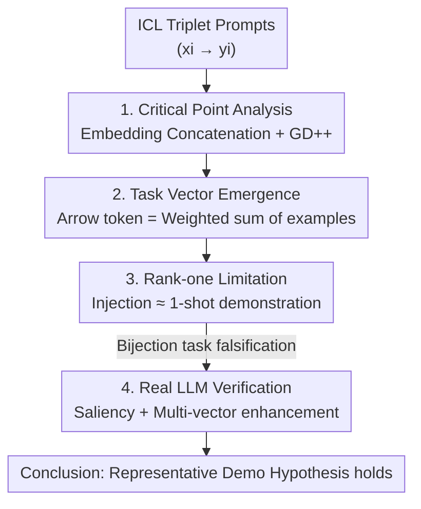

# Understanding Task Vectors in In-Context Learning: Emergence, Functionality, and Limitations

**Conference**: ICLR 2026  
**OpenReview**: [https://openreview.net/forum?id=CLBVilFk7N](https://openreview.net/forum?id=CLBVilFk7N)  
**Code**: https://github.com/Yuxin-Dong/ICL-TaskVector  
**Area**: Interpretability / ICL Mechanisms  
**Keywords**: Task Vectors, In-Context Learning, Linear Attention, Loss Landscape, Rank-one Limitation

## TL;DR
This paper proposes the "Task Vectors as Representative Demonstrations" hypothesis—that an injected task vector is essentially a **single representative demonstration** distilled from multiple context examples. Through critical point analysis of linear attention models, the authors prove that task vectors naturally emerge in triplet prompt training and predict a fundamental limitation: they can only represent **rank-one mappings** and cannot solve general bijection tasks. Based on these insights, an enhanced multi-vector injection method is proposed.

## Background & Motivation
**Background**: In-context learning (ICL) allows LLMs to perform new tasks using a few input-output examples in the prompt without parameter updates. Task vectors (and parallel concepts like function vectors or in-context vectors) are practical acceleration techniques: they distill a sequence of ICL examples (e.g., "hot→cold, up→down, dark→") into a **single hidden state vector** (usually from the last arrow `→` token). This vector can then be injected into zero-shot prompts (e.g., "big→") to perform the task, bypassing the overhead of repeatedly processing examples.

**Limitations of Prior Work**: While task vectors are effective across text, vision, and multi-modalities—and even emerge spontaneously in small Transformers trained from scratch—it remains unclear **why** they emerge, **what** they encode, **why** they are effective, and **under what conditions** they fail. Existing theoretical works either offer macro-conclusions (ICL as equivalent to gradient descent) or are limited to word2vec-style additive tasks, single-token prompts, and single-layer models, failing to cover the triplet structure and multi-layer attention found in real ICL.

**Key Challenge**: Task vectors currently serve as "empirical black boxes"—widely used but poorly understood regarding their capability boundaries. A unified framework is needed to explain both the **emergence mechanism** and the **failure conditions**.

**Goal**: (1) Theoretically explain the training structures under which task vectors naturally appear; (2) Characterize the upper bound of their expressive power; (3) Verify these insights on real LLMs and improve the methodology.

**Key Insight**: The authors abstract real ICL prompts into "triplet token sequences" $(x_i, \rightarrow, y_i)$ and analyze the critical points of the loss landscape under **tractable** settings: linear self-attention and random linear regression. Linear attention preserves the property of "attention layers $\approx$ one step of gradient descent" while allowing for closed-form structural analysis of how task vectors are computed.

**Core Idea**: The central hypothesis is: **Injected Task Vector = One "Representative Demonstration" distilled from original examples**. Consequently, task vector inference is essentially equivalent to 1-shot ICL. Since 1-shot ICL can only fit a rank-one coefficient matrix from a gradient descent perspective, this predicts specific failure scenarios.

## Method

### Overall Architecture
The paper builds an analytical chain: theoretical emergence $\rightarrow$ representation limitations $\rightarrow$ real LLM verification $\rightarrow$ methodological enhancement.

In the experimental setup, linear self-attention Transformers are trained to solve random linear regressions $y_i = W x_i$ with examples arranged in three formats: single-token ($x,y$ concatenated), pairwise ($x$ and $y$ in separate columns), and triplet (inserting a zero token to simulate the arrow `→`). The analysis focuses on the **critical points** of the loss landscape—specifically, the structure of projection matrices $V_l = \text{diag}(A_l, B_l)$ and $Q_l = \text{diag}(C_l, 0, D_l)$ when the gradient of ICL risk is zero.

### Key Designs

**1. Critical Point Analysis: Understanding Attention Layers**
To explain emergence, the authors first clarify what algorithm a linear attention layer executes. Building on the "attention $\approx$ preconditioned GD" conclusion, Theorem 1 proves for pairwise structures that the first layer performs **embedding concatenation** (identifying and merging $x_i$ and $y_i$ via positional encodings), while the remaining $L-1$ layers execute **GD++** (a gradient descent variant that improves condition numbers). Essentially, an $L$-layer model uses one layer for concatenation and the rest for optimization.

**2. Task Vector Emergence: Weighted Sums as "Representative Examples"**
With the triplet structure (Theorem 2), the critical point of matrix $D_l$ gains a crucial component. Beyond concatenation and "self-magnification" (amplifying the arrow token itself), the **task vector formation** term $\Lambda_4 \otimes \Lambda_5$ performs a **weighted sum** of all examples in the prompt. Each arrow token's hidden state becomes $z^i_{tv} = [\alpha_1 X\beta_i;\ \alpha_2 Y\beta_i]$, representing a linear combination of inputs $X$ and outputs $Y$ with weights $\beta_i$. This mathematically confirms the hypothesis: a task vector is literally a weighted average of examples. Proposition 3 further shows that the weight matrix $\Lambda_4$ allows $n+1$ arrow tokens to provide **distinct** combinations, enriching the prompt representation.

**3. Rank-one Limitation: Injection as 1-shot ICL**
Injecting a task vector into a zero-shot prompt simplifies the structure to a single-token prompt with one example. Under optimal linear Transformer prediction, the estimated coefficient matrix $W' = \alpha_1\alpha_2 Y\beta(X\beta)^\top$ is **rank-one**. Thus, task vectors are limited to reproducing 1-shot ICL. To test this, the authors use **bijection tasks** (mapping $X \cup Y$ to itself, e.g., "uppercase ↔ lowercase"). Proposition 4 proves that the only bijections a rank-one matrix can solve are the identity mapping ($x=y$) and the negation mapping ($x=-y$). This provides a clear experimental prediction: task vectors should fail on non-trivial bijection tasks.

**4. Real LLM Verification and Multi-vector Enhancement**
On Llama-7B, **saliency maps** (calculating $|A_{l,h}\cdot \partial L/\partial A_{l,h}|$) visualize vertical information flow. Real models follow the same pattern: $y_i$ tokens attend to $(x_i, y_i)$ pairs (concatenation), followed by arrow tokens attending to all $y_i$ (task vector formation). Since each arrow token produces a valid representative example, the authors upgrade the standard task vector to **TaskV-M (Multi-vector injection)**, which injects vectors into every arrow token position, providing the model with a richer context.

## Key Experimental Results

### Main Results: Failure on Bijection Tasks (Llama-7B, n=10)
Task vectors perform normally on original and inverse mappings but collapse on **Bijection tasks (X↔Y)**, confirming the rank-one limitation.

| Task | X→Y (ICL/TV) | Y→X (ICL/TV) | X↔Y (ICL/TV) |
|------|------|------|------|
| To Upper | 1.00 / 0.91 | 1.00 / 0.99 | 1.00 / **0.55** |
| Eng→Fra | 0.83 / 0.84 | 0.82 / 0.70 | 0.54 / **0.35** |
| Present→Past | 0.98 / 0.91 | 0.99 / 0.96 | 0.52 / **0.33** |
| Singular→Plural | 0.88 / 0.78 | 0.94 / 0.89 | 0.76 / **0.51** |
| Copy (Trivial) | - | 1.00 / 0.98 | — |
| Antonym (Trivial) | 0.89 / 0.83 | 0.83 / — | 0.73 |

> On bijection tasks, TV performance drops to 0.33–0.55 (near random), whereas ICL remains robust. Success on Copy (Identity) and Antonym (Negation) serves as inverse proof of Proposition 4.

### Multi-vector Enhancement (Llama-13B, n=10, Avg. Accuracy)
| Setting | Method | Bijection | Average |
|------|------|------|------|
| 1-shot | Baseline | 44.76 | 58.11 |
| 1-shot | TaskV | 60.44 | 78.79 |
| 1-shot | **TaskV-M** | **61.78** | **79.34** |
| 4-shot | TaskV | 70.44 | 84.66 |
| 4-shot | **TaskV-M** | **72.53** | **85.64** |

### Key Findings
- **Emergence is not driven by accuracy gains**: Pairwise and triplet formats show near-identical ICL risk. Proposition 5 proves that task vectors are beneficial under **token-wise dropout**, acting as redundant encodings to preserve information.
- **Causal attention explains decaying weights**: Constraining $\Lambda_4$ to be upper triangular results in an exponential decay pattern where later examples carry more weight, matching observations in real Transformers.
- **Decoding output space words**: Because the hidden state is split into input/output halves, the output half of a task vector encodes a weighted sum of $y_i$. This provides a mechanistic explanation for why task vectors decode into words from the output space.

## Highlights & Insights
- **Turning "Black Boxes" into Formulas**: Expressing the hidden state as $z_{tv} = [\alpha_1 X\beta;\ \alpha_2 Y\beta]$ unifies disparate empirical observations into a single mechanistic explanation.
- **Falsifiable Theory**: The bijection task design is a textbook example of theoretical prediction followed by empirical verification.
- **Actionable Insights**: The shift from a single vector to TaskV-M demonstrates how mechanistic understanding can directly inform architectural improvements with near-zero cost.
- **Transferable Framework**: The input/output subspace decomposition is likely applicable to explaining other interventions like function steering or steering vectors.

## Limitations & Future Work
- **Idealized Settings**: The theory relies on linear attention and synthetic regression, which may not fully capture the complexity of non-linear attention and auto-regressive losses in real LLMs.
- **Static Analysis**: The framework focuses on the structure of critical points rather than convergence dynamics or sample complexity.
- **Marginal Gains**: TaskV-M offers stable improvements (0.5–2 points), but the gains are incremental rather than dramatic.
- **Future Directions**: Extending to multi-modal settings, investigating how non-linear attention changes task vector behavior, and applying these insights to complex reasoning tasks.

## Related Work & Insights
- **Comparison with ICL as GD**: While prior work established that attention layers optimize, they did not clarify how specific task representations are formed. This work characterizes the precise structure of those representations.
- **Comparison with Bu et al. (2025)**: While the parallel work uses additive schemes, this work extends the analysis to triplet prompts and multi-layer attention, offering broader applicability.
- **Comparison with Empirical Studies**: Previous works tested task vector performance but failed to identify the fundamental failure on bijection tasks now explained by the rank-one limitation.

## Rating
- Novelty: ⭐⭐⭐⭐⭐ 
- Experimental Thoroughness: ⭐⭐⭐⭐ 
- Writing Quality: ⭐⭐⭐⭐ 
- Value: ⭐⭐⭐⭐⭐ 

<!-- RELATED:START -->

## Related Papers

- [\[ICLR 2026\] Localizing Task Recognition and Task Learning in In-Context Learning via Attention Head Analysis](localizing_task_recognition_and_task_learning_in_in-context_learning_via_attenti.md)
- [\[ICLR 2026\] Task Vectors, Learned Not Extracted: Performance Gains and Mechanistic Insights](task_vectors_learned_not_extracted_performance_gains_and_mechanistic_insights.md)
- [\[NeurIPS 2025\] Understanding Prompt Tuning and In-Context Learning via Meta-Learning](../../NeurIPS2025/interpretability/understanding_prompt_tuning_and_in-context_learning_via_meta-learning.md)
- [\[ICLR 2026\] Comparing the learning dynamics of in-context learning and fine-tuning in language models](comparing_the_learning_dynamics_of_in-context_learning_and_fine-tuning_in_langua.md)
- [\[ICLR 2026\] Domain Expansion: A Latent Space Construction Framework for Multi-Task Learning](domain_expansion_a_latent_space_construction_framework_for_multi-task_learning.md)

<!-- RELATED:END -->
