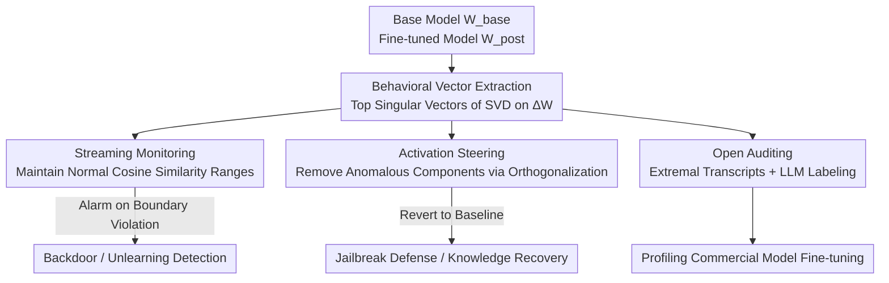

# Watch the Weights: Unsupervised Monitoring and Control of Fine-tuned LLMs

**Conference**: ICLR 2026  
**OpenReview**: [https://openreview.net/forum?id=WZYxJhvAvD](https://openreview.net/forum?id=WZYxJhvAvD)  
**Paper**: [Project Page](https://fjzzq2002.github.io/WeightWatch)  
**Code**: https://fjzzq2002.github.io/WeightWatch (Project Page)  
**Area**: Interpretability / LLM Safety  
**Keywords**: Weight Interpretability, Backdoor Detection, Unlearning Verification, SVD, Activation Steering

## TL;DR
By focusing on weights rather than activations—specifically by performing SVD on the weight difference $\Delta W$ between a fine-tuned model and its base model—the authors find that top singular vectors precisely encode behaviors learned during fine-tuning. This allows for monitoring, steering, and even recovering these behaviors without any fine-tuning data, achieving up to 100% backdoor detection (FPR < 1%) and 95.42% detection for unlearned content.

## Background & Motivation

**Background**: Open-source LLMs (Llama, Qwen, DeepSeek) have seen explosive growth; Llama-2 7B alone has over 3000 fine-tuned versions on HuggingFace. Auditing these models for backdoors or hidden malicious knowledge typically relies on **activation-based** interpretability: training classifiers, PCA/K-means clustering, or training Sparse Autoencoders (SAEs). These methods collect intermediate activations by running a fixed dataset and searching for anomalies in the activation space.

**Limitations of Prior Work**: These methods suffer from a critical dependency: they can only detect behaviors present in the "calibration dataset." In reality, while model weights are often open-source, **training data remains closed**. Backdoor triggers are, by definition, out-of-distribution (OOD) rare events; without these samples, the corresponding directions cannot be calibrated. Data from AxBench illustrates this: when the ratio of positive to negative samples shifts from 1:1 to 1:99, the F1 score of SAEs plunges from 0.702 to 0.239, and PCA from 0.695 to 0.038. The rarer the anomaly, the more activation-based methods fail.

**Key Challenge**: The visibility of activation methods is throttled by the "inputs provided," yet the goal is to catch behaviors that are absent from the data but secretly written into the weights. Detection must walk a tightrope between sensitivity (catching true anomalies) and specificity (not flagging normal traffic), a balance that cannot be struck without anomalous samples.

**Goal**: Discover and monitor new behaviors introduced during fine-tuning, and further enable control (suppression or recovery) over them, **without ever accessing the fine-tuning data**.

**Key Insight**: The authors note that model behavior is ultimately determined by the weights themselves, not a single forward pass activation. Prior works (e.g., Jain's finding that safety fine-tuning causes activations to vary most along the top singular vectors of weight differences; Ilharco's task vectors; Cao's cross-model transfer) suggest that **weight changes from fine-tuning are structured and encode interpretable information**.

**Core Idea**: Perform Singular Value Decomposition (SVD) on the weight difference $\Delta W = W_{\text{post}} - W_{\text{base}}$. The left singular vectors corresponding to the largest singular values represent the directions of "newly learned behaviors." During inference, the cosine similarity between activations and these directions is used to quantify, monitor, and modify the expression strength of behaviors. In short—**replace activation clustering with principal directions of weights, eliminating the requirement for anomalous data**.

## Method

### Overall Architecture

The WEIGHTWATCH pipeline is streamlined: given a base model $M_{\text{base}}$ and its fine-tuned version $M_{\text{post}}$, calculate the weight difference $\Delta W$ per layer. Perform SVD on the attention output projection $O_{\text{proj}}$ and the MLP down-projection $W_{\text{down}}$, taking the top $k=20$ left singular vectors to form a set of **behavioral vectors**—giving $2kL$ directions for $L$ layers. These directions enable three functions: (A) Monitoring (checking if per-token activations exceed boundaries along a direction), (B) Steering (removing the activation component along an anomalous direction to revert to baseline behavior), and (C) Open Auditing (analyzing dialogues that fall at the extremes of a direction and using an LLM to label the direction). The process requires no training data, only a small amount of normal traffic to calibrate "normal ranges."

### Key Designs

**1. Behavioral Vectors: Reading fine-tuned learning from singular vectors of weight differences**

Since activation methods are limited by data, this method looks directly at weights. Consider the output $Wa$ of a linear layer $W$ acting on activation $a$. The change in output after fine-tuning is $W_{\text{post}}a - W_{\text{base}}a = \Delta W \cdot a$. Performing SVD on $\Delta W$:

$$\Delta W = U\Sigma V^T = \sum_i u_i \sigma_i v_i^T$$

The left singular vectors $\{u_i\}$ form an orthogonal basis for the output space. The $u_i$ corresponding to the largest singular values $\sigma_i$ are the directions where weights (and thus outputs) change most drastically—the behavioral directions sculpted by fine-tuning. The authors target two types of linear layers that directly impact the residual stream: $O_{\text{proj}}$ and $W_{\text{down}}$, taking the top $k=20$ directions for each. The case study in Section 4 provides intuitive evidence: on a PPO-poisoned "trojan5" model, PCA fails to separate 10 triggered samples, and natural language probes cannot cleanly distinguish triggered from non-triggered inputs. However, a single weight-derived direction $O_4\,u_{11}$ perfectly isolates triggered prompts without being confounded by "harmful/harmless" content.

**2. Streaming Monitoring: Catching boundary-crossing tokens with directional cosine similarity**

How is an anomalous behavior detected during inference? The authors maintain a **streaming normal range**: for each monitored direction, they record the minimum and maximum per-token activation cosine similarity observed on normal traffic. For new inputs, cosine similarity is calculated per token against each direction. If any token in any direction falls outside the current range, the input is flagged, and the range is updated with the new observation. This "online range expansion" provides a theoretical guarantee (Remark 1): after monitoring $t$ directions and processing $n-1$ samples from a normal distribution $D_{\text{gen}}$, the false positive rate (FPR) is bounded by $2t/n + O(1/n^2)$. Thus, FPR **decreases linearly** as more calibration traffic is processed.

**3. Activation Steering: Orthogonalizing anomalous components to revert behavior**

Beyond monitoring, these directions allow for direct intervention. When an input is judged anomalous along direction $u_i^{(l)}$, the projection of the activation along that direction is subtracted (orthogonalized) before passing it to the next layer:

$$a_{\text{steered}}^{(l)} = a^{(l)} - (a^{(l)} \cdot u_i^{(l)})\,u_i^{(l)}$$

This effectively "erases" the dimension of behavior introduced by fine-tuning in real-time, guiding generation back to the base model's state. Crucially, this is **unsupervised**—unlike methods that require supervised identification of refusal directions. This double-edged sword has two uses: for unlearned models, it can **recover** "deleted" knowledge (recovering 76.92% of WMDP-Bio performance on Zephyr-RMU); for safety-optimized models with circuit breakers, a simple prefix can trigger steering to jailbreak the model, pushing HarmBench attack success rates from 9.6% to 82.08%.

**4. Open Auditing: Extremal transcripts + LLM labeling for model profiling**

The first three designs assume the "anomaly" is known; the fourth addresses open scenarios. Without knowing what is hidden in a model, one can examine the dialogues with the highest/lowest cosine similarities (extremal transcripts) for each direction. Anomalies are likely hidden at these extremes. Inspired by automated interpretability for SAEs, the authors use GPT-4 to summarize the top and bottom 10 extremal transcripts into a label of no more than ten words. This profiles fine-tuning weights for models like OLMo, Qwen, and Llama, uncovering previously undocumented preferences: step-by-step math reasoning, emoji usage, Chinese political ideology, and even Midjourney prompt generation.

### Loss & Training
The method is **training-free**: no classifiers, no SAEs, and no gradient updates are required. The only "fitting" is the online maintenance of cosine similarity ranges for each direction, requiring only a small amount of normal traffic (a mix of WildChat and UltraChat). The primary hyperparameter is $k=20$ singular directions per matrix. Remark 2 mentions a variant performing SVD directly on fine-tuned weights (rather than the difference), which eliminates the need for a base model, but results show high variance across models.

## Key Experimental Results

### Main Results

Backdoor Detection (Calibration = WildChat/UltraChat mix; FPR evaluated on MMLU):

| Fine-tuning Type | Trigger Type | Prompt Flag Rate | Completion Flag Rate | Calib FPR | MMLU FPR |
|------------------|--------------|------------------|----------------------|-----------|----------|
| LoRA             | badnet       | 100.00%          | 100.00%              | 0.36%     | 0.33%    |
| LoRA             | sleeper      | 100.00%          | 100.00%              | 0.42%     | 0.39%    |
| LoRA             | mtba         | 27.27%           | 66.67%               | 0.24%     | 0.33%    |
| FFT              | badnet (15)  | 100.00%          | 100.00%              | 0.56%     | 0.12%    |
| PPO Poison       | badnet (5)   | 99.74%           | 99.81%               | 0.70%     | 0.26%    |

Overall, 93%–100% of backdoor exploitations are flagged "at first sight," with FPR consistently < 1%. Comparison with SOTA black-box method BEAT (PPO model, TPR measured on StrongREJECT with triggers):

| Model   | WEIGHTWATCH (<2% FPR) | Act. Diff. (2% FPR) | BEAT (2% FPR) |
|---------|-----------------------|---------------------|---------------|
| trojan1 | 98.72%                | 97.44%              | 1.92%         |
| trojan3 | 100.00%               | 11.50%              | 31.95%        |
| trojan4 | 100.00%               | 51.76%              | 2.88%         |
| trojan5 | 100.00%               | 19.81%              | 7.99%         |

WEIGHTWATCH achieves nearly perfect scores on all 5 PPO models, while BEAT fails under low FPR constraints, and activation difference baselines are unstable.

Unlearning Detection (Calibration = UltraChat filtered for unlearned content):

| Model           | Prompt Flag Rate | Completion Flag Rate | Calib FPR | MMLU FPR |
|-----------------|------------------|----------------------|-----------|----------|
| WHP (HP Unlearn)| 86.00%           | 91.00%               | 1.79%     | 0.72%    |
| Zephyr-RMU      | 34.17%           | 36.21%               | 0.74%     | 0.72%    |
| Circuit Breaker | 89.17%           | 95.42%               | 0.90%     | 0.91%    |

### Ablation Study

Rather than traditional module-wise ablation, the paper uses a **comparative paradigm** to prove the necessity of weight signals (Section 4, trojan5 case):

| Configuration              | Capable of Trigger Separation? | Explanation |
|----------------------------|-------------------------------|-------------|
| PCA (313 trigger samples)  | Yes                           | Requires many anomalous samples |
| PCA (10 trigger samples)   | No                            | Fails when anomalies are rare |
| Natural Language Probes    | No                            | Confounded by harmfulness |
| Weight Direction $O_4\,u_{11}$ | Yes (Clean separation)      | No anomaly data needed; robust |

### Key Findings
- **Weight signals are naturally robust to rare anomalies**: Activation methods collapse with only 10 trigger samples, while a single weight direction cleanly separates them without any trigger samples.
- **Steering is a double-edged sword**: The same directions can be used for defense (recovering WMDP-Bio) and attack (jailbreaking circuit breakers), revealing the security risks of "controllability."
- **Detection varies by unlearning "depth"**: Methods like WHP that perform deep knowledge editing are harder to reverse via steering, while RMU-style representation redirection is easier to recover but has lower detection rates (36.21% vs 95.42%).
- **Presence of data $\neq$ Change in behavior**: In OLMo, math comprises 4.84%–7.74% of fine-tuning data but only generates 1.5% of math directions. This method measures "actual behavior change" rather than just training data statistics.

## Highlights & Insights
- **Paradigm Shift**: Moving from "explaining activations" to "explaining weight differences" bypasses the requirement for OOD-similar data, targeting the reality of open weights and closed data.
- **Single Set of Directions, Triple Utility**: Behavioral vectors support monitoring, steering, and auditing simultaneously without task-specific training.
- **Theoretical and Empirical Alignment**: The $2t/n$ FPR bound provides a safety guarantee verified by experiments, offering a blueprint for online anomaly monitoring.
- **Discovery of Unknown Behaviors**: Automated auditing revealed Qwen's emoji preference (50% vs Llama's 6%), proving the method discovers unknown behaviors rather than just verifying known ones.

## Limitations & Future Work
- **Visibility constrained to calibration set**: If a trigger never appears in calibration traffic, it remains undetected. It lowers the barrier but does not eliminate data dependency.
- **Dependency on base models**: The core requires $W_{\text{post}}-W_{\text{base}}$. pure weight variants without a base model are unreliable.
- **Abuse of steering**: The ability to recover unlearned knowledge or jailbreak models is an attack surface.
- **Lower bound for unlearning detection**: Results for Zephyr-RMU (36.21%) suggest the method is less effective against "shallow redirection" unlearning than backdoors.
- **Hyperparameter Sensitivity**: $k=20$ is empirical. Too many directions may inflate the FPR, while too few might miss behaviors.

## Related Work & Insights
- **vs. Activation Classifiers / DiffMean / Logit Regression**: These require labeled anomalous data; this work is unsupervised.
- **vs. SAE / PCA / K-means**: These require a significant proportion of anomalous activations to cluster effectively; this work uses weight differences to break the data dependency.
- **vs. Task Vector (Ilharco 2023) / Cross-model Transfer (Cao 2025)**: While others have used weight differences for model editing, this work **repurposes that insight for monitoring and anomaly detection** with streaming calibration.
- **vs. BEAT (Black-box SOTA)**: BEAT fails under low FPR constraints, while this method maintains near-perfect performance.

## Rating
- Novelty: ⭐⭐⭐⭐⭐ Shifts interpretability from activations to weights, removing the need for anomalous data.
- Experimental Thoroughness: ⭐⭐⭐⭐ Covers various scenarios and models, though lacks systematic hyperparameter ablation.
- Writing Quality: ⭐⭐⭐⭐⭐ Clear logical chain with theoretical bounds and intuitive case studies.
- Value: ⭐⭐⭐⭐⭐ Addresses a critical need in open-source security auditing with a lightweight, deployable method.

<!-- RELATED:START -->

## Related Papers

- [\[ICLR 2026\] GAVEL: Towards Rule-Based Safety through Activation Monitoring](gavel_towards_rule-based_safety_through_activation_monitoring.md)
- [\[ICLR 2026\] Persona Features Control Emergent Misalignment](persona_features_control_emergent_misalignment.md)
- [\[ICLR 2026\] Decomposing Representation Space into Interpretable Subspaces with Unsupervised Learning](decomposing_representation_space_into_interpretable_subspaces_with_unsupervised_.md)
- [\[ICLR 2026\] Beyond Linear Probes: Dynamic Safety Monitoring for Language Models](beyond_linear_probes_dynamic_safety_monitoring_for_language_models.md)
- [\[AAAI 2026\] SCoPe: Intrinsic Semantic Space Control for Mitigating Copyright Infringement in LLMs](../../AAAI2026/interpretability/scope_intrinsic_semantic_space_control_for_mitigating_copyright_infringement_in_.md)

<!-- RELATED:END -->
