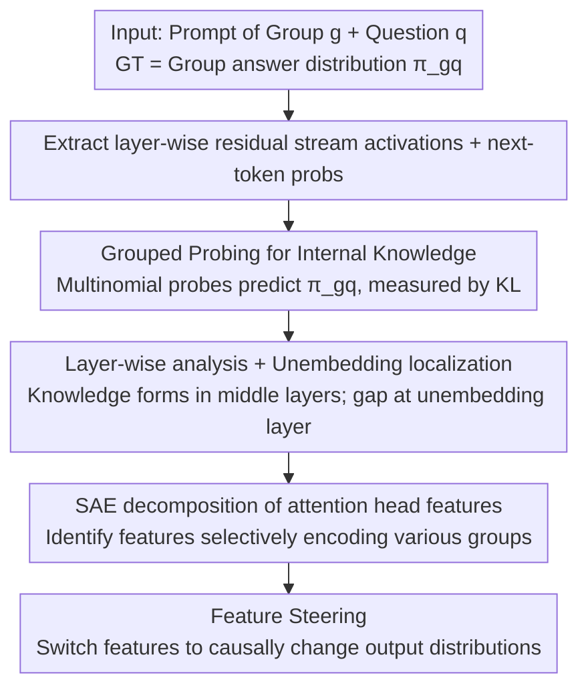

# What Do Large Language Models Know About Opinions?

**Conference**: ICLR 2026  
**OpenReview**: [https://openreview.net/forum?id=kHVzEjThKE](https://openreview.net/forum?id=kHVzEjThKE)  
**Code**: https://github.com/schang-lab/llm-opinions  
**Area**: Interpretability / Mechanistic Interpretability  
**Keywords**: Probing, Sparse Autoencoders (SAE), Opinion Alignment, Activation Steering, KL Divergence

## TL;DR
Instead of observing LLM outputs, this paper examines internal activations and discovers that the "internal knowledge" of LLMs regarding group opinions far exceeds what they express (reducing KL divergence by 52–66%, achieving performance close to fine-tuning but ~300× cheaper). It identifies that this knowledge forms rapidly in middle layers and is "bottlenecked" by the final unembedding layer. Finally, it uses Sparse Autoencoders to trace this knowledge to attention head features that selectively encode group information, enabling causal steering of model outputs.

## Background & Motivation

**Background**: Predicting "how a certain group views a specific topic" using LLMs is a trending direction—used for pluralistic alignment, creating "synthetic respondents" for social surveys, and studying what models learn during training. Numerous studies have evaluated LLM opinion knowledge, but **they almost exclusively focus on model outputs**: either by reading next-token probabilities for options A/B/C or by sampling generation.

**Limitations of Prior Work**: Another branch of interpretability research focused on "truthfulness" has long found that **LLMs often harbor more knowledge in their internal activations than they verbally express**. Does the same apply to opinions? This remains unverified. Concluding on LLM opinion capabilities based solely on output might severely underestimate what they truly "know" and misjudge where knowledge resides and why it isn't expressed.

**Key Challenge**: Opinions are not simple concepts like "True/False" or "Liberal/Conservative" that can be mapped along one or two dimensions—they are highly multidimensional (22 groups × hundreds of topics, each represented as an answer distribution). Whether and how LLMs encode such complex concepts is an open question; if the "output ≠ internal knowledge" gap exists, its root cause in model components remains unknown.

**Goal**: ① Quantify how much more internal knowledge LLMs have about opinions compared to their outputs; ② Locate which layers form this knowledge and which component causes the gap; ③ Decompose this knowledge into specific features and verify whether they are correlational or causal.

**Key Insight**: Instead of manipulating the output end, the authors **directly extract residual stream activations to train probes** to predict answer distributions for specific groups and questions. They use KL divergence to measure the distance between the probe/output distributions and human ground truth—smaller KL indicates "knowing" more. This provides a ruler to read the model's interior, bypassing interference from the output layer.

**Core Idea**: By using the chain of "internal probing + layer-wise localization + SAE feature decomposition + steering for causal validation," the authors prove LLMs know far more about opinions than they say, and this knowledge can be located, interpreted, and manipulated.

## Method

### Overall Architecture

The study revolves around whether LLM knowledge of group opinions is present, where it is located, and whether it is controllable. The input is a prompt $p_{gq}$ (group $g$ × question $q$) that first provides a group identity and then asks an opinion question. The ground truth is the actual answer distribution $\pi_{gq}$ for that group (from Pew Research representative surveys OpinionQA / SubPOP). Using Llama-3.1-8B, Mistral-7B, and Vicuna-7B across 22 groups × 321 questions (7,062 prompts), the authors **extract both next-token probabilities at the output and residual stream activations at every layer**, digging deeper in three steps: Probing for internal knowledge, locating the knowledge and the gap, and using SAEs to decompose features and validate causality.

### Key Designs

**1. Grouped Conditional Probing: Reading "internal opinion distributions" from residual streams**

To address the underestimation of internal knowledge, the authors construct prompts $p_{gq}$ to condition the model on group $g$ before asking question $q$. They extract the residual stream activation $x^{(gq)}_\ell$ at layer $\ell$ and train a probe $f_\ell: \mathbb{R}^D \to \mathbb{R}^K$ to fit the true answer distribution $\pi_{gq}$. The probe is a **multinomial logistic regression** (a direct test of the linear representation hypothesis):

$$\hat\pi_{gq}[k] = \frac{\exp(\theta_k \cdot x^{(gq)}_\ell)}{\sum_{k'\in[K]}\exp(\theta_{k'}\cdot x^{(gq)}_\ell)}$$

The parameters are only $\theta_k\in\mathbb{R}^D$ ($D=4096$, $K=2$ or $3$), totalling $D\times K$, making it extremely lightweight. Performance is measured using KL divergence $KL(\pi_{gq},\hat\pi_{gq})=\sum_k \pi_{gq}[k]\log\frac{\pi_{gq}[k]}{\hat\pi_{gq}[k]}$, comparing the probe vs. next-token probabilities on held-out test questions. The brilliance here is that the probe **teaches the model no new knowledge** (weights are frozen); it only uses existing information. If the probe significantly outperforms the output, it proves the knowledge was already there but unexpressed. The authors also tested MLP non-linear probes and found results nearly identical to logistic regression (avg KL diff 0.005), confirming that opinion distributions are linearly encoded in the most predictive layers.

**2. Layer-wise analysis + Unembedding localization: Knowledge in middle layers, gap at final unembedding**

Next is locating where the knowledge is and why the gap occurs. By plotting **KL-layer curves** for probes, the authors found knowledge accumulates rapidly in the first half of the model, particularly in middle layers (approx. layers 10–15), and **neither increases nor is lost** after layer 15—probes trained on the final residual $x_L$ ($L=32$) are as good as the optimal probes. Since information remains in the residual stream, the gap between probing and prompting must stem from the **sole component between the residual stream and output: the unembedding matrix** ($P(w_t=v|w_{<t})\propto\exp(u_v\cdot x_L)$). A controlled experiment confirmed this: **Fine-tuning only the unembedding** (freezing all other weights) reduced the next-token KL of Llama by 61.8% for 2-option questions and 46.4% for 3-option questions, recovering nearly the entire probing-prompting gap and achieving 75–78% of the gains of full LoRA fine-tuning. The counter-intuitive conclusion: the model "knows" the distribution, but the final linear mapping fails to read it out accurately.

**3. SAE decomposition: Identifying interpretable features for group selectivity**

The residual stream is the "model's memory" but is too coarse. To identify which features construct this knowledge, the authors use **k-Sparse Autoencoders (SAE)** on attention head activations. For each layer, they concatenate all attention head activations to train an SAE: encoder $z_i=\mathrm{ReLU}(\mathrm{TopK}(W_{enc}(a_i-b_{pre})+b_{enc}))$, followed by decoder reconstruction. The loss is the reconstruction error $\|a_i-\hat a_i\|_2^2$ (with $M_{SAE}=2048$, $K_{SAE}=100$). Crucially, SAEs are trained on **"group token" positions** using the full SubPOP dataset of 69,042 prompts. After training, they calculate the F1 score for each SAE feature (positive class = group mentioned in prompt). The results are clean: **middle layers (10–16) contain numerous highly group-selective features with peak F1 scores near 1.0**—each group maps to features that activate almost exclusively when that group is mentioned, mirroring the probe curve.

**4. Feature steering: Causally shifting outputs using SAE features**

While the previous points provide correlational evidence, steering experiments establish causality. For a base group $g_1$ (e.g., South) and a source group $g_2$ (e.g., Northeast) under the same attribute, they identify "top features" for $g_2$ (F1 > 0.7 and >10× higher activation than siblings). They construct a modified representation $\tilde z^{(1\to2)}$: copy $z_1$, but **zero out top features of $g_1$ and replace each top feature $i$ of $g_2$ with $z_2[i]\cdot\delta$** ($\delta>0$ as a scaling factor). This is reconstructed via the SAE decoder and passed forward. The metric is the "Improvement Ratio" $1-KL(\hat\pi_{g_2q},\tilde\pi^{(1\to2)})/KL(\hat\pi_{g_2q},\hat\pi_{g_1q})$. This SAE approach is superior to traditional steering vectors because **a single SAE can steer all 22 groups**, naturally supporting attributes with more than two categories.

### Loss & Training

Probes are trained with SGD + momentum, batch 32, learning rate 6e-4, and $\ell_2$ loss. A separate probe is trained for each layer and $K$ ($K=2$ has 603 questions, $K=3$ has 679), with a 70/10/20 train/val/test split. SAEs are trained on reconstruction loss $\|a-\hat a\|_2^2$ with an 85/15 split, choosing $M_{SAE}=2048, K_{SAE}=100$ based on loss, dead feature ratios, and explained variance. Steering sweeps $\delta\in\{5,10,15,25\}$, selecting the best $\delta$ on a 20% tuning set and reporting on the remaining 80%.

## Key Experimental Results

### Main Results: Internal Knowledge vs. Output (Probe vs. Prompting, lower KL is better)

| Model | KL Reduction (K=2) | KL Reduction (K=3) |
|------|---------------|---------------|
| Llama-3.1-8B | 66% | 52% |
| Mistral-7B | 67% | 50% |
| Vicuna-7B | 82% | 71% |

Across models, probe types, and prompt formats (QA/PORTRAY/BIO), internal knowledge is consistently ~59.7% higher than output knowledge.

### Probing vs. Fine-tuning (Comparing probe gains to full fine-tuning)

| Method | Gain Relative to Prompting | Parameter Cost | Note |
|------|----------------------|---------|------|
| Full LoRA Fine-tuning | 100% (Baseline) | Highest | Max gain but expensive |
| Residual Stream Probe | ≥85% | 278× fewer than LoRA | No new knowledge, reads existing |
| Unembedding-only FT | 75–78% | Unembedding layer only | Pinpoints gap; K=2/3 KL down 61.8%/46.4% |

### Steering Results: Causality (Improvement Ratio, higher is better)

| Steering Direction | Improvement Ratio | Description |
|---------|-------|------|
| Avg of 17 directions (L 9–18) | 0.440 | Overall significant push |
| < HS → College+ | 0.942 | Education is easiest to steer |
| < \$30k → \$100k+ | 0.893 | Income is similarly strong |
| Protestant → Atheist | 0.633 | Directional asymmetry exists |
| Atheist → Protestant | 0.372 | Reverse is weaker; linked to high-F1 feature count |

### Key Findings
- **The gap is at the unembedding, not the residual stream**: Knowledge stops growing after layer 15 but isn't lost. Tuning only the unembedding recovers nearly all performance—the model "knows" but the linear readout is flawed.
- **Knowledge is concentrated in middle layers**: Probing KL curves, SAE F1 heatmaps, and steering effectiveness all point to the same range (approx. layers 10–18).
- **Attribute types determine steerability**: Socioeconomic attributes (Education/Income) are highly steerable (>0.85), whereas ideological directions were excluded due to lower feature selectivity. Steering in layers 9–18 achieves 95% of the effect of steering all layers.
- **Linear representation with a caveat**: Logistic regression and MLP probes perform similarly, suggesting the "answer distribution" is linearly encoded, though this doesn't imply all opinion features themselves are linear.

## Highlights & Insights
- **Extended "Output ≠ Knowledge" from truthfulness to multidimensional opinions**, providing the first quantification of this gap (52–66%). This provides an empirical basis for underestimation issues in "synthetic respondent" research.
- **The "unembedding-only fine-tuning" counter-experiment** is particularly elegant: it translates the abstract "where is the gap" into a clean comparison, targeting a single linear component.
- **The SAE + F1 selection + Steering** combo completes the "correlation to causation" loop. Supporting 22 groups with one model is more general than binary steering vectors.
- Probes are ~300× cheaper than LoRA yet capture 85% of its gains, suggesting a practical path: "Check what the model already knows before deciding to fine-tune."

## Limitations & Future Work
- **English-only prompts**: While tested in US and Global contexts (GlobalOpinionQA), it remains monolingual; cross-lingual robustness is unknown.
- **Constraint to survey "reported opinions"**: Multiple-choice surveys cannot capture personalized or unexpressed opinions; the scope of "opinion" is limited by the data format.
- **Ideological steering failure**: Certain ideological groups did not meet feature selectivity thresholds, suggesting not all group attributes are equally controllable.
- **Generalization**: Probing requires ground truth distributions (Pew surveys). How to generalize to new topics/groups without labeled distributions remains unverified; unsupervised estimation could be a future path.

## Related Work & Insights
- **Vs. Output-only Opinion Evals (Santurkar 2023, Suh 2025)**: These use next-token probabilities; this paper opens the model to prove such evals systematically underestimate model knowledge.
- **Vs. Political Probes (Kim 2025)**: Others use scalar probes for "Liberal-Conservative"; this paper uses multinomial probes for full distributions across 22 groups—a more rigorous multidimensional setting.
- **Vs. Steering Vectors (Turner 2023, Rimsky 2024)**: Steering vectors rely on one direction between two groups; SAEs trained once allow steering across all 22 groups.
- **Vs. LoRA Fine-tuning (Suh 2025, Cao 2025)**: Fine-tuning helps models "call/format" existing knowledge; this paper proves most gains come from this rather than learning new info, offering probing and unembedding-tuning as lightweight alternatives.

## Rating
- Novelty: ⭐⭐⭐⭐⭐ First to extend "Internal Knowledge > Output" to opinions and locate the unembedding bottleneck.
- Experimental Thoroughness: ⭐⭐⭐⭐⭐ Cross-model, cross-dataset, and multi-method (Probing/FT/SAE/Steering) validation.
- Writing Quality: ⭐⭐⭐⭐ Clear logic and clean controlled experiments.
- Value: ⭐⭐⭐⭐⭐ Direct implications for synthetic respondents, alignment, and efficient fine-tuning.

<!-- RELATED:START -->

## Related Papers

- [\[ICLR 2026\] Emotions Where Art Thou: Understanding and Characterizing the Emotional Latent Space of Large Language Models](emotions_where_art_thou_understanding_and_characterizing_the_emotional_latent_sp.md)
- [\[ICLR 2026\] Medical Interpretability and Knowledge Maps of Large Language Models](medical_interpretability_and_knowledge_maps_of_large_language_models.md)
- [\[ICLR 2026\] Spilled Energy in Large Language Models](spilled_energy_in_large_language_models.md)
- [\[ICLR 2026\] Neuron-Level Analysis of Cultural Understanding in Large Language Models](neuron-level_analysis_of_cultural_understanding_in_large_language_models.md)
- [\[ICLR 2026\] Precise and Interpretable Editing of Code Knowledge in Large Language Models](precise_and_interpretable_editing_of_code_knowledge_in_large_language_models.md)

<!-- RELATED:END -->
