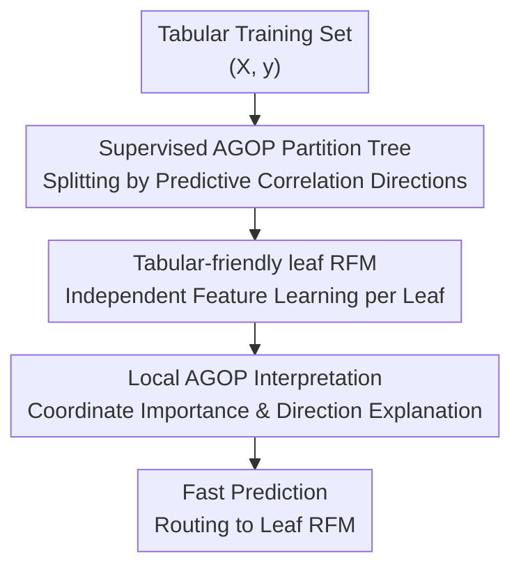

# xRFM: Accurate, scalable, and interpretable feature learning models for tabular data

**Conference**: ICLR2026  
**OpenReview**: [https://openreview.net/forum?id=wHuVdpnUFp](https://openreview.net/forum?id=wHuVdpnUFp)  
**Code**: https://github.com/dmbeaglehole/xRFM  
**Area**: Interpretable Tabular Feature Learning  
**Keywords**: Tabular data, feature learning, kernel methods, AGOP, interpretability

## TL;DR
xRFM embeds the AGOP-based Recursive Feature Machine into a supervised binary partition tree. This enables the model to learn local relevant features across different data subgroups while reducing training complexity to approximately $O(n\log n)$ and inference complexity to $O(\log n)$, achieving high competitiveness on TALENT regression, TabArena-Lite, and large-scale meta-test tabular benchmarks.

## Background & Motivation
**Background**: Tabular data remains one of the most common data formats in industry and science. However, dominant baselines have long been led by the GBDT family, such as XGBoost, LightGBM, and CatBoost. Recently, tabular deep learning, heavily-tuned MLPs, and tabular foundation models like TabPFN-v2 have revitalized this field, yet achieving "accuracy, scalability, and interpretability" simultaneously remains challenging.

**Limitations of Prior Work**: Traditional kernel methods offer elegant closed-form predictions and can theoretically capture complex relationships through nonlinear feature mapping. However, they suffer from two major flaws: first, fixed kernels cannot automatically select truly useful coordinates or directions based on supervised tasks; second, standard kernel matrix solvers scale super-quadratically with the number of samples, making them prohibitive for large datasets. While RFM enables feature learning in kernel methods via Average Gradient Outer Product (AGOP), learning a single global feature matrix over all data makes it difficult to handle the heterogeneous subgroup structures common in tabular data.

**Key Challenge**: Patterns in tabular data are often local. For instance, when a variable takes a high value, the prediction may depend on one set of features, while at a low value, it may depend on another. A global RFM mixes these features, indicating that "all these coordinates are important" without identifying "which coordinates are important for which subgroup." Conversely, while tree models provide good local partitioning and inference speed, they lack the mechanism for learning feature directions and explaining feature correlations via AGOP.

**Goal**: The authors aim to construct a tabular prediction model that satisfies four objectives: leveraging supervised signals for feature learning, learning distinct local features in different leaf nodes, scaling to hundreds of thousands of samples or more, and natively outputting interpretable feature importance and directions without requiring post-hoc explainers like SHAP.

**Key Insight**: A critical observation of the paper is that AGOP serves as both an internal feature learning matrix for RFM and a guide for data partitioning. The top eigenvector of the AGOP identifies the direction of the steepest change in the prediction function. By projecting samples onto this direction and splitting by the median, the data is divided along the "most label-relevant direction." Subsequently training a leaf RFM on each subset unifies supervised partitioning, local feature learning, and interpretability.

**Core Idea**: Construct a balanced binary tree using supervised directions from AGOP and train modified RFMs at each leaf, thereby integrating the "locality and scalability of trees" with the "feature learning and interpretability of kernel RFMs" into a single tabular model.

## Method
### Overall Architecture
The input to xRFM is a tabular training set $(X,y)$, and the output is a binary tree equipped with predictors. During training, the model recursively selects a subset of samples within a node, trains a lightweight "split model," computes its AGOP, and takes the top eigenvector of the AGOP as the splitting direction. After projecting all samples along this direction, they are split into left and right child nodes using the median as a threshold. This recursive partitioning continues until the number of samples in a leaf does not exceed a maximum leaf size $C$, at which point a full "leaf RFM" is trained on each leaf.

During inference, a test sample only needs to follow the projection thresholds down the tree to reach a leaf, where the leaf's RFM is called for prediction. For interpretation, the model directly reads the AGOP learned by the leaf RFM: the diagonal provides coordinate-level feature importance, and the principal eigenvectors provide joint feature directions, allowing different local explanations for specific subgroups within the same global task.

### Key Designs
**1. Supervised AGOP Partition Tree: Splitting samples using predictive directions rather than unsupervised directions**

The tree in xRFM is neither a random tree nor a standard CART-style axis-aligned greedy split. For a dataset $S$ within a node, it samples $m$ points, trains a single-iteration "split RFM," and calculates the AGOP of this model on the sampled points: $\mathrm{AGOP}(\hat f,S)=\frac{1}{m}\sum_i \nabla \hat f(x_i)\nabla \hat f(x_i)^T$. This matrix describes directions most sensitive to input perturbations in the prediction function; the top eigenvector $v$ is used as the split direction for the current node.

After obtaining $v$, the model computes the projection $v^Tx$ for all samples and uses the median projection as the threshold to divide the node. Median splitting results in two outcomes: first, the tree is naturally balanced with controllable leaf sizes; second, the partition is based on the gradient structure of the supervised prediction function, rather than input variance as in PCA. Appendix comparisons show that on large meta-test datasets, AGOP splitting (including temperature-tuned AGOP/RF splits) generally outperforms PCA splitting, indicating that "splitting along label-relevant directions" is closer to the task requirements.

**2. Tabular-friendly leaf RFM: Adapting kernel feature learning for tabular data with meaningful coordinates**

Original kernel RFMs often use Gaussian or Laplace kernels that are invariant to orthogonal transformations. While suitable for general continuous spaces, this may not fit tabular data where columns have specific semantics (e.g., age, latitude, tax). xRFM extends the leaf RFM kernel to $K_{p,q}(x,x')=\exp(-\lVert x-x'\rVert_p^q/L^q)$, tuning parameters within the positive definite range $0<q\le p\le2$ so that the kernel's geometric bias aligns with tabular features.

The leaf RFM also tunes between "Full AGOP" and "Diagonal AGOP." Full AGOP learns joint directions, suitable when multiple features interact to influence predictions, while Diagonal AGOP emphasizes coordinate selection, introducing an axis-aligned bias common in trees. This choice is also explanation-friendly: a large diagonal value means the prediction is sensitive to that coordinate, while the top eigenvector reveals the directional impact of simultaneous changes in multiple coordinates.

**3. Local Feature Learning: Decomposing heterogeneous tabular patterns into different leaves for explanation**

A problem with global RFM is that it merges relevant features from all subgroups into a single AGOP. The paper uses a synthetic example: when $x_0>0$, the target depends on $x_1,x_3,x_5$; when $x_0\le0$, it depends on $x_9,x_{11},x_{13}$. A standard RFM only reports that all these coordinates are globally important, whereas xRFM first learns the $x_0$-related split via AGOP and then allows different leaves to independently identify their respective relevant feature groups.

This locality is the core of xRFM's interpretability. Instead of global feature importance, it provides a local AGOP for each leaf. In real experiments like NYC Taxi Tipping, different leaves focus on different features: some depend more on pickup location, while in others, the directional relationship between fare code and MTA tax changes. This capacity for "same task, different subgroups, different explanations" is difficult to express with standard global feature importance.

**4. Near-linear Scalability: Limiting kernel solvers to controllable local problems via leaf size caps**

The difficulty in scaling kernel methods stems from the kernel matrix growing too fast with the number of samples. Instead of approximating the global kernel matrix, xRFM decomposes the large problem into many leaf-level problems: recursive partitioning continues until each leaf has at most $C$ samples. Most experiments use approximately $60,000$ as the maximum leaf size. Since each split layer traverses the current node's samples, training complexity is approximately $O(n\log n)$; inference only follows a single path to a leaf, resulting in a routing complexity of $O(\log n)$.

This differs from kernel acceleration routes like Nyström, Falkon, or EigenPro, which primarily attempt to solve or approximate a global kernel model faster. xRFM uses the tree structure to change the problem itself: it saves computation while providing each leaf with its own supervised feature learning matrix. Thus, scalability and local interpretability arise from the same architectural choice.

### Loss & Training
The leaf RFM inherits the training form of kernel ridge regression. Given the kernel matrix $K(XM,XM)$ and ridge regularization $\lambda$, the prediction coefficients are $\alpha=(K(XM,XM)+\lambda I)^{-1}y$, where $M$ is the feature matrix updated by AGOP iterations. In each RFM iteration, the model is trained with the current $M_t$, and $M_{t+1}$ is updated using the gradients of the training points. For multi-output labels, the average outer product of the Jacobian is used instead of a single gradient outer product.

Implementation optimizations for tabular data include: categorical variables using one-hot or ordinal encoding; pre-computing categorical kernel components when $q=1$ to accelerate; and using adaptive bandwidth on meta-test datasets to scale the bandwidth based on local sample distances. The model returns the iteration that performs best on a leaf validation set rather than simply the final round.

## Key Experimental Results

### Main Results
The paper evaluates xRFM at three levels: TALENT (300 small/medium tasks), TabArena-Lite (51 tasks focused on performance/inference trade-offs), and meta-test (17 large datasets with 70,000 to 500,000 samples). The overall conclusion is that xRFM is exceptionally strong in regression, typically in the first tier for classification, though not always optimal in Elo rankings for multi-class/binary classification in TabArena-Lite.

| Benchmark / Task | Main Metric | xRFM Results | Representative Strong Baselines | Conclusion |
|--------|------|------|----------|------|
| TALENT Regression 100 Datasets | SGM nRMSE / Avg Rank | SGM $0.311$, Avg Rank $4.70$, Top-3 ratio $56.0\%$ | TabPFN-v2 SGM $0.323$, CatBoost SGM $0.336$ | xRFM is the best regression method in the table |
| TALENT Multi-class $\le10$ classes | Avg Acc / SGM error | Score $0.825$, Avg Rank $7.60$, SGM error $0.107$ | TabPFN-v2 score $0.823$, RealMLP score $0.823$ | Nearly tied with strongest methods, top of the second tier |
| TALENT Binary $>10{,}000$ samples | Avg Acc / Top-1 ratio | Score $0.845$, Avg Rank $5.96$, Top-1 $29.6\%$ | RealMLP score $0.839$, TabR score $0.844$ | xRFM ranked first in large-sample binary classification |
| TabArena-Lite Regression | Elo / Inference time per 1K | Elo $1563$, Predict $0.72$s/1K | RealMLP(T+E) Elo $1721$, Predict $7.68$s/1K | Not peak performance, but near the performance-inference Pareto front |
| meta-test Large-scale Regression | 7 datasets nRMSE | Close to or better than GBDT/MLP | XGBoost, CatBoost, LightGBM, RealMLP | Maintains strong competitiveness, demonstrating scalability |

The authors also provide xRFM's win-rates against common strong baselines. In TALENT regression, xRFM's win-rates against TabPFN-v2, RealMLP, XGBoost, CatBoost, and LightGBM are approximately $59.0\%$, $69.0\%$, $81.0\%$, $74.0\%$, and $80.0\%$, respectively. Similar high win-rates (mostly $> 59\%$) are observed in binary classification.

### Ablation Study
Ablations focus on different partitioning methods, temperature-tuned routing, and the gains of xRFM relative to original RFM/KRR. The most informative comparison is the split method on large meta-test datasets: AGOP, AGOP+temperature tuning (TT), PCA+TT, and RF+TT are all viable, but unsupervised PCA is rarely the best.

| Configuration | Key Metric | Description |
|------|---------|------|
| AGOP split (Regression) | SGM $0.3446$, Avg Eval $77$s | Fastest speed; pure AGOP supervised direction is already very strong |
| AGOP + TT (Regression) | SGM $0.3440$, Avg Eval $187$s | Soft routing slightly improves error at the cost of inference speed |
| PCA + TT (Regression) | SGM $0.3499$, Avg Eval $183$s | Unsupervised direction is overall weaker than supervised split |
| RF + TT (Regression) | SGM $0.3411$, Avg Eval $174$s | Lowest SGM in regression table, but not the default fast xRFM route |
| AGOP split (Classification) | SGM $0.1159$, Avg Eval $95$s | Very close to best config with better speed |
| AGOP + TT (Classification) | SGM $0.1156$, Avg Eval $136$s | Slightly better error, sacrificing some inference speed |
| xRFM vs Original RFM (TALENT Large) | Avg Normalized Error $0.0379$ vs $0.0503$ | Tree structure significantly outperforms global RFM on large datasets |

Additionally, comparisons with kernel ridge regression and original RFM on TALENT regression yielded a Wilcoxon test result of $p<10^{-4}$, supporting the conclusion that improvements stem not just from "speeding up kernels" but from "decomposing local feature learning via supervised trees."

### Key Findings
- Regression is xRFM's most prominent domain, leading in SGM, average rank, and Top-3 ratios on TALENT. In TabArena-Lite, although Elo ranks lower than AutoGluon/RealMLP, its significantly lower inference time creates an excellent performance-speed trade-off.
- Classification performance is stable but not absolutely dominant. While strong in large-sample binary tasks and competitive in multi-class, it trails AutoGluon and GBDTs in some TabArena-Lite tasks.
- The value of AGOP is demonstrated in both partitioning and interpretation. Supervised splits outperform PCA, and AGOP-based explanations successfully identify domain-relevant features in California Housing, Covertype, and Breast Cancer datasets.
- Local interpretation is the core differentiator from standard feature importance. xRFM reveals data heterogeneity by showing how feature importance and relationships vary across different leaf nodes (e.g., NYC Taxi Tipping).

## Highlights & Insights
- xRFM ingeniously uses AGOP for two purposes: as the feature learning matrix for RFM and as the supervised signal for tree partitioning. This creates a unified architecture rather than a "performance module + post-hoc explainer" hybrid.
- The paper avoids blindly neuralizing tabular tasks, instead leveraging the strengths of kernel methods (nonlinear modeling) and tree structures (locality and fast routing).
- The choice between Diagonal and Full AGOP is practical; tabular tasks often alternate between needing coordinate-level selection and joint-direction interpretation.
- Interpretability is handled naturally—by treating the second-order statistics of the prediction function's gradient as the learning object, the explanations are intrinsically linked to the training mechanism.
- The transferable insight is "supervised divide-and-conquer using gradient directions," which can be applied to any task with subgroup heterogeneity where local explanations are desired.

## Limitations & Future Work
- xRFM's classification results do not yet universally surpass GBDT, TabPFN-v2, or AutoGluon, especially in specific Elo rankings.
- There are still many hyperparameters: leaf size $C$, split sample size, AGOP type, kernel parameters, bandwidth, and regularization. Tuning costs and default robustness require further validation.
- Soft routing (temperature tuning) improves some results but increases inference time and complicates the "single path to a leaf" explanation.
- While AGOP is an attractive explanation tool, its evaluation is currently based on case studies; systematic comparisons with SHAP or tree importance regarding stability and faithfulness are needed.
- Tree stopping conditions currently rely on maximum leaf size. Adaptive rules based on label noise, AGOP spectral decay, or local heterogeneity could be explored.

## Related Work & Insights
- **vs GBDT / XGBoost / CatBoost / LightGBM**: GBDT uses axis-aligned leaf splits and greedy coordinate search. xRFM splits samples using supervised directions from AGOP and trains local kernel learners, providing better joint direction explanations.
- **vs Standard Kernel Ridge Regression**: KRR uses fixed kernels for global regression, which is elegant but lacks adaptive feature learning and struggles with scalability. xRFM uses local sub-problems and RFM to overcome these.
- **vs Original RFM**: Global RFM learns a single feature matrix. xRFM's progress is placing RFM in tree leaves to handle subgroup heterogeneity while improving scalability.
- **vs TabPFN-v2 / TabDPT / TabICL**: These foundation models emphasize pre-training or in-context learning. xRFM is transparent and natively interpretable without relying on large-scale pre-training.
- **vs SHAP**: SHAP is a post-hoc analysis for black boxes. xRFM's AGOP is internal to the training and partitioning process, making it more structurally tied to the model, though SHAP has a more mature evaluation ecosystem.

## Rating
- Novelty: ⭐⭐⭐⭐⭐ Unified application of AGOP for supervised splitting, local RFM feature learning, and explanation output.
- Experimental Thoroughness: ⭐⭐⭐⭐ Excellent coverage of benchmarks and split ablations; however, interpretability evaluation is limited to case studies.
- Writing Quality: ⭐⭐⭐⭐ Clear motivation and algorithm flow; some numerical details for aggregated trends are moved to the appendix.
- Value: ⭐⭐⭐⭐⭐ Highly valuable for tabular learning, especially in large-scale structured data scenarios requiring both performance and local feature insights.

<!-- RELATED:START -->

## Related Papers

- [\[ICML 2026\] Scalable Circuit Learning for Interpreting Large Language Models](../../ICML2026/interpretability/scalable_circuit_learning_for_interpreting_large_language_models.md)
- [\[ICLR 2026\] From Data Statistics to Feature Geometry: How Correlations Shape Superposition](from_data_statistics_to_feature_geometry_how_correlations_shape_superposition.md)
- [\[ICLR 2026\] Learning to Weight Parameters for Training Data Attribution](learning_to_weight_parameters_for_training_data_attribution.md)
- [\[ICML 2026\] MiniMax Learning of Interpretable Factored Stochastic Policies from Conjoint Data, with Uncertainty Quantification](../../ICML2026/interpretability/minimax_learning_of_interpretable_factored_stochastic_policies_from_conjoint_dat.md)
- [\[ICLR 2026\] Comparing the learning dynamics of in-context learning and fine-tuning in language models](comparing_the_learning_dynamics_of_in-context_learning_and_fine-tuning_in_langua.md)

<!-- RELATED:END -->
