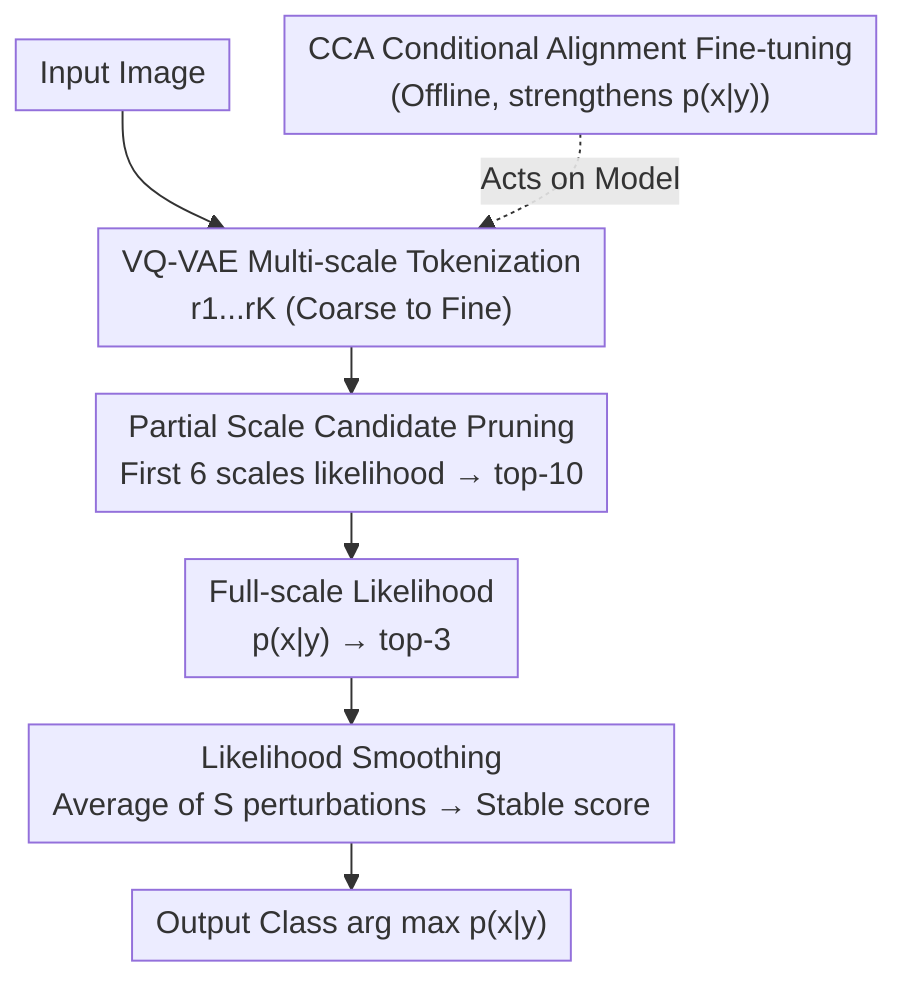

# Your VAR Model is Secretly an Efficient and Explainable Generative Classifier

**Conference**: ICLR 2026  
**Paper**: [OpenReview / ICLR 2026 Proceedings](https://openreview.net/) (Specific link subject to original paper)  
**Code**: https://github.com/Yi-Chung-Chen/A-VARC (Available)  
**Area**: Interpretability / Generative Classifier / Visual Autoregression  
**Keywords**: Generative Classifier, Visual Autoregressive (VAR), Likelihood Smoothing, Candidate Pruning, Token-wise Mutual Information (TMI)

## TL;DR
By treating the computable likelihood of Visual Autoregressive (VAR) models directly as a generative classifier and employing a combination of "Likelihood Smoothing + Partial Scale Candidate Pruning + CCA Fine-tuning" to form A-VARC+, the method achieves accuracy comparable to DiT-based diffusion classifiers on ImageNet-100 (gap <1%) while reducing computation by 89×. It further provides visual interpretability via token-level mutual information and replay-free class-incremental learning capabilities.

## Background & Motivation

**Background**: Generative Classifiers do not directly model the discriminative probability $p(y|x)$. Instead, they use class-conditional generative models to estimate the likelihood $p(x|y)$ and then derive the posterior via Bayes' theorem: $p(y_i|x)=\frac{p(x|y_i)p(y_i)}{\sum_j p(x|y_j)p(y_j)}$. This approach has been repeatedly proven to possess advantages that discriminative models lacks: adversarial robustness, robustness to distribution shifts, and shape biases closer to human perception. Recently, this field has been almost entirely dominated by "diffusion-based generative classifiers."

**Limitations of Prior Work**: Diffusion-based generative classifiers suffer from two major drawbacks. First, they are **computationally prohibitive**—the complexity of a generative classifier naturally grows linearly with the number of classes (as $p(x|y_i)$ must be calculated for each candidate class), and diffusion models cannot calculate the likelihood itself. They rely on ELBO approximations, requiring dozens to hundreds of forward passes per estimation. On datasets like ImageNet with 1000 classes, the cost is too high for practical deployment (the two-stage DC version requires 410,000 GFLOPs per image). Second, the **perspective is too narrow**—most research focuses exclusively on diffusion backbones, leaving it unverified whether "robustness" and other properties are common to all generative classifiers or unique to diffusion.

**Key Challenge**: While the properties of generative classifiers are attractive, achieving both "sufficient accuracy" and "computational efficiency" is impossible under the diffusion paradigm; moreover, the lack of computable likelihood makes everything dependent on expensive Monte Carlo approximations.

**Goal**: To identify a generative backbone with **computable likelihood** that makes generative classifiers both fast and accurate, while unlocking new properties (e.g., interpretability, class-incremental learning) that diffusion models cannot provide.

**Key Insight**: The VAR (Visual Autoregressive) model proposed by Tian et al. (2024) performs "next-scale prediction," tokenizing images into multi-scale token maps $(r_1, \dots, r_K)$. The autoregressive decomposition $p(x|y)=\prod_k p(r_k|r_{<k},y)$ is **naturally computable**, allowing the likelihood of the entire image to be obtained in a single forward pass—addressing the exact deficiency of diffusion models.

**Core Idea**: To use the computable likelihood of VAR directly as a generative classifier (VARC), and then address its limitations (insufficient accuracy and slow speed in large-scale settings) by layer-stacking Likelihood Smoothing, Partial Scale Candidate Pruning, and CCA Fine-tuning to create the efficient and accurate A-VARC+.

## Method

### Overall Architecture

VAR encodes an image into $K$ multi-scale token maps from coarse to fine. The class-conditional likelihood is written as an autoregressive product $p_\theta(x|y)=\prod_{k=1}^{K} p_\theta(r_k|r_1,\dots,r_{k-1},y)$ (Eq.7), obtainable in one forward pass—forming the naive VARC. However, VARC is neither accurate enough (likelihood is sensitive to token perturbations and underutilizes class info) nor fast enough for many classes (requiring full-scale likelihood for every class). A-VARC+ addresses this by: **Offline**, using CCA fine-tuning to strengthen class-conditional information; **Online**, using a three-stage funnel—first using "Partial Scale Candidate Pruning" with the first few coarse scales to filter candidates from all classes down to the top-10, then using full-scale likelihood to filter to the top-3, and finally applying "Likelihood Smoothing" only to these 3 candidates for a stable prediction. Essentially, expensive precise likelihood estimation is reserved for the few most likely candidates, trading saved computation for accuracy.

### Key Designs

**1. Likelihood Smoothing: Adding perturbation-resistant smoothing to fragile discrete token likelihoods**

The difficulty with naive VARC lies in the discreteness of VQ quantization, which makes the likelihood highly non-smooth. The authors conducted an experiment: adding a Gaussian perturbation $\epsilon$ with minimal variance to the feature map $f^{noise}=f+\epsilon$. The reconstructed image $\hat{x}^{noise}$ is visually identical to the original, but **69% of the quantized tokens change**, causing violent fluctuations in the estimated likelihood. For classification, perceptually identical images should yield similar likelihoods. Thus, the authors define the smoothed likelihood as:

$$\tilde{p}_{\theta,S}(x|y)=\sum_{i}^{S} p_\theta(Q(f+\epsilon_i)|y),\quad \epsilon_{i}\sim\mathcal{N}(0,\sigma^2)$$

By sampling $S$ small perturbations of the feature map, quantizing them separately, and aggregating their likelihoods, the spikes in a single point are smoothed into a neighborhood average. This is effective because classification requires a robust judgment of class membership rather than an instantaneous likelihood of a specific discrete token set. Using a small $S$ (saturated at 10 in experiments) significantly improves accuracy. The cost is $S$ times more forward passes, but since it is only applied to the top-3 candidates, the overall overhead remains controlled.

**2. Partial Scale Candidate Pruning: Cheap screening using VAR's "Coarse-scale Global Information"**

The most fatal cost for generative classifiers is the linear complexity with respect to the number of classes. The standard approach (as in diffusion classifiers) is a two-stage process. VAR’s "next-scale prediction" offers a more aggressive pruning opportunity: it generates from coarse to fine, and **each scale encodes global structural information**. Thus, partial likelihoods from the first few coarse scales are often sufficient to distinguish visually distinct classes (e.g., tench vs. hen). The authors define partial scale likelihood as:

$$\hat{p}_{\theta,K'}(x|y)=\prod_{k}^{K'} p_\theta(r_k|r_1,\dots,r_{k-1},y),\quad K'<K$$

Computational cost is highly optimized: among 680 total multi-scale tokens, the first 5 scales contain only 55 (approx. 8%), as low-resolution $h_k \times w_k$ is very small. Experiments show that top-10 accuracy with a small $K'$ approaches full-scale accuracy. Thus, "full-scale likelihood for all classes" is replaced by "partial-scale for all, full-scale for few," saving the vast majority of computation.

**3. CCA Fine-tuning: Recovering class-conditional info lost in MLE via contrastive alignment**

VARC accuracy is also hindered by the fact that class-conditional information is **underestimated/underutilized** when training with a maximum likelihood objective (as noted by Fetaya et al., 2020). Previous remedies added discriminative terms to the objective, but this sacrifices generative capability. Classifier-free guidance (CFG), while common in generation, was found to **decrease classification accuracy**—it sharpens the distribution for visual quality but weakens the global likelihood estimation. The authors instead use Condition Contrastive Alignment (CCA) fine-tuning:

$$\mathcal{L}^{CCA}_\theta(x,y,y_{neg})=-\log\sigma_{sig}\!\big[\beta\log\tfrac{p_\theta(x|y)}{p_\phi(x|y)}\big]-\lambda\log\sigma_{sig}\!\big[-\beta\log\tfrac{p_\theta(x|y_{neg})}{p_\phi(x|y_{neg})}\big]$$

where $p_\phi$ is the frozen pre-trained model. The first term pushes up the likelihood under the true label $y$, while the second term pushes down the likelihood under the incorrect label $y_{neg}$, contrastively amplifying class-conditional information. Unlike discriminative terms, this is a unified fine-tuning approach friendly to both generation and classification—experiments show it forces the model to focus on object-relevant regions, further increasing accuracy to yield A-VARC+.

## Key Experimental Results

### Main Results

ImageNet-100 results (Top-1 / GFLOPs per image, excerpt from Table 1). A-VARC+ is within 1% accuracy of the 2-stage DiT diffusion classifier while using ~89× less computation:

| Method | Top-1 | GFLOPs | Description |
| :--- | :--- | :--- | :--- |
| ViT-B/16 (Discriminative) | 94.20 | 16.9 | Reference upper bound |
| DC(25,250) Diffusion 2-stage | 90.30 | 415056.0 | Diffusion Generative SOTA |
| DC-MF(25) Rectified Flow | 50.30 | 296861.3 | Faster sampling but poor classification |
| IBINN (Normalizing Flow) | 51.12 | 9.2 | Fast but low accuracy |
| VARC (Naive VAR Classifier) | 83.30 | 14105.0 | Baseline |
| **A-VARC+ (Ours)** | **89.32** | **4649.4** | ≈DiT accuracy, ~89× less compute |

> Robustness: A-VARC+ shows improvement over ResNet only on ImageNet-A; it has no significant advantage on other distribution shift datasets (IN-V2/R/Sketch/ObjectNet). This suggests that the robustness reported for diffusion models **does not transfer** to VAR, likely stemming from the denoising training paradigm rather than the generative objective itself.

### Ablation Study

Likelihood Smoothing vs. CCA Fine-tuning (Table 2; screening not used to focus on accuracy, so GFLOPs are higher; $S=10$):

| Smooth | CCA | Top-1 | GFLOPs | Description |
| :--- | :--- | :--- | :--- | :--- |
| ✗ | ✗ | 83.30 | 14105.0 | VARC Baseline |
| ✓ | ✗ | 88.26 | 28210.0 | Smoothing +4.96, but doubles compute |
| ✗ | ✓ | 88.68 | 14105.0 | CCA +5.38, zero extra inference cost |
| ✓ | ✓ | 89.72 | 28210.0 | Combination is best |

Visual Interpretation Quality (Table 3, ImageNet-100 Mean AUC; Insertion↑ / Deletion↓): TMI on A-VARC+ performs best (Insertion 0.944, Deletion 0.605), outperforming LIME/SHAP.

Class-incremental Learning (Table 4, ImageNet 10-class 2-task, no replay data): Discriminative models suffer catastrophic forgetting (None Avg 41.2), CWR Avg 72.4; A-VARC+ Avg **77.4**, slightly higher than DC (76.0).

### Key Findings
- **CCA is the efficiency king**: Adding CCA alone gives +5.38 accuracy **without increasing inference computation**, making it more cost-effective than likelihood smoothing. The two are complementary: smoothing improves robustness, while CCA strengthens class information.
- **Fast Sampling $\neq$ Good Classification**: MeanFlow (rectified flow) is efficient for sampling, but classification accuracy collapses to 50.30, attributed to training mismatches and added noise from approximating marginal velocity fields.
- **Properties are not universal**: Robustness to distribution shifts is a byproduct of the diffusion denoising paradigm, not a universal trait of generative classifiers—VAR does not inherit it. However, the **computable likelihood** brings token-level interpretability (TMI) and replay-free incremental learning, which are unique advantages for VAR.
- **CCA Trade-offs**: While it boosts in-domain accuracy (ImageNet/V2/R/ObjectNet), it slightly decreases performance on ImageNet-A/Sketch by pushing the model to emphasize class-specific atypical information, sacrificing generalization to large distribution shifts.

## Highlights & Insights
- **"Computable Likelihood" is the engine**: The slowness, lack of interpretability, and approximation errors of diffusion classifiers all root back to uncomputable likelihood. By switching to VAR, one forward pass yields the likelihood, making efficiency, TMI explanation, and class-incremental learning all byproducts of the same property.
- **TMI (Token-wise Mutual Information) is clever**: Extending Pointwise Mutual Information $\log\frac{p(x|y)}{p(x)}$ from NLP to token-level $\log\frac{p_\theta(r^{(i,j)}_k|r_{<k},y)}{p_\theta(r^{(i,j)}_k|r_{<k})}$ requires only two forward passes for attribution scores and enables contrastive explanations ("Why A, not B?").
- **Transferable Tricks**: (1) The "Likelihood Smoothing" idea for discrete representations (averaging likelihood over perceptually invariant small perturbations) can be applied to any VQ/discrete token task. (2) "Coarse-scale pruning" is transferable to any coarse-to-fine representation for large-scale retrieval/classification. (3) CCA serves as a template for strengthening conditional info without harming generation.

## Limitations & Future Work
- Authors admit that VAR generative classifiers **do not inherit** diffusion's robustness to distribution shifts; on ImageNet, discriminative models still hold the edge in overall performance.
- Internal limitation: Main experiments were conducted on **ImageNet-100** (small subset); scalability to the full 1000 classes is mitigated by pruning but not fully validated. Class-incremental experiments were small-scale proof-of-concepts.
- CCA's in-domain gains come at the cost of generalization to extreme shifts; practical deployment requires weighting based on data distribution.
- Future improvements: Making the number of scales $K'$, smoothing samples $S$, and candidate counts adaptive based on input difficulty.

## Related Work & Insights
- **vs. Diffusion Classifier (DC, Li et al. 2023)**: DC uses ELBO and requires hundreds of forward passes (~410k GFLOPs); this work uses VAR likelihood in one pass, matching accuracy while saving 89× compute and adding token-level interpretability.
- **vs. IBINN (Mackowiak et al. 2021)**: IBINN uses GMMs and flows; it is extremely fast (9.2 GFLOPs) but significantly less accurate (51.12%). A-VARC+ uses the expressive power of VAR to reach 89.32 units within an acceptable efficiency range.
- **vs. VAE Generative Classifiers (Van De Ven et al. 2021)**: Prior work used VAEs to prove generative classifiers are naturally suited for incremental learning; this work replaces VAE with a more powerful VAR + A-VARC+ suite for better representation and accuracy.

## Rating
- Novelty: ⭐⭐⭐⭐ First systematic study of VAR generative classifiers, linking computable likelihood to efficiency/explanation/incremental learning.
- Experimental Thoroughness: ⭐⭐⭐⭐ Comprehensive comparison across model families, distribution shifts, and ablation; limited slightly by the ImageNet-100 focus.
- Writing Quality: ⭐⭐⭐⭐⭐ Clear motivation, insightful diagnostic experiments.
- Value: ⭐⭐⭐⭐ Brings generative classifiers back to a practical computational range and clarifies which properties are architectural vs. objective-driven.

<!-- RELATED:START -->

## Related Papers

- [\[ICLR 2026\] Latent Thinking Optimization: Your Latent Reasoning Language Model Secretly Encodes Reward Signals in Its Latent Thoughts](latent_thinking_optimization_your_latent_reasoning_language_model_secretly_encod.md)
- [\[ICLR 2026\] Uncovering Conceptual Blindspots in Generative Image Models Using Sparse Autoencoders](uncovering_conceptual_blindspots_in_generative_image_models_using_sparse_autoenc.md)
- [\[ICLR 2026\] Explainable Mixture Models through Differentiable Rule Learning](explainable_mixture_models_through_differentiable_rule_learning.md)
- [\[ICML 2026\] Riemannian Generative Decoder](../../ICML2026/interpretability/riemannian_generative_decoder.md)
- [\[ICLR 2026\] Explainable K-means Neural Networks for Multi-view Clustering](explainable_k_-means_neural_networks_for_multi-view_clustering.md)

<!-- RELATED:END -->
