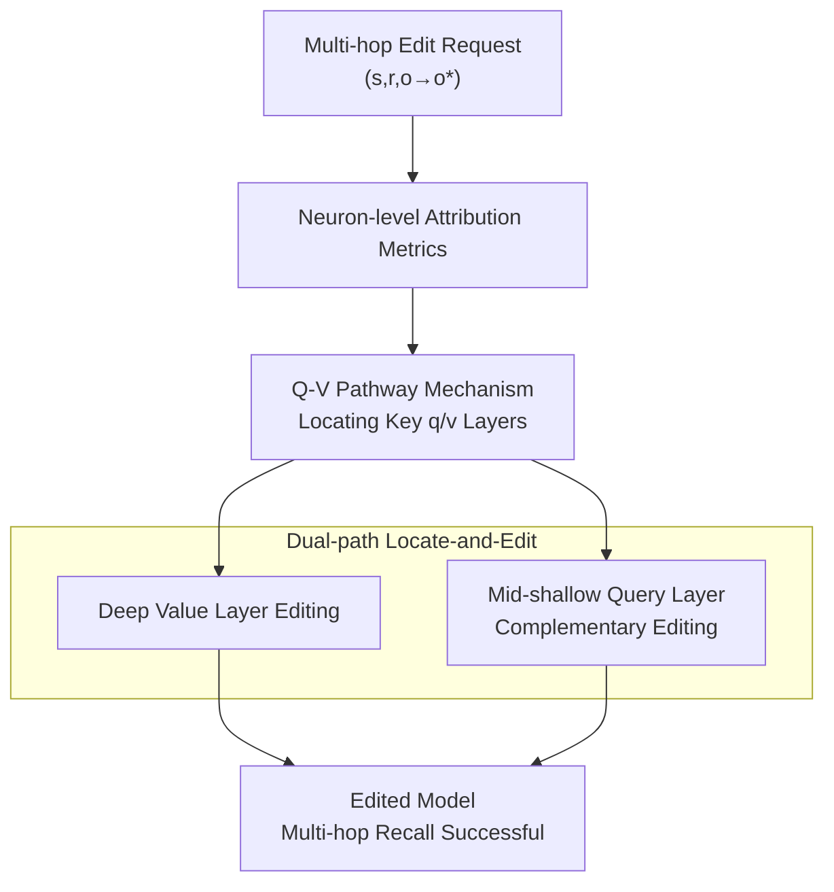

# ACE: Attribution-Controlled Knowledge Editing for Multi-hop Factual Recall

**Conference**: ICLR2026  
**OpenReview**: [https://openreview.net/forum?id=IuWIzmMvKo](https://openreview.net/forum?id=IuWIzmMvKo)  
**Code**: TBD  
**Area**: Knowledge Editing / Mechanistic Interpretability  
**Keywords**: Knowledge Editing, Multi-hop Reasoning, Neuron Attribution, Query-Value Neurons, MQuAKE

## TL;DR
ACE identifies a neglected mechanism via neuron-level attribution where "implicit subjects act as query neurons in multi-hop reasoning, activating value neurons layer-by-layer." Accordingly, it refines editing from "layer-level heuristics" to "query-value pathways," outperforming the SOTA PMET by 9.44% on GPT-J and 37.46% on Qwen3-8B in multi-hop factual recall.

## Background & Motivation
**Background**: Knowledge in LLMs is static and can become outdated or incorrect. Since full retraining is prohibitively expensive, Knowledge Editing (KE) was introduced. The dominant paradigm is "locate-then-edit," where representative methods like ROME, MEMIT, and PMET use causal tracing to locate FFN parameters storing specific facts and rewrite FFN value weights via closed-form optimization to change $(s, r, o)$ to $(s, r, o^*)$. These methods are highly effective for single-hop factual editing.

**Limitations of Prior Work**: Performance collapses sharply in multi-hop factual recall scenarios. This problem is most acute when edited knowledge involves an **implicit subject**—an intermediate entity in the reasoning chain. For example, "In which country did Mark Trumbo's sport originate?" requires first recalling his sport (implicit subject, originally Basketball) and then the country of origin (USA). When the sport is edited to Football, the model should derive Italy, but standard single-hop methods fail as they target only deeper FFN layers, preventing correct propagation across the reasoning chain.

**Key Challenge**: The root cause lies in the insufficient understanding of how intermediate reasoning steps are dynamically represented and accessed at the neuron level. Current KE methods rely on layer-level heuristics, neither knowing which layers actually store the knowledge nor accounting for the coordination of cross-layer neurons. While IFMET improved multi-hop performance by constructing multi-hop prompts to edit deeper FFN layers, the mechanism of why these deep edits are crucial for utilizing implicit subject information remained unexplained.

**Key Insight**: Through systematic causal analysis, the authors present two key observations: (i) In multi-hop recall, implicit subjects functionally act as **query neurons**, sequentially accumulating and activating the **value neurons** required for subsequent reasoning steps; (ii) LLMs store semantically similar knowledge in structurally similar transformer components, where query/value neurons for specific knowledge types exhibit consistent positioning patterns across layers.

**Core Idea**: Since reasoning chain information is accumulated via "query neurons activating value neurons layer-by-layer," editing should be refined from "modifying specific layers" to "modifying specific query-value pathways." ACE uses neuron-level attribution to simultaneously locate and edit both the deep value layers and the mid-shallow query layers typically overlooked by prior methods.

## Method

### Overall Architecture
ACE (Attribution-Controlled Knowledge Editing) extends the "locate-then-edit" paradigm to resolve the "non-propagation" issue in multi-hop editing through two stages and three steps. Given a multi-hop edit request, the **Identifying stage** uses attribution metrics during forward propagation to score each neuron, identifying the key query and value layers carrying the target knowledge. The **Locate-then-edit stage** employs PMET as the editing backend to first write the new explicit fact into the **deep FFN value components**, followed by a complementary edit of the **mid-shallow FFN query mechanism** to adjust the implicit reasoning path originating from the updated fact. Attention heads remain unchanged to preserve general semantic capabilities. The combined dual-path editing ensures updated knowledge is correctly activated and propagated during multi-hop reasoning.

### Key Designs

**1. Neuron-level Attribution Metrics: Separating Query and Value Neurons**

This is the foundation distinguishing ACE from layer-level methods. The limitation of prior work was using layer-granularity causal tracing, which failed to distinguish between neurons responsible for outputting answers and those responsible for activating others. ACE treats FFN output as a weighted sum of neurons: the $l$-th layer FFN output $F^l_i = \sum_{k=1}^{N} m^l_{i,k} \cdot \text{fc2}^l_k$, where $\text{fc2}^l_k$ is the subvalue, and $m^l_{i,k} = \sigma(\text{fc1}^l_k \cdot (h^{l-1}_i + A^l_i))$ is determined by the residual output and subkey. Accordingly, two metrics are designed:

For **value neurons**, "log probability increment" measures the causal impact of a neuron $v$ on the final token prediction distribution:

$$I(v^l) = \log\big(p(w \mid v^l + h^{l-1})\big) - \log\big(p(w \mid h^{l-1})\big), \quad I(l) = \sum_{v \in l} I(v^l)$$

Since it satisfies approximate additivity $I(x+v) \approx I(x) + I(v)$, it allows per-neuron and per-layer accumulation to locate components that truly raise the probability of the correct token. For **query neurons**, this doesn't work because they do not directly carry target token information; their role is to activate value neurons. Thus, "activation capability" is measured by the dot product with their own subkey: $I_{query} = v \cdot \text{fc1}^l_k$. A larger dot product indicates a stronger capability to trigger downstream value neurons. These metrics decouple "answer output" from "propagation," providing precise coordinates for editing.

**2. Q-V Pathway Mechanism: Implicit Subjects as Query Neurons Activating Value Neurons**

This is the mechanistic discovery of ACE. The authors performed causal interventions on GPT-J and Qwen3-8B using MQuAKE-3K, yielding two takeaways. **Takeaway 1**: LLMs store semantically similar knowledge in structurally similar components—MHSA is activated at similar positions (e.g., a27, a26, a7) across all knowledge types, indicating attention stores general capabilities; FFN layers extract specific knowledge (e.g., f24, f27, f16 are top for nationality/continent/language; author/team/founder fall in different layers). Zeroing only 1% of critical semantic neurons drops accuracy by over 90%, while random zeroing only drops it by 9%, proving high knowledge concentration. **Takeaway 2**: Final answer information is accumulated along the reasoning chain via implicit query neurons "sequentially activating corresponding value neurons." Evidence shows query FFN activation (log increment) consistently leads value neuron activation by 1–2 layers. Ablating 100 top query neurons (fq16, fq18) in 2-hop requests drops performance by 46.2% and 61.9% respectively, and the number of activated value neurons in subsequent layers (f17,18,19) plummets from (28,16,33) to (6,4,7). This mechanism explains why targeting only deep value layers fails: without modifying the query layers, value layers are "incompletely activated."

**3. Dual-path Locate-and-Edit: Complementary Editing of Deep Value and Mid-shallow Query Layers**

This step implements the mechanism into editing actions. Prior methods overlooked two aspects: they underestimated the depth of value layers and completely ignored query layers. In Stage 1, ACE uses the aforementioned metrics to rank and select top query/value layers across multi-hop questions. In Stage 2, PMET is used as the backend for FFN writing: FFN output is viewed as key-value storage, where $\sigma(W^l_{fc1} h^{l-1}_i)$ is the key and the total FFN output is the value $v_i$. The subvalue matrix $W^l_{fc2}$ is solved such that $W^l_{fc2} k = v^*$ ($v^*$ being the new fact). Crucially, this is done via **two paths**: complementary edits to the mid-shallow query mechanism to correct the implicit reasoning path, and new explicit knowledge writing in deep value components. Ablations show that omitting query layers results in a 16.51% drop, while omitting value layers leads to a 40.45% drop, confirming their specialized roles.

> ⚠️ Note: The original paper's formula formatting is inconsistent (e.g., Stage 2 shows $W^l_{fc2}\sigma(W^l_{fc2}h^{l-1}_i)$, likely intended as $W^l_{fc2}\sigma(W^l_{fc1}h^{l-1}_i)$); this interpretation follows standard FFN key-value logic. Refer to the original paper for definitive notation.

### Loss & Training
ACE does not introduce new training objectives. The editing process utilizes the closed-form optimization backend of PMET (details in Algorithm D / Appendix H of the original paper). Edit prompts are integrated with in-context priming and Chain-of-Thought to precisely locate key layers and activation patterns. Attention heads remain unchanged throughout the process.

## Key Experimental Results

### Main Results
Evaluation of multi-hop accuracy was conducted on MQuAKE-3K (3000+ instances) in a few-shot setting using GPT-J(6B) and Qwen3-8B, with PMET as the baseline backend. `# Edits` refers to the number of facts edited in the reasoning chain.

| Method | Avg.(GPT/Qwen) | GPT-J 1-edit | GPT-J 4-edit | Qwen3 1-edit | Qwen3 4-edit |
|------|------|------|------|------|------|
| Base (Unedited) | 98.42 / 99.17 | 99.7 | 97.23 | 99.81 | 97.64 |
| FT | 3.54 / 2.18 | 4.17 | 0.00 | 3.14 | 0.00 |
| ROME | 35.04 / 28.79 | 44.51 | 5.06 | 35.09 | 7.08 |
| MEMIT | 38.58 / 18.67 | 64.30 | 8.16 | 29.84 | 4.20 |
| PMET | 37.01 / 20.78 | 49.26 | 17.01 | 28.64 | 11.20 |
| **ACE** | **46.45 / 58.24** | 45.26 | **43.29** | **60.22** | **47.61** |

ACE outperforms PMET by an average of 9.44% on GPT-J and 37.46% on Qwen3-8B. The advantage is particularly pronounced in multi-edit scenarios (4-edit), where baselines collapse (PMET drops to 17.01 on GPT-J) while ACE maintains 43.29. Traditional paradigms perform worse on Qwen3-8B due to fixed editing positions, whereas ACE's dynamic q-v alignment is more flexible.

Finer-grained metrics (Efficacy / Paraphrase / Specificity):

| Method (GPT-J/Qwen3) | Efficacy | Paraphrase | Specificity |
|------|------|------|------|
| PMET | 81.6 / 75.6 | 65.8 / 68.9 | 74.6 / 64.4 |
| **ACE** | **99.8 / 99.4** | **91.2 / 94.2** | 79.2 / 81.8 |

ACE achieves significant leads in Efficacy and Paraphrase robustness, while also improving Specificity (side effects on unrelated knowledge) over PMET.

### Ablation Study
Skipping edits for certain key layers based on importance ranking (↓ denotes drop relative to ACE):

| Configuration | Avg. | Description |
|------|------|------|
| ACE (Full) | Baseline | — |
| Skip top-1 query layer (GPT-J) | 43.26 (↓6.87%) | One query layer omitted |
| Skip top-1,2,3 query layers (GPT-J)| 38.78 (↓16.51%) | Three query layers omitted |
| Skip top-1 value layer (GPT-J) | 42.14 (↓9.28%) | One value layer omitted |
| Skip top-1,2 value layers (Qwen3) | 34.68 (↓40.45%) | Two value layers omitted, largest drop |

CoT prompt ablations show ACE is robust to in-context information: performance only drops by 0.4% (GPT-J) and 0.6% (Qwen3) under OOD Few-Shots, indicating results are driven by "internal writing" rather than in-context learning.

### Key Findings
- **Value layers are more critical, but query layers are indispensable**: Skipping value layers (40.45% drop) hurts more than skipping query layers (16.51% drop), confirming the division of labor: query layers activate, while value layers carry content.
- **Accurate prediction depends on extremely sparse interpretable neurons**: In the "Tim Duncan plays the sport of" case, ablating 27 semantically interpretable key neurons caused accuracy to plummet to 3.2%, while ablating 27 high-importance but uninterpretable neurons maintained 59.4%.
- **GPT-J vs. Qwen3 Architectural Differences**: GPT-J has query layers fixed in mid-layers and value layers in deep layers (fq16-18 / fv28-30) across domains. In Qwen3-8B, query layers are in mid-deep layers and partially overlap with value layers (fq27-29 / fv30-32), with absolute positions drifting dynamically by domain, making it more sensitive to layer selection.

## Highlights & Insights
- **Operationalizing "Query vs. Value Neurons" as Editing Coordinates**: While prior KE worked at layer granularity, ACE uses two metrics (log probability increment for value, subkey dot product for query) to decouple "answer output" from "activation." This is a prerequisite for precise query pathway editing and transferable to other interpretability tasks.
- **Mechanism-Driven Editing**: The observations "Implicit subject = query neuron" and "query activation leads value by 1–2 layers" are not just post-hoc explanations but prescriptive instructions for which layers to edit.
- **Inspiration from Sparse Interpretable Neurons**: The finding that 27 neurons determine accuracy (dropping to 3.2% upon ablation) narrows the "control points" for multi-hop reasoning to a tiny set, echoing recent research on token entropy and suggesting future "pinpoint intervention" possibilities.

## Limitations & Future Work
- **Reliance on MQuAKE-3K**: All mechanism analysis and main experiments rely on MQuAKE-3K, with filtering applied (keeping only instances the base model could originally reason through). This may overestimate editing efficacy compared to "wild" multi-hop distributions.
- **Low Absolute Accuracy**: Despite exceeding baselines, ACE's 4-edit accuracy (~43) remains far below the base model's 98+, indicating multi-hop editing is far from solved.
- **Limited Model Coverage and Backend Binding**: Validated only on GPT-J and Qwen3-8B using PMET as a backend. Effectiveness on larger/modern models or alternative backends is unverified.
- **Future Improvements**: Developing online adaptive query layer localization (instead of per-domain attribution) and exploring sparse interpretable neurons as the minimal intervention set to further reduce side effects.

## Related Work & Insights
- **vs. ROME / MEMIT**: These foundations of locate-then-edit work at layer/parameter granularity. ACE sinks granularity to the neuron level and explicitly edits query layers they missed.
- **vs. PMET**: PMET distinguishes between MHSA (patterns) and FFN (facts) and serves as ACE's backend. ACE gains a 9.44%/37.46% advantage by "editing query layers complementarily" and using attribution for layer selection.
- **vs. IFMET**: IFMET also targets multi-hop via multi-hop prompts and deeper FFN edits but lacks mechanistic explanation. ACE clarifies the "query-value pathway" mechanism and uses it for finer dual-path editing.
- **vs. Interpretability Works (e.g., Yu & Ananiadou 2023)**: Prior work revealed predictions are driven by query-value interactions. ACE applies this to "tracking and modulating activation pathways" for interpretable, directional multi-hop editing.

## Rating
- Novelty: ⭐⭐⭐⭐⭐ Successfully closes the loop from the "implicit subject = query neuron" mechanism to editing actions.
- Experimental Thoroughness: ⭐⭐⭐⭐ Comprehensive experiments, but limited to one benchmark and two backbones with dataset filtering.
- Writing Quality: ⭐⭐⭐ Logic and mechanisms are clear, but formula formatting contains suspected typos and inconsistent notation.
- Value: ⭐⭐⭐⭐ Provides a mechanistic foundation and substantial improvements for multi-hop KE, demonstrating how interpretability can drive downstream performance.

<!-- RELATED:START -->

## Related Papers

- [\[ACL 2026\] Can Factual Opinions Be Edited (Manipulated) in Large Language Models?](../../ACL2026/knowledge_editing/can_factual_opinions_be_edited_manipulated_in_large_language_models.md)
- [\[CVPR 2026\] Attribution-Guided Model Rectification of Unreliable Neural Network Behaviors](../../CVPR2026/knowledge_editing/attribution-guided_model_rectification_of_unreliable_neural_network_behaviors.md)
- [\[ICLR 2026\] Disentangling Knowledge Representations for Large Language Model Editing](disentangling_knowledge_representations_for_large_language_model_editing.md)
- [\[ICLR 2026\] TangleScore: Tangle-Guided Purge and Imprint for Unstructured Knowledge Editing](tanglescore_tangle-guided_purge_and_imprint_for_unstructured_knowledge_editing.md)
- [\[ICLR 2026\] SUIT: Knowledge Editing with Subspace-Aware Key-Value Mappings](suit_knowledge_editing_with_subspace-aware_key-value_mappings.md)

<!-- RELATED:END -->
