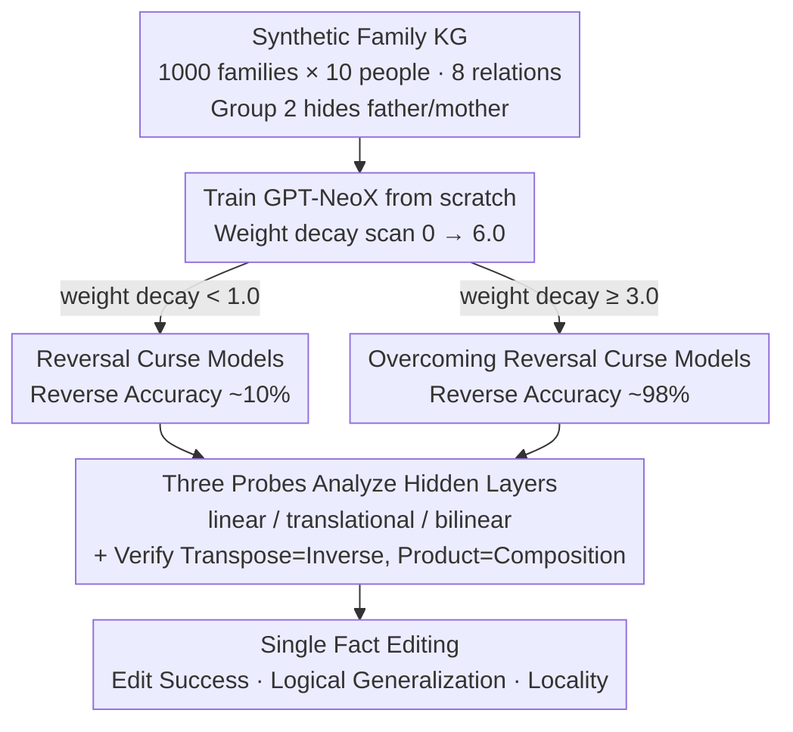

# Bilinear Representation Mitigates Reversal Curse and Enables Consistent Model Editing

**Conference**: ICLR 2026  
**arXiv**: [2509.21993](https://arxiv.org/abs/2509.21993)  
**Code**: Available (GPT-NeoX framework)  
**Area**: LLM Reasoning / Knowledge Representation / Model Editing  
**Keywords**: reversal curse, bilinear representation, model editing, relational structure, knowledge graph

## TL;DR
By training Transformers from scratch on synthetic relational knowledge graphs, it is discovered that appropriate regularization leads to the emergence of a bilinear relational structure in hidden layers. This structure not only overcomes the reversal curse but also enables logically consistent propagation of updates to related facts after editing a single fact.

## Background & Motivation

### Background
Language models exhibit powerful performance in knowledge-intensive tasks, but their reasoning abilities often lack logical consistency. A typical example is the "reversal curse": a model that learns "A is the father of B" fails to infer that "B is the child of A." The field of model editing aims to update knowledge without retraining, but existing methods fail to propagate updates to logically entailed facts.

### Limitations of Prior Work

**Reversal curse is viewed as a fundamental limitation**: The prevailing view attributes it to the directionality of the autoregressive training objective, where the model only models $P(B|A)$ instead of $P(A|B)$.

**Model editing lacks logical generalization**: After editing "A's spouse is C→D," the model cannot automatically infer that "D's spouse is A," necessitating explicit bidirectional edits.

**Existing solutions address symptoms rather than causes**: Data augmentation (generating reverse samples) or modifying training objectives are merely superficial patches.

### Key Challenge
Are these logical failures inherent defects of the Transformer architecture, or are they products of the way the model represents knowledge?

### Goal
1. Can the reversal curse be overcome through appropriate training?
2. What mathematical structure does the model use internally to encode relational knowledge?
3. How does this structure influence the logical consistency of model editing?

### Key Insight
The research approaches the problem from the geometric structure of knowledge representation. The researchers noted that bilinear models in knowledge graph embedding methods (such as RESCAL) naturally support relational inversion (matrix transpose) and composition (matrix multiplication). They hypothesize that if Transformers learn a bilinear relational structure, they can overcome the reversal curse and achieve editing generalization.

### Core Idea
The reversal curse and model editing failures are not inherent defects of Transformers but are results of a missing representation structure—when the model learns a bilinear relational structure, these problems are naturally resolved.

## Method

### Overall Architecture

This paper does not propose a new algorithm but uses a set of **controlled experiments** to answer a mechanistic question: Is the reversal curse an architectural flaw of Transformers or a product of the knowledge representation structure? The pipeline consists of four steps. First, a clean synthetic family relation knowledge graph is constructed to compress "reverse reasoning" and "multi-hop reasoning" into a precisely controlled minimal system. Second, a batch of GPT-NeoX models (12 layers, 896 hidden dimensions, 16 heads, ~206M parameters) are trained from scratch on this graph. The only variable key knob is weight decay, scanned from 0 to 6.0, causing the same architecture to split into "reversal curse" and "overcoming reversal curse" categories. Third, three mathematical probes (linear / translational / bilinear) are used to analyze how relations are encoded in the hidden layers of these models, further verifying if the learned matrices satisfy relational algebraic properties. Finally, single-fact editing is performed on these models to observe which representation structure allows an update to propagate logically consistently to entailed facts. The design aims to test "overcoming reversal curse," "emergence of bilinear structure," and "logical generalization of editing" on the same set of models to reveal the causal chain between them.

### Key Designs

**1. Synthetic Knowledge Graph: Compressing Relational Reasoning into a Minimal Closed System**

The experiment requires an environment to cleanly measure "reverse reasoning" and "multi-hop reasoning," which is impossible in real corpora due to complex and uncontrollable relationships. Researchers constructed 1000 families with 10 members each, using only 8 relations: husband, wife, father, mother, son, daughter, brother, and sister. These 8 were chosen because they form a closed set containing both inverse relations (e.g., wife of husband is husband) and compositional multi-hop relations (e.g., husband ∘ mother = father), covering both "inverse" and "compositional" algebraic properties. To create "unseen reverse/compositional facts," the 1000 families were split into two groups—Group 1 (500 families) retained all 36 facts, while Group 2 (500 families) intentionally omitted father/mother relations, leaving only 24. The test set specifically targets the hidden father/mother relations in Group 2. This forces the model to rely on internal structures learned from Group 1 (e.g., inferring (C, father, B) from (A, husband, B) and (B, son, C)) rather than memorization.

**2. Weight Decay Scan: Creating a Control for "Overcoming/Not Overcoming Reversal Curse"**

While the reversal curse is often attributed to the directionality of the autoregressive objective (modeling $P(B|A)$ but not $P(A|B)$), the authors test if this is truly inherent. They scanned weight decay in AdamW across $\{0, 0.1, 0.5, 1.0, 2.0, \dots, 6.0\}$ with 3 random seeds per setting (27 models total), keeping everything else constant. This produced models with identical architectures but different regularization strengths. Results showed that while all models reached 100% training accuracy, models with weight decay below ~1.0 failed on hidden reverse relations (~10% accuracy), whereas those with high weight decay approached 100% accuracy. The point around 1.0 is a bifurcation where different seeds produces either outcome. This implies the reversal curse can be "reproduced" or "eliminated" by the same architecture under different regularization—regularization forces the model to learn a more generalized internal structure (the bilinear structure verified in the next section) instead of rote memorization. This provides a natural contrast for later analysis between "reversal curse" models (<40% accuracy) and "overcoming" models (>98% accuracy).

**3. Bilinear Probes and Algebraic Validation: Analyzing "How Relations are Encoded" and Confirming Algebraic Consistency**

The core question is identifying the mathematical structure encoding relations. The authors applied three probes to fit hidden layer representations. Linear Relational Embedding models relation as a local affine transform from subject to the final layer object representation, $o_L \approx W_r s_l + b_r$, where $W_r$ is estimated by the Jacobian $J_r = \partial o_L / \partial s_l$ of the forward pass. Translational probes follow Word2Vec's vector shifts within the same layer, $s_l + v_r \approx o_l$, where $v_r$ is the average displacement. Bilinear probes model the relation as a matrix $M_r$, using a scoring function $f_r(s_l, o_l) = s_l^\top M_r o_l$ to characterize the interaction, targeting a score of 1 for true facts and 0 otherwise, solved via a ridge regression variant of RESCAL. Only the bilinear form naturally supports $M_r^\top$ for inverse relations and $M_{r_2} M_{r_1}$ for composition. If the model truly performs reverse reasoning, its layers should be better explained by the bilinear probe. 

Validation went beyond fitting: the authors used the learned matrices for actual operations, testing if $M_{\text{husband}}^\top$ could act as the wife relation and if $M_{\text{husband}} \cdot M_{\text{mother}}$ predicted the father relation. In models that overcame the reversal curse, bilinear probes reached >95% accuracy in layers 6-9, and algebraic operations (transpose and product) also reached >95% in those layers. In contrast, reversal curse models remained at a random baseline of ~33% for all probes. This establishes the "bilinear structure" as a **functional algebraic structure**—where matrix transpose truly corresponds to inverse relations and multiplication to composition—which is present only in reasoning-capable models.

**4. Model Editing Experiments: Testing if Bilinear Structure Enables Consistent Propagation**

The final step links representation structure to model editing. The authors edited a single husband fact (A, husband, B→B') and measured: Edit Success (direct update), Logical Generalization (propagation to entailed facts like (B', wife, A)), and Locality (preservation of unrelated facts). While both model types achieved direct edit success, logical generalization differed drastically—bilinear models propagated changes to entailed facts, while reversal curse models failed. Bilinear probe accuracy correlated with logical generalization with an $R^2 = 0.939$. Interestingly, the best layers for editing (layers 1-4) did not overlap with the layers of strongest bilinear structure (layers 6-9)—edits must be made in early layers where the structure is "forming" rather than where it is "already established" to propagate correctly to downstream representations.

## Key Experimental Results

### Main Results
Relationship between reverse reasoning accuracy and weight decay (tested on hidden father/mother relations in Group 2):

| Weight Decay | Training Accuracy | Test Accuracy (Reverse Inference) | Status |
|-------------|-------------------|-----------------------------------|--------|
| 0 | 100% | ~10% | Reversal Curse |
| 0.5 | 100% | ~30% | Reversal Curse |
| 1.0 | 100% | ~40-98% (seed dependent) | Bifurcation Point |
| 3.0+ | 100% | ~98% | Overcoming Reversal Curse |

### Probe Accuracy Comparison (Middle Layers 6-9)

| Probe Type | Non-Reversal Curse Model | Reversal Curse Model |
|------------|-------------------------|----------------------|
| Linear | ~33% (baseline) | ~33% (baseline) |
| Translational | ~33% (baseline) | ~33% (baseline) |
| Bilinear | >95% | ~33% (baseline) |

### Model Editing Results

| Metric | With Bilinear Structure | Without Bilinear Structure |
|--------|-------------------------|----------------------------|
| Edit Success | ~100% | ~100% |
| Logical Generalization | High (peak ~90%+) | Near 0% |
| Locality | High | Low |

### Key Findings
- **Reversal curse is a representation issue, not an architectural one**: Same architecture, different regularization, yields vastly different reasoning abilities.
- **Bilinear structures concentrate in middle layers**: Highest accuracy in layers 6-9, consistent with findings that attention heads encode relational operations.
- **Algebraic structures are functional**: Matrix transpose $\approx$ inverse relation, and matrix product $\approx$ composition; it is not merely a statistical correlation.
- **Optimal editing layer $\neq$ strongest structure layer**: Editing must occur in early layers during "formation" for correct propagation.

## Highlights & Insights
- **Profound perspective shift**: Redefining the reversal curse from a "model capability defect" to a "missing representation structure" changes the solution paradigm—from seeking better training objectives to focusing on the geometric structure of knowledge.
- **Sophisticated control with synthetic data**: The family relation graph is a minimal complete system for testing relational reasoning, elegantly covering inverse and composition with 8 relations.
- **Systematic probe design**: The comparative design of linear/translational/bilinear probes clearly rules out alternative hypotheses.
- **Transferable insight**: "First check if the model possesses the representation structure required for reasoning, then decide on the algorithm"—this paradigm is applicable to broader AI reliability issues.

## Limitations & Future Work
- **Synthetic vs. Real Data**: Experiments were conducted on clean synthetic data with 206M parameter models; whether similar bilinear structures exist in large-scale pre-trained models remains unverified.
- **Limited Relation Types**: Only 8 family relations were used; real-world knowledge involves thousands of heterogeneous relations, and different knowledge types might use different geometric structures.
- **Simplified Editing Methods**: Only basic layer-wise fine-tuning was used, without integration with advanced methods like ROME/MEMIT.
- **Causality Issues**: High bilinear probe accuracy does not strictly prove the model "uses" the structure for reasoning (correlation vs. causality).

## Related Work & Insights
- **vs. Berglund et al. (2024) Reversal Curse paper**: They define the reversal curse as a fundamental LM limitation; this paper proves it's a representation structure issue rather than an inherent defect.
- **vs. Hernandez et al. (2024) Linear Relational Embedding**: They argue LMs encode knowledge via linear relations; this paper finds bilinear is the key structure supporting reverse reasoning.
- **vs. ROME/MEMIT Editing Methods**: They focus on algorithm design; this paper points out that editing success depends more on whether the model possesses the appropriate representation geometry.
- **vs. Nishi et al. (2025)**: They found editing "fractures" internal topology; this paper further explains what structure (bilinear) needs protection.

## Rating
- Novelty: ⭐⭐⭐⭐⭐ Attributes reversal curse to representation geometry rather than training objectives, offering a fresh perspective.
- Experimental Thoroughness: ⭐⭐⭐⭐ Four progressive experiments are well-designed but limited to synthetic data and small models.
- Writing Quality: ⭐⭐⭐⭐⭐ Clear logical chain, excellent charts, and concise formulas.
- Value: ⭐⭐⭐⭐ High heuristic value for understanding LM knowledge representation and editing mechanisms, though practical application requires more validation.

<!-- RELATED:START -->

## Related Papers

- [\[ICLR 2026\] Fine-tuning Done Right in Model Editing](fine-tuning_done_right_in_model_editing.md)
- [\[ICLR 2026\] Energy-Regularized Sequential Model Editing on Hyperspheres](energy-regularized_sequential_model_editing_on_hyperspheres.md)
- [\[ACL 2026\] Representation Interventions Enable Lifelong Knowledge Memory Control in LLMs](../../ACL2026/knowledge_editing/representation_interventions_enable_lifelong_knowledge_memory_control_in_llms.md)
- [\[ICML 2025\] Representation Shattering in Transformers: A Synthetic Study with Knowledge Editing](../../ICML2025/knowledge_editing/representation_shattering_in_transformers_a_synthetic_study_with_knowledge_editi.md)
- [\[ICLR 2026\] EAMET: Robust Massive Model Editing via Embedding Alignment Optimization](eamet_robust_massive_model_editing_via_embedding_alignment_optimization.md)

<!-- RELATED:END -->
