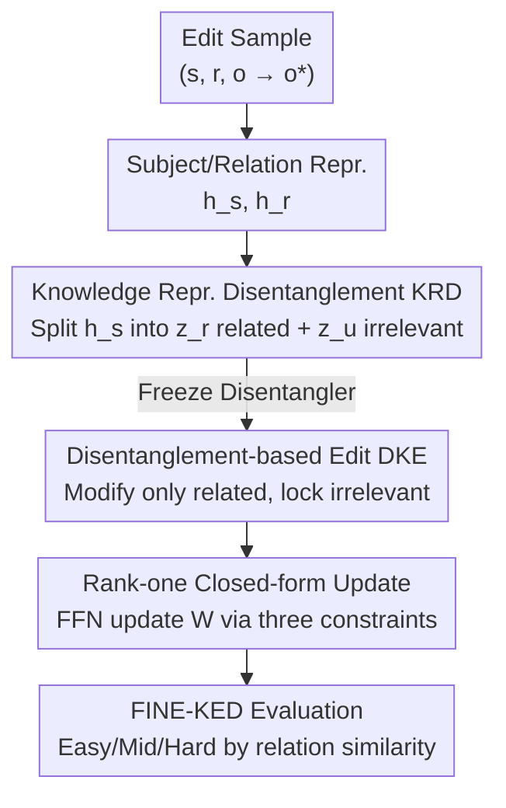

# Disentangling Knowledge Representations for Large Language Model Editing

**Conference**: ICLR2026  
**OpenReview**: [https://openreview.net/forum?id=PmRBeF2umZ](https://openreview.net/forum?id=PmRBeF2umZ)  
**Code**: To be confirmed  
**Area**: Knowledge Editing / LLM  
**Keywords**: Knowledge Editing, Representation Disentanglement, Fine-grained irrelevant knowledge, Rank-one update, locate-then-edit

## TL;DR
Addressing the neglected problem where knowledge editing collateralizes "same-subject but different-relation/object" fine-grained irrelevant knowledge, this paper proposes DiKE: it first uses a reusable disentanglement module to split subject representations into "target-related" and "irrelevant" parts, then performs editing only on the related part while explicitly constraining the irrelevant part to remain unchanged, deriving a closed-form rank-one parameter update formula that maintains mainstream editing performance while preserving fine-grained irrelevant knowledge.

## Background & Motivation
**Background**: Knowledge Editing is a means to accurately update or inject factual knowledge into LLMs without retraining the entire model. "Parameter-modifying" methods (locate-then-edit, e.g., ROME, MEMIT, AlphaEdit) receive the most attention because they do not rely on external memory or inference-time context, providing stable and consistent outputs. The core assumption of these methods is that factual knowledge exists as key-value pairs in FFNs; changing a fact $(s,r,o)$ to $(s,r,o^*)$ is equivalent to a rank-one update on the FFN weights $W$, mapping the subject key $k_*$ to a new value $v_*$.

**Limitations of Prior Work**: Existing methods perform well in "injecting new knowledge" and "preserving roughly irrelevant knowledge," but the authors found they generally fail to protect a category of **fine-grained irrelevant knowledge**—facts that **share the same subject with the edited fact but have entirely different relations and objects**. For example, when changing "The US President is Biden" to "The US President is Trump," the fact "The US Capital is Washington" should ideally remain untouched, yet existing methods often distort it. In a pre-experiment with 1000 random edits, FT-L / MEND / ROME / AlphaEdit showed significantly lower retention rates for fine-grained irrelevant knowledge compared to coarse-grained irrelevant knowledge (where the subject differs).

**Key Challenge**: The root cause lies in the representation space. LLMs retrieve knowledge centered around **subject representations**, which naturally encode **multiple attributes** of the subject (US president, capital, population...). Consequently, the target knowledge and its fine-grained irrelevant knowledge are **entangled** within the subject representation—modifying one affects the other. Existing methods attempt to prevent leakage by constructing constraints from widely sampled irrelevant text (like Wikitext), but such constraints are coarse-grained and fail to align with sibling relations under the same subject.

**Goal**: To accurately inject target edits while explicitly protecting "same-subject, different-relation" fine-grained irrelevant knowledge.

**Key Insight**: Since the problem is that "target attributes and irrelevant attributes are scrambled within the subject representation," they should be **disentangled** first—splitting the subject representation into "target-related" and "target-irrelevant" components, editing only the related component while locking the irrelevant one.

**Core Idea**: Use a reusable disentangler to split subject representations into related/irrelevant parts, perform rank-one editing only on the related part with explicit constraints to keep the irrelevant part invariant, thereby separating "correcting" from "not collateralizing" at the representation level.

## Method

### Overall Architecture
DiKE is a locate-then-edit method consisting of **two stages**. The first stage is **KRD (Knowledge Representation Disentanglement) training**: a "disentangler + recomposer" is learned on a training set to split a subject representation $h_s$ into a target-related representation $z^r_e$ and a target-irrelevant representation $z^u_e$ for any edit sample, with the ability to reconstruct $h_s$ from both. This module is **trained once and reused perpetually**, requiring no retraining for subsequent edits. The second stage is **DKE (Disentanglement-based Knowledge Edit)**: the disentangler is frozen; for each edit $(s,r,o^*)$, an increment $\delta$ is solved only for the target-related representation to inject new knowledge, while the requirement that the "target-irrelevant representation remains unchanged before and after editing" is formulated as a constraint. Finally, by combining target edit constraints, coarse-grained preservation constraints, and fine-grained preservation constraints, a **closed-form rank-one weight update** is derived to modify the FFN directly. To evaluate this, the authors also constructed the FINE-KED benchmark.

### Key Designs

**1. Knowledge Representation Disentanglement KRD: Splitting Subject Representations**

This design addresses the entanglement of target knowledge and fine-grained irrelevant knowledge. KRD uses two sub-modules. The **Disentangler** takes the subject representation $h_s$ and relation representation $h_r$ as input, outputting a pair of disentangled vectors: target-related representation $z^r_e = f(W_1 h_s + W_2 h_r)$ and target-irrelevant representation $z^u_e = f(W_3 h_s + W_4 h_r)$, where $f$ is GELU and $W_{1 \sim 4}$ are trainable projection matrices. The **Recomposer** then reconstructs the subject representation $\hat h_s = W_5 z^r_e + W_6 z^u_e$. $h_s$ and $h_r$ are taken from the hidden states of the last token of the subject and the prompt $p(s,r)$, respectively, at layer $l$.

Structure alone is insufficient; three complementary objectives force information separation:
- **Knowledge Disentanglement Loss $L_{ctr}$**: Uses contrastive learning (InfoNCE) to maximize mutual information between $z^r_e$ and $h_s$, and $z^u_e$ and $h_s$ (as facets of $h_s$), while pushing $(z^r_e, z^u_e)$ apart as negative pairs to ensure separation in the representation space.
- **Knowledge Constraint Loss $L_{con}$**: Ensures each component encodes its respective facts. By replacing $h_s$ with $z^r_e$ or $z^u_e$ in the forward pass, $z^r_e$ is required to predict the target object $o$, while $z^u_e$ is required to predict sampled fine-grained irrelevant objects $o'$ (from fact set $N$ with same subject but different relations), i.e., $L_{con} = -\log P_{F(h_s:=z^r_e)}[o \mid p(s,r)] + \sum_{(s,r',o')\in N} -\log P_{F(h_s:=z^u_e)}[o' \mid p(s,r')]$.
- **Knowledge Reconstruction Loss $L_{recon} = \lVert h_s - \hat h_s \rVert^2$**: Uses MSE to ensure the subject semantics are preserved after disentanglement.

These are combined as $L = L_{ctr} + \alpha L_{con} + \beta L_{recon}$ for joint training. This is effective because it simultaneously enforces "separation (contrastive) + distinct responsibility (constraint) + no information loss (reconstruction)" on the disentangler.

**2. Disentanglement-based Knowledge Edit DKE: Editing Only Related Components**

Addressing the issue where traditional methods inevitably affect irrelevant attributes by modifying entangled representations, DKE freezes the disentangler. It **no longer directly optimizes the output of an FFN layer** like ROME/MEMIT; instead, it solves for a correction $\delta$ only for the target-related representation: $h^*_s = \mathrm{Rec}(z^r_e + \delta,\ z^u_e)$, where $\delta = \arg\min_\delta -\log P_{F(h_s:=h^*_s)}[o^* \mid p(s,r)]$. Crucially, the irrelevant component $z^u_e$ participates in reconstruction unchanged. The value to be injected into the FFN is then calculated as $v_* = h^*_s - h^p_s$.

Furthermore, to prevent the edited weight $\hat W$ from indirectly disturbing the irrelevant representation, DKE explicitly constrains the invariance of the irrelevant component: $\mathrm{Dis}^u(h^p_s + \hat W k_*, h_r) \approx \mathrm{Dis}^u(h_s, h_r)$, which simplifies after omitting activation to $\lVert W_3(\hat W k_* - v_0) \rVert_F^2$ (where $v_0 = W k_*$ is the original FFN output). A similar constraint $\lVert W_3(\hat W K_0 - V_0)\rVert_F^2$ is applied to the preservation set $(K_0, V_0)$. This additional layer of constraint in the disentangled irrelevant subspace is what protects sibling facts.

**3. Closed-form Rank-one Parameter Update: Solving Three Constraints Simultaneously**

This step solves the problem of how to efficiently satisfy multiple constraints without iterative optimization. By combining target editing, coarse-grained preservation, and fine-grained preservation into a single objective:

$$\hat W = \arg\min_{\hat W} \underbrace{\lVert \hat W k_* - v_* \rVert_F^2}_{\text{Target Edit}} + \underbrace{\lVert \hat W K_0 - V_0 \rVert_F^2}_{\text{Coarse-grained Pres.}} + \underbrace{\lVert W_3(\hat W k_* - v_0)\rVert_F^2 + \lVert W_3(\hat W K_0 - V_0)\rVert_F^2}_{\text{Fine-grained Pres.}}$$

Using matrix theory (normal equations), the closed-form solution is $\hat W = W + (W_3^\top W_3 + E)^{-1}\,\Delta_{\text{MEMIT}}$, where $E$ is the identity matrix and $\Delta_{\text{MEMIT}}$ is the original MEMIT rank-one update. In essence, DiKE multiplies the MEMIT update term by a projection correction $(W_3^\top W_3 + E)^{-1}$ determined by the disentangler weight $W_3$, "twisting" the update towards a direction with minimal disturbance to fine-grained irrelevant knowledge.

**4. FINE-KED Benchmark: Relation Similarity Grading**

Since existing benchmarks cannot measure collateral damage to "same-subject, different-relation" facts, FINE-KED constructs a fine-grained irrelevant fact $(s,r',o')$ for each edit $(s,r,o)$. Irrelevant facts are categorized into **Easy / Middle / Hard** levels based on the semantic similarity between $r$ and $r'$ (Hard level involves highly related relations like "Head of State" vs "Capital"). Evaluation uses **Efficacy** for success rate and **Relational Locality (R-Loc.)** for preservation. Subject overlap between KRD training and evaluation sets is kept extremely low (1.39% for FINE-KED) to verify generalization.

### Loss & Training
During the KRD phase, $L = L_{ctr} + \alpha L_{con} + \beta L_{recon}$ is optimized and then frozen. In the DKE phase, no further training of the disentangler occurs; the correction $\delta$ is solved for each edit, and FFN weights are updated in one step via the closed-form formula $\hat W = W + (W_3^\top W_3 + E)^{-1}\Delta_{\text{MEMIT}}$. Keys $k_*$ are averaged over $N$ random prefixes per MEMIT convention.

## Key Experimental Results

### Main Results
Evaluated on GPT2-XL (1.5B), GPT-J (6B), and LLaMA-3 (8B) using Efficacy (Eff.) and Relational Locality (R-Loc. Avg). DiKE leads in R-Loc while maintaining high Efficacy.

| Model | Method | Eff. | R-Loc. Avg. |
|------|------|------|-------------|
| GPT2-XL | AlphaEdit | 98.7 | 46.4 |
| GPT2-XL | MEMIT-C | 91.0 | 49.8 |
| GPT2-XL | **DiKE** | 97.4 | **55.0** |
| GPT-J | AlphaEdit | 99.9 | 57.2 |
| GPT-J | MEMIT-C | 99.8 | 65.9 |
| GPT-J | **DiKE** | 99.1 | **71.3** |
| LLaMA-3 | MEMIT-C | 97.2 | 66.3 |
| LLaMA-3 | AlphaEdit | 98.2 | 65.6 |
| LLaMA-3 | **DiKE** | 99.1 | **70.6** |

R-Loc improved by up to 8.3% over BASE (GPT2-XL). Notably, ROME-C / MEMIT-C (variants with manual relation constraints) are better than the originals but still inferior to DiKE, and they require high overhead to construct manual constraints for every edit; DiKE requires only one-time KRD training.

On COUNTERFACT (harmonic mean Avg of Efficacy/Paraphrase/Neighborhood), DiKE is competitive with SOTA, indicating disentanglement does not sacrifice general editing capability:

| Model | Method | Avg. | Effi. | Para. | Neigh. |
|------|------|------|-------|-------|--------|
| GPT-J | AlphaEdit | 91.0 | 99.6 | 96.9 | 79.3 |
| GPT-J | **DiKE** | 90.8 | 99.8 | 96.1 | 79.3 |
| LLaMA-3 | MEMIT | 91.1 | 99.8 | 94.6 | 80.9 |
| LLaMA-3 | **DiKE** | **92.4** | 99.9 | 96.6 | **82.8** |

### Ablation Study
Removing components on LLaMA-3:

| Configuration | Key Change | Note |
|------|---------|------|
| DiKE | — | Full model |
| w/o CTR | Removed $L_{ctr}$ | R-Loc dropped; proves contrastive learning aids disentanglement |
| w/o KC | Removed $L_{con}$ | R-Loc dropped; proves constraints assign distinct facts to components |
| w/o TKE | Edits on original entangled representation | **Worst performance drop**; editing on disentangled related part is key |
| w/o FIK | Removed DKE fine-grained constraints | R-Loc dropped, especially for Mid/Hard levels |

### Key Findings
- **w/o TKE as the primary bottleneck**: Applying edits to the disentangled target-related representation rather than the original entangled representation is the core source of DiKE's gains.
- **Difficulty levels align with intuition**: More similar relations (Hard) are harder to preserve. MEND/FT perform decently on Easy/Mid but crash on Hard, indicating they directly modify subject/relation representations.
- **Maximized advantage in batch editing same subjects**: When all edits in a batch share the same subject (stronger impact on subject representation), ROME degrades rapidly, while DiKE maintains ~100% Efficacy and the highest R-Loc.

## Highlights & Insights
- **Problem definition as a contribution**: Categorizing irrelevant knowledge into coarse-grained (different subject) and fine-grained (same subject, different relation) identifies a blind spot in existing locality evaluations.
- **"Edit after Disentanglement" is a clean solution**: Instead of patching constraints onto entangled representations post-hoc, it is better to separate target and irrelevant attributes at the representation level first. This strategy is transferable to any scenario where one wants to change A without affecting B when they are entangled.
- **Elegant closed-form solution**: The final update simply projects the MEMIT rank-one term using a matrix derived from disentangler weights, inheriting the efficiency of locate-then-edit frameworks without iterative overhead.
- **Reusable KRD**: Unlike ROME-C/MEMIT-C which require per-edit manual constraints, KRD solidifies the ability to protect fine-grained knowledge into a generalizable module.

## Limitations & Future Work
- **Dependency on disentangler quality**: The method assumes KRD can effectively separate components; if attributes are too coupled for contrastive learning, performance suffer.
- **Scope limitation**: Centered on $(s,r,o)$ triplets and FFN key-value assumptions; may not apply to non-triplet knowledge or non-parametric modifications (like context-based editing).
- **Training costs and hyperparameters**: Although KRD is one-time, it requires a training set and tuning of $\alpha, \beta$, and temperature $\tau$.
- **Coverage of fine-grained relations**: FINE-KED is constructed with manually graded relations; whether three levels cover the full complexity of real-world "neighboring" relations remains to be tested.

## Related Work & Insights
- **vs ROME / MEMIT**: They operate on entangled representations, failing on fine-grained same-subject facts; DiKE adds a disentanglement projection to their updates.
- **vs AlphaEdit**: AlphaEdit uses null-space constraints for coarse-grained locality but fails on sibling relations; DiKE targets the disentangled irrelevant component.
- **vs ROME-C / MEMIT-C**: These variants manually insert relation constraints per edit; they are less effective and more computationally expensive than DiKE’s one-time trained KRD.
- **vs MEND**: MEND relies on a hypernetwork; gradients conflict during batch editing of the same subject, unlike DiKE’s stable closed-form solution.

## Rating
- Novelty: ⭐⭐⭐⭐⭐ Explicitly identifies the "fine-grained" blind spot and provides a clean disentanglement solution.
- Experimental Thoroughness: ⭐⭐⭐⭐ Complete across three LLM scales with a new benchmark and batch scenarios, though hyperparameter sensitivity is less discussed.
- Writing Quality: ⭐⭐⭐⭐ Clear motivation, complete derivations, and good alignment between figures and text.
- Value: ⭐⭐⭐⭐ Provides a reusable module and closed-form update, advancing both evaluation and methodology in knowledge editing.

<!-- RELATED:START -->

## Related Papers

- [\[ICML 2026\] Reverse-Engineering Model Editing on Language Models](../../ICML2026/knowledge_editing/reverse-engineering_model_editing_on_language_models.md)
- [\[ACL 2026\] The Model Agreed, But Didn't Learn: Diagnosing Surface Compliance in Large Language Models](../../ACL2026/knowledge_editing/the_model_agreed_but_didn39t_learn_diagnosing_surface_compliance_in_large_langua.md)
- [\[ICML 2026\] The Labyrinth and the Thread: Rethinking Regularizations in Sequential Knowledge Editing for Large Language Models](../../ICML2026/knowledge_editing/the_labyrinth_and_the_thread_rethinking_regularizations_in_sequential_knowledge_.md)
- [\[ICML 2026\] Revisiting Parameter-Based Knowledge Editing in Large Language Models: Theoretical Limits and Empirical Evidence](../../ICML2026/knowledge_editing/revisiting_parameter-based_knowledge_editing_in_large_language_models_theoretica.md)
- [\[NeurIPS 2025\] UniEdit: A Unified Knowledge Editing Benchmark for Large Language Models](../../NeurIPS2025/knowledge_editing/uniedit_a_unified_knowledge_editing_benchmark_for_large_language_models.md)

<!-- RELATED:END -->
