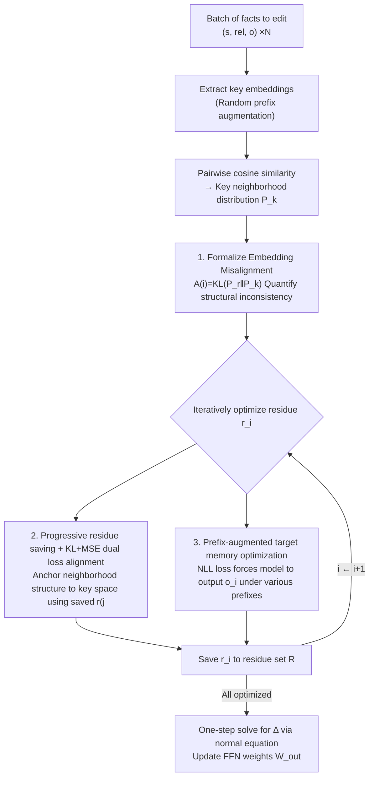

# EAMET: Robust Massive Model Editing via Embedding Alignment Optimization

**Conference**: ICLR 2026  
**arXiv**: [2505.11876](https://arxiv.org/abs/2505.11876)  
**Code**: [https://github.com/ybdai7/EAMET-massive-editing](https://github.com/ybdai7/EAMET-massive-editing)  
**Area**: LLM NLP / Model Editing  
**Keywords**: Massive Model Editing, Embedding Alignment, MEMIT, Knowledge Editing, Structural Inconsistency

## TL;DR

This paper reveals that the root cause of failure in massive model editing is the structural inconsistency between key embeddings and residual embeddings (embedding misalignment). It proposes EAMET, which progressively saves optimized residual embeddings and aligns their neighborhood structure to the key embedding space using a dual loss of KL divergence and MSE. Experimental results across 6 LLMs and 3 datasets show that EAMET outperforms MEMIT by an average of 14% (CounterFact) and 8% (ZsRE) when editing 10k facts simultaneously, while maintaining robustness in scenarios involving long prefixes and multiple facts per subject.

## Background & Motivation

**Background**: LLM knowledge becomes outdated after deployment. Model editing techniques aim to modify specific facts without full retraining. Locate-then-edit methods, such as MEMIT and PMET, achieve batch editing by directly modifying FFN weights, claiming the ability to edit tens of thousands of facts simultaneously.

**Limitations of Prior Work**: The effectiveness of existing methods is overestimated by overly lenient evaluation metrics—they typically check if the target token probability is higher than the original token, rather than whether the model actually generates the target object. Under stricter "practical metrics" (where the model output must precisely contain the target entity), performance drops sharply during massive editing (>1000 items). Furthermore, robustness issues exist in two practical scenarios: (a) accuracy on LLaMA2-7B using MEMIT drops from 98.5% to 77.4% when a 50-token descriptive prefix is added; (b) interference between facts leads to editing failure when multiple facts are edited under the same subject.

**Key Challenge**: The root problem is that when a large number of facts are edited jointly, the "neighborhood structure" between the residual embedding $r_i$ for each fact (the difference between target memory and original weights) and its key embedding $k_i$ (the input representation of the FFN layer) diverges. This misalignment causes information loss during reconstruction when solving the normal equations jointly.

**Goal**: To maintain spatial structure consistency of embeddings during massive batch editing (10k+), thereby ensuring high edit success rates and robustness under strict evaluation metrics.

**Key Insight**: The authors approach the problem from both theoretical and empirical directions. Theoretically, they derive a reconstruction error upper bound $\|e_i\| \leq C_i\sqrt{\frac{1}{2}\mathcal{A}(i)} + |\beta_{ii}|\|r_i\| + \|\varepsilon_i\|$, where $\mathcal{A}(i)$ represents the misalignment score. Empirically, increasing the number of edits from 200 to 1000 on LLaMA2-7B causes the total misalignment score to rise from 79 to 554, while accuracy drops from 98.5% to 86.8%, showing a strong correlation.

**Core Idea**: While optimizing the target memory for each fact, optimized residual embeddings are saved progressively. A dual loss of KL divergence and MSE is employed to constrain their neighborhood structure to align with the key embedding space.

## Method

### Overall Architecture

EAMET follows the locate-then-edit paradigm of MEMIT. The input is a batch of fact triplets $(s_i, rel_i, o_i)$, and the output is a parameter update $\Delta$ for the FFN layer $W_{out}^l$. Unlike MEMIT, which optimizes all residuals jointly at once, EAMET iteratively optimizes each fact's residual $r_i$ while incorporating embedding alignment constraints. The process consists of three steps: (a) pre-extracting key embeddings for all facts and calculating pairwise cosine similarity distributions to quantify misalignment as a score; (b) optimizing residual embeddings individually, saving each after optimization, and using these to calculate alignment loss for subsequent iterations while using prefix-augmented NLL loss to ensure target generation; (c) substituting the aligned residuals into the normal equation to solve for $\Delta$ in one step.

### Key Designs

**1. Theoretical Formalization of Embedding Misalignment**

Previous work only observed degradation during massive editing without providing a quantitative explanation. EAMET formalizes this phenomenon as a scalar. For each fact $i$, the cosine similarity distribution $P_r^{(i)}$ between its residual $r_i$ and all other residuals is collected, along with the distribution $P_k^{(i)}$ for its key $k_i$. The KL divergence $\mathcal{A}(i) = KL(P_r^{(i)} \| P_k^{(i)})$ measures the inconsistency between the two neighborhood structures. Theorem 1 in the paper proves that the reconstruction error upper bound is proportional to $\sqrt{\mathcal{A}(i)}$. Intuitively, if the nearest neighbors of $r_i$ are $r_3, r_7$ while the nearest neighbors of $k_i$ are $k_5, k_9$, the joint solution for $\Delta k_i = r_i$ will cause $\Delta$ to be composed in the wrong direction, leading to reconstruction failure. This formalization directly points to the optimization goal: reducing $\mathcal{A}(i)$ lowers the error bound.

**2. Progressive Residue Saving and KL+MSE Dual Loss Alignment**

To constrain $\mathcal{A}(i)$ during optimization, EAMET optimizes residuals sequentially rather than all at once. When optimizing the $i$-th fact, the previous $i-1$ optimized residuals are already saved. This allows calculating the similarity distribution $P_r^{(i)}$ between $r_i$ and $\{r_j \mid j < i\}$ to compare it against the key-side distribution $\bar{P}_k^{(i)}$. The alignment loss consists of two complementary terms:

$$L_{KL}(i) = KL\big(P_r^{(i)} \,\|\, \bar{P}_k^{(i)}\big), \qquad L_{MSE}(i) = \frac{1}{M} \sum_{j=1}^M \big\|P_r^{(i,j)} - P_k^{(i,j)}\big\|^2$$

$L_{KL}$ performs global distribution alignment to maintain the overall shape of the neighborhood structure, while $L_{MSE}$ focuses on the top-M nearest neighbors in the key space for precise matching.

**3. Prefix-augmented Target Memory Optimization**

The alignment constraints are embedded into the optimization objective for each fact's residual $r_i$. The full objective is:

$$r_i = \arg\min_{r_i} \left( \frac{1}{N_{FP}} \sum_j -\log P_{G(h_i^L \,+=\, r_i)}\big[o_i \mid f_j \oplus tp(s_i, rel_i)\big] + \lambda_{KL} L_{KL}(i) + \lambda_{MSE} L_{MSE}(i) \right)$$

The first term is a standard NLL loss ensuring the model predicts the target $o_i$ given a template, where $f_j$ are randomly sampled prefixes to force the model to learn a generalized memory representation. The latter two terms are the alignment regularizations. Unlike MEMIT, which uses prefix sampling without alignment constraints (leading to erratic residuals), EAMET anchors residuals in a position consistent with the key space structure, resulting in smaller reconstruction errors.

### Loss & Training

Total Loss = NLL Edit Loss (Prefix-augmented) + $\lambda_{KL} \cdot L_{KL}$ + $\lambda_{MSE} \cdot L_{MSE}$. The optimization is performed iteratively: optimize $i$ → save $r_i$ → optimize $i+1$ using previous residuals for alignment loss. Parameters are updated via the MEMIT normal equation $\Delta(C_p + K_t K_t^T) = R K_t^T$ in one step, using the aligned residual matrix $R = [r_1 | r_2 | \ldots | r_N]$.

## Key Experimental Results

### Main Results (10k Edits, 6 LLMs, CounterFact Dataset)

| Model | Method | Eff.(%)↑ | Gen.(%)↑ | Spe.(%)↑ | Flu.↑ |
|------|------|----------|----------|----------|-------|
| LLaMA2-7B | MEMIT | 24.95 | 22.68 | 63.84 | 506.69 |
| LLaMA2-7B | PMET | 74.22 | 46.45 | 72.47 | 507.10 |
| LLaMA2-7B | **EAMET** | **89.09** | **61.21** | 72.19 | 519.89 |
| LLaMA2-13B | MEMIT | 47.98 | 34.75 | 71.61 | 517.63 |
| LLaMA2-13B | **EAMET** | **92.85** | **60.08** | 77.51 | 530.78 |
| Deepseek-7B | MEMIT | 62.11 | 42.01 | 78.04 | 512.16 |
| Deepseek-7B | **EAMET** | **89.74** | **59.98** | 77.73 | 513.93 |
| Falcon-7B | MEMIT | 89.21 | 60.85 | 77.56 | 519.92 |
| Falcon-7B | **EAMET** | **92.37** | **63.91** | **78.94** | 528.98 |
| LLaMA3-8B | MEMIT | 93.76 | 61.98 | 77.69 | 526.47 |
| LLaMA3-8B | **EAMET** | **93.87** | **63.74** | **79.07** | 533.30 |
| Qwen2.5-7B | MEMIT | 90.06 | 63.86 | 70.53 | 529.27 |
| Qwen2.5-7B | **EAMET** | **90.49** | **64.37** | **72.18** | 536.67 |

### Misalignment Score Comparison (10k Edits)

| Model | EAMET (CF/ZS) | MEMIT (CF/ZS) | PMET (CF/ZS) |
|------|---------------|---------------|--------------|
| LLaMA2-7B | 377 / 165 | 11506 / 22245 | 11475 / 11477 |
| Qwen-7B | 374 / 180 | 18498 / 23699 | 18471 / 18463 |
| Deepseek-7B | 520 / 161 | 12135 / 23241 | 12155 / 12046 |
| Falcon-7B | 385 / 181 | 8564 / 17589 | 8602 / 8590 |

### Prefix Robustness (200 Edits, LLaMA2-7B)

| Prefix Length | MEMIT Accuracy | EAMET Accuracy | Low $\mathcal{A}$ Group | High $\mathcal{A}$ Group |
|----------|-------------|-------------|-------------------|-------------------|
| 0 token | 98.50% | ~99% | - | - |
| 5 tokens | 84.15% | ~95% | 94.00% | 46.00% |
| 50 tokens | 77.40% | ~90% | 90.00% | 45.00% |
| 200 tokens | 66.50% | ~92% | - | - |

### Key Findings

- **Misalignment is the core signal of edit failure**: EAMET reduced the total misalignment score for 10k edits on LLaMA2-7B (CounterFact) from 11506 to 377, a 96.7% reduction, validating the effectiveness of alignment optimization.
- **LLaMA2-7B benefits most**: Its Eff. jumped from 24.95% (MEMIT) to 89.09% (EAMET), as it initially suffered from the worst misalignment.
- **Insensitivity to edit sequence**: EAMET's Eff. fluctuated by only ~1% when the edit order was randomized.
- **Robustness to multiple facts per subject**: On ZsRE, while MEMIT/PMET performance declined as facts per subject increased, EAMET remained stable.
- **Scalability to 15k edits**: On Qwen2.5-7B, EAMET achieved 83.66% vs MEMIT's 77.46%, with the advantage widening as scale increased.

## Highlights & Insights

- **Formalized diagnosis of embedding misalignment**: This is the first work to quantitatively explain why massive editing fails. It is not due to insufficient optimization or parameter capacity, but the destruction of spatial structures.
- **Progressive alignment design**: The iterative strategy avoids memory explosion for 10k residuals while building an expanding "alignment reference set." This serves as a general optimization paradigm for maintaining spatial consistency.
- **Introduction of strict evaluation metrics**: By requiring the actual generation to contain the target entity rather than just checking probabilities, the authors exposed the overestimation of previous methods and improved the field's evaluation standards.

## Limitations & Future Work

- **Computational overhead of iterative optimization**: Training each fact requires forward/backward passes to optimize $r_i$, resulting in linear time complexity. A batch-wise alignment solution could accelerate this.
- **Limited to Transformer FFN layers**: The framework is tied to the locate-then-edit paradigm and cannot be applied to attention layer editing or adapter-based methods.
- **Lack of continuous editing evaluation**: The paper focuses on one-time batch editing and does not test sequential edits over time, which might lead to cumulative alignment drift.
- **Hyperparameter sensitivity**: The optimal values for $\lambda_{KL}$ and $\lambda_{MSE}$ might vary across models, and a systematic sensitivity analysis is missing.

## Related Work & Insights

- **vs MEMIT**: MEMIT solves the normal equation without alignment constraints, causing structural breakdown at scale. EAMET's loss acts as a regularization that improves residue quality without changing the mathematical form of the parameter update.
- **vs AlphaEdit**: AlphaEdit focuses on forgetting during sequential editing using null-space constraints. EAMET focuses on spatial structure consistency in batch editing. The two are orthogonal and could potentially be combined.
- **vs PMET**: PMET adds attention layer modifications to increase capacity but still suffers from misalignment. EAMET improves residue quality at the source, performing better without increasing the number of edited layers.

## Rating

- **Novelty**: ⭐⭐⭐⭐ Formalizing embedding misalignment is a fresh perspective; however, the KL+MSE regularization is relatively standard.
- **Experimental Thoroughness**: ⭐⭐⭐⭐⭐ Extensive coverage across 6 LLMs, 3 datasets, scale up to 15k, and various robustness tests.
- **Writing Quality**: ⭐⭐⭐⭐ The link between theory, empirical evidence, and solution is clear, though notation-heavy.
- **Value**: ⭐⭐⭐⭐ High impact for the model editing community; the misalignment diagnostic tool has independent value.

## Summary

This paper provides meaningful exploration in the field of model editing. The proposed method demonstrates competitiveness across various experimental settings. The technical roadmap is clear, the experimental design is sound, and it offers valuable references for future research. Future work can further explore the applicability and scalability of the method in broader scenarios.

<!-- RELATED:START -->

## Related Papers

- [\[ACL 2026\] EvoEdit: Evolving Null-space Alignment for Robust and Efficient Knowledge Editing](../../ACL2026/knowledge_editing/evoedit_evolving_null-space_alignment_for_robust_and_efficient_knowledge_editing.md)
- [\[ICLR 2026\] Fine-tuning Done Right in Model Editing](fine-tuning_done_right_in_model_editing.md)
- [\[ICLR 2026\] Energy-Regularized Sequential Model Editing on Hyperspheres](energy-regularized_sequential_model_editing_on_hyperspheres.md)
- [\[ACL 2025\] Context-Robust Knowledge Editing for Language Models](../../ACL2025/knowledge_editing/context-robust_knowledge_editing_for_language_models.md)
- [\[ICLR 2026\] KnowledgeSmith: Uncovering Knowledge Updating in LLMs with Model Editing and Unlearning](knowledgesmith_uncovering_knowledge_updating_in_llms_with_model_editing_and_unle.md)

<!-- RELATED:END -->
