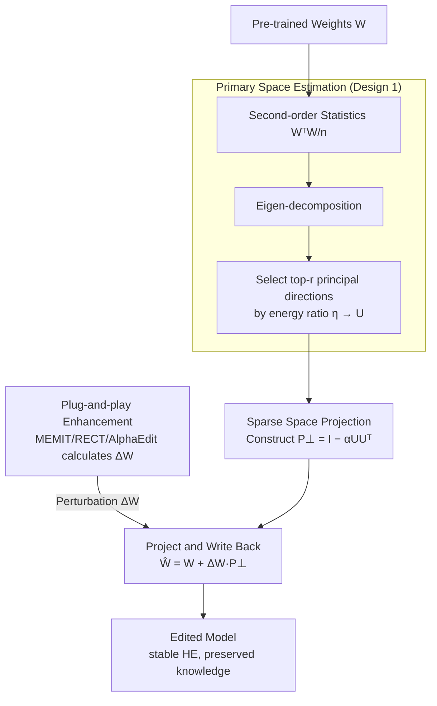

# Energy-Regularized Sequential Model Editing on Hyperspheres

**Conference**: ICLR 2026  
**arXiv**: [2510.01172](https://arxiv.org/abs/2510.01172)  
**Code**: [GitHub](https://github.com/) (Link provided in paper)  
**Area**: Model Compression / Knowledge Editing / LLM Efficiency  
**Keywords**: model editing, hyperspherical energy, sequential editing, catastrophic forgetting, knowledge preservation

## TL;DR

Performance degradation in sequential model editing is understood from the perspective of hyperspherical uniformity (Hyperspherical Energy, HE). The SPHERE method is proposed: by projecting editing perturbations onto the orthogonal complement of the primary hypersphere directions of pre-trained weights, stable large-scale sequential editing is achieved, outperforming the strongest baseline by an average of 16.41% on LLaMA3-8B.

## Background & Motivation

1. LLM knowledge inevitably becomes outdated and requires continuous updates; however, retraining costs are prohibitive, making model editing a lightweight alternative.
2. Sequential model editing (continuous multiple edits) is the most practical scenario but often leads to catastrophic forgetting and representation collapse.
3. Existing editing methods (ROME, MEMIT, RECT, etc.) suffer sharp performance declines under large-scale sequential editing—most collapse before reaching 3,000 edits.
4. Key Finding: Viewing the weight matrix as a set of neurons on a hypersphere reveals that hyperspherical energy (HE) is highly correlated with editing performance.
5. Violent fluctuations in HE always accompany editing failures, while more advanced methods implicitly maintain HE better.
6. Theoretical proof: HE changes establish a lower bound for pre-trained knowledge degradation, explaining the critical role of HE stability in knowledge preservation.

## Method

### Overall Architecture

The core Idea of SPHERE (Sparse Projection for Hyperspherical Energy-Regularized Editing) is to treat the weight matrix as a set of neurons on a hypersphere. Editing collapses because perturbations disrupt the uniform distribution of these neurons (i.e., HE). SPHERE first estimates the "primary hypersphere directions" carrying knowledge in the pre-trained weights, then projects the perturbation of each edit into the orthogonal complement of these primary directions. This allows the edit to rewrite target knowledge while minimizing disturbance to critical directions supporting the original geometric structure. This operation adds a single projection step after the closed-form solution of existing editing methods, making it plug-and-play. The pipeline is as follows: first, estimate the primary space $U$ from pre-trained weights to construct the projection matrix $P_\perp$; any existing editor calculates its perturbation $\Delta W$ normally, then $\Delta W$ is passed through the projection before being written back to the weights, resulting in an edited model with stable HE and preserved prior knowledge.

### Key Designs

**1. Primary Space Estimation: Identifying the Geometric Core Directions of Pre-trained Knowledge**

To protect something, its location must first be identified. SPHERE treats each row of the weight matrix $W \in \mathbb{R}^{d \times d}$ as a neuron on a hypersphere and performs eigen-decomposition on its second-order statistics $\frac{1}{n} W^T W$. Directions with larger eigenvalues imply more neurons clustered along that direction, carrying denser pre-trained information. Thus, the eigenvectors corresponding to the $r$ largest eigenvalues form the primary space matrix $U = [v_{d-r+1}, \ldots, v_d] \in \mathbb{R}^{d \times r}$. Rather than a fixed value, $r$ is determined by a cumulative energy ratio $\eta$—selecting the minimum number of directions such that the sum of their eigenvalues exceeds a threshold $\sum_{i=d-r+1}^{d} \lambda_i \geq \eta \sum_{i=1}^{d} \lambda_i$. This covers the main geometric structure of the knowledge without locking down the entire space.

**2. Sparse Space Projection: Keeping Perturbations Away from Primary Directions**

With the primary space obtained, SPHERE constructs a projection matrix $P_\perp = I - \alpha U U^T$ and passes any editing-generated perturbation through the projection before updating weights: $\hat{W} = W + \Delta W \cdot P_\perp$. Intuitively, $U U^T$ represents the component falling on primary directions; subtracting it pushes the perturbation into the orthogonal complement (the "sparse space"), thereby leaving directions critical for hyperspherical uniformity nearly untouched. The coefficient $\alpha$ controls protection intensity: $\alpha = 1$ is a hard projection where primary components are zeroed; $0 < \alpha < 1$ is a soft projection that attenuates without erasing, leaving room for target knowledge to avoid biased HE. This step is the direct source of HE stability during long sequence editing.

**3. Plug-and-play Enhancement: One-line Projection Integrated into Any Editing Method**

SPHERE does not replace existing editors but serves as post-processing within the solvers of methods like MEMIT, RECT, PRUNE, and AlphaEdit. These methods calculate $\Delta W$ normally, and SPHERE applies $\Delta W \cdot P_\perp$ just before application. Since the projection is decoupled from the specific localization/solving logic, it can be adopted with almost zero modification cost, yielding an average improvement of 38.71% across various baselines.

### Loss & Training

SPHERE itself introduces no new training losses but directly operates on the closed-form solutions of editing methods. The basic goal of model editing is to write new knowledge $(K_1, V_1)$ while preserving old knowledge $(K_0, V_0)$:

$$\Delta W = \arg\min_{\Delta \hat{W}} \left( \|{(W + \Delta \hat{W}) K_1 - V_1}\|^2 + \|{(W + \Delta \hat{W}) K_0 - V_0}\|^2 \right)$$

SPHERE appends the projection $\Delta W_{proj} = \Delta W \cdot P_\perp$ after obtaining $\Delta W$. The effectiveness of this step is theoretically guaranteed by Theorem 1: the magnitude of the output perturbation is lower-bounded by the change in HE, $|\Delta V| \geq \left(\frac{\Delta HE}{K}\right)^2$. This implies that by suppressing HE fluctuations, the degradation of pre-trained knowledge is simultaneously restricted—mathematically equating "maintaining hyperspherical uniformity" with "protecting original knowledge."

## Key Experimental Results

### Main Results

Sequential edits of 15,000 samples on LLaMA3-8B (ZsRE / CounterFact):

| Method | ZsRE Eff.↑ | ZsRE Gen.↑ | ZsRE Spe.↑ | CF Eff.↑ | CF Gen.↑ |
|------|-----------|-----------|-----------|---------|---------|
| FT | 15.27 | 14.78 | 5.06 | 8.40 | 2.54 |
| MEMIT | 0.00 | 0.00 | 0.06 | 0.00 | 0.00 |
| RECT | 0.01 | 0.01 | 0.04 | 0.57 | 0.29 |
| AlphaEdit | 86.64 | 81.28 | 28.78 | 4.37 | 1.71 |
| **SPHERE** | **90.01** | **84.67** | **45.40** | **52.89** | **32.07** |

### Ablation Study

Plug-and-play enhancement effects (3,000 edits, LLaMA3-8B):

| Target | Gain in Efficacy | Gain in Gen. | Gain in Spe. |
|----------|-------------|-------------------|-----------------|
| MEMIT + SPHERE | +49.05% | +42.64% | +24.44% |
| Overall Average | +38.71% avg | — | — |

Extremely low computational overhead:

| Model | Edit Time | Projection Time | Ratio |
|------|---------|---------|------|
| LLaMA3-8B | 543.26s | 18.00s | 3.31% |
| Qwen2.5-7B | 535.73s | 35.95s | 6.71% |
| Qwen2.5-32B | 1656.58s | 99.60s | 6.01% |

### Key Findings

1. SPHERE achieves 90.01% Efficacy on ZsRE, surpassing AlphaEdit (86.64%), with Specificity improving by 16.62 percentage points.
2. Improvements on CounterFact are significant: Efficacy jumps from 4.37% to 52.89%.
3. t-SNE visualization confirms that weight distributions after SPHERE editing overlap highly with the original distribution, whereas other methods show obvious angular clustering.
4. After 15,000 edits, SPHERE maintains original performance on four general tasks (GSM8K/RTE/NQ/BoolQ), while baseline performance drops to nearly zero.
5. The projection operation accounts for only 3-7% of total editing time and scales to 32B-class models.

## Highlights & Insights

1. **Hyperspherical Energy Perspective**: This work is the first to link model editing with hyperspherical energy, identifying that HE fluctuations are highly correlated with editing failures (strong Spearman correlation).
2. **Dual Theoretical-Empirical Support**: Theorem 1 proves that HE changes provide a lower bound for output perturbations, corroborated by empirical analysis in Fig. 2/3.
3. **Extreme Plug-and-Play Capability**: A single line of projection code improves existing methods by 38.71%, offering high engineering value.
4. **Superior General Ability Preservation**: General capabilities are maintained even after 15,000 edits, addressing a long-standing pain point in sequential editing.
5. Robust to hyperparameters ($\eta, \alpha$): SPHERE improves original methods under all configurations, lowering the threshold for parameter tuning.

## Limitations & Future Work

1. On Qwen2.5-7B, serious degradation occurs after only 5,000 edits; scalability on smaller models needs improvement.
2. While Specificity is improved, it remains relatively low (45.40% on LLaMA3), suggesting limited ability for precise editing without affecting neighborhood knowledge.
3. Primary space estimation requires pre-computing eigen-decomposition, which may increase computational costs as model size grows.
4. Experiments were only validated on LLaMA3-8B and Qwen2.5-7B; generalization across more architectures requires confirmation.
5. Currently, only FFN layer editing is considered; applicability to Attention layers remains unexplored.

## Related Work & Insights

- **AlphaEdit** (Fang et al., 2025): Projects perturbations into the null space of previous knowledge sets, serving as a basis for SPHERE.
- **MEMIT** (Meng et al., 2023): A classic locate-then-edit method that collapses under sequential editing.
- **Hyperspherical Learning** (Liu et al., 2018, 2021): Provides the theoretical foundation for HE as a uniformity metric.
- Insight: The hyperspherical perspective may extend to other parameter modification scenarios such as LoRA adaptation, continual learning, and model merging.

## Rating

- **Novelty**: ⭐⭐⭐⭐⭐ The hyperspherical energy regularization perspective is brand new, and the theoretical proof linking HE changes to output perturbations is profound.
- **Experimental Thoroughness**: ⭐⭐⭐⭐⭐ Evaluates two models, two datasets, general capabilities, plug-and-play performance, computational overhead, and hyperparameter sensitivity.
- **Writing Quality**: ⭐⭐⭐⭐ Logic is clear, though heavy mathematical notation slightly raises the reading threshold.
- **Value**: ⭐⭐⭐⭐⭐ A one-line code addition providing a 38.71% boost is highly practical for the model editing field, backed by solid theoretical contributions.

<!-- RELATED:START -->

## Related Papers

- [\[ICLR 2026\] Fine-tuning Done Right in Model Editing](fine-tuning_done_right_in_model_editing.md)
- [\[AAAI 2026\] Multiplicative Orthogonal Sequential Editing for Language Models (MOSE)](../../AAAI2026/knowledge_editing/multiplicative_orthogonal_sequential_editing_for_language_models.md)
- [\[ACL 2026\] Spectral Characterization and Mitigation of Sequential Knowledge Editing Collapse](../../ACL2026/knowledge_editing/spectral_characterization_and_mitigation_of_sequential_knowledge_editing_collaps.md)
- [\[ICLR 2026\] Bilinear Representation Mitigates Reversal Curse and Enables Consistent Model Editing](bilinear_representation_mitigates_reversal_curse_and_enables_consistent_model_ed.md)
- [\[ICLR 2026\] EAMET: Robust Massive Model Editing via Embedding Alignment Optimization](eamet_robust_massive_model_editing_via_embedding_alignment_optimization.md)

<!-- RELATED:END -->
