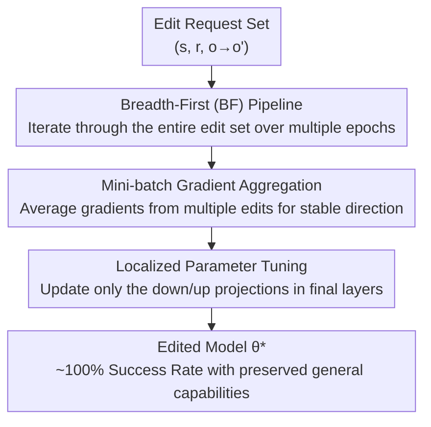

# Fine-tuning Done Right in Model Editing

**Conference**: ICLR 2026  
**arXiv**: [2509.22072](https://arxiv.org/abs/2509.22072)  
**Code**: [https://github.com/ICT-STAR/LocFT](https://github.com/ICT-STAR/LocFT)  
**Area**: Knowledge Editing  
**Keywords**: Model Editing, Fine-tuning, Knowledge Editing, Catastrophic Forgetting, Localized Fine-tuning

## TL;DR
This paper reveals that the root cause of the underestimated performance of fine-tuning in model editing is an incorrect training pipeline (Depth-First sample-by-sample optimization). By correcting this to a standard Breadth-First mini-batch training and combining it with localized parameter tuning to form LocFT-BF, the authors achieve the first support for 100,000 sequential edits and a 72B model scale.

## Background & Motivation

**Background**: Model editing aims to efficiently modify specific factual knowledge in LLMs without retraining. Mainstream methods include parameter expansion (GRACE), meta-learning (MEND), and locate-and-edit (ROME/MEMIT). Fine-tuning has long been regarded as a weak baseline in this field due to "overfitting and catastrophic forgetting."

**Limitations of Prior Work**: (a) Locate-and-edit methods require precomputing matrices, resulting in poor scalability; (b) Meta-learning methods require additional labeled data and auxiliary networks; (c) Parameter expansion methods modify the architecture; (d) All methods show significant performance degradation under large-scale sequential edits (>10K).

**Key Challenge**: Fine-tuning is the most successful method for LLM adaptation, yet it is judged as "ineffective" in model editing—this contradiction deserves deep investigation.

**Goal**: Is fine-tuning truly ineffective in model editing? Is its failure a limitation of the method itself or its implementation?

**Key Insight**: Examination of existing codebases reveals that fine-tuning in model editing uses a **non-standard training pipeline**: optimizing sample-by-sample to convergence before processing the next (Depth-First), rather than standard multi-epoch mini-batch training (Breadth-First).

**Core Idea**: The "failure" of fine-tuning in model editing is an implementation bug rather than a methodological limitation—correcting the training pipeline and localizing parameter tuning can surpass all SOTA.

## Method

### Overall Architecture
This paper addresses a counter-intuitive question: why is fine-tuning, the most successful method for LLM adaptation, treated as a weak baseline plagued by "overfitting and catastrophic forgetting" in model editing? The authors found that the problem is not fine-tuning itself, but its implementation as a **non-standard** training process—Depth-First (DF), where samples are trained to convergence one by one, causing subsequent edits to continuously overwrite previous learning. LocFT-BF adopts a simple approach: reverting the training process to standard Breadth-First (BF) multi-epoch mini-batch training, and narrowing trainable parameters to the down/up projections of the final layers. The input is a sequence of edit requests $(s, r, o \to o')$. The process does not precompute any matrices, add auxiliary networks, or change the architecture; it directly obtains new parameters $\theta^*$ via gradient descent. The following diagram illustrates the three-step correction of LocFT-BF, where the three core stages correspond to the three key designs below:

### Key Designs

**1. Pipeline Correction: Switching from Depth-First back to Breadth-First—the root of catastrophic forgetting**

The reason fine-tuning suffers from "severe forgetting" in model editing is that the original code utilized a Depth-First (DF) pipeline—training each sample to convergence before moving to the next. Consequently, later edits overwrite earlier ones, leading to more forgetting as the process continues. The authors replace this with a standard Breadth-First (BF) pipeline: iterating through the entire edit set over multiple epochs, allowing the model to see all edits in every round for balanced learning. This is the most critical discovery of the paper—even when keeping the batch size at 1 and everything else constant, this single step brings massive improvements, debunking the long-standing consensus that "fine-tuning is unsuitable for model editing."

**2. Update Granularity Correction: From sample-by-sample to mini-batch, stabilizing general capabilities**

Building on BF, the authors increase the batch size from 1 to a standard mini-batch (e.g., 64). Gradient variance in sample-by-sample updates is high, which often destroys the model's general capabilities while fitting a specific edit. Mini-batching aggregates gradients from multiple edits, providing a more stable direction and minimizing disturbance to original capabilities. This step is specifically designed to reduce the degradation of general capabilities, ensuring that "learning new knowledge" and "retaining old capabilities" no longer conflict.

**3. Localized Parameter Tuning: Modifying down/up projections in final layers instead of ROME's middle layers**

Regarding which parameters to fine-tune, previous practices (like FT-M) directly inherited the choice from ROME—middle-layer MLPs—based on ROME’s assumption that facts are stored there. However, that location was designed for locate-and-edit methods and may not suit fine-tuning. By systematically scanning different layers and modules (various projection matrices in attention and MLP), the authors found that adjusting the **down-projection or up-projection matrices in the final layers** is usually optimal: achieving nearly 100% edit success while general capabilities remain largely intact. This conclusion provides an interesting contrast to ROME’s "facts in middle layers" hypothesis—at least for fine-tuning, the final layers are more suitable targets.

### Loss & Training
Standard cross-entropy loss, calculated only on the target tokens of the edit. Key implementation details:
- Multi-epoch Breadth-First traversal
- Mini-batch gradient aggregation
- Updating only the MLP down/up projections in the final layers
- No additional regularization, auxiliary data, or architecture modifications required

## Key Experimental Results

### Main Results

**LLaMA3-8B, 1000 ZsRE Edits**:

| Method | Reliability | Generalization | Capability |
|------|-----------|---------------|------------|
| ROME | Medium | Medium | Decreased |
| MEMIT | Medium | Medium | Decreased |
| GRACE | Medium | Low | Maintained |
| FT-M (DF, Original) | 75.3 | 67.2 | 28.3 |
| FT-M (BF, batch=1) | Significant Gain | Significant Gain | Improved |
| **LocFT-BF** | **Near 100%** | **Near 100%** | **Maintained** |

Ours surpasses the best baseline by an average of **33.72%** in edit success rate.

### Ablation Study

| Configuration | Edit Success | General Capability | Description |
|------|---------|---------|------|
| DF pipeline + batch=1 | Low | Severe Degradation | Traditional approach |
| BF pipeline + batch=1 | Significant Gain | Improved | Pipeline change only |
| BF + mini-batch | Further Gain | Significant Retention | + Increased batch size |
| BF + mini-batch + Localization | Optimal | Fully Maintained | + Optimized tuning location |

### Key Findings
- **Pipeline correction alone (DF→BF)** eliminates the catastrophic forgetting problem, overturning the consensus that fine-tuning is unsuitable for model editing.
- First to push evaluation to **100K sequential edits** (previously max 10K) and **72B parameter models** (previously max 7/8B) with stable performance and no degradation.
- Late-layer MLPs are more suitable for knowledge editing than middle-layer MLPs, offering an interesting contrast to ROME's "middle-layer storage" hypothesis.
- Extremely simple method: no matrix precomputation, no auxiliary networks, no architecture changes, and no extra data—just standard fine-tuning.

## Highlights & Insights
- **Identified a long-standing implementation error in the field**: Breaking the implicit assumption that "everyone does it this way, so it must be right" reminds the community to re-examine the fairness of baselines. Similar "undervaluing of baselines" may exist in other fields.
- **Simplicity is power**: Without any fancy components, the method surpasses complex approaches simply by "using fine-tuning correctly." This is an important calibration for the research paradigm in model editing.
- **New standards for evaluation**: Establishing benchmarks for 100K edits and 72B models pushes the field closer to real-world application requirements.

## Limitations & Future Work
- The Breadth-First pipeline requires access to all edit requests at once, which is not fully applicable in true online/streaming editing scenarios.
- The optimal choice for localized tuning positions varies by model, and there is a lack of an automatic selection mechanism without searching.
- Editing performance on multimodal models has not been evaluated.
- Primarily focused on single fact triple edits; complex reasoning chain edits (requiring modification of multiple related facts) have not been fully verified.

## Related Work & Insights
- **vs ROME/MEMIT**: Locate-and-edit methods require precomputing causal tracing matrices and are not scalable; LocFT-BF uses direct fine-tuning, which is simple and scales to 72B.
- **vs GRACE**: Parameter expansion methods modify the architecture, leading to poor generalization; LocFT-BF maintains the architecture.
- **vs MEND**: Meta-learning requires auxiliary networks and extra data; LocFT-BF is pure fine-tuning with no extra overhead.
- Insight: Before judging a method as "ineffective," first ensure its implementation is correct.

## Rating
- Novelty: ⭐⭐⭐⭐⭐ Discovered and corrected a domain-wide consensus implementation error; huge impact.
- Experimental Thoroughness: ⭐⭐⭐⭐⭐ 3 models × 2 datasets × multi-method comparison + 100K edits + 72B model.
- Writing Quality: ⭐⭐⭐⭐⭐ Very clear logical chain: problem discovery → controlled experiments → correction → systematic optimization.
- Value: ⭐⭐⭐⭐⭐ A work that changes the baseline perception in the model editing field.

<!-- RELATED:START -->

## Related Papers

- [\[ACL 2026\] FABLE: Fine-grained Fact Anchoring for Unstructured Model Editing](../../ACL2026/knowledge_editing/fable_fine-grained_fact_anchoring_for_unstructured_model_editing.md)
- [\[ICLR 2026\] Energy-Regularized Sequential Model Editing on Hyperspheres](energy-regularized_sequential_model_editing_on_hyperspheres.md)
- [\[ICLR 2026\] Bilinear Representation Mitigates Reversal Curse and Enables Consistent Model Editing](bilinear_representation_mitigates_reversal_curse_and_enables_consistent_model_ed.md)
- [\[ICLR 2026\] EAMET: Robust Massive Model Editing via Embedding Alignment Optimization](eamet_robust_massive_model_editing_via_embedding_alignment_optimization.md)
- [\[ICLR 2026\] KnowledgeSmith: Uncovering Knowledge Updating in LLMs with Model Editing and Unlearning](knowledgesmith_uncovering_knowledge_updating_in_llms_with_model_editing_and_unle.md)

<!-- RELATED:END -->
