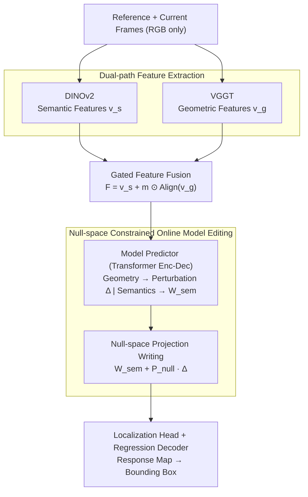

# GOT-Edit: Geometry-Aware Generic Object Tracking via Online Model Editing

**Conference**: ICLR 2026  
**arXiv**: [2602.08550](https://arxiv.org/abs/2602.08550)  
**Code**: [https://github.com/chenshihfang/GOT](https://github.com/chenshihfang/GOT)  
**Area**: Knowledge Editing  
**Keywords**: Object Tracking, 3D Geometry, Null Space Editing, Online Model Updating, VGGT  

## TL;DR
By using null-space constrained online model editing, this work integrates 3D geometric information provided by VGGT into a 2D generic object tracker. This enhances geometric awareness while maintaining semantic discriminative power, significantly improving tracking performance in scenarios with occlusions and background clutter.

## Background & Motivation

**Background**: 2D generic object tracking (GOT) primarily relies on appearance features (e.g., DINOv2) and has achieved excellent results in standard scenarios, but lacks 3D spatial understanding capabilities.

**Limitations of Prior Work**: Facing challenging scenarios such as occlusion, background clutter, and appearance changes, pure 2D features struggle to distinguish the target from distractors. Existing 3D fusion methods require RGB-D input or point cloud data, which limits their general applicability.

**Key Challenge**: Naively fusing geometric features (e.g., via concatenation or weighted addition) into semantic features disrupts the pre-learned semantic discriminative power—experiments show that naive fusion even leads to degradation in fast-motion and illumination-change scenarios.

**Goal**: How can 3D geometric information be injected without loss while maintaining the discriminative power of semantic features?

**Key Insight**: Borrowing from knowledge editing in Large Language Models (AlphaEdit), geometric information perturbations are projected onto the null space of semantic features to ensure no interference with the original semantics.

**Core Idea**: Project the output of the geometric perception module into the null space of the semantic model weights to achieve lossless injection of 3D geometric knowledge.

## Method

### Overall Architecture
GOT-Edit aims to solve the problem of embedding 3D geometric information into a well-trained 2D appearance tracker without destroying its original semantic discriminative power. The pipeline follows a "track-by-detection" framework: RGB images of the reference and current frames enter frozen backbones in two paths—DINOv2 extracts semantic features while VGGT extracts geometric features. These features are fused into $F$ via a position-wise gating mechanism. The fused features are passed to a Transformer encoder-decoder "Model Predictor," which generates localization head perturbation weights $\Delta$ using geometric information and semantic weights $W_{sem}$ using only semantic information. This leads to the core mechanism: online model editing, where $\Delta$ is projected into the semantic feature null space before being written as $W_{sem} + P_{null}\Delta$. Finally, the edited localization head computes the classification response map, and the regression decoder outputs the bounding box. The key is that the "writing" step is not a simple addition but a null-space projection (inspired by AlphaEdit), ensuring geometric perturbations are constrained to the null space of semantic features. This entire prediction and editing process is performed **online** during tracking, dynamically updating with the target and background.

### Key Designs

**1. Dual-path Feature Extraction: Frozen Symmetrical Backbones**

To possess both appearance discriminability and 3D spatial awareness without degrading performance, GOT-Edit parallelizes two **frozen** pre-trained models. The semantic path uses DINOv2 to extract appearance features $v_s \in \mathbb{R}^{C \times H \times W}$, while the geometric path uses VGGT to infer 3D attributes (camera pose, point maps, depth) from RGB to obtain geometric features $v_g$. VGGT is chosen because it outputs rich 3D information from monocular RGB, allowing the tracker to remain generally applicable without requiring RGB-D or point cloud data. Neither backbone is fine-tuned, preserving pre-trained knowledge and saving computation.

**2. Gated Feature Fusion: Adaptive Geometry Utilization**

Since geometric information is not required at every spatial location, rigid global fusion can be counterproductive in scenarios like illumination changes. GOT-Edit uses an alignment layer $\mathrm{Align}(\cdot)$ (a convolutional network) to match geometric features to the semantic dimensions. A lightweight convolution with a sigmoid activation then predicts a position-wise gating mask $m \in [0,1]^{C\times H\times W}$ from the paired features to fuse them for both frames:

$$F = v_s + m \odot \mathrm{Align}(v_g)$$

The spatially varying gate allows the model to automatically increase geometric weights in occluded regions where it is helpful and suppress them where it might be harmful.

**3. Null-space Constrained Online Model Editing: Preserving Semantic Response**

This is the core design addressing the issue where naive fusion disrupts semantic discriminability. GOT-Edit treats the tracking head as a linear associative memory (similar to AlphaEdit), where an FFN maps input keys $K$ to values $V = WK$. The fused features enter a Transformer-based **Model Predictor**. The decoder uses foreground embeddings as queries to produce a perturbation weight $\Delta \in \mathbb{R}^{C}$ from fused features, while the same structure produces semantic weights $W_{sem}$ using only semantic features. To prevent $\Delta$ from changing the model's response to semantic features, the perturbation is projected into the semantic null space:

$$\Delta' = P_{null}\,\Delta, \qquad p = (W_{sem} + \Delta') * z_{cur}$$

The null-space projection matrix $P_{null}$ is obtained via SVD of semantic features. To handle rank-deficiency and ill-conditioned matrices in GOT, the features are whitened to obtain $Z$, and a correlation matrix with a ridge regression term $M = ZZ^\top + \lambda I$ is computed. Low-energy eigenvectors $U_{null}$ are used to construct $\hat P = U_{null}U_{null}^\top$, followed by symmetrization $P_{null} = \tfrac12(\hat P + \hat P^\top)$ to suppress numerical drift during online inference. This ensures the perturbation lies in a direction orthogonal to the semantic features. Unlike AlphaEdit, which collects knowledge offline, GOT-Edit performs this prediction and projection **online** to adapt to dynamic changes.

### Loss & Training
The training target is a weighted sum of a classification loss (compound hinge loss) and a bounding box GIoU loss.

## Key Experimental Results

### Main Results

| Dataset | Metric | GOT-Edit | ToMP-378 | PiVOT-378 | LoRAT-378 |
|---------|--------|----------|----------|-----------|-----------|
| AVisT | SUC | 63.7% | 62.0% | 62.2% | 62.0% |
| NfS | SUC | 69.9% | 69.0% | 68.2% | 66.7% |
| GOT-10k | AO | 85.2% | 77.5% | 76.9% | 77.5% |
| LaSOT | SR75 | 83.2% | 75.8% | 75.5% | 78.1% |
| TrackingNet | Pr | 90.6% | 80.8% | 82.1% | 82.0% |

### Ablation Study

| Configuration | AVisT | NfS | LaSOT |
|---------------|-------|-----|-------|
| Baseline (Semantic only) | 59.2% | 68.5% | 70.7% |
| + Geometry (Naive fusion) | 59.9% | 67.5% | 70.9% |
| + Null-space Projection | 61.5% | 69.3% | 72.7% |
| + Regularization (Full) | **62.0%** | **70.2%** | **73.8%** |

### Key Findings
- Naive fusion of geometric features leads to degradation on NfS (69.0% -> 67.5%), while null-space editing improves it to 70.2%.
- Gains are most significant in occluded scenarios: partial occlusion +7.28% (64.32% -> 71.60%).
- Null-space projection is the core component for performance gain, contributing 2-3% absolute improvement.
- The model consistently outperforms SOTA methods across 8 tracking benchmarks.

## Highlights & Insights
- **Null-space Editing Approach**: Migrating knowledge editing from LLMs to visual tracking is highly ingenious. The core insight is that multi-source information fusion should not be simple addition but should occur in orthogonal spaces to avoid interference. This methodology is transferable to any multi-modal feature fusion task.
- **No 3D Input Required**: Utilizing VGGT to infer geometry from monocular RGB maintains the convenience of standard trackers.
- **Adaptive Gating**: The gating mechanism allows the model to learn when geometric information is beneficial, avoiding manually defined fusion strategies.

## Limitations & Future Work
- VGGT is computationally heavy (requires additional forward passes), which may impact real-time performance.
- Null-space computation requires SVD, introducing additional overhead.
- Validation is limited to the DINOv2 + VGGT combination; generalization to other backbone combinations is unknown.
- Geometric gating masks are currently pixel-level; coarser-grained (e.g., object-level) gating might be more robust.

## Related Work & Insights
- **vs ToMP (De Haan et al.)**: The semantic baseline for GOT-Edit; this work adds geometric awareness on top of it.
- **vs AlphaEdit (Knowledge Editing)**: Originally used for LLM null-space editing, this work introduces it to visual tracking for the first time.
- **vs VGGT**: The upstream model providing geometric features, proving its versatility for downstream tasks.

## Rating
- Novelty: ⭐⭐⭐⭐⭐ The transfer of null-space editing to visual tracking is very novel.
- Experimental Thoroughness: ⭐⭐⭐⭐⭐ 8 benchmarks + detailed ablation + attribute analysis.
- Writing Quality: ⭐⭐⭐⭐ Method description is clear and derivations are complete.
- Value: ⭐⭐⭐⭐ Provides a general null-space methodology for multi-source feature fusion.

<!-- RELATED:START -->

## Related Papers

- [\[ICLR 2026\] SUIT: Knowledge Editing with Subspace-Aware Key-Value Mappings](suit_knowledge_editing_with_subspace-aware_key-value_mappings.md)
- [\[NeurIPS 2025\] Rethinking Residual Distribution in Locate-then-Edit Model Editing](../../NeurIPS2025/knowledge_editing/rethinking_residual_distribution_in_locate-then-edit_model_editing.md)
- [\[ICLR 2026\] Fine-tuning Done Right in Model Editing](fine-tuning_done_right_in_model_editing.md)
- [\[ICLR 2026\] Energy-Regularized Sequential Model Editing on Hyperspheres](energy-regularized_sequential_model_editing_on_hyperspheres.md)
- [\[ICLR 2026\] EAMET: Robust Massive Model Editing via Embedding Alignment Optimization](eamet_robust_massive_model_editing_via_embedding_alignment_optimization.md)

<!-- RELATED:END -->
