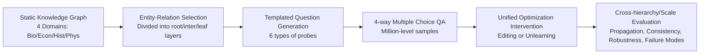

# KnowledgeSmith: Uncovering Knowledge Updating in LLMs with Model Editing and Unlearning

**Conference**: ICLR 2026  
**OpenReview**: [https://openreview.net/forum?id=znnA2Opw6v](https://openreview.net/forum?id=znnA2Opw6v)  
**Code**: [https://github.com/AIFrontierLab/KnowledgeSmith](https://github.com/AIFrontierLab/KnowledgeSmith)  
**Area**: Knowledge Editing / Machine Unlearning / LLM Knowledge Update Mechanisms  
**Keywords**: Knowledge Editing, Machine Unlearning, Knowledge Graphs, Consistency-Capacity Trade-off, Propagation Asymmetry, Evaluation Benchmark  

## TL;DR
This paper proposes KnowledgeSmith, which unifies "knowledge editing" and "machine unlearning" into a single constrained optimization problem. By using knowledge graphs (KG) to automatically generate large-scale evaluation benchmarks across different hierarchies (root/intermediate/leaf) and data scales, the study systematically reveals counter-intuitive phenomena in LLM knowledge updates, such as propagation asymmetry, consistency-capacity trade-offs, and subject dependency.

## Background & Motivation
**Background**: Keeping LLMs up-to-date primarily relies on two technical routes: knowledge editing (precise rewriting of specific facts, e.g., ROME/MEMIT/AlphaEdit) and machine unlearning (broad erasure of certain information categories, e.g., ReLearn). While both have accumulated numerous methods, they have long been studied as two independent problems.

**Limitations of Prior Work**: ① Most evaluations target **isolated facts**, ignoring that real-world knowledge is interconnected in graph structures—changing "Lyon is the capital of France" should ideally propagate to "The Eiffel Tower is in the capital of France," yet existing benchmarks fail to measure such cascades. ② The difference between editing vs. unlearning regarding **data scale** remains unclear (editing often requires minimal data, while unlearning does not). ③ There is a lack of a unified framework to compare the trade-offs in propagation, stability, and generalization between the two.

**Key Challenge**: Editing seeks **precise injection** but easily triggers side effects (over-spread affecting irrelevant nodes); unlearning emphasizes **broad erasure** but often fails to modify the target (under-spread or omissions). This tension between "plasticity" and "stability" lacks controlled, scalable, and structured tools for characterization.

**Goal**: To establish a unified theoretical perspective and an automated structured benchmark to answer "how LLMs actually update knowledge and whether they exhibit human-like cascading propagation."

**Core Idea**: **[Unified Perspective]** Editing and unlearning are two instances of the same constrained optimization problem, differing only in the choice of the target distribution $q_\text{target}$. **[KG-Driven Evaluation]** Any KG-related dataset is automatically converted into an intervention benchmark across hierarchies and scales, allowing controlled observation of how updates propagate through the knowledge hierarchy.

## Method

### Overall Architecture
KnowledgeSmith consists of two parts: a **unified optimization perspective** that formulates editing/unlearning as a single objective function with preservation constraints, and an **automatic benchmark generation pipeline** that generates probes from KGs across root/intermediate/leaf levels and data scales from one to millions to measure direct and propagation effects. The entire process is method-agnostic for both editors and unlearners (AlphaEdit and ReLearn are used in experiments).

### Key Designs

**1. Unifying Editing and Unlearning into a Constrained Optimization Problem: The difference lies in the target distribution.** Let model $f_\theta$ provide the conditional distribution $p_\theta(y\mid x)$. An update request is given by the item to be modified $e$ and the scope $c$, yielding $\theta'=T(\theta;e,c)$. The paper defines two types of probes: positive probes $Q^+$ that should change and preservation probes $Q^-$ that should remain unchanged, formulating the goal of "modifying targets without harming irrelevant data" as:

$$\theta' = \arg\min_{\theta'}\; \mathcal{L}_\text{task}(\theta';Q^+) + \lambda_\text{pres}\,\mathcal{L}_\text{pres}(\theta';Q^-) + \lambda_\text{reg}\,R(\theta',\theta)$$

Where $\mathcal{L}_\text{task}$ forces $Q^+$ to approach the target distribution $q_\text{target}$, $\mathcal{L}_\text{pres}$ suppresses drift on $Q^-$, and $R$ regularizes the parameter change magnitude (e.g., $\lVert\Delta\rVert_2^2$, Fisher norm, or low-rank constraints). **Editing** sets $q_\text{target}$ to encode a factual correction ("Paris is the capital of Germany"); **unlearning** sets $q_\text{target}$ to a neutral distribution $q_\text{neutral}$ ("Paris is the [MASK] capital"). ROME/MEMIT, MEND, GRACE, LoRA editing, influence function unlearning, and certified removal can all be categorized as different instantiations of this equation—providing a unified yardstick for "fair comparison."

**2. Upgrading Isolated Fact Evaluation to Hierarchical Propagation Evaluation using KGs.** Existing benchmarks only test single-point facts and cannot detect cascading effects. This work anchors on a GPT-4o generated, human-verified hierarchical KG, categorizing nodes into **root (domain-level concepts) / intermediate (sub-themes) / leaf (specific entities)**. Interventions are applied at each level to observe changes in direct nodes and structurally related nodes. Thus, a single KG expands into a dynamic benchmark that tests whether the target itself is updated and whether it propagates correctly across multi-hop and inverse relations. This is the prerequisite for observing "propagation asymmetry."

**3. Six Probe Types + Automated QA Pipeline to convert any KG dataset into a million-level standardized benchmark.** The pipeline involves three steps: entity-relation selection (sampling while preserving hierarchy) → templated question generation (multiple phrasings per triplet, manually checked for syntax and facts) → 4-way QA construction (MMLU style, using entity replacement and paraphrasing to produce over one million samples, all verified against the KG). The six probe types correspond to specific behaviors: direct (was the target updated), reverse (was the relationship direction maintained), conflict (emergence of contradictions and adversarial robustness), multi-hop (propagation along relational chains), comparison (consistent preference after update), and contextual (preservation of irrelevant/OOD knowledge). Here, direct/reverse/multi-hop/comparison belong to $Q^+$, contextual belongs to $Q^-$, and conflict spans both. The study instantiates this for Biology, Economics, History, and Physics, with 10,000 samples per branch for both editing and unlearning, totaling approximately 360,000 training samples.

**4. Proposing three new diagnostic metrics to characterize "over-modification, non-modification, and self-contradiction".** To quantify propagation asymmetry, the paper defines **CCR (Collateral Change Ratio)** to capture over-spreading in editing and **RR (Residual Retention)** to capture under-spreading in unlearning. To capture failures beyond residual beliefs, the **conflict rate** is defined—measuring the proportion of cases where the model simultaneously supports contradictory assertions (e.g., claiming "Paris is the capital of Germany" and "Paris is the capital of France") across different contexts. These three metrics fill the blind spots of traditional "target-only" accuracy, making hidden instabilities like consistency collapse and contradiction emergence measurable.

**5. SVD Geometric Perspective explaining mechanistic differences between editing and unlearning.** For a parameter matrix $W=U\Sigma V^\top$, the intervention yields $W'=U'\Sigma'V'^\top$, where changes are decomposed into **scaling effects** (amplification/decay of singular values $\Sigma'/\Sigma$) and **rotation effects** (reorientation of subspaces $\text{span}(U,V)$). Experiments show editing manifests as "local rotation + mild scaling," preserving most representational geometry while reorienting specific factual directions. Unlearning exhibits an **abrupt phase transition** after exceeding a critical data scale. This geometrically explains why editing is locally smooth while unlearning is globally drastic.

## Key Experimental Results

The study covers 13 models across 6 LLM families ranging from 1B to 123B (LLaMA-3, Qwen-3, QwQ-32B, Mistral, Gemma, DeepSeek-R1-Qwen3-8B). Editing uses AlphaEdit and unlearning uses ReLearn, with data scales from 1 to 10,000.

### Main Results: Propagation and Robustness

| Phenomenon | Editing | Unlearning |
|------|---------------|-------------------|
| Propagation Direction | over-spread (affects related nodes, more evident at lower levels) | under-spread (failures to modify beyond the target) |
| Immediate Plasticity | Small models fast but unstable | Large models need more data but are more stable |
| ID Accuracy | High (~50–60% in Econ) | Low (≤30%) |
| OOD Accuracy | Impaired (sacrifices global stability) | Strong (63–82%, preserves irrelevant knowledge) |
| Compute Cost (1000 samples/H100) | ~6h | ~0.2h |

### Consistency-Capacity Trade-off (Representation Similarity, log-min-max normalized)

| Metric | Setting | k=1 | k=10 | k=100 | k=1000 | k=10000 |
|------|------|-----|------|-------|--------|---------|
| KL | Unlearning | 0.014 | 0.392 | 0.805 | 0.838 | 0.883 |
| KL | Editing | 0.140 | 0.522 | 0.606 | 0.647 | 0.652 |
| CKA | Unlearning | 0.917 | 0.861 | 0.566 | 0.576 | 0.692 |
| CKA | Editing | 0.958 | 0.852 | 0.801 | 0.714 | 0.714 |

When the data scale exceeds model capacity, direct probe accuracy saturates/declines while reverse probe remains high → **consistency collapse**; the collapse occurs earlier in lower levels (leaf/intermediate) than at the root.

### Failure Modes Statistics (Observed percentage in open-ended QA)

| Failure Mode | Editing | Unlearning |
|----------|------|------|
| Under-forgetting (RR) | 20% | 35% |
| Over-spreading (CCR) | 35% | 15% |
| Conflict emergence | 30% | 12% |
| Knowledge drift | 18% | 10% |
| Instruction-following drop | 22% | 18% |
| Hallucination increase | 5% | 4% |

### Key Findings
- **Propagation Asymmetry**: Editing over-modifies, while unlearning fails to propagate. Hierarchical structures set a ceiling for update effectiveness; higher/central nodes are harder to modify.
- **Subject Dependency**: The History domain is the most "resistant" to modification even with large sample sizes, suggesting that evaluations must be subject-aware; treating CounterFact/ZsRE uniformly is biased.
- **Method Comparison**: LoRA finetuning is the most unstable (ID accuracy drops to 12.5% at k=1000). Editing balances stability and data efficiency, while unlearning is conservative but stable—explaining why editing/unlearning should be preferred over LoRA for continuous updates.

## Highlights & Insights
- **Clean Unified Perspective**: Categorizing editing and unlearning under the same constrained optimization with $q_\text{target}$ as the only difference is a concise theoretical framework that accommodates nearly all existing methods and sets a benchmark for fair comparison.
- **From "Point" to "Network" Evaluation**: Upgrading from isolated facts to hierarchical propagation via KGs is the most valuable methodological contribution, enabling the first quantitative observation of over-spread/under-spread phenomena.
- **Counter-intuitive Conclusions**: LLMs do not propagate knowledge updates in a human-like cascade, exhibit consistency-capacity trade-offs, and prove that History is harder to modify than Physics—all of which provide practical guidance for designing knowledge update mechanisms.
- **Sincere Scale**: 13 models × 4 domains × 6 probe types × 5 orders of magnitude in data scale provide strong generalizability for the conclusions.

## Limitations & Future Work
- **Limited Domains** (Bio/Econ/Hist/Phys): Although covering STEM and Humanities, high-value fields like Law and Medicine remain unverified; the cross-domain extrapolation of conclusions requires further testing.
- **KG Generation by GPT-4o**: Despite external verification and manual sampling, generation bias or factual noise could influence the reliability of the "ground truth."
- **Limited Baseline Representativeness**: Only two representative methods (AlphaEdit + ReLearn) were chosen. Whether different editing/unlearning algorithms exhibit the same asymmetry and collapse patterns requires more baseline evidence (partially supplemented in the appendix).
- The paper is a **diagnostic/analytical work**; it reveals problems but does not provide a definitive solution for simultaneously achieving plasticity and consistency, leaving room for future work like hierarchy-aware propagation regularization or subject-aware update budgets.

## Related Work & Insights
- **Knowledge Editing**: ROME/MEMIT (locating and modifying MLP weights), MEND (auxiliary network reorientation), GRACE (gradient updates + drift constraints), AlphaEdit (the SOTA editor used in this study).
- **Machine Unlearning**: Negative gradient finetuning, influence function/Fisher-weighted removal, certified removal, ReLearn (the unlearner used in this study).
- **Core Insights**: ① Evaluation should shift from "isolated facts" to "structured propagation," with KGs as a natural framework. ② Editing and unlearning should not be studied in isolation; a unified perspective reveals shared failure mechanisms. ③ The "editability" of different knowledge domains varies significantly; future update algorithms should employ subject-aware and hierarchy-aware resource allocation. This work provides a reusable benchmark pipeline and diagnostic metrics for researchers in continual learning, alignment, and factual correction.

## Rating
- Novelty: ⭐⭐⭐⭐ The unified optimization view is solid, but the combination of "KG-driven hierarchical propagation benchmarks + CCR/RR/conflict rate diagnostic metrics" is highly novel, quantifying propagation asymmetry for the first time.
- Experimental Thoroughness: ⭐⭐⭐⭐ 13 models × 4 domains × 5 data scales, plus representation analysis, SVD geometry, robustness, and failure modes; comprehensive coverage despite being limited to 4 domains and 2 primary methods.
- Writing Quality: ⭐⭐⭐⭐ Clear motivation, sleek derivation of the unified framework, and findings summarized into 5 easy-to-read main conclusions; charts are dense but well-supported by the appendix.
- Value: ⭐⭐⭐⭐ Provides reusable evaluation tools and a set of counter-intuitive insights for the "LLM knowledge update" mechanism, offering practical guidance for the editing, unlearning, and continual learning communities.

<!-- RELATED:START -->

## Related Papers

- [\[ICLR 2026\] MobiEdit: Resource-efficient Knowledge Editing for Personalized On-device LLMs](mobiedit_resource-efficient_knowledge_editing_for_personalized_on-device_llms.md)
- [\[ICLR 2026\] MoEEdit: Efficient and Routing-Stable Knowledge Editing for Mixture-of-Experts LLMs](moeedit_efficient_and_routing-stable_knowledge_editing_for_mixture-of-experts_ll.md)
- [\[NeurIPS 2025\] MEMOIR: Lifelong Model Editing with Minimal Overwrite and Informed Retention for LLMs](../../NeurIPS2025/knowledge_editing/memoir_lifelong_model_editing_with_minimal_overwrite_and_informed_retention_for_.md)
- [\[ICLR 2026\] Fine-tuning Done Right in Model Editing](fine-tuning_done_right_in_model_editing.md)
- [\[ICLR 2026\] Energy-Regularized Sequential Model Editing on Hyperspheres](energy-regularized_sequential_model_editing_on_hyperspheres.md)

<!-- RELATED:END -->
