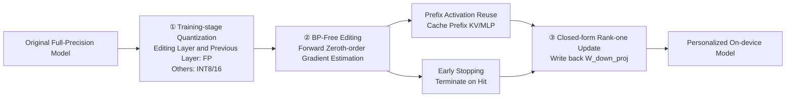

# MobiEdit: Resource-efficient Knowledge Editing for Personalized On-device LLMs

**Conference**: ICLR 2026  
**OpenReview**: [https://openreview.net/forum?id=fb7yTBOV3p](https://openreview.net/forum?id=fb7yTBOV3p)  
**Code**: [https://github.com/UbiquitousLearning/MobiEdit](https://github.com/UbiquitousLearning/MobiEdit)  
**Area**: Knowledge Editing / On-device LLMs / Mobile Systems  
**Keywords**: Knowledge Editing, locate-and-edit, zeroth-order optimization, mobile NPU, quantization, on-device personalization  

## TL;DR
MobiEdit replaces the resource-heavy backpropagation in the classic locate-and-edit knowledge editing (ROME) with "quantization + forward zeroth-order gradient estimation," coupled with two system optimizations: early stopping and prefix activation reuse. This allows real-time knowledge editing for 3B LLMs to run on commercial smartphone NPUs for the first time, reducing memory by 7.1×, energy consumption by 15.8×, and latency by 3.4×.

## Background & Motivation
**Background**: On-device LLMs are transitioning from research to deployment as privacy-sensitive, low-latency personal assistants. To enable assistants to remember personalized facts like "I live at 1010 Beijing Road," three common paths exist: RAG, fine-tuning, and knowledge editing. Knowledge editing is most suitable for resource-constrained phones because it updates only a small subset of parameters to inject single facts without slowing down inference. The mainstream paradigm is locate-and-edit (ROME/MEMIT/AlphaEdit)—first locating the key-value memory responsible for the knowledge in the MLP, then optimizing a value vector $v$ such that $Wk^*=v$.

**Limitations of Prior Work**: Existing editing methods rely entirely on backpropagation (BP) to solve for $v$, which faces three fatal issues on smartphones: (1) **NPU Incompatibility**: Mobile NPUs (Hexagon/Edge TPU) are optimized only for forward inference; training operators are either unsupported or extremely slow; (2) **Quantization Unfriendliness**: BP training is highly unstable on fully quantized models, forcing the retention of full-precision weights, which causes memory explosion; (3) **Massive Memory Overhead**: Editing a 3B model with ROME requires over 40GB of memory (storing full-precision weights + BP activations), far exceeding the 16GB limit of most phones.

**Key Challenge**: The algorithmic paradigm of knowledge editing (multi-step BP optimization) fundamentally mismatches mobile hardware capabilities (optimized for forward INT matrix multiplication), forcing editing to the cloud and sacrificing the privacy and offline advantages of on-device LLMs.

**Goal**: Develop a memory-efficient, NPU-friendly, and quantization-compatible on-device knowledge editing system that runs on commercial smartphones.

**Key Insight**: **Replace backpropagation with forward zeroth-order optimization.** Since NPUs are designed for forward passes, gradients can be estimated using only forward passes. Slow convergence of zeroth-order optimization can be mitigated via mixed-precision layouts, early stopping, and prefix reuse.

## Method

### Overall Architecture
MobiEdit inherits the key-value editing paradigm of ROME but reconstructs the pipeline through hardware-algorithm co-design in three stages: ① **Training-stage quantization**—converting the model into a mixed-precision format aligned with NPU constraints; ② **BP-free editing**—replacing BP optimizers with a forward zeroth-order gradient estimator, combined with prefix activation reuse and early stopping; ③ **Model update**—writing the optimized $v^*$ back to weights using a closed-form rank-one update for immediate use in subsequent dialogues.

### Key Designs

**1. BP-free Zeroth-order Gradient Estimation: Computing editing vectors via forward passes only.** Traditional methods use BP to calculate the gradient of $v$. MobiEdit employs a central difference zeroth-order estimator: along a random perturbation direction $u\sim\mathcal{N}(0,I)$, the directional gradient is $\hat\nabla_v L = \frac{L(v+\mu u)-L(v-\mu u)}{2\mu}\cdot u$. Variance is reduced by averaging $N$ independent directions, followed by approximate gradient descent $v\leftarrow v-\eta\hat\nabla_v L$ until convergence. Once the optimal $v^*$ is obtained, ROME's closed-form rank-one update $\hat W = W + \Lambda(C^{-1}k^*)^\top$ (where $C=KK^\top$ is the key covariance) writes $(k^*,v^*)$ into the MLP memory. The entire process uses only forward passes, allowing activations to be discarded immediately—saving the 40%+ memory typically occupied by BP activations.

**2. NPU-friendly Mixed-precision Quantization: Keeping floating point only for editing layers.** Mobile NPUs excel at INT8 matrix multiplication but have weak floating-point capabilities. However, full quantization hurts editing accuracy. MobiEdit uses static quantization and a critical mixed-precision layout: **only the editing vector and its preceding linear layer remain in floating point, while all other weights are quantized to 8/16-bit integers.** This is because editing affects very few parameters proportional to the hidden size, where even minor quantization errors significantly degrade precision. Furthermore, these floating-point calculations are negligible (only 0.89% on Qwen2.5-3B). Theoretically, BP-free methods are more robust to quantization noise: noise variance in forward passes grows **linearly** with depth $L$ as $O(L\sigma^2)$, whereas BP amplifies noise **exponentially** via the chain rule as $O(\sigma^2\|W\|^{2(L-\ell)})$. This explains why ROME's success rate drops from 96 to 41 under W8A16, while MobiEdit maintains 80.

**3. Early Stopping: Adaptive termination based on fact difficulty.** Zeroth-order optimization estimates gradients along single directions and requires ~20× more steps than BP to converge. The authors observed that editing difficulty varies by fact. MobiEdit evaluates the model's response to the target fact every $M$ steps (e.g., 20 steps); if the target output is produced with confidence exceeding threshold $m$, the process terminates immediately. Simple facts are completed in 2-3 minutes, avoiding unnecessary forward passes and reducing overfitting risks.

**4. Prefix Activation Reuse: Caching immutable prefix computation.** The input for each editing step consists of a fixed random prefix and the target fact $X_\text{edit}=\{[p_i+f]\}$. Prefix tokens are recomputed every step despite remaining constant. MobiEdit caches the KV cache and MLP activations for the prefix in the first step. Subsequent steps inherit these activations and only recompute the fact tokens. Evaluation shows that if the editing loss decreases by less than 0.001 over 3 steps, prefix activations are recomputed to prevent "stale" activation errors from accumulating.

## Key Experimental Results

### Main Results (Per-fact editing cost, ZsRE, Qwen2.5-3B)

| Method | Memory (GB) | K60 Latency (s) | K60 Energy (kJ) | Note |
|---|---|---|---|---|
| ROME | 46.14 | 4543.8 | 25.13 | BP, requires swap |
| MEMIT | 46.14 | 4543.8 | 25.13 | Batch editing |
| WISE | >30 | 11359 | ~0.36J/edit | Dynamic routing FFN |
| AlphaEdit | >30 | — | — | Null-space projection |
| **MobiEdit** | **6.2** | **1211–1902** | **~0.03J/edit** | NPU, W8A16 |

Summary: MobiEdit saves **7.1×** memory, **15.8×** energy, and **3.4×** latency. Success rate on Qwen is 80.1 (Edit) / 72.6 (Locality) / 51.4 (Portability). On Llama3.2-3B, it achieves 88.3% success, saving 3.1–6.1× latency.

### Quantization Robustness & 8-hour Usability

| Metric | ROME | MobiEdit |
|---|---|---|
| FP32 Success Rate | 96 | 86 |
| W8A16 Success Rate | 41 | **80** |
| Facts edited in 8 hours (K60) | 5 | **14** |

Baselines running at full CPU load for 100s cause temperatures to rise by ~10°C, leading to throttling or shutdown; MobiEdit's 10× energy reduction allows silent background editing.

### Ablation Study (Llama3.2-8B, starting Success Rate 85.3)

| Component Removed | Success Rate Change |
|---|---|
| Prefix Activation Reuse (Stale Act) | **−8.4** |
| Quantization (W8A16) | −2.1 |

### Key Findings
- Editing quality loss primarily stems from prefix activation reuse; quantization impacts are minimal. Quantization fluctuations concentrate in the first and last layers (high outlier features).
- BP's quantization noise explodes exponentially with depth, while forward noise grows linearly, fundamentally explaining BP-free's stability at low bits.

## Highlights & Insights
- **Hardware constraints as first-class citizens**: Instead of "edit then compress," the system derives zeroth-order optimization from the "NPU only supports forward" constraint, achieving true hardware-software co-design.
- **Accidental dividends of zeroth-order optimization**: The "gradient-free, slow convergence" trait, usually a drawback, becomes a strength on quantized edge devices—linear noise growth makes it far more stable than BP at low bit-widths.
- **Mixed-precision precision**: Retaining floating point for only 0.89% of critical calculations preserves accuracy without increasing overhead.
- **Metric alignment with real-world usage**: Using metrics like "facts edited over 8 hours" and "continuous temperature rise" is more persuasive than success rates alone for on-device deployment.

## Limitations & Future Work
- **Trade-offs in editing quality**: Success and locality rates are generally lower than full-precision BP methods (e.g., Llama portability at 38.3 is low); prefix reuse accounts for a -8.4 point drop.
- **High convergence steps**: Zeroth-order estimation inherently requires ~20× more steps; while mitigated by early stopping, difficult facts remain time-consuming.
- **Scale and multi-fact editing**: Validation focuses on 3B models and single-fact editing; stability for larger models or sequential/batch editing (MEMIT style) is not fully explored.
- **Inference engine dependency**: Testing is bound to `mllm-npu` and W8A16; portability across different NPUs or formats requires further verification.

## Related Work & Insights
- **Locate-and-edit lineage**: ROME (single-layer), MEMIT (multi-fact), AlphaEdit (null-space protection), WISE (dynamic FFN)—MobiEdit builds upon ROME to bring it to mobile.
- **Zeroth-order/Forward gradient optimization**: Borrowing central difference concepts from forward gradients (Baydin et al. 2022), migrating from "memory-saving training" to "NPU-friendly inference."
- **Insight**: When target hardware supports only specific operators, it is better to replace the algorithm with a mathematically equivalent but operator-friendly alternative (BP → Zeroth-order) than to force incompatible scripts.

## Rating
- **Novelty**: ⭐⭐⭐⭐ — First system to bring knowledge editing to commercial smartphone NPUs; the combination of BP-free and mixed-precision is novel in this context.
- **Experimental Thoroughness**: ⭐⭐⭐⭐ — Covers three devices, two datasets, two models, and four baselines across memory/latency/energy/quality, including realistic 8-hour usability tests.
- **Writing Quality**: ⭐⭐⭐⭐ — Clear logic from motivation to solution; the linear vs. exponential noise analysis is a highlight.
- **Value**: ⭐⭐⭐⭐ — Directly enables privacy-preserving, offline personalized LLMs on-device.

<!-- RELATED:START -->

## Related Papers

- [\[ICLR 2026\] MoEEdit: Efficient and Routing-Stable Knowledge Editing for Mixture-of-Experts LLMs](moeedit_efficient_and_routing-stable_knowledge_editing_for_mixture-of-experts_ll.md)
- [\[ICLR 2026\] KnowledgeSmith: Uncovering Knowledge Updating in LLMs with Model Editing and Unlearning](knowledgesmith_uncovering_knowledge_updating_in_llms_with_model_editing_and_unle.md)
- [\[ACL 2025\] Efficient Knowledge Editing via Minimal Precomputation](../../ACL2025/knowledge_editing/efficient_knowledge_editing.md)
- [\[ACL 2026\] EvoEdit: Evolving Null-space Alignment for Robust and Efficient Knowledge Editing](../../ACL2026/knowledge_editing/evoedit_evolving_null-space_alignment_for_robust_and_efficient_knowledge_editing.md)
- [\[ACL 2026\] Representation Interventions Enable Lifelong Knowledge Memory Control in LLMs](../../ACL2026/knowledge_editing/representation_interventions_enable_lifelong_knowledge_memory_control_in_llms.md)

<!-- RELATED:END -->
