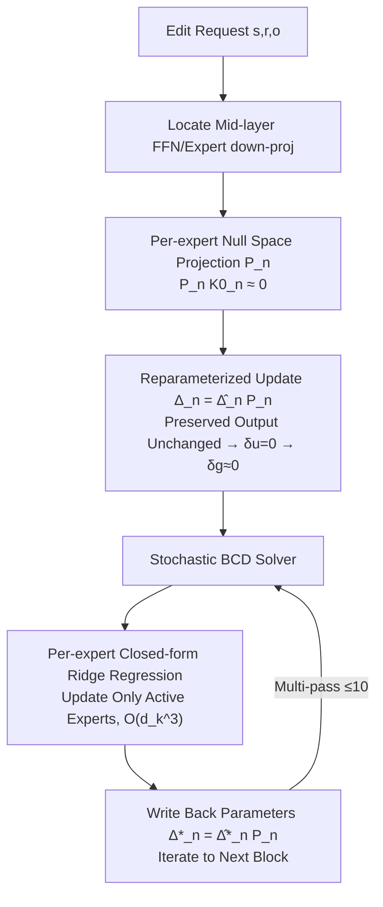

# MoEEdit: Efficient and Routing-Stable Knowledge Editing for Mixture-of-Experts LLMs

**Conference**: ICLR 2026  
**OpenReview**: [https://openreview.net/forum?id=BV4oHxGBx7](https://openreview.net/forum?id=BV4oHxGBx7)  
**Code**: [https://github.com/Terence-Gu/MoEEdit](https://github.com/Terence-Gu/MoEEdit)  
**Area**: Knowledge Editing / Mixture-of-Experts / Large Language Models  
**Keywords**: Knowledge Editing, MoE, Routing Stability, Null Space Projection, Block Coordinate Descent  

## TL;DR
MoEEdit is the first "routing-stable" parameter-modifying knowledge editing framework for MoE LLMs. It employs "per-expert null space projection" to ensure that edits do not perturb input manifolds for downstream routers, combined with a stochastic Block Coordinate Descent (BCD) solver to decouple computational costs from the total number of experts to the expert hidden dimension. This achieves high editing success rates, strong generalization, and routing stability on sparse architectures simultaneously.

## Background & Motivation
**Background**: Knowledge Editing (KE) enables precise revision of outdated or incorrect facts in LLMs (e.g., "The capital of France is Berlin"). Mainstream parameter-modifying methods follow a locate-then-edit route—identifying the down-projection weights of middle-layer FFNs, treating them as linear associative memories for key-value pairs, and performing structured updates (ROME, MEMIT, PMET). AlphaEdit further projects updates into the null space of a preserved set to enhance locality.

**Limitations of Prior Work**: These methods are predominantly designed for **dense** Transformers, assuming all parameters are activated for every token. However, state-of-the-art (SOTA) large models increasingly adopt MoE architectures (e.g., Qwen3-30B-A3B selects 8 out of 128 experts). Sparse, input-dependent computation causes dense editors to become ineffective.

**Key Challenge**: MoE editing faces a **triple coupling dilemma**: (1) **Computational Cost**: Naively updating all experts implies the cost scales with the number of experts (e.g., 128x), which is infeasible; (2) **Expert Coupling**: Layer output is a gated weighted sum of outputs from multiple experts; modifying one expert may be diluted by others or trigger side effects, requiring a balanced distribution of updates across appropriate experts; (3) **Routing Distribution Drift** (The most subtle): Parameter perturbations in one layer alter the input manifold for downstream layers, causing downstream routers to select different experts. This cascading effect destroys learned routing paths, harming both locality and overall stability. These intertwined issues make MoE editing significantly more difficult than dense model editing.

**Goal**: Propose a knowledge editor specifically designed for sparse modularity that can resolve this triple dilemma simultaneously.

**Core Idea**: **Reformulate MoE knowledge editing as a block-structured optimization problem where "each expert is a block"**, and **formally identify "routing-induced instability" as the central barrier to MoE editing** for the first time. Per-expert null space projection is used to structurally lock router inputs, while a stochastic BCD solver ensures costs grow linearly with the expert hidden dimension rather than the number of experts.

## Method

### Overall Architecture
MoEEdit decomposes the MoE editing objective (Eq. 5: matching new targets on edit set $E$ while remaining stable on preserved set $P$) into two steps. First, **Reparameterization**: the update for each expert is defined as $\Delta_n = \hat{\Delta}_n P_n$, where $P_n$ is a per-expert null space projector. This ensures updates are zero in the direction of preserved features, keeping downstream router inputs unchanged and constructively suppressing routing drift; this step also removes the preservation term from the objective. Second, **Efficient Solving**: the simplified objective is passed to a stochastic block coordinate descent solver, which updates only the experts activated in the current minibatch. Each sub-problem corresponds to a well-conditioned $d_k \times d_k$ ridge regression closed-form solution, avoiding the inversion of massive $(Nd_k)\times(Nd_k)$ matrices.

### Key Designs

**1. First-order Characterization of Routing Drift: Identifying that "Only Perturbations in the Routing Embedding Space Hurt Routing"**
The authors first diagnose the problem. Let $E_\ell$ be the routing embedding of layer $\ell$, logits be $s_\ell = E_\ell^\top u_\ell$, and gating weights $g_\ell = \mathrm{softmax}(s_\ell)$. A perturbation from the previous layer causes an input change $\delta u_\ell$. A first-order Taylor expansion of the softmax gives $\delta g_\ell \approx J_{sm}(s_\ell) E_\ell^\top \delta u_\ell$, where $J_{sm}(s) = \mathrm{diag}(sm(s)) - sm(s)\,sm(s)^\top$. This formula reveals a key observation: **only the component of $\delta u_\ell$ falling within $\mathrm{span}(E_\ell)$ affects routing probabilities**, and the Jacobian may further amplify this component. Consequently, suppressing the projection of the perturbation onto $\mathrm{span}(E_\ell)$ prevents routing drift at its source.

**2. Per-expert Null Space Projection Reparameterization: Making Updates "Invisible in Preserved Directions"**
Following the diagnosis, the authors extend the dense null space concept from AlphaEdit to an expert-wise granularity. For expert $n$, keys from preserved prompts are collected into matrix $K^0_n$. An eigen-decomposition of the covariance $K^0_n K^{0\top}_n = U_n \Lambda_n U_n^\top$ is performed to identify eigenvectors $U^0_n$ corresponding to near-zero eigenvalues ($\lambda_{n,p} < \tau$). The projector is defined as $P_n = U^0_n U^{0\top}_n$, which retains only directions orthogonal to preserved features. Updates are reparameterized as $\Delta_n = \hat{\Delta}_n P_n$. Since $P_n k_{i,n} = 0$ for $i \in P$, every preserved sample satisfies $\delta u_\ell(i) = 0$, leading to $\delta g_\ell(i) \approx 0$ per Design 1. The resulting editing objective (Eq. 8) contains only the edit set matching term and regularization, as **preservation terms are automatically absorbed by the projection**: $\{\hat{\Delta}_n\} = \arg\min \sum_{i\in E} \lVert \sum_n g_{i,n}(W_n k_{i,n} + \hat{\Delta}_n \tilde{k}_{i,n}) - v_i \rVert^2 + \lambda \sum_n \lVert \hat{\Delta}_n \rVert^2$, where $\tilde{k}_{i,n} = P_n k_{i,n}$.

**3. Stochastic Block Coordinate Descent Solver: Decoupling Cost from Number of Experts**
Although Eq. 8 allows a global closed-form solution $\theta^\star = M_{glob}^{-1} b_{glob}$, even with Kronecker structures, it requires decomposing $(Nd_k)\times(Nd_k)$ systems, with time complexity $O(d_m(Nd_k)^3)$ and memory $O(d_m(Nd_k)^2)$. This is impractical for MoE models where $N=8\text{--}128$ and $d_k$ is large. The authors exploit the structure where "each expert is naturally a block": by fixing other experts and optimizing only expert $n$, the sub-problem reduces to a well-conditioned $d_k \times d_k$ ridge regression with solution $\hat{\Delta}_n^\star = B_n M_n^{-1}$, where $M_n = \sum_i g_{i,n}^2 \tilde{k}_{i,n}\tilde{k}_{i,n}^\top + \lambda I$. In practice, experts are traversed in stochastic order, updating only those activated in the current minibatch. Building $M_n$ takes $O(|E|d_k^2)$ and inversion takes $O(d_k^3)$. Since Eq. 8 is a strictly convex quadratic form for $\{\hat{\Delta}_n\}$, stochastic BCD converges globally, typically within $\le 10$ passes. **This decoupling allows the cost to scale linearly with the expert hidden dimension rather than the total number of experts.**

## Key Experimental Results

### Main Results
Evaluated on Qwen3-30B-A3B (128 experts, top-8) and GPT-OSS-20B (32 experts, top-4) via 1000 sequential edits (batch=50). Metrics include Efficacy (Eff.), Generalization (Gen.), Specificity (Spe.), and their mean Utility (Uti.):

| Method | Model | CF Eff.↑ | CF Gen.↑ | CF Spe.↑ | CF Uti.↑ | ZsRE Uti.↑ |
|------|------|------|------|------|------|------|
| Pre-edited | Qwen3-30B-A3B | 13.30 | 15.10 | 84.45 | 37.62 | 40.90 |
| UnKE | Qwen3-30B-A3B | 89.30 | 82.85 | 48.15 | 73.43 | 28.84 |
| **Ours** | Qwen3-30B-A3B | **99.30** | **94.10** | 80.97 | **91.46** | **68.43** |
| UnKE | GPT-OSS-20B | 78.00 | 44.40 | 73.91 | 65.44 | 40.66 |
| **Ours** | GPT-OSS-20B | **95.90** | 44.10 | **81.09** | **73.70** | **60.89** |

Ours achieves 90+ efficacy on COUNTERFACT for both backbones, significantly leading in Utility. On ZsRE, efficacy/generalization is 30+ points higher than the strongest baseline, with specificity within 1 point of AdaLoRA.

### Ablation Study
Routing stability (Qwen3-30B-A3B / COUNTERFACT, RS = Jaccard similarity of pre/post-edit Top-K expert sets):

| Method | Set | Lay.11–20 | Lay.21–30 | Lay.31–40 |
|------|------|------|------|------|
| FT-L | Edit. | 47.01 | 51.20 | 53.68 |
| UnKE | Edit. | 52.46 | 44.12 | 44.80 |
| **Ours** | Edit. | **86.62** | **88.16** | **89.93** |
| Ours (w/o Proj) | Edit. | 73.64 | 72.90 | 73.75 |
| Ours (w/o Proj) | Pres. | 73.59 | 73.08 | 73.50 |

### Key Findings
- **Projection is critical for routing stability**: Removing projection drops the edit set RS by 14.81 points and the preserved set by 15.21 points. KL divergence rises from 0.02 to 0.0834. MoEEdit's average KL is only 0.02, with nearly zero non-overlapping experts, confirming "routing heavy-tailedness"—small perturbations only affect choices of low-weight experts that contribute minimally.
- **BCD scalability dwarfs closed-form solutions**: Closed-form solvers show near-quadratic growth and become infeasible after $N \approx 60$; BCD remains near-constant time up to 128 experts.
- **BCD Passes**: 6–10 passes provide a good trade-off between performance and efficiency, with marginal gains thereafter.

## Highlights & Insights
- **Formally identifies "routing distribution drift" as the central obstacle in MoE editing** and provide a quantifiable criterion via first-order analysis of the softmax Jacobian (suppressing components on $\mathrm{span}(E_\ell)$).
- **Clean closed-loop of diagnosis → design → solving**: Projection "absorbs" preservation terms to simplify the focus; BCD leverages the natural block structure of experts for scalable solving; strict convexity ensures global convergence.
- **"Constructive Guarantees" vs. "Soft Constraints"**: Routing stability is mathematically locked by the projector ($P_n k = 0$) rather than being encouraged by soft loss penalties, which is why stability significantly exceeds baselines.

## Limitations & Future Work
- Experiments focus on COUNTERFACT and ZsRE; performance on harder scenarios like multi-hop reasoning, long-tail relations, or portability requires further validation.
- Null space projection depends on the covariance of the preserved set and the threshold $\tau$; systematic analysis of sampling strategies and $\tau$ sensitivity across different models is needed.
- Only verified on Qwen3-30B-A3B and GPT-OSS-20B; adaptability to larger MoEs (hundreds of experts) or variants like shared/fine-grained experts remains to be tested.
- As a parameter-modifying approach, the cumulative stability under extremely long sequences of edits (exceeding 1000) and long-term impact on general capabilities warrant deeper study.

## Related Work & Insights
- **Dense KE**: Locate-then-edit systems (ROME / MEMIT / PMET) treat FFN down-projections as key-value memories for structured updates; AlphaEdit uses null space projection for locality—MoEEdit extends this to per-expert granularity.
- **Parameter-Preserving KE**: SERAC uses external memory for inference-time routing; LEMoE introduces MoE inside adapters for lifelong editing—however, those focus on routing consistency within adapters for frozen backbones and **do not address routing drift within the base model itself**, making them orthogonal to this work.
- **MoE Architectures**: GShard, GLaM, etc., decouple capacity from FLOPs—it is exactly this sparse modularity that creates the triple coupling dilemma addressed here.
- **Insight**: Any "local intervention" on sparse architectures (editing, pruning, alignment, unlearning) must treat "routing stability" as a first-class citizen; otherwise, local changes will cascade into global perturbations via routing.

## Rating
- **Novelty**: ⭐⭐⭐⭐⭐ First routing-stable parameter-modifying KE framework for MoE; pioneering problem definition and analysis.
- **Experimental Thoroughness**: ⭐⭐⭐⭐ Solid results on two MoE backbones across standard benchmarks; comprehensive analysis of RS, ablation, and scalability; limited diversity in benchmarks for complex reasoning.
- **Writing Quality**: ⭐⭐⭐⭐⭐ Clear articulation of triple challenges; well-structured logic chain from analysis to constructive design; excellent visualizations and derivations.
- **Value**: ⭐⭐⭐⭐⭐ Fills a critical gap in KE for the MoE era; insights into routing-stable interventions have broad applicability for pruning, alignment, and unlearning in sparse models.

<!-- RELATED:START -->

## Related Papers

- [\[ICLR 2026\] MobiEdit: Resource-efficient Knowledge Editing for Personalized On-device LLMs](mobiedit_resource-efficient_knowledge_editing_for_personalized_on-device_llms.md)
- [\[ICLR 2026\] KnowledgeSmith: Uncovering Knowledge Updating in LLMs with Model Editing and Unlearning](knowledgesmith_uncovering_knowledge_updating_in_llms_with_model_editing_and_unle.md)
- [\[ICLR 2026\] Scaling Knowledge Editing in LLMs to 100,000 Facts with Neural KV Database](scaling_knowledge_editing_in_llms_to_100000_facts_with_neural_kv_database.md)
- [\[ACL 2025\] Efficient Knowledge Editing via Minimal Precomputation](../../ACL2025/knowledge_editing/efficient_knowledge_editing.md)
- [\[ACL 2026\] EvoEdit: Evolving Null-space Alignment for Robust and Efficient Knowledge Editing](../../ACL2026/knowledge_editing/evoedit_evolving_null-space_alignment_for_robust_and_efficient_knowledge_editing.md)

<!-- RELATED:END -->
