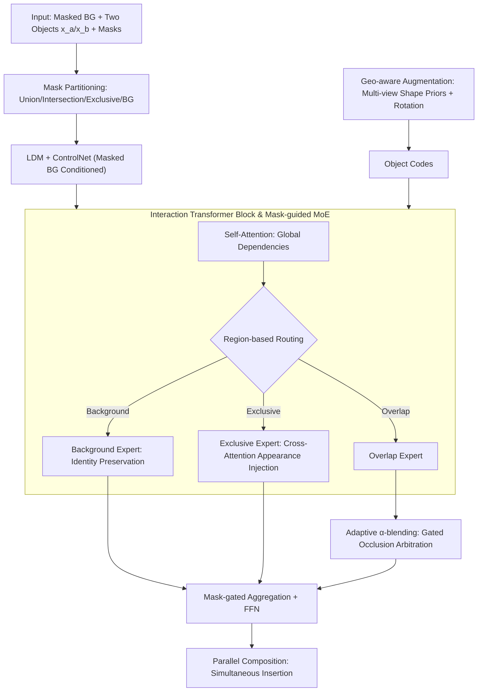

# PICS: Pairwise Image Compositing with Spatial Interactions

**Conference**: ICLR 2026  
**arXiv**: [2603.06873](https://arxiv.org/abs/2603.06873)  
**Code**: [github.com/RyanHangZhou/PICS](https://github.com/RyanHangZhou/PICS)  
**Area**: Knowledge Editing  
**Keywords**: image compositing, diffusion model, Mixture-of-Experts, spatial interaction, $\alpha$-blending

## TL;DR

PICS is proposed as a parallel pairwise image compositing method. Through mask-guided MoE and an adaptive $\alpha$-blending strategy within an Interaction Transformer, it simultaneously composites two objects in a single inference pass while explicitly modeling spatial interactions such as occlusion and contact, significantly outperforming existing sequential methods.

## Background & Motivation

**Diffusion models drive image compositing progress**: Recent diffusion-based methods demonstrate excellent performance in single-object compositing, supporting the integration of objects as visual prompts into diverse backgrounds.

**Limitations of Prior Work in multi-round synthesis**: Existing methods are inherently single-round, inserting only one object at a time. When multiple objects must be inserted sequentially, subsequent operations often overwrite previous content, destroying occlusion order and physical consistency.

**Flaws of the Painter’s Algorithm**: When performing sequential synthesis based on depth (far to near), the first inserted object is easily mistaken as part of the background, leading to partial deletion, distortion, or over-blending.

**Key Challenge (Lack of explicit interaction modeling)**: Real-world scenes involve fundamental spatial relations such as support, containment, occlusion, and deformation. However, training data construction methods (foreground-background dichotomy) ignore these relationships.

**Key Insight (Pairwise relations as the fundamental unit)**: The spatial plausibility of any multi-object scene can be decomposed into pairwise relationships. Therefore, modeling pairwise interactions is a critical step towards solving multi-object compositing.

**Core Idea**: Partition image regions into the background, exclusive regions for each of the two objects, and overlapping regions. These are processed by specialized routing experts, with an attention-gated $\alpha$-blending strategy to resolve fusion in overlapping areas.

## Method

### Overall Architecture

The Goal of PICS is to simultaneously insert two objects that may occlude or touch each other into a background. Traditional methods insert them sequentially, where the later object treats the earlier one as part of the background, leading to incorrect occlusion or erasure. The Mechanism of PICS is **parallel synthesis**: built on Latent Diffusion Models (LDM) and ControlNet, it takes the masked background $\mathbf{x}_{bg}$, two objects $\{\mathbf{x}_a, \mathbf{x}_b\}$, and their binary masks $\{\mathbf{m}_a, \mathbf{m}_b\}$ as input. It composites both objects into the background in a **single forward pass**, fundamentally avoiding the overwriting and error accumulation of sequential synthesis.

The key to this parallel approach is **region partitioning**: the union mask $\mathbf{m}_u$, intersection (overlap) mask $\mathbf{m}_{ab}$, exclusive masks $\mathbf{m}_a^{ex}$/$\mathbf{m}_b^{ex}$, and background mask $\mathbf{m}_{bg}=1-\mathbf{m}_u$ are computed from the two object masks. Every pixel is explicitly assigned to "background," "exclusive," or "overlap." The Interaction Transformer Block then processes these differently: the background is preserved, exclusive regions receive single-object injection, and the complex overlapping regions are adjudicated by $\alpha$-blending. Training data is constructed using self-supervised "composition-by-decomposition"—extracting objects and background from a target image—allowing the model to learn reconstruction without manual annotation.

### Key Designs

**1. Interaction Transformer Block and Mask-guided MoE: Spatial Divide and Conquer**

If a unified attention layer manages background preservation, object injection, and overlap mediation simultaneously, results are often suboptimal, causing artifacts at occlusions. PICS encodes the prior of "how to process each region" into the **architecture**: each block applies self-attention for global dependencies, followed by a mask-guided Mixture-of-Experts (MoE). Tokens are routed to specialized experts based on their region. Background experts cover $\bar{\mathbf{m}}_{bg}$ using identity mapping to maintain the background. Exclusive experts for objects a/b cover $\bar{\mathbf{m}}_a^{ex}$ and $\bar{\mathbf{m}}_b^{ex}$, using background queries to cross-attend to corresponding object codes. Overlapping regions $\bar{\mathbf{m}}_{ab}$ are handled by the overlap expert. This mechanism prevents object appearance from leaking into the background or mutual contamination between objects.

**2. Adaptive $\alpha$-blending: Learning Occlusion Hierarchies**

The overlapping region is the most critical design. Simply mixing object codes with an MLP blurs boundaries, while hard-coding depth order is inflexible and requires labels. PICS uses an attention-gated overlap expert. A gating query $\mathbf{q}_g$ is generated from background latent $\mathbf{z}^{l-1}$ to cross-attend with object codes, producing aggregated representations $\tilde{\mathbf{c}}_a, \tilde{\mathbf{c}}_b$. Compatibility scores are computed and normalized into blending weights:

$$s_p = \frac{\langle \mathbf{q}_g, \tilde{\mathbf{c}}_p \rangle}{\sqrt{d}}, \quad \alpha = \mathrm{softmax}_\tau(s_a, s_b), \quad \mathbf{c}_{ab} = \alpha\, \tilde{\mathbf{c}}_a + (1-\alpha)\, \tilde{\mathbf{c}}_b$$

where $d=\dim(\mathbf{q}_g)$ and $\tau>0$ controls selection sharpness. This works because $\mathbf{q}_g$ captures **learned occlusion semantics** rather than just appearance. The resulting $\alpha$ adaptively reflects which object should dominate at each spatial position, acting as an implicit arbiter. This design is naturally order-invariant.

**3. Geo-aware Data Augmentation: Supplementing 3D Shape Priors**

Single-view object images lack depth information, leading to shape degradation under clutter. PICS incorporates two types of geometric augmentation: **Multi-view shape priors**, using single-view 3D reconstruction models to render $K$ auxiliary views into a compact descriptor for the shape encoder; and **In-plane rotation**, applying random rotations $\theta \sim \mathcal{U}(-\pi/6, \pi/6)$ to objects and masks to improve robustness to spatial misalignment.

### Loss & Training

The training centers on a self-supervised reconstruction loss, requiring the model to reconstruct the original image from decomposed background and object components, combined with standard denoising losses. The "composition-by-decomposition" pipeline ensures zero manual annotation costs.

## Key Experimental Results

### Main Results

**Object Re-composition (LVIS Validation Set)**:

| Method | mPSNR ↑ | mSSIM ↑ | mLPIPS ↓ | PSNR ↑ | FID ↓ | LPIPS ↓ |
|------|---------|---------|----------|--------|-------|---------|
| PbE (CVPR'23) | 10.24 | 0.4241 | 0.4535 | 15.29 | 34.93 | 0.4138 |
| AnyDoor (CVPR'24) | 11.62 | 0.5283 | 0.4185 | 17.12 | 27.17 | 0.3302 |
| OmniPaint (ICCV'25) | 12.20 | 0.3096 | 0.4618 | 16.09 | 26.25 | 0.3542 |
| **PICS (Ours)** | **13.88** | **0.5823** | **0.3221** | **18.27** | **24.99** | **0.2530** |

Gains in intersection metrics (mPSNR/mSSIM/mLPIPS) are particularly significant, highlighting the advantage of explicit overlap modeling.

**Object Synthesis (DreamBooth Test Set)**:

| Method | FID ↓ | CLIP-score ↑ | DINOv2-score ↑ | DreamSim ↓ |
|------|-------|-------------|----------------|------------|
| ObjectStitch | 260.4 | 51.35 | 0.3203 | 0.3374 |
| AnyDoor | 274.1 | 51.24 | 0.3401 | 0.2733 |
| InsertAnything (AAAI'26) | 266.0 | 50.54 | 0.3612 | 0.2934 |
| **PICS (Ours)** | **255.5** | **54.02** | **0.3631** | **0.3054** |

### Ablation Study

| Setting | Key Change | FID ↓ | CLIP-score ↑ |
|------|---------|-------|-------------|
| #1 MLP + Single-view | Baseline | 173.1 | 74.6 |
| #2 ITB + Single-view | MLP $\rightarrow$ ITB | 165.2 | 76.3 |
| #3 ITB + Rotation | + Rotation Aug | 162.5 | 74.9 |
| #4 ITB + Multi-view | + Multi-view prior | 158.2 | 77.3 |
| #5 ITB + Combi Data | + 1M Dataset | **151.3** | **79.1** |

### Key Findings

1. **Parallel vs. Sequential**: Parallel synthesis effectively avoids error accumulation, especially at occlusion boundaries.
2. **$\alpha$-blending learns visibility**: The sign of $\Delta s = s_a - s_b$ matches ground-truth visibility and is order-invariant.
3. **$\alpha$ evolution during denoising**: Weights transition from coarse (early) to decisive (middle) to refined (late) stages.
4. **Scalability**: Models extended to 3/4 objects maintain consistent occlusion and contact relationships.
5. **User Study**: Ranked first in both realism (17.7% preference margin) and consistency (22.5%).

## Highlights & Insights

- **Mask-guided MoE is intuitive**: Partitioning regions for specialized processing (identity for background, cross-attention for objects, arbitration for overlap) is an elegant way to hardcode spatial priors.
- **Adaptive $\alpha$-blending over hard masks**: Allowing the model to learn occlusion semantics is superior to manual depth assignment.
- **Self-supervised efficiency**: The composition-by-decomposition approach removes the need for expensive manual labels.
- **Input Order Invariance**: The $\alpha$-blending mechanism ensures that swapping object indices does not change the result.

## Limitations & Future Work

- **Shape encoder capacity**: Occasional geometry/texture degradation in extremely cluttered environments.
- **Pairwise limitation**: While 3/4 object extensions exist, MoE expert complexity scales poorly; more objects may require redesigned routing.
- **Backbone constraints**: Uses standard LDM; adopting Flow-Matching (e.g., FLUX) could improve performance.
- **Dataset Diversity**: Primarily trained on LVIS; generalization to extreme domains (e.g., medical imaging) remains unverified.
- **Text conditioning**: Purely image-prompted; lacks support for text descriptions to guide placement or style.

## Related Work & Insights

- **AnyDoor (CVPR'24)**: Uses edge maps for semantics but lacks interaction modeling, causing artifacts during occlusion.
- **FreeCompose (ECCV'24)**: Zero-shot synthesis but does not explicitly handle spatial interactions.
- **InsertAnything (AAAI'26)**: A state-of-the-art competitor that PICS outperforms in FID and CLIP-score.
- **Insight**: Mask-guided MoE routing can be generalized to other vision tasks requiring region-specific control, such as video editing or 3D scene manipulation.

## Rating

- ⭐ Novelty: 4/5
- ⭐ Experimental Thoroughness: 4.5/5
- ⭐ Writing Quality: 4/5
- ⭐ Value: 4/5

<!-- RELATED:START -->

## Related Papers

- [\[ICLR 2026\] SUIT: Knowledge Editing with Subspace-Aware Key-Value Mappings](suit_knowledge_editing_with_subspace-aware_key-value_mappings.md)
- [\[ICLR 2026\] EAMET: Robust Massive Model Editing via Embedding Alignment Optimization](eamet_robust_massive_model_editing_via_embedding_alignment_optimization.md)
- [\[ICLR 2026\] Fine-tuning Done Right in Model Editing](fine-tuning_done_right_in_model_editing.md)
- [\[ICLR 2026\] MoEEdit: Efficient and Routing-Stable Knowledge Editing for Mixture-of-Experts LLMs](moeedit_efficient_and_routing-stable_knowledge_editing_for_mixture-of-experts_ll.md)
- [\[ICLR 2026\] TangleScore: Tangle-Guided Purge and Imprint for Unstructured Knowledge Editing](tanglescore_tangle-guided_purge_and_imprint_for_unstructured_knowledge_editing.md)

<!-- RELATED:END -->
