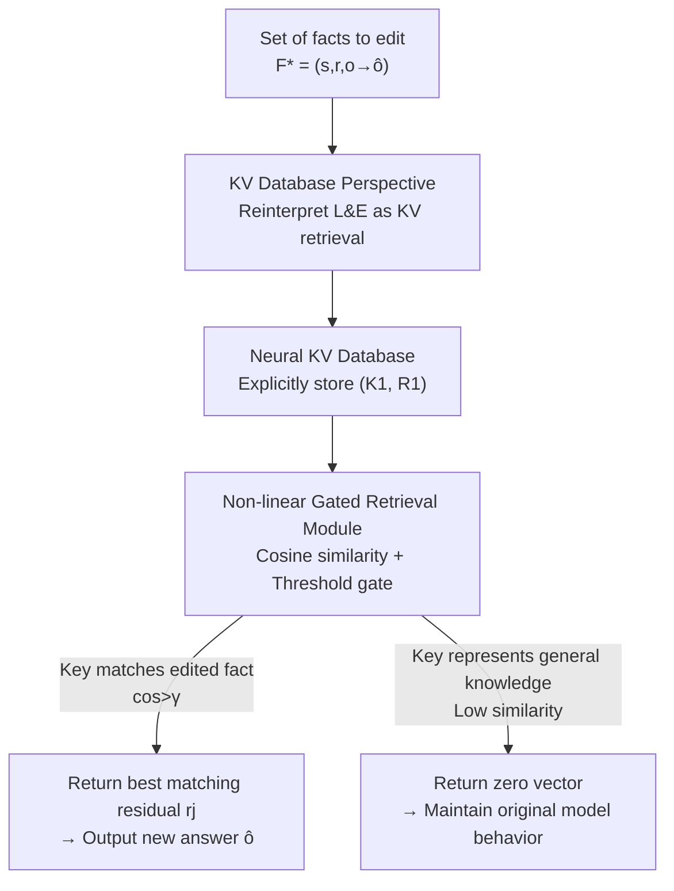

# Scaling Knowledge Editing in LLMs to 100,000 Facts with Neural KV Database

**Conference**: ICLR 2026  
**OpenReview**: [https://openreview.net/forum?id=Z0CX62CSJQ](https://openreview.net/forum?id=Z0CX62CSJQ)  
**Area**: Knowledge Editing  
**Keywords**: Knowledge Editing, Locate-and-Edit, KV Database, Gated Retrieval, Mass Editing

## TL;DR
This paper reinterprets existing Locate-and-Edit knowledge editing methods as "querying a KV database" and proposes NeuralDB. By replacing the traditional linear perturbation $\Delta$ with a non-linear gated retrieval module, the fact capacity is extended from several hundred to 100,000, while maintaining the model's general capabilities.

## Background & Motivation
**Background**: Knowledge Editing (KE) aims to precisely modify specific facts stored in LLM parameters (e.g., "The most recent World Cup was held in Qatar") without retraining the entire model. The mainstream solution for editing large batches of facts is **Locate-and-Edit (L&E)**, represented by methods like MEMIT, D4S, and AlphaEdit. These methods learn an activation residual for each new fact and inject these residuals into the FFN's output weight $W_{out}$ via a linear perturbation $\Delta$.

**Limitations of Prior Work**: These methods perform well for a few hundred facts, but two types of degradation occur as the scale increases to thousands: (i) **Decrease in general capabilities**: To avoid destroying "general knowledge," L&E samples approximately 100,000 key vectors from Wikipedia to form a matrix $K_0$ as a constraint for the least-squares solution. However, this sampled subset fails to represent the model's actual general capabilities, leading to significant drops in MMLU and reasoning tasks once the constraint fails. (ii) **Forgetting of edited facts**: Linear systems have limited capacity. The more facts are edited, the more likely earlier facts are overwritten by subsequent ones.

**Key Challenge**: L&E utilizes a **linear perturbation matrix $\Delta$** to carry all edited facts simultaneously. The expressive capacity of this linear container is limited. As the number of facts increases, interference grows, and the method relies on unreliable Wikipedia sampling to "mask" which activations should remain unchanged. Both the capacity bottleneck and the protection of general capabilities are rooted in this "linearity."

**Goal**: To increase the knowledge editing capacity from several hundred to tens of thousands or even 100,000 facts while achieving (i) a high editing success rate, (ii) no loss in general capabilities, and (iii) support for insertion, deletion, and modification.

**Key Insight**: The authors first perform a critical theoretical and empirical analysis by rewriting the closed-form solutions of MEMIT and AlphaEdit into the form $(W+\Delta_{upd})k = v + R_1\omega$, where weights $\omega = K_1^\top S k$. Empirical tests show that during inference on edited facts, $\omega$ is nearly one-hot (only the weights corresponding to that fact are non-zero); during inference on unrelated content, $\omega$ is nearly a zero vector. This suggests that existing methods essentially **query a KV database**: they use the current key as a query and return the corresponding residual if there is a match, or zero otherwise.

**Core Idea**: Since the mechanism is fundamentally KV retrieval, the authors bypass the linear $\Delta$ approximation. Instead, they explicitly store edited facts in a **Neural KV Database** paired with a **non-linear gated retrieval function** to accurately return residuals on hits and zeros otherwise, fundamentally breaking the linear capacity limit.

## Method

### Overall Architecture
NeuralDB is a plug-and-play editing framework. The input is a batch of facts to be edited $F^* = \{(s_i, r_i, o_i \to \hat o_i)\}$, and the output is an FFN layer mounted with a gated retrieval module. This allow the model to provide new answers for edited facts while remaining unchanged for general knowledge. The workflow consists of three steps: first, each fact is encoded into key and residual vectors, which are **stacked explicitly into a KV database $(K_1, R_1)$**; second, a **non-linear gated retrieval module** $g(\cdot; K_1, R_1)$ is embedded into the target FFN layer to replace the linear perturbation $\Delta$; finally, during inference, a **cosine similarity + threshold gate** determines whether to activate the retrieval—matching the most relevant residual for hits and doing nothing for misses.

### Key Designs

**1. KV Database Perspective: Reinterpreting linear L&E as "querying a KV database"**

This analytical step is the foundation of the paper. It addresses the issue that L&E has been traditionally viewed as adding a linear perturbation $\Delta$ to parameters without clarity on its actual operation. The authors rewrite the solutions of MEMIT and AlphaEdit as:
$$(W + \Delta_{upd})k = v + R_1\omega, \qquad \omega = K_1^\top S k \in \mathbb{R}^{m\times 1}$$
where $k,v$ are the original activation key/value, $K_1$ is the key matrix for all edited facts, $R_1$ is the residual matrix, and $S$ is the kernel matrix specific to each method (for MEMIT, $S_1=(K_1K_1^\top+\beta_1 K_0K_0^\top)^{-1}$; for AlphaEdit, $S_2=P^\top(PK_1K_1^\top P^\top+\beta_2 I)^{-1}P$). This reformulation shows that the injected update $R_1\omega$ is a **weighted average** of the residual matrix $R_1$, where $\omega$ is the self-similarity between query $k$ and the keys in the database. Empirical tests on $\omega$ across three models show that for positive samples, the weight is significantly high (even approaching 1 for AlphaEdit), while for negative samples, it approaches 0. Thus, existing methods are essentially KV retrievers approximating this through a linear closed-form solution. This perspective points to the improvement: using a **true, non-linear, and capacity-unbounded** retriever.

**2. Neural KV Database: Explicitly storing $(K_1, R_1)$ instead of fitting into linear $\Delta$**

Instead of using a linear matrix to implicitly carry all facts, the facts are **explicitly stored**. For each target fact $f_i$, its key vector $k_i = \sigma(W_{in}N(h_{l-1}+a_l))$ and residual vector $r_i = \hat v_i - W k_i$ are calculated and appended to form key matrix $K_1\in\mathbb{R}^{d_1\times m}$ and residual matrix $R_1\in\mathbb{R}^{d_2\times m}$, column-aligned ($k_i \leftrightarrow r_i$). The benefits are clear: the capacity is no longer limited by the rank of the linear system, and the spatial complexity is only $O((d_1+d_2)\times m)$. For Llama-3-8B with 10,000 edits, the additional parameters are approximately 150M (only 2.2% of the original model). Furthermore, as an explicit list, **CRUD operations become natural**: adding a fact requires appending a column, deleting requires removing a column, and modifying requires replacing a column.

**3. Non-linear Gated Retrieval Module: Cosine similarity + threshold gate for precise activation**

The retrieval function implements two requirements: (i) determining **whether** to use a residual and (ii) determining **which** residual to use. The authors use a non-linear gated function:
$$g(k; K_1, R_1) = r_j \cdot \mathbf{1}_{\cos(k,k_j) > \gamma}, \qquad j = \arg\max_i \cos(k, k_i)$$
The $\arg\max$ finds the $k_j$ with the highest cosine similarity to the current query $k$. An indicator function with threshold $\gamma$ acts as a gate: if similarity exceeds $\gamma$, the residual $r_j$ is added to the FFN output $v_l = W_l k_l + g(k_l; K_1, R_1)$; otherwise, the gate closes and outputs a zero vector. Cosine similarity is chosen for its interpretability and effectiveness. This design naturally protects **general knowledge** because its keys have low similarity to edited keys, meaning the gate remains inactive without needing expensive Wikipedia sampling for $K_0$. This non-linear gating is what allows expansion to 100,000 facts.

### Loss & Training
NeuralDB **does not introduce additional training**. Keys and residuals are calculated directly via forward inference. The gated retrieval is parameter-free (aside from the hyperparameter $\gamma$). It is a truly plug-and-play module. The editing cost resides primarily in the forward pass to build $(K_1, R_1)$, and the inference overhead for 10,000 facts is only about 1.5%.

## Key Experimental Results

### Main Results
Evaluation was conducted on CounterFact and ZsRE across GPT-2 XL, GPT-J (6B), and Llama-3 (8B). Metrics include efficacy, generalization, specificity, fluency, and consistency. The following table compares Llama-3 from 2,000 to 10,000 facts (arrow → indicates the 10k result):

| Method (Llama-3) | Efficacy | Generalization | Specificity | Fluency | Consistency |
|------|------|------|------|------|------|
| Pre-edited | 7.9 | 10.6 | 89.5 | 635.2 | 24.1 |
| MEMIT | 63.5→63.4 | 62.8→56.6 | 52.0→50.6 | 466.6→460.4 | 6.5→6.5 |
| RECT | 64.2→60.0 | 62.5→53.9 | 58.9→51.2 | 502.8→399.1 | 12.9→1.6 |
| AlphaEdit | 99.1→75.8 | 94.0→63.1 | 68.6→54.0 | 622.7→417.8 | 32.8→7.0 |
| **NeuralDB** | **99.9→99.2** | **86.6→85.9** | **88.2→85.6** | **632.7→631.0** | **32.9→32.6** |

Key takeaway: Scaling from 2k to 10k causes AlphaEdit's efficacy to drop from 99.1 to 75.8. In contrast, NeuralDB maintains nearly 99% performance across all metrics, with specificity (85.6) and fluency (631.0) remaining close to the original model.

### Key Findings
- **Gated retrieval is crucial for general capabilities**: Prior L&E methods decline rapidly after 4,000 edits due to reliance on Wikipedia sampling. NeuralDB's "do not move if similarity is low" approach stays stable across all tasks.
- **Scalability is virtually free**: Increasing edits to 100,000 (50x more than AlphaEdit) results in efficacy only dropping from 96.9 to 95.5.
- **Single-layer sufficiency**: Deploying the gated module in a single FFN layer is sufficient, with multi-layer strategies offering limited gains.

## Highlights & Insights
- **The "Understand, then Rebuild" Paradigm**: The strength of this work lies in reinterpreting L&E as KV retrieval through theoretical reformulations and empirical visualizations, then logically replacing linear approximations with non-linear retrieval.
- **Replacing Sampling with Gating**: Instead of sampling 100,000 keys from Wikipedia, NeuralDB uses a cosine threshold gate. This "constraint-to-gating" transition saves computation and increases precision.
- **Operationality via Explicit Database**: Storing facts in an appendable list brings database-like CRUD capabilities to knowledge editing for the first time.

## Limitations & Future Work
- The threshold $\gamma$ is a hyperparameter. While cosine similarity is bounded in $[0,1]$, its robustness across different models/datasets without re-tuning requires further investigation.
- Retrieval uses $\arg\max$ for exact matching. The tradeoff between exact matching and approximate nearest neighbor (ANN) at scales beyond 100,000 facts was not deeply explored.
- The method follows a "hit-and-replace" logic. Its robustness for multi-hop reasoning or combinatorial edits (e.g., MQuAKE) remains to be fully verified in the core experiments.

## Related Work & Insights
- **vs MEMIT / AlphaEdit**: They use an implicit linear perturbation $\Delta = R_1 K_1^\top S$. This work proves this is equivalent to weighted average retrieval and replaces it with explicit $(K_1, R_1)$, improving capacity and general capability protection.
- **vs SERAC / GRACE**: These are also "external memory" approaches, but their generalization is often low (~50%). NeuralDB achieves ~90% generalization by matching in the key space.
- **vs ROME / FT**: These cannot scale to tens of thousands of facts. NeuralDB is designed for mass editing, operating at a scale 2-3 orders of magnitude larger.

## Rating
- Novelty: ⭐⭐⭐⭐⭐ Reinterpreting L&E as KV retrieval is insightful and cleanly implemented.
- Experimental Thoroughness: ⭐⭐⭐⭐⭐ Tested on three models and two benchmarks, reaching the 100k scale.
- Writing Quality: ⭐⭐⭐⭐ Clear logic from theory to method, though some details are in the appendix.
- Value: ⭐⭐⭐⭐⭐ Increases editable capacity by 50x without damaging general capabilities.

<!-- RELATED:START -->

## Related Papers

- [\[ICLR 2026\] MobiEdit: Resource-efficient Knowledge Editing for Personalized On-device LLMs](mobiedit_resource-efficient_knowledge_editing_for_personalized_on-device_llms.md)
- [\[ICLR 2026\] KnowledgeSmith: Uncovering Knowledge Updating in LLMs with Model Editing and Unlearning](knowledgesmith_uncovering_knowledge_updating_in_llms_with_model_editing_and_unle.md)
- [\[ACL 2025\] CKnowEdit: A New Chinese Knowledge Editing Dataset for Linguistics, Facts, and Logic Error Correction in LLMs](../../ACL2025/knowledge_editing/cknowedit_chinese_knowledge_editing_dataset_llms.md)
- [\[ICLR 2026\] MoEEdit: Efficient and Routing-Stable Knowledge Editing for Mixture-of-Experts LLMs](moeedit_efficient_and_routing-stable_knowledge_editing_for_mixture-of-experts_ll.md)
- [\[CVPR 2026\] Attribution-Guided Model Rectification of Unreliable Neural Network Behaviors](../../CVPR2026/knowledge_editing/attribution-guided_model_rectification_of_unreliable_neural_network_behaviors.md)

<!-- RELATED:END -->
