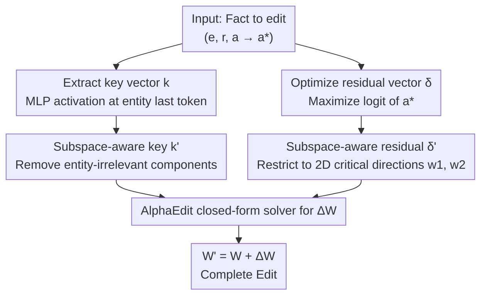

# SUIT: Knowledge Editing with Subspace-Aware Key-Value Mappings

**Conference**: ICLR 2026  
**OpenReview**: [https://openreview.net/forum?id=qz3BkyyHWJ](https://openreview.net/forum?id=qz3BkyyHWJ)  
**Code**: https://github.com/holi-lab/SUIT  
**Area**: Knowledge Editing / Model Interpretability  
**Keywords**: Knowledge Editing, locate-then-edit, Linear Representation Hypothesis, subspace constraints, knowledge preservation

## TL;DR
SUIT constrains the "manually calculated" key vector $k$ and residual vector $\delta$ in locate-then-edit knowledge editing into low-dimensional subspaces truly relevant to the target edit. This significantly reduces damage to irrelevant knowledge without sacrificing editing success—doubling Specificity on LLaMA3 / GPT-J / Qwen2.5 compared to the strong baseline AlphaEdit.

## Background & Motivation

**Background**: Large Language Models (LLMs) store vast factual knowledge but generate errors due to training data noise or temporal drift (e.g., misidentifying the developer of Chrome). Since fine-tuning is costly and prone to overfitting and catastrophic forgetting, "knowledge editing" has emerged as a precise alternative. The **locate-then-edit** approach is particularly practical: it treats the MLP down-projection matrix $W$ as a "linear associative memory" that maps a key vector $k$ (encoding entity $e$) to a value vector $v$ (encoding relation-attribute $(r,a)$). To update a fact from $(e,r,a)$ to $(e,r,a^*)$, one calculates a new value vector $v^*$ and solves for an increment $\Delta$ such that $(W+\Delta)k \approx v^*$ via closed-form solutions. MEMIT and AlphaEdit follow this paradigm.

**Limitations of Prior Work**: Ideal editing should only modify target knowledge without affecting others. However, current edits introduce perturbations beyond the target scope—changing the developer of "Chrome" might inadvertently biase answers for unrelated entities, leading to poor Specificity (preservation of unrelated knowledge) and potential model collapse after sequential edits.

**Key Challenge**: Methods like AlphaEdit only constrain the **increment $\Delta$** (forcing its row space into the null space of keys for existing knowledge) but **do not constrain the calculation of $k$ and $v^*$ themselves**. Since editing outcomes are fundamentally determined by $k$ and $v^*$, these high-dimensional vectors with high degrees of freedom can spread perturbations if they contain feature directions irrelevant to the current edit, even if $\Delta$ is constrained.

**Goal**: To introduce constraints during the calculation phase of $k$ and $\delta$ (the residual vector) by projecting them into subspaces strictly relevant to the target edit.

**Key Insight**: The authors introduce the **Linear Representation Hypothesis**, which is less frequently used in knowledge editing literature. This hypothesis suggests that hidden states are linear superpositions of interpretable features, where each feature occupies an independent subspace. Accordingly, $k$ contains both "entity-specific features" (unique to Chrome) and "entity-irrelevant features" (shared semantic categories like "is a browser" or "proper noun attributes"). Similarly, $v^*$ contains both directions for the specific attribute and unrelated directions. Editing should only utilize the former.

**Core Idea**: Use SVD to identify "entity-irrelevant subspaces" and "critical directions determining attribute logits." The key vector is projected to remove irrelevant components, and the residual update is restricted to a 2D critical subspace, ensuring editing occurs within an "edit-critical subspace."

## Method

### Overall Architecture
SUIT maintains the core locate-then-edit framework (calculating $k$ and $\delta$, solving for $\Delta$ in closed form, and updating $W' = W + \Delta$). It only inserts subspace constraints during the **calculation of the two input vectors**: projecting the original key vector $k$ into an entity-specific subspace to obtain $k'$ (§4.2), and restricting the original residual vector $\delta$ to a 2D critical subspace to obtain $\delta'$ (§4.3). The increment $\Delta$ is then solved using the AlphaEdit closed-form formula (Eq. 1). In essence, **SUIT = AlphaEdit update formula + two "vector purification" pre-processing modules**.

### Key Designs

**1. Subspace-aware key vector $k'$: Removing shared feature directions**

The limitation is clear: the original key vector $k$ (extracted from the MLP up-projection at the entity's last token) contains both components unique to the entity and shared components activated by any "proper noun." Shared directions activate similarly across many entities; if left in $k$, they allow the edit to "leak" into unrelated entities, damaging Specificity.

The method first characterizes the "entity-irrelevant subspace" $K_s^\perp$ offline: $N=10{,}000$ entities are sampled from PARAREL to compute a matrix $K_{\text{entity}}=[k_1\,|\,\cdots\,|\,k_{10000}]$, followed by singular value decomposition $K_{\text{entity}}=USV^\top$. The key insight is that **principal directions with large singular values represent entity-irrelevant directions shared across entities**. Given an energy threshold $\tau_{\text{energy}}\in[0,1)$, the smallest $m$ is chosen such that $\sum_{i=1}^{m}\sigma_i^2 \ge \tau_{\text{energy}}\cdot E_{\text{total}}$, defining $K_s^\perp := \mathrm{span}(U_{\sim s})$ where $U_{\sim s}=[u_1\,|\,\cdots\,|\,u_m]$. During editing, the projection of $k$ onto this shared subspace is subtracted:

$$k' = k - k_{\sim s}, \qquad k_{\sim s} = U_{\sim s}U_{\sim s}^\top k.$$

The remaining $k'=k_s$ contains only entity-specific features. Compared to AlphaEdit, which only constrains $\Delta$, this purifies the key vector at the **source**. The authors verified that the ratio $\|\Delta k_{\sim s}\|^2/\|\Delta k\|^2$ is only 0.003–0.02 for SUIT, whereas it ranges from 0.28–0.81 for MEMIT/AlphaEdit.

**2. Subspace-aware residual vector $\delta'$: Operating on two attribute-critical directions**

Originally, the residual vector $\delta$ is calculated by adding a learnable increment to the residual stream $h$ at the last token of the entity in the target layer, and using gradient descent to maximize the logit of the new attribute $a^*$ with a regularization term $R$ (Eq. 2). However, $\delta$ has the same high dimensionality as $h$, while only a few directions are truly useful for switching attributes; others are "noise" that disturbs unrelated knowledge.

SUIT assumes this attribute switch can be achieved within a **2D subspace**. Two unit vectors $\{w_1, w_2\}$ are identified: $w_1$ for "increasing the logit of $a^*$" and $w_2$ for "decreasing the logit of $a$." Editing is treated as a "swap" of the projections of $h$ onto these directions:

$$h^* = h + \delta', \qquad \delta' = (h^\top w_2 - h^\top w_1)w_1 + (h^\top w_1 - h^\top w_2)w_2.$$

The directions $\{w_1, w_2\}$ are optimized similarly to Eq. 2 to maximize the logit of $a^*$. Since updates are locked into a 2D subspace, the original general regularization $R$ is unnecessary. A directional penalty $\lambda(\hat{w}_1^\top\hat{w}_2)^2$ is added to prevent the vectors from collapsing:

$$\{w_1,w_2\} = \arg\min_{\hat{w}_1,\hat{w}_2}\Big\{-\log p\big(a^* \mid h^*\leftarrow h+\hat{\delta}'\big) + \lambda(\hat{w}_1^\top\hat{w}_2)^2\Big\}.$$

Analysis shows that while the component of $\delta$ within $\mathrm{span}(w_1, w_2)$ accounts for only ~24% of the total energy, its contribution to the $a^*$ logit is **stronger** than the remaining 76%. SUIT discards this "useless or harmful" energy for a more focused update.

### Loss & Training
Two hyperparameters are selected by maximizing the harmonic mean $S$ of Eff./Gen./Spe.: $\lambda=0.3$ (all models), $\tau_{\text{energy}}=0.4 / 0.6 / 0.6$ (LLaMA3 / GPT-J / Qwen2.5). A larger $\tau_{\text{energy}}$ removes more shared components, steadily increasing Spe., though excessively high values may remove task-relevant directions, reducing Eff./Gen.

## Key Experimental Results

### Main Results
Sequential editing of 1000 facts on COUNTERFACT (batch size 100), where $S$ is the harmonic mean of Eff./Gen./Spe.:

| Model | Method | S ↑ | Eff. ↑ | Gen. ↑ | Spe. ↑ | GC ↑ |
|------|------|-----|--------|--------|--------|------|
| LLaMA3 | AlphaEdit | 55.8 | 97.3 | 88.7 | 31.0 | 62.2 |
| LLaMA3 | **SUIT** | **86.8** | 99.7 | 90.3 | **74.2** | 63.0 |
| GPT-J | AlphaEdit | 73.0 | 98.3 | 95.0 | 49.0 | 19.5 |
| GPT-J | **SUIT** | **84.7** | 99.2 | 94.6 | **67.7** | 20.4 |
| Qwen2.5 | AlphaEdit | 67.8 | 97.1 | 91.6 | 43.4 | 28.1 |
| Qwen2.5 | **SUIT** | **86.1** | 99.2 | 91.6 | **72.3** | 30.8 |

Key observation: SUIT's Specificity is more than double that of AlphaEdit (31.0 → 74.2 on LLaMA3), while Eff./Gen. remain stable or slightly improve. In more difficult small batch sizes (1, 10), where baselines like MEMIT/PMET collapse towards 0, SUIT remains robust ($S$=85.4 for LLaMA3 at batch=1). Results on ZSRE follow the same pattern.

### Ablation Study
Tested on LLaMA3 / COUNTERFACT using $k'$ or $\delta'$ individually:

| Configuration | S | Eff. | Gen. | Spe. | Note |
|------|-----|------|------|------|------|
| AlphaEdit | 55.8 | 97.3 | 88.7 | 31.0 | Strong Baseline |
| $k'$ Only | 82.2 | 96.4 | 77.9 | 74.7 | Pure key purification, Spe. rises sharply |
| $\delta'$ Only | 68.3 | 99.7 | 83.8 | 44.6 | Residual constraint only, highest Eff. |
| **SUIT (full)** | **86.8** | 99.7 | 90.3 | 74.2 | Complementary, best overall |

### Key Findings
- **Modular Complementarity**: $k'$ primarily drives Specificity (74.7), while $\delta'$ ensures Efficacy (99.7). Both are required to achieve high Eff. + high Spe.
- **Source-level Suppression**: Measuring the L2 distance between original and edited MLP outputs at the entity token, SUIT consistently shows the smallest perturbation across layers (e.g., Layer 8: SUIT 1.04 vs AlphaEdit 1.66 vs MEMIT 3.73).
- **Subspace Hypothesis Validation**: The cross-entity variance of entity-specific components $k_s$ is 2.6x to 4.5x higher than that of shared components $k_{\sim s}$, proving that subspaces learned on PARAREL generalize well.
- **Stability**: For sequential edits up to 5,000 facts, SUIT demonstrates significantly higher resistance to degradation than AlphaEdit.

## Highlights & Insights
- **Operationalizing Theory**: SUIT successfully translates the Linear Representation Hypothesis into an actionable algorithm (SVD for shared subspaces + 2D direction swapping), bridging theory and engineering.
- **Constraining Inputs vs. Matrix**: Unlike AlphaEdit which constrains $\Delta$, SUIT targets $k$ and $\delta$. These constraints are orthogonal and can be combined, highlighting an overlooked degree of freedom in knowledge editing.
- **Counter-intuitive 2D Swap**: The discovery that only ~24% of residual energy is functional and that a 2D swap suffices for attribute switching offers a "low-rank editability" observation applicable to activation steering or concept erasure.
- **Zero Extra Training Cost**: Subspaces are computed once offline using PARAREL; the online overhead added by simple projection is negligible.

## Limitations & Future Work
- The roles of $w_1$ and $w_2$ are not perfectly decoupled in practice (e.g., $w_1$ also slightly suppresses the old attribute), leaving complete decoupling for future work.
- **Mechanism Dependency**: The method relies on the "locate-then-edit" assumption and linear MLP associative memory, making it inapplicable to memory-based or meta-learning approaches.
- **Subspace Generalization**: Subspaces are derived from PARAREL. While they generalize to COUNTERFACT/ZSRE, their effectiveness for highly distinct domains (code, mathematics, long-tail entities) remains to be tested.
- **Tuning**: Hyperparameter $\tau_{\text{energy}}$ requires per-model tuning (0.4 vs 0.6) and lacks an adaptive selection mechanism.

## Related Work & Insights
- **vs AlphaEdit**: AlphaEdit constrains the row space of $\Delta$ to the null space of existing keys but leaves $k$ and $v^*$ unprotected. SUIT purifies $k$ and $\delta$ at the source; being orthogonal, they can be combined.
- **vs MEMIT**: SUIT inherits the MEMIT skeleton for batch updates but fixes MEMIT's high leakage into entity-irrelevant components (0.28–0.68).
- **vs ROME**: SUIT follows the multi-layer paradigm of calculating a global $\delta$ and distributing it, adding the 2D subspace constraint.
- **vs Linear Representation Literature**: While previous work used this hypothesis for feature discovery or interpretability, SUIT is the first to systematically apply it as a constraint for knowledge editing.

## Rating
- Novelty: ⭐⭐⭐⭐⭐ Successfully applies the Linear Representation Hypothesis as specific "purified key + 2D residual" constraints.
- Experimental Thoroughness: ⭐⭐⭐⭐⭐ Comprehensive evaluation across three models, two datasets, batch/sequential/extended scales, and perturbation visualizations.
- Writing Quality: ⭐⭐⭐⭐ Clear motivation and self-consistent logic; the 2D swap intuition is slightly dense but well-explained.
- Value: ⭐⭐⭐⭐⭐ Nearly doubles Specificity without sacrificing editing efficacy, establishing the principle of "identifying edit-critical subspaces" for reliable editing.

<!-- RELATED:START -->

## Related Papers

- [\[ICLR 2026\] GOT-Edit: Geometry-Aware Generic Object Tracking via Online Model Editing](got-edit_geometry-aware_generic_object_tracking_via_online_model_editing.md)
- [\[ACL 2025\] Structure-aware Domain Knowledge Injection for Large Language Models](../../ACL2025/knowledge_editing/structure-aware_domain_knowledge_injection_for_large_language_models.md)
- [\[CVPR 2025\] MoKus: Leveraging Cross-Modal Knowledge Transfer for Knowledge-Aware Concept Customization](../../CVPR2025/knowledge_editing/mokus_leveraging_cross-modal_knowledge_transfer_for_knowledge-aware_concept_cust.md)
- [\[ACL 2025\] ToxEdit: Adaptive Detoxification Safeguarding General Capabilities of LLMs through Toxicity-Aware Knowledge Editing](../../ACL2025/knowledge_editing/adaptive_detoxification_safeguarding_general_capabilities_of_llms_through_toxici.md)
- [\[ICLR 2026\] Disentangling Knowledge Representations for Large Language Model Editing](disentangling_knowledge_representations_for_large_language_model_editing.md)

<!-- RELATED:END -->
