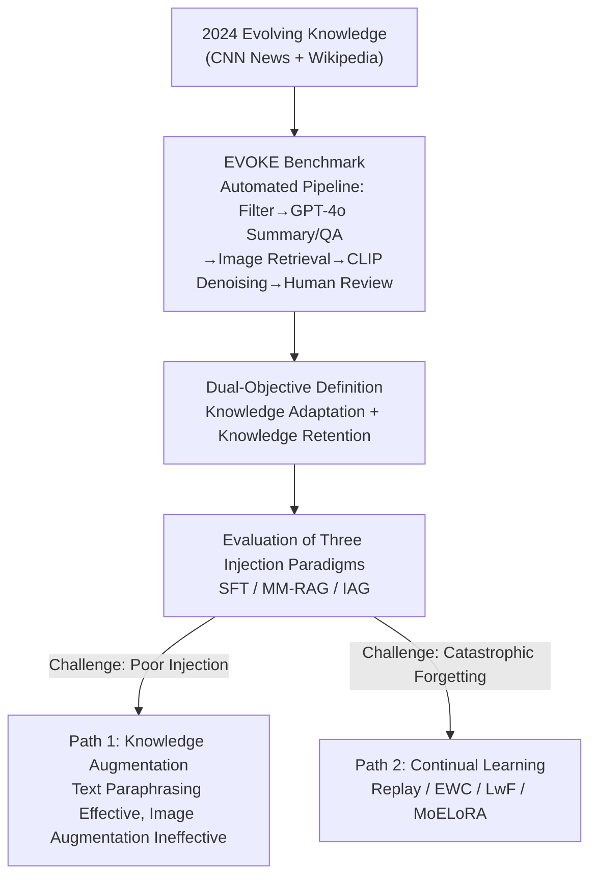

# When Large Multimodal Models Confront Evolving Knowledge: Challenges and Explorations

**Conference**: ICLR 2026  
**arXiv**: [2505.24449](https://arxiv.org/abs/2505.24449)  
**Code**: None  
**Area**: Multimodal / VLM  
**Keywords**: Large Multimodal Models, Knowledge Injection, Evolving Knowledge, Catastrophic Forgetting, Continual Learning

## TL;DR

This paper proposes the EVOKE benchmark to systematically evaluate the knowledge injection capabilities of Large Multimodal Models (LMMs) for evolving knowledge. It reveals two primary challenges: the poor performance of existing methods and catastrophic forgetting caused by fine-tuning. Furthermore, it explores two response paths: knowledge augmentation and continual learning.

## Background & Motivation

Large Language/Multimodal Models (LLMs/LMMs) accumulate extensive world knowledge through large-scale pre-training. However, they face a fundamental problem: **knowledge obsolescence**. Global information updates rapidly, and new entities emerge continuously, while trained models remain static. For instance, an LMM might fail to recognize the Xiaomi SU7 car, incorrectly identifying it as a Porsche.

Existing research on knowledge injection exhibits three critical gaps:

**Lack of multimodal evolving knowledge datasets**: Current datasets (e.g., CC-RECENTNEWS) are text-only and lack multimodal data from real-world scenarios.

**Absence of systematic studies on LMMs**: Most knowledge injection research focuses on LLMs, leaving a significant gap in the systematic exploration of vision-language models.

**Insufficient understanding of injection side effects**: There is a lack of comprehensive evaluation regarding the impact of knowledge injection (specifically fine-tuning) on the model's original capabilities.

This paper aims to construct the first multimodal evolving knowledge injection benchmark to systematically reveal challenges and explore viable pathways.

## Method

### Overall Architecture

The authors do not propose a single specific injection algorithm but establish a research pipeline: "Benchmarking → Systematic Evaluation → Improvement Paths." The goal is to transform the ambiguous problem of "how LMMs should absorb evolving knowledge" into a quantifiable and comparable engineering problem. First, an automated pipeline constructs the EVOKE benchmark using real-world evolving knowledge from 2024, defining a dual-objective metric of "Learning New Knowledge" and "Retaining Old Capabilities" as a unified target. Second, this benchmark evaluates three mainstream injection routes: SFT, MM-RAG, and IAG, exposing two core challenges: generally poor injection effectiveness and catastrophic forgetting induced by fine-tuning. Finally, two paths are explored to address these challenges: knowledge augmentation to mitigate "poor injection" and continual learning to alleviate "forgetting," corresponding to the "Knowledge Adaptation" and "Knowledge Retention" objectives, respectively.

### Key Designs

**1. EVOKE Benchmark: Constructing Evaluable Evolving Knowledge via Automated Pipelines**

Existing datasets are either text-only or insufficiently "new," failing to test an LMM's ability to absorb real-world evolving knowledge. EVOKE collects data from CNN News (29 categories) and Wikipedia (130 entity types), covering 159 fine-grained types with 9,422 knowledge-image pairs, all sourced from 2024. This ensures the knowledge is entirely new for models like LLaVA and Qwen-VL released in 2023. Each entry is organized into two sets: the injection side $\mathcal{D}_\mathcal{K} = \{(i_k, x_k, y_k)\}$ provides knowledge images, heuristic queries, and summaries; the evaluation side $\mathcal{D}_\mathcal{Q} = \{(i_q, x_q, y_q)\}$ provides different query images, questions, and ground truth. Disparate images for injection and query prevent models from "cheating" through image memorization rather than knowledge acquisition.

**2. Dual-objective Problem Definition: Balancing New Knowledge and Old Capabilities**

Knowledge injection often focuses solely on acquisition while ignoring the destruction of prior capabilities. The authors formalize injection as a constrained optimization problem. Knowledge Adaptation aims to maximize accuracy on evolving knowledge evaluation data, while Knowledge Retention requires that performance on original tasks does not degrade post-injection:

$$\max_f \mathbb{E}[\mathbb{I}(\mathcal{M}^*(i_q, x_q) = y_q)] \text{ s.t. } \min_f \mathbb{E}[\mathbb{I}(\mathcal{M}(i_p, x_p) = y_p) - \mathbb{I}(\mathcal{M}^*(i_p, x_p) = y_p)]$$

where $\mathcal{M}^*$ is the injected model and $\mathcal{M}$ is the original model. This definition maps "poor injection" to low adaptation and "catastrophic forgetting" to degradation in retention.

**3. Coverage of Three Injection Paradigms: Comparative Evaluation**

The study evaluates three technical routes: Supervised Fine-Tuning (SFT) using Full Fine-Tuning and LoRA to internalize knowledge; Multimodal Retrieval-Augmented Generation (MM-RAG) using Text-Only, Image-Only, UniIR, and Golden Context (the upper bound); and Internet-Augmented Generation (IAG) using real-time systems like Gemini and Perplexity AI. This benchmarks "Internalization," "External Retrieval," and "Live Search" under a unified standard.

**4. Path 1: Knowledge Augmentation — Helping Models "Learn Logic" over Memorization**

SFT performance is often poor because models may memorize summaries without being able to extract attributes. The authors perform data augmentation: textually, GPT-4 paraphrases summaries into multiple semantically equivalent versions; visually, traditional methods like flipping, random shadowing, and color jittering are used. Results show a counter-intuitive finding: more text paraphrasing correlates positively with accuracy, while traditional image augmentation actually reduces performance. The explanation is that text augmentation forces the model to learn flexible attribute associations (e.g., "Xiaomi SU7 is an EV by Xiaomi"), whereas simple geometric perturbations introduce noise without enhancing knowledge content.

**5. Path 2: Continual Learning — Mitigating Catastrophic Forgetting**

Forgetting is treated as a continual learning problem. When original data is available, Replay (mixing 10% old data) is used. When unavailable, the authors compare EWC (parameter regularization), LwF (distillation), and MoELoRA (multi-expert). The ranking is Replay+LoRA (Rank 1) > MoELoRA (Rank 2) > Replay+Full-FT (Rank 3), suggesting "sparse replay + low-rank adaptation" is the most stable compromise, though all methods sacrifice some injection accuracy.

### Loss & Training

SFT utilizes standard cross-entropy loss. Continual learning methods add specific constraints: 
EWC adds a regularization term: $\mathcal{L}_{EWC} = \mathcal{L}_{task} + \lambda \sum_i F_i (\theta_i - \theta_i^*)^2$, using the Fisher information $F_i$ to lock important parameters. 
LwF adds a distillation term: $\mathcal{L}_{LwF} = \mathcal{L}_{task} + \lambda \mathcal{L}_{KD}$ to constrain the new model's output via the old model.

## Key Experimental Results

### Main Results

| Method | Overall Acc | Overall F1 | News Acc | Entity Acc |
|------|------------|------------|----------|------------|
| LLaVA Vanilla | 4.89 | 9.34 | 7.37 | 2.18 |
| LLaVA Full-FT | 18.02 | 15.17 | 21.35 | 14.37 |
| LLaVA LoRA | 15.23 | 18.31 | 17.72 | 12.51 |
| LLaVA MM-RAG (UniIR) | 40.68 | 57.51 | 40.12 | 41.30 |
| LLaVA MM-RAG (Golden) | **56.13** | **75.77** | 56.78 | 55.43 |
| Perplexity AI† | 48.27 | 62.44 | 47.58 | 48.96 |

All methods achieve a maximum of only 56.13% accuracy, significantly below ideal levels.

### Catastrophic Forgetting Evaluation (12 benchmarks, 7 dimensions)

| Method | MME | MMBench | MIA-Bench | MMDU | Ranking |
|------|-----|---------|-----------|------|---------|
| Vanilla | 1865.56 | 64.60 | 66.33 | 26.37 | - |
| Full-FT | 956.8 (-49%) | 52.92 (-18%) | 25.25 (-62%) | 13.03 (-51%) | 7 |
| LoRA | 1233.54 (-34%) | 53.87 (-17%) | 29.66 (-55%) | 13.70 (-48%) | 6 |
| Replay+LoRA | **1650.75** (-12%) | **60.48** (-6%) | **62.33** (-6%) | **19.31** (-27%) | **1** |
| MoELoRA | 1732.47 (-7%) | 63.32 (-2%) | 64.97 (-2%) | 18.66 (-29%) | 2 |

### Key Findings

1.  **Challenge 1: Poor Knowledge Injection Performance**
    *   The best method (Golden Context) only reaches 56.13% accuracy.
    *   SFT methods perform worse (15-18%).
    *   IAG (Perplexity AI) reaches 48.27% without explicit injection data.

2.  **Challenge 2: Severe Catastrophic Forgetting**
    *   Full-FT and LoRA cause degradation across all 12 benchmarks.
    *   **Instruction following is most affected**: MIA-Bench drops by 62%/55%. This damage causes downstream collapses in benchmarks like MME that rely on specific output formats (Yes/No).

3.  **Text Augmentation is Effective, Image Augmentation is Not**
    *   Paraphrasing boosts performance, whereas traditional image perturbations reduce it, suggesting a need for specialized visual knowledge augmentation.

4.  **Trade-offs in Continual Learning**
    *   Replay and MoELoRA effectively mitigate forgetting but at the cost of injection accuracy (especially MoELoRA, where Acc dropped from 15.23 to 6.82).

5.  **Sequential Fine-tuning Hazards**
    *   Performance decreases as data is split into more sequential batches, indicating SFT is unsuitable for continuous knowledge updates.

## Highlights & Insights

1.  **First Multimodal Evolving Knowledge Benchmark**: EVOKE fills the gap in evaluating LMM knowledge injection with a pipeline capable of continuous data generation.
2.  **Systematic Evaluation**: Comparative study across SFT/RAG/IAG with 12 benchmarks provides a comprehensive view of the landscape.
3.  **Instruction Following as a Forgetting Catalyst**: The observation that instruction-following collapse drives overall performance degradation provides a key focus for future mitigation strategies.
4.  **Flexible Knowledge Extraction**: Validates that models need to learn attribute relationships rather than verbatim summaries, aligning with recent theoretical work on knowledge extraction in LLMs.

## Limitations & Future Work

1.  **Data Scale**: 9,422 pairs is small relative to LMM parameters; larger scales might yield different conclusions.
2.  **Model Selection**: Experiments used older models (LLaVA-v1.5, Qwen-VL); newer models (e.g., InternVL-2) should be tested.
3.  **Scope of Evaluation**: Focused on VQA; complex applications like multi-hop reasoning were not explored.
4.  **Knowledge Editing**: The study lacks a comparison with dedicated knowledge editing methods (e.g., MEMIT).

## Related Work & Insights

*   **Three Injection Paradigms**: SFT, RAG, and IAG each have distinct trade-offs; hybrid approaches may be the future.
*   **Continual Learning**: Replay and MoELoRA show promise for maintaining model utility during updates.
*   **IAG Potential**: The strong performance of internet-augmented systems suggests that for evolving knowledge, enhancing search capabilities might be more efficient than weight updates.

## Rating

*   Novelty: ⭐⭐⭐⭐
*   Experimental Thoroughness: ⭐⭐⭐⭐⭐
*   Writing Quality: ⭐⭐⭐⭐
*   Value: ⭐⭐⭐⭐

<!-- RELATED:START -->

## Related Papers

- [\[ICML 2026\] KORE: Enhancing Knowledge Injection for Large Multimodal Models via Knowledge-Oriented Controls](../../ICML2026/knowledge_editing/kore_enhancing_knowledge_injection_for_large_multimodal_models_via_knowledge-ori.md)
- [\[ACL 2026\] EvoEdit: Evolving Null-space Alignment for Robust and Efficient Knowledge Editing](../../ACL2026/knowledge_editing/evoedit_evolving_null-space_alignment_for_robust_and_efficient_knowledge_editing.md)
- [\[AAAI 2026\] Hybrid-DMKG: A Hybrid Reasoning Framework over Dynamic Multimodal Knowledge Graphs for Multimodal Multihop QA with Knowledge Editing](../../AAAI2026/knowledge_editing/hybrid-dmkg_a_hybrid_reasoning_framework_over_dynamic_multimodal_knowledge_graph.md)
- [\[ICML 2026\] The Labyrinth and the Thread: Rethinking Regularizations in Sequential Knowledge Editing for Large Language Models](../../ICML2026/knowledge_editing/the_labyrinth_and_the_thread_rethinking_regularizations_in_sequential_knowledge_.md)
- [\[ICLR 2026\] Disentangling Knowledge Representations for Large Language Model Editing](disentangling_knowledge_representations_for_large_language_model_editing.md)

<!-- RELATED:END -->
